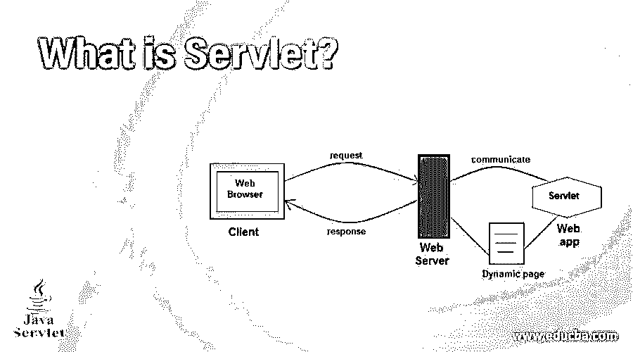
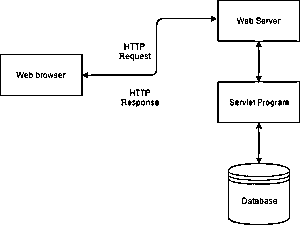
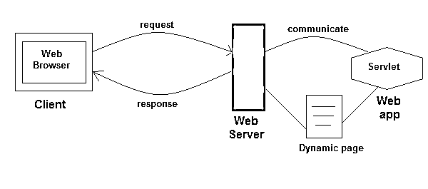
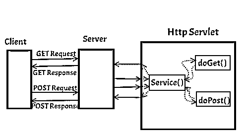

# 什么是 Servlet？

> 原文：<https://www.educba.com/what-is-servlet/>

## Servlet 简介

Servlet 基本上是一个 JAVA 程序，特别是在 Web 服务器上的 JVM 或{JAVA 虚拟机}内部运行。它通常用于制作/创建动态 web 应用程序和网页。

它是一种用于开发动态 web 应用程序的技术。它使用 JAVA 语言来开发网页。这种技术是安全的、可伸缩的和健壮的，因为它使用了提供相同特性的 JAVA 技术。

<small>网页开发、编程语言、软件测试&其他</small>

### 谅解

它是一个小程序，使用并运行在 JAVA 语言上，扩展了服务器的功能。它们用于开发静态和动态 web 应用程序。

### 它是如何让工作变得如此简单的？

如前所述，我们已经告诉您，它使我们的工作变得如此简单，只是因为它使用了 JAVA 编程语言，为我们提供了许多功能，如安全、可伸缩和健壮，这使得它非常易于使用和操作。

### 你能用它做什么？

我们可以用它做更多的事情。我们用它做的主要和基本的事情是为 web 应用程序开发静态和动态网页。这项技术非常类似于 CGI {公共网关接口}，但是由于 CGI Servlet 的缺点，克服了它。如果我们谈论它们之间的区别，它们之间的主要区别是高效和可移植性，数据共享是可能的，它可以处理 cookie，但另一方面，CGI 是不可移植的，共享数据是不可能的，因此它也不能处理 cookie。所以这些就是 CGI 的弊端。

#### servletapi 的

它由两个包构建而成:

*   Javax.servlet {basic}
*   Javax.servlet http{advance}

#### 成分

*   小型应用程序
*   ServletRequest
*   过滤器
*   ServletConfig
*   HttpServlet
*   servlet 响应
*   GenericServlet
*   HttpServletRequest

### 优势

下面描述了一些优点。

*   **可移植/平台无关:**如 JAVA 所写，因此，它是可移植的。
*   高效且可扩展:一旦它被加载到网络服务器上，就能立即满足客户的需求。
*   健壮:JAVA 的顶级特性，如垃圾收集、异常处理等。它也被称为健壮。
*   **简单的数据共享:**数据共享是可能的，而且非常简单，这在 CGI 中是没有的。
*   与其他产品相比，它的价格较低。
*   **新流程:**并不是每次都使用新流程。它消除了新进程的开销，因此也节省了内存。

### Servlet 容器

它的容器也被称为 Servlet 引擎，为 Java Servlet 组件提供了一个非常有效的运行时环境。换句话说，基本上，它是一个管理 JAVA Servlet 组件来处理客户请求的系统。

**提供的服务:**

*   网络服务
*   安全局
*   会话管理
*   资源管理
*   管理容器

### Servlet 的生命周期和工作方式

它在其生命周期中包含 5 个步骤

**第一步:**加载。

(每当服务器启动时，它的容器就会部署并加载所有的 servlet。在这个步骤中，它创建 ServletContext 对象，这是一个与容器轻松通信的接口)

**步骤 2:** 创建 Servlet 的实例。

(当所有的 Servlet 类都被加载后，容器为每个类创建一个实例。容器只为单个类创建一个实例，并请求在同一个实例上执行的 servlet)

**第三步:**调用 init()方法。

当创建了所有实例后，调用它的 init()方法。此方法用于初始化。我们可以在 web.xml 文件中指定许多 init 参数。

`<servlet>
<servlet-name>MyServlet</servlet-name>
<servlet-class>com.XYZ.MyServletDemo</servlet-class>
<load-on-startup>1</load-on-startup>
</servlet>`

现在，类 co.XYZ.MyServletDemo 的 init 方法将在容器启动期间被调用。

**第四步:**调用 Service()方法。

(每次服务器收到对 servlet 的请求时，它都会获得一个调用 service()方法的新线程。如果 Servlet 是通用的，那么请求由 service()方法提供服务，HttpServlet 然后 service()方法接收请求。)

**第五步:**调用 destroy()方法。

(当容器关闭时，它卸载所有的 servlet 类和接口，并为每个初始化的 servlet 调用 destroy()方法。)

### 这项技术的职业发展

对于对编程语言感兴趣的学生来说，这是职业发展的最佳技术，但学生应该在这方面得到提高，对他来说有很多机会。每个公司都需要这种类型的技术和拥有专家的员工。

### 结论

有几种技术是根据我们的需要或要求来使用的。它是制作 web 应用程序最常用的技术，因为它的界面易于使用，而其他一些技术也可以作为它的替代。但是对于所有用于 web 应用程序的技术来说，这是最好的。

### 推荐文章

这是什么是 Servlet 的指南？.在这里，我们讨论了 servlet 的工作、组件、优势、生命周期和职业发展。您也可以阅读以下文章，了解更多信息——

1.  [Servlet 生命周期](https://www.educba.com/servlet-life-cycle/)
2.  什么是 JSF？
3.  [静态与动态网页](https://www.educba.com/static-vs-dynamic-web-page/)
4.  [Servlet 架构](https://www.educba.com/servlet-architecture/)

