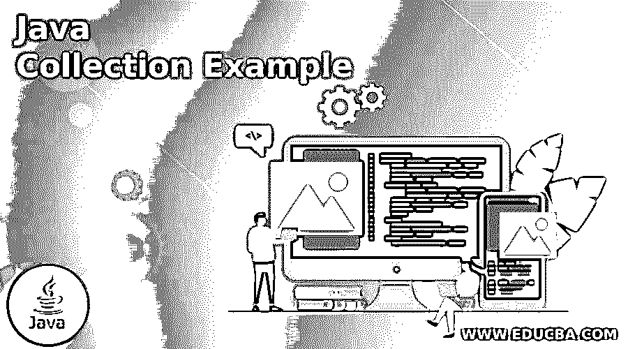

# java 集合备忘单

> 原文：<https://www.educba.com/java-collection-cheat-sheet/>

## java 集合备忘单介绍

java 集合是 Java 程序员的基本框架。collection cheat sheet 是一个小的 cheat sheet，它有一组访问 java 数据集合的规则，所以它是一个数据结构，实际上它创建对象并保存将被其他对象访问的引用。基本上，集合包含创建和访问相同数据类型的对象的引用。java 集合是一个接口框架，它将声明一个对象，这个对象将通过各种类型的集合来执行。

### 什么是 java 集合备忘单？

对于 java 程序员来说，Java 集合是最基本、最重要的结构。集合备忘单是一个很小的备忘单，包含一组访问 java 数据集合的规则。它是一种数据结构，实际上构建了对象并保存了对其他对象的引用。基本上，集合包含创建和访问相同数据类型的对象的引用。java 集合是一个接口框架，它用各种类型的集合声明对象并对其执行操作。Java Collections API 是 JDK 或任何编程语言最基本的特性之一，但也是最难掌握的特性之一。此外，使集合库变得基本、内聚和易于使用确实很困难。Java 集合将被他们所有人使用！我们无法想象在我们的备忘单集合中包含一个 Java 集合备忘单，因为它们太重要了。事实上，这个备忘单是我们所能得到的最接近 Java 的备忘单了。但这是一项艰巨的任务，因为关于集合框架有太多的东西需要学习，包括实现细节、正确的用例、如何选择正确的集合类型、它们可以完成什么，以及是否利用第三方库而不是 JDK 的内置集合。

<small>网页开发、编程语言、软件测试&其他</small>

在每个 java 集合框架中，它都有自己的库引入到 java 版本 1.2 及以后的版本中，并且它有自己的 stuck，它将使用向后兼容性来处理 java 平台上要处理的核心值之一。集合没有更改任何现有的值，因此 it 参与的工具可以增强 java 实现的向后兼容性，但不会破坏概念及其功能。每个 java 集合都有自己的综合库，包含处理实用函数的库和使用数据结构处理数据的库。

### 集合接口

java 集合有一些类型来实现应用程序，它已经开始挖掘伞状接口，如 Iterable 和 Collection。当我们使用 iterable 接口时，它允许我们获得一个迭代器，并使用任何循环遍历元素的数据序列，如 for、for-each、while、do-while 等。collection 接口主要扩展了 Iterable datas 来搜索执行 CRUD 操作的数据元素，因此它将在应用程序中添加、读取、更新和删除数据。

**列表:**

这是一个集合接口，它将用于对元素集合进行排序，元素索引接受添加和替换值。列表中有一些类，如 Arraylist、hashlist、linkedlist，..等等。

**举例:**

`import java.util.ArrayList;
public class Main {
public static void main(String[] args) {
ArrayList<Integer> aLst = new ArrayList<Integer>(6);
aLst.add(23);
aLst.add(34);
aLst.add(2);
aLst.add(13);
aLst.add(42);
aLst.add(52);
System.out.println("We can access the element using the index " + aLst.get(5) );
aLst.remove(4);
System.out.println("The elements are printed using the specified orderd " + aLst) ;
}
}`

**样本输出:**

**树图:**

`import java.util.Iterator;
import java.util.Map;
import java.util.Map.Entry;
import java.util.Set;
import java.util.TreeMap;
public class Sample {
public static void main(String[] args) {
TreeMap<String,Integer> tMap = new TreeMap<String,Integer>();
tMap.put("January is the first month", 1);
tMap.put("February is the second month", 2);
tMap.put("March is the third month", 3);
tMap.put("April is the fourth month", 4);
tMap.put("May is the fifth month", 4);
System.out.println(tMap);
Set<Entry<String, Integer>> eSet = tMap.entrySet();
Iterator<Entry<String, Integer>> itr = eSet.iterator();
while(itr.hasNext())
{
Map.Entry vars = (Map.Entry)itr.next();
System.out.println(vars.getKey());
}
}
}`

**样本输出:**

在上面的例子中，如果项目的需求是使用排序顺序的映射技术，我们就使用树映射集合类，这样我们就可以访问具有键值对存储的排序映射。一般来说，Hashmap 实现依赖于成功实现 hashCode()和 equals()方法的关键对象，因此要注意它们。作为交换，HashMap 为您提供了近乎恒定的时间性能，这与任何数据结构一样好，并且可伸缩性非常好。树形图可以用来在元素之间导航，或者处理不可散列的元素种类。Treemap 可以适当缩放，并允许您使用平衡树以排序的顺序重复内容，就像上面的集合一样。因为键和值的关联是计算机的全部，所以映射是最通用的集合类型:字典，像 javascript 一样将对象属性映射到它们的值，将文件名映射到它们的内容和元数据，将用户名映射到密码散列、会话属性、产品购物车项目和游戏高分。

**哈希集:**

`import java.util.HashSet;
public class Sample {
public static void main(String[] args) {
HashSet<Integer> hSet = new HashSet<Integer>();
if ( hSet.add(41) )
System.*out*.println(" Welcome To My Domain your inputs are added");
else
System.*out*.println("The CRUD operation is not supported");
if ( hSet.add(41) )
System.*out*.println(" Elements are inserted successfully");
else
System.out.println("Sorry your element is not inserted successfully");
}
}`

在 HashSet 中，重复是不允许的，所以如果只需要惟一的元素索引。它还有实现和修改功能的子类。

### 结论

一般来说，数据收集元素是按照指定的顺序存储的，每个顺序将调用一个单独的索引来存储和检索内存位置中的元素。我们可以使用备忘单轻松获取详细信息，并且它有一个快速参考。

### 推荐文章

这是一个 java 收藏指南备忘单。这里我们讨论什么是 java collection cheat sheet 以及示例和输出。您也可以看看以下文章，了解更多信息–

1.  [AVL 树 java](https://www.educba.com/avl-tree-java/)
2.  [settimeout Java](https://www.educba.com/settimeout-java/)
3.  [Java 中的 Volatile 关键字](https://www.educba.com/volatile-keyword-in-java/)
4.  [Java 中的 Struts](https://www.educba.com/struts-in-java/)

