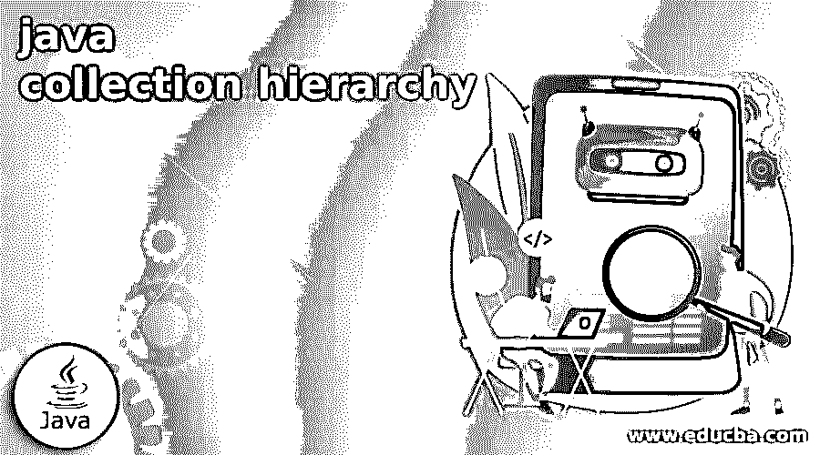

# java 集合层次结构

> 原文：<https://www.educba.com/java-collection-hierarchy/>

## java 集合层次结构介绍

Java 集合层次结构是整个集合框架的层次结构，它包含了集合、集合、映射和列表四个核心接口。此外，还有两个更受关注的接口，即用于排序的 SortedSet 和 SortedMap。集合层次结构框架的整个接口和类都放在 java.util.package 中。

### 什么是 Java 集合层次结构？

java 中的 Java 集合层次结构是一个提供结构化设计的框架，用于存储和控制对象组。Java 集合层次结构完成了对数据执行的所有操作，如插入、删除、搜索、排序和操作。Java 集合描述了对象的单个单元。它提供了许多接口，如 Set、Queue、Deque、List，还提供了一些类，如 ArrayList、LinkedList、LinkedHashSet、HashSet、

<small>网页开发、编程语言、软件测试&其他</small>

优先级队列、向量和树集。此外，还有两个固定接口，即 SortedSet 和 SortedMap，用于排序。集合层次结构框架的整个接口和类都放在 java.util.package 中。

### 接口 Java 集合层次结构方法

在 Java 集合层次结构中，有几个集合接口方法用于控制集合中的元素。我们来看看下面的 Java 集合接口方法，

*   **add():** 该方法主要用于在集合中插入或添加一个元素。在名称本身中，它描述了 add，向集合中添加元素。当向集合中添加新元素时，它返回 TRUE，否则返回 FALSE。它避免了重复，因此如果特定的添加元素已经存在，集合就不接受它。add()方法的常用语法如下:

**语法** **: add(对象元素):Boolean**

*   **addAll():** 这个 addAll()用于将指定集合中的所有元素添加到这个集合中。当向集合中添加新元素时，它返回 TRUE，否则返回 FALSE。addAll()方法的常用语法如下:

**语法** **: addAll(集合 c) : Boolean**

*   **Clear():** 这个 Clear()方法用于移除或清除集合中的一个元素。它不返回任何内容。Clear()方法的常用语法如下:

**语法** **: clear() : void**

*   **Contains():** 该方法用于检查集合中是否存在特定元素，主要用于搜索/查找元素。如果它包含集合中的特定元素，则返回 TRUE，否则返回 FALSE。contains()方法的常用语法如下:

**语法** **:包含(对象元素) :布尔**

*   **ContainsAll():** 该方法用于检查整个元素是否存在于给定的集合中。如果它包含集合中的所有元素，则返回 TRUE，否则返回 FALSE。containsAll()方法的常用语法如下:

**语法** **: containsAll(集合 c) : Boolean**

*   **equals():** 该方法用于检查与另一个对象的相等性，它比较集合中特定对象的相等性。equal()方法的常用语法如下:

**语法** **: equal(对象元素):Boolean**

*   **isEmpty():** 该方法仅用于当集合为空时返回 true，否则返回 false。isEmpty()方法的常用语法如下:

**语法** **: isEmpty() : Boolean**

*   **iterator():** 这个方法用于返回集合中元素的迭代器。iterator()方法的常用语法如下:

**语法** **:迭代器() :迭代器**

*   **remove():** 这个方法用于返回一个布尔值，如果它删除了元素，则返回 true，否则返回 false。它从集合中移除给定的特定元素。如果有重复的值，那么它将删除对象的第一个匹配项。remove()方法的常用语法如下:

**语法** **: remove(对象元素):Boolean**

*   **removeAll():** 这个方法用来返回一个布尔值，如果它删除了所有的元素它返回 true，否则返回 false。它从集合中移除整个元素。removeAll()方法的常用语法如下:

**语法** **: removeAll(集合 c): Boolean**

*   **retainAll():** 该方法用于保留只存在于特定集合所包含的集合中的元素。它返回一个布尔值。retainAll()方法的常用语法如下:

**语法****:retailall(集合 c): Boolean**

*   **size():** 这个方法用来返回集合中出现的元素的个数。Size()方法的返回类型是 integer，它返回集合中元素的总数。size()方法的常用语法如下:

**语法** **: size(): int**

*   **toArray():** 该方法用于返回数组中包含的元素集合。它以数组的形式返回集合中的元素。toArray()方法的常用语法如下:

**语法** **: toArray(): Object [ ]**

*   **Object[ ] toArray():** 该方法用于返回存储在被调用集合中的元素所包含的数组。Object toArray()方法的常用语法如下:

**语法** **: toArray(对象数组[ ]):对象[ ]**

### Java 集合层次方法

Java 集合层次结构类实现了核心接口，并提供了可靠的功能。我们来看看下面这些方法，

*   **集合**–集合接口是基本的根层次。它提供了所有集合类支持的全部方法。
*   **List–**List 以有序的方式表示元素的集合。通过使用这个列表，通过元素的索引来访问元素，我们也可以搜索一个元素。
*   **集合–**集合以排序的方式表示元素的集合。
*   **Map–**Map 接口提供了三种集合，我们可以将它们视为键集合、值集合和键-值映射方式集合。它支持以键值对的形式存储数据。
*   **Stack–**它表示堆栈数据结构中的元素，我们可以将这些元素推入对象的后进先出(LIFO)方法中。
*   **Queue–**它是一种队列数据结构，用于在用户线程处理之前保存元素。队列提供插入、检查和提取操作。
*   **Deque–**它是一个双端队列，在两端提供元素的插入和移除。这个接口最好使用 stack 类。

### Java 集合层次类图

让我们看看 Java 集合层次的类图，它包含了四个核心接口，分别是集合、集合、映射和列表。此外，还有两个更受关注的接口，即用于排序的 SortedSet 和 SortedMap。集合层次结构框架的整个接口和类都放在 java.util.package 中。

蓝框代表界面

红框代表类别

e 描述了扩展，这是用于在两个类别和两个接口之间建立接口的关键字。

I 描述工具，这是用于建立类和接口之间的继承的关键字。

### 结论

希望这篇文章有助于理解 Java 集合的层次结构，它给用户提供了访问数据结构和操作它们的算法。它是 object 的集合，保存对另一个对象的引用。接口和类打包在 java.util 中。

### 推荐文章

这是一个 java 集合层次的指南。这里我们讨论 Java 集合层次结构，它让用户能够访问数据结构。您也可以看看以下文章，了解更多信息–

1.  [AVL 树 java](https://www.educba.com/avl-tree-java/)
2.  [Java XML 解析器](https://www.educba.com/java-xml-parser/)
3.  [爪哇的二叉查找树](https://www.educba.com/binary-search-tree-in-java/)
4.  [Java 中的数据结构](https://www.educba.com/data-structures-in-java/)

