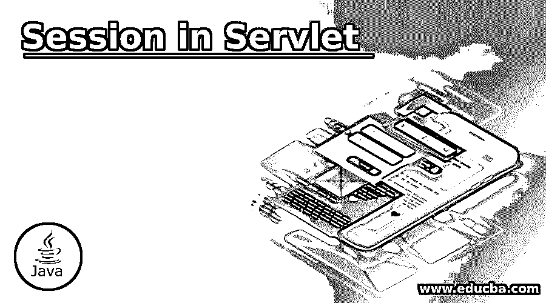
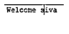
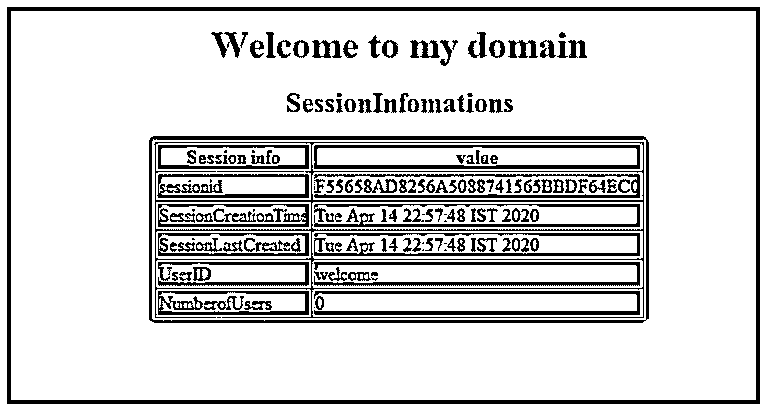
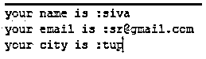

# Servlet 中的会话

> 原文：<https://www.educba.com/session-in-servlet/>

## Servlet 中的会话介绍

在动态 web 中，应用程序 servlet 是 web MVC 设计模型后端的控制器之一。对于每个客户端请求，服务器响应将作为任何前端编程技术(如 jsp、HTML 等)的客户端来接收。这里的服务器是 servlet，用于在前端视图中发送对特定请求的响应。我们可以保存日志中存储的用户请求和响应相关数据，以及像会话这样的 servlet 技术。会话主要用于客户端和服务器交互的持续时间。我们可以使用会话跟踪来跟踪数据，以将用户数据保持在特定状态。

**语法:**

<small>网页开发、编程语言、软件测试&其他</small>

下面给出了 servlet 会话的基本语法:

`import javax.servlet.*;
import javax.servlet.http.*;
class classname extends HttpServlet
{
public void doGet(HttpServletRequest request ,HttpServletResponse response)
{
----some logic codes—
HttpSession instance=request.getSession();
}
public void doPost(HttpServletRequest request ,HttpServletResponse response)
{
----some logic codes—
HttpSession instance=request.getSession();
}
}`

上面的代码是 servlet http 会话代码，用于处理用户会话，还管理浏览器 cookies 中的应用程序数据。

### 如何在 Servlet 中使用 Session？

*   当我们在 jsp 中使用相同的会话实例时，与 servlet 相比可能有一些优势。默认会话管理在 jsp 中启用，但它在 servlet 中显式启用。在基于 web 的应用程序中，会话是指在某个时间段内，当用户访问应用程序的索引页面时，该应用程序中使用的单个用户的会话就会启动。之后，用户将访问和导航所有要在会话中记录的数据的其他页面。一旦用户出现会话超时错误或任何与服务器相关的错误，会话就会停止，并抛出一些经过验证的错误。
*   在 java 中，http 协议用于处理应用程序中的会话。http 是无状态的，它也有助于通过 cookies 处理会话，URL 重写或隐藏字段技术用于识别单个用户中的所有不同请求。使用会话跟踪技术是处理 cookies 的主要方法。如果假设用户浏览器不支持 cookies，那么它将继续使用其他技术，如 url 重写等。在 web 开发人员中，会话机制用于特定状态和持续时间的用户数据，如注册用户的身份验证、用户名或任何其他需要与整个请求共享的相关数据。
*   使用 httpsession 对象，它将代表单个用户的整个会话。httpsession 是在名为 javax.servlet 的包中定义的接口。我们可以将用户相关的数据存储在键-值对中，这个键-值对已经存在于名为 map 的 java 集合接口中，这个接口被定义为类似 hashmap 的类。httpsession 接口调用 setAttribute (key，value)等方法进行存储，而 retrieving getAttribute(key)用于检索特定的键。默认情况下，java 语言使用 cookie 来处理会话跟踪，这个名为 JSESSIONID 的 cookie 用于存储在 web 浏览器中。它还用于处理同一用户的不同请求。

### Servlet 中的会话示例

以下是 Servlet 中的会话示例:

#### 示例#1

**Html 代码:**

`<!DOCTYPEhtml>
<html>
<head>
<title>Sample</title>
</head>
<body>
<form action="//second.java">
<input type="text" placeholder="Name" name="name">  
<input type="text" placeholder="City" name="city">  
<input type="submit" value="submit"> 
</form>
</body>
</html>`

**Java 代码:**

`package com.first;
import java.io.IOException;
import java.io.PrintWriter;
import javax.servlet.ServletException;
import javax.servlet.annotation.WebServlet;
import javax.servlet.http.HttpServlet;
import javax.servlet.http.HttpServletRequest;
import javax.servlet.http.HttpServletResponse;
import javax.servlet.http.HttpSession;
/**
* Servlet implementation class second
*/
@WebServlet("/second")
public class second extends HttpServlet {
private static final long serialVersionUID = 1L;
/**
* @seeHttpServlet#HttpServlet()
*/
public second() {
super();
// TODO Auto-generated constructor stub
}
/**
* @seeHttpServlet#doGet(HttpServletRequest request, HttpServletResponse response)
*/
Protected void doGet(HttpServletRequest request, HttpServletResponse response) throws ServletException, IOException {
// TODO Auto-generated method stub
response.setContentType("text/html");
PrintWriter out = response.getWriter();
request.getRequestDispatcher("index.html").include(request, response);
String name = request.getParameter("name");
String city = request.getParameter("city");
out.print("Welcome, "+name);
HttpSessionsession=request.getSession();
session.setAttribute("name",name);
out.close();
}
/**
* @seeHttpServlet#doPost(HttpServletRequest request, HttpServletResponse response)
*/
Protected void doPost(HttpServletRequest request, HttpServletResponse response) throws ServletException, IOException {
// TODO Auto-generated method stub
doGet(request, response);
}
}`

**输出:**

#### 实施例 2

**Java 代码:**

`package com.first;
import java.io.*;
import javax.servlet.*;
import javax.servlet.http.*;
import java.util.*;
public class sessions extends HttpServlet {
public void doGet(HttpServletRequest request, HttpServletResponse response)
throws ServletException, IOException {
HttpSession session = request.getSession(true);
Date startdate = new Date(session.getCreationTime());
Date lastdate = new Date(session.getLastAccessedTime());
String s = "Welcome Back to my domain";
Integer i = new Integer(0);
String v = new String("lasytvisittimes");
String u = new String("id");
String u1 = new String("welcome");
if (session.isNew() ){
s = "Welcome to my domain";
session.setAttribute(u, u1);
session.setAttribute(v,  i);
}
i = (Integer)session.getAttribute(v);
v = v + 1;
u1 = (String)session.getAttribute(u);
session.setAttribute(v,  i);
response.setContentType("text/html");
PrintWriterout = response.getWriter();
String docType =
"<!doctype html public \"-//w3c//dtd html 4.0 " +
"transitional//en\">\n";
out.println(docType +
"<html>\n" +
"<head><title>" + s + "</title></head>\n" +
"<body bgcolor = \"green\">\n" +
"<h1 align = \"center\">" + s + "</h1>\n" +
"<h2 align = \"center\">SessionInfomations</h2>\n" +
"<table border = \"1\" align = \"center\">\n" +
"<tr bgcolor = \"green\">\n" +
"  <th>Session info</th><th>value</th></tr>\n" +
"<tr>\n" +
"  <td>sessionid</td>\n" +
"  <td>" + session.getId() + "</td></tr>\n" +
"<tr>\n" +
"  <td>SessionCreationTime</td>\n" +
"  <td>" + startdate + "  </td></tr>\n" +
"<tr>\n" +
"  <td>SessionLastCreated</td>\n" +
"  <td>" + lastdate + "  </td></tr>\n" +
"<tr>\n" +
"  <td>UserID</td>\n" +
"  <td>" + u1 + "  </td></tr>\n" +
"<tr>\n" +
"  <td>NumberofUsers</td>\n" +
"  <td>" + i + "</td></tr>\n" +
"</table>\n" +
"</body></html>"
);
}
}`

**输出:**

#### 实施例 3

**Java 代码:**

`public class second extends HttpServlet {
private static final long serialVersionUID = 1;
protected void doGet(HttpServletRequest request, HttpServletResponse response) throws ServletException, IOException {
response.setContentType("text/html");
PrintWriter out = response.getWriter();
String user = request.getParameter("name");
String email = request.getParameter("email");
String city = request.getParameter("city");
out.println("<HTML>");
out.println("<h2>your name is  :"+user+"</h2>");
out.println("<h2>your email is  :"+email+"</h2>");
out.println("<h2>your city is  :"+city+"</h2>");
out.println("</HTML>");
out.flush();
out.close();
}
}`

**输出:**

### 结论

在 servlet 会话中，处理机制有助于跟踪 web 应用程序中与用户相关的信息，而且与 jsp 配置相比，它有自己的配置，我们已经在 web.xml 等配置文件中指定了它。

### 推荐文章

这是一个 Servlet 会话指南。这里我们讨论介绍，如何在 servlet 中使用会话，配置与 jsp 配置的比较，以及各种例子。您也可以看看以下文章，了解更多信息–

1.  [Servlet 过滤器](https://www.educba.com/servlet-filter/)
2.  [什么是 Servlet？](https://www.educba.com/what-is-servlet/)
3.  [Servlet 架构](https://www.educba.com/servlet-architecture/)
4.  [Servlet 生命周期](https://www.educba.com/servlet-life-cycle/)

