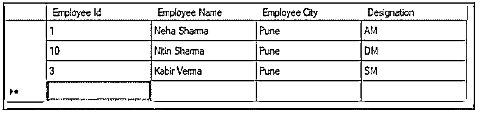
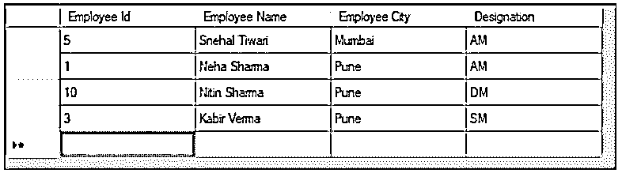
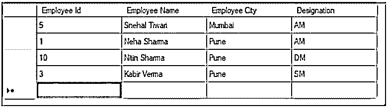
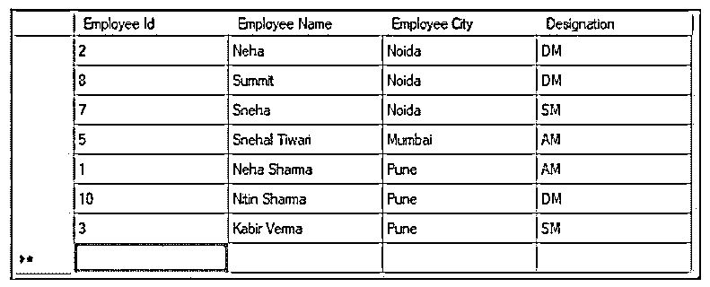

# 实体框架插入

> 原文：<https://www.educba.com/entity-framework-insert/>

## 实体框架简介插入

实体框架是一个 ORM 框架，由微软支持。net 应用程序。插入功能使开发人员能够使用数据库来插入数据库中的数据。该功能有助于开发人员在更高的抽象层次上处理数据。插入属于实体框架的保存特性。当程序调用“SaveChanges()”方法时，它执行插入命令。当实体发生任何变化时，它对数据库执行插入命令。

### 如何使用实体框架插入数据？

要插入数据，我们可以使用 DbSet。Add 方法，以便将新实体添加到上下文中。这将在调用 SaveChanges()方法时在数据库中插入一条新记录。

<small>网页开发、编程语言、软件测试&其他</small>

**代码:**

`Using (var context = new SchoolDBEntities())
{
Var std = new Student()
{
FistName = “Neha”,
LastName =  “Shrama”
};
Context.Students.Add(std);
Context.SveChnges();
}`

在上面的代码上下文中。Students.Add(std)用于创建学生实体的新实例，该实例与添加的 EntityState 的上下文相关。

语境。SveChnges()方法将构建并执行下面的 insert 语句到数据库中。

**代码:**

`Exec sp_executesql N ‘INSERT [dbo].[Students]([FirstName], [LastName])
VALUES (@0,@1)
SELECT [StudentId] FROM [db].[Students] WHERE @@ROWCOUNT > 0 AND [StudentID] = scope_identity()’, N
‘’@0 nvarchar(max) ,@1 nvarchar(max) ‘,@0=Neha ,@1=N’Sharma’
go`

**举例:**

让我们看一个例子，以便更清楚如何插入数据。

假设我们有一个包含雇员 ID、姓名、城市和职务的雇员详细信息的记录表。

我们将看到下面的代码在 employee 表中插入一个新的雇员记录

**代码:**

`private void insertData()
{
TestEntities context = new TestEntities();
// Creating a new employee
Employee objEmployee = new Employee();
objEmployee.name = "Snehal Tiwari";
objEmployee.City = "Mumbai";
ObjEmployee.Designation = "AM";
//Below line of code will add the created employee object to the context.
context.AddToEmployee(objEmployee);
context.SaveChanges();
}`

TestEntities 是一个类，由“在 web.config 中保存实体连接设置”给出。

**输出:**

**

** 

新员工的记录将被添加到第一行。

DbContext。AddRange()方法用于同时插入多个实体。

DbContext 在实体框架中非常重要。它是一类实体框架 API。我们可以说它是数据库和域或实体类之间的载体或中间件。它负责数据库和类之间的交互。

它负责以下活动:

*   **query:**它负责将 LINQ 查询转换成 SQL 查询，然后将它们直接发送到数据库。
*   **持久化数据:**它根据实体状态处理数据库上的插入、更新和删除功能。
*   **变化跟踪:**跟踪从数据库中查询到的实体状态发生的变化。
*   **管理关系:**它将采用模型优先或数据库优先的方式使用 CSDL、SSDL 和 MSL。此外，在代码优先的方法中使用流畅的 API 配置。
*   **缓存:**默认有一级抓取。它将存储在生存期内从上下文类重试的实体。
*   **对象物化:**帮助将数据库中的原始数据转化为对象实体。

**DbContext 方法:**

下面是一些用于插入数据的 DbContext 方法:

*   **入口:**入口将为我们提供对变更跟踪信息和实体操作的访问。它将获得给定实体的 DbEntityEntry。
*   **SaveChanges:** 对数据库中处于添加、删除、修改状态的实体执行插入、删除、更新功能。
*   **SaveChangesAsync:** 是 SaveChanges()方法的异步方法。
*   **Set:** 这将创建一个 DbSet <实体>，用于查询实体并保存其实体的实例。
*   **OnModelCreating:** 它将采用模型构建器的实例。当我们的上下文首先被创建时，框架调用它来构建特定的模型及其在内存中的映射。

### 在数据库中插入多条记录

现在，如果我们想要插入多条记录，我们可以通过下面的代码来使用它。在下面的代码中，我们添加了 3 条记录及其名称。

**代码:**

`Var Employee1 = new Employee() { Name = "Neha"}
Var Employee2 = new Employee() { Name = "Summit"}
Var Employee3 = new Employee() { Name = "Sneha"}
Using (var context = new companyContext())
{
Context.Employee.AddRange(dept1, dept2, dept3);
Context.saveChanges();
}
In addition, we can do the same thing by below code. We just need to create a list for the employees
Var Employee1 = new Employee() { Name = "Neha"}
Var Employee2 = new Employee() { Name = "summit"}
Var Employee3 = new Employee() { Name = "Sneha"}
Var employee =new List<Employee>() { Employee1, Employee2, Employee3 };
Using (var context = new CompanyContext())
{
Context.Department.AddRange(employee)
Context.SaveChanges();
}`

**输出:**

执行上述代码后，我们将得到以下输出。我们假设该表已经有 1 条记录。

执行插入代码后，它将插入 3 个雇员。

通常这个过程在早期是非常笨拙和庞大的。我们过去常常先建立连接，以便先打开数据库。然后，我们创建一个数据集来获取数据或将数据提交给数据库，将数据转换成。NET 对象，反之亦然，以便可以应用业务规则。由于所有这些庞大而混乱的程序，微软推出了被称为“实体框架”的框架。这将使我们所需应用程序的整个数据库活动自动化。

### 结论

在本文中，我们看到了如何使用实体框架将数据插入数据库。我们看到了即使需要插入多条记录，这是如何处理的。这将减少并使我们的应用程序易于使用。

### 推荐文章

这是一个实体框架插入指南。这里我们讨论一下入门，如何使用实体框架插入数据？插入多条记录。您也可以看看以下文章，了解更多信息–

1.  [Hibernate 框架](https://www.educba.com/hibernate-framework/)
2.  [MVC 架构](https://www.educba.com/mvc-architecture/)
3.  [冬眠发生器](https://www.educba.com/hibernate-generator/)
4.  [冬眠持续](https://www.educba.com/hibernate-persist/)

