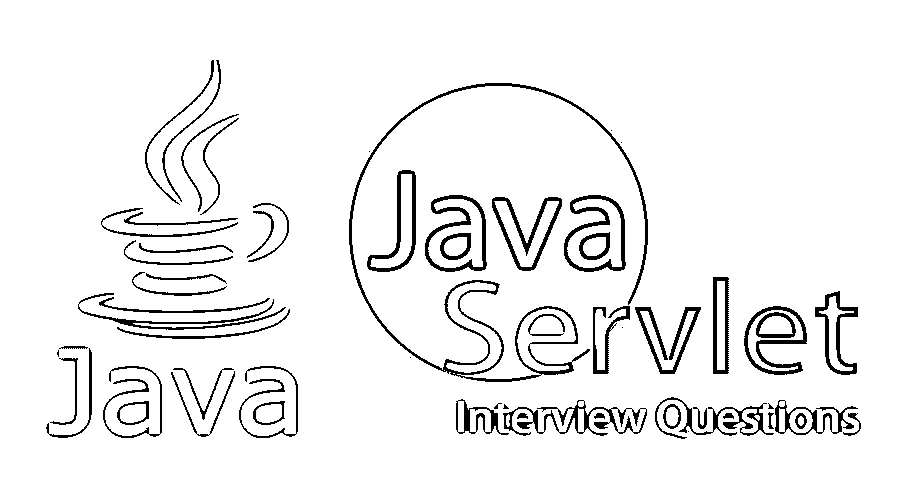

# Java Servlet 面试问题

> 原文：<https://www.educba.com/java-servlet-interview-questions/>

## Java Servlet 面试问答介绍

Java Servlet 是一个基于 [Java 企业版技术](https://www.educba.com/java-ee-interview-questions/)的 web 组件。它是一种扩展 web 服务器或应用服务器功能的软件组件。Servlets 通过 web 服务器或应用服务器处理客户端(即可以在任何平台上的 web 浏览器)的请求和响应。Java Servlets 驻留在 web 容器中，也称为 servlet 容器，其中容器根据部署描述符基于 servlet 的映射来处理请求和重定向或调度响应，其中 DD(部署描述符)是驻留在 web 应用程序中并在其中进行配置以正确映射 web 请求的映射文件。DD 有助于通过 web 服务器正确映射请求和响应。

现在，如果你正在寻找一份与 Java Servlet 相关的工作，那么你需要准备 2022 年的 Java Servlet 面试问题。的确，每个面试都因不同的职位而不同。在这里，我们准备了重要的 Java [Servlet 面试问题](https://www.educba.com/servlet-interview-questions/)和答案，它们将帮助你在面试中获得成功。

<small>网页开发、编程语言、软件测试&其他</small>

在这篇 2022 Java Servlet 面试问题的文章中，我们将提出 10 个最重要和最常见的 Java Servlet 面试问题。这些 2021 Java Servlet 面试问题分为两部分如下:

### 第 1 部分——Java Servlet 面试问题(基础)

这第一部分包括基本的面试问题和答案。

#### Q1。什么是 Java Servlet？

**答:**
Java Servlet 是一个 web 组件，其生命周期由 web 服务器中的 Servlet 容器管理。Servlet 只不过是一个简单的 Java 类，它通过遵循 Java EE 标准来实现 Java Servlet API，从而扩展了 Servlet 接口的特性。servlet 可以以客户机-服务器协议的形式建立通信。Servlet 是一个 javax。servlet 包，可以通过添加为依赖项或添加到库中来使用它的功能或特性。

#### Q2。Servlet 有什么特点？

**答案:**
这是面试中问的基本面试问题。Servlet 的不同特性是

*   它依赖于 Java 标准版第 5 版，即 J2SE 5.0。
*   它支持降低代码复杂性的注释特性，并支持代码中的松散耦合。
*   它有助于使用 web.xml 加载类，即所谓的部署描述符。
*   它是便携式的，易于使用和实现。
*   它是健壮的、高效的和可扩展的。
*   它具有不同的特性，如异常处理、垃圾收集、安全机制等。,
*   它不容易出现内存泄漏和内存管理故障。

#### Q3。Java Servlet 生命周期的不同阶段是什么？

**答案:**
一个 Java Servlet 的生命周期有不同的阶段，分别是 Servlet 的初始化、服务的实现和 Servlet 的销毁。:

*   **初始化**:在这个阶段，将调用并执行 servlet 的 init()方法来初始化 servlet。
*   **服务:**在这个阶段，调用 servlet 的 Service()方法处理请求，并通过 web 服务器向客户端返回响应。
*   **Destroy:** 在这个阶段，调用 Destroy()方法，这是 servlet 的最后一个阶段，Servlet 实例或对象将被销毁，最后将被垃圾收集。

#### Q4。Servlet 容器的不同功能是什么？

**答案:**
这是面试中问的基本 Java Servlet 面试问题。下面列出了 Servlet 容器的一些功能，但并没有全部列出:

*   它处理 servlet 的生命周期管理。
*   它支持 web 浏览器和 servlet 之间的通信机制。
*   它支持多线程，而多线程又支持多个 servlets 的执行。
*   它有声明性的内置安全特性，JSP (Java 服务器页面)支持。
*   它实现了 java 企业架构。
*   它支持并发性、安全性、事务、部署、生命周期管理、自动垃圾收集和一些其他服务。

#### Q5。解释 Servlet 生命周期的架构？

**答:**
[Servlet 生命周期](https://www.educba.com/servlet-life-cycle/)的架构中不同的组件分别是 Servlet、Servlet 容器、web 服务器，Servlet 容器和客户端 Web 浏览器之间建立的网络。一旦 servlet 被 servlet 容器初始化，就可以调用 servlet 实例的不同方法。Servlet 是一个线程安全的组件。servlet 容器以不同线程的形式实例化不同的 Servlet，其中每个 Servlet 的生命周期可以在每个线程中处理。许多 servlet 线程可以被实例化，它们将由 Servlet 容器有效地管理。Servlet 容器符合服务器中的 Java EE 标准。

### 第 2 部分——Java Servlet 面试问题(高级)

现在让我们来看看高级面试问题。

#### Q6。什么是 HTTP Servlet？

**回答:**
HTTP Servlet 是支持 HTTP 协议及其[HTTP GET、HTTP PUT、HTTP POST、HTTP DELETE、HTTP PATCH 等不同 HTTP 方法](https://www.educba.com/http-methods/)的 Servlet。Servlet 中的不同方法是 doGet()、doPost()、doPut()、doTrace()、doOptions()。HttpServlet 是 Servlet API 的抽象类。它存在于 javax.servlet 包中。它扩展了 GenericServlet。它不会包含任何抽象方法。

#### Q7。什么是 Servlet 过滤器？

**答案:**
Servlet 过滤器用于过滤 Servlet 容器中客户端的请求和响应。这可以通过使用部署描述符(即 web 应用程序的 web.xml)中的过滤器元素来实现。它还在过滤客户端的请求后执行某种形式的后处理。Servlet 过滤器是可移植的，可以很容易地与 Servlet 组件集成，Servlet 组件是一种可插拔的组件。过滤器可以有多个，用来过滤 servlet 请求和响应。servlet 过滤器生命周期方法是 init()、doFilter()和 destroy()，它们与 Servlet 类似，只是 Service()方法将初始化 Servlet，执行过滤操作并销毁过滤器实例或对象。

#### Q8。有哪些不同的 Servlet 过滤器？

**答:**
可用的不同 Servlet 过滤器有数据压缩过滤器、认证过滤器、触发资源访问事件的过滤器、加密过滤器、日志记录、审计过滤器、令牌化过滤器和图像转换过滤器。

#### Q9。Servlet 中的会话是什么？

**答案:**
这是在面试中被问到的流行的 Java Servlet 面试问题。会话是在 Servlet 容器中维护 Servlet 状态的一段时间间隔。这个过程在 Servlet 中称为会话管理。通过跟踪用户的状态，也可以在 Servlet 中维护会话跟踪。由于 HttpServlet 是无状态的，Session 可以和 HTTP Servlet 一起使用来维护 HTTP 会话。

#### Q10。HttpServlet 支持哪些不同的协议？

**答案:**
HTTP serlvet 支持的不同协议有 HTTP(超文本传输协议)和 HTTPS(超文本传输协议安全)。

### 推荐文章

这是一个 Java Servlet 面试问题和答案的列表指南，以便候选人可以轻松地解决这些面试问题。在本帖中，我们研究了面试中经常被问到的顶级 Java Servlet 面试问题。您也可以阅读以下文章，了解更多信息——

1.  [JSP 面试问题](https://www.educba.com/jsp-interview-questions/)
2.  [Java 春季面试试题](https://www.educba.com/java-spring-interview-questions/)
3.  [JSF 面试问题](https://www.educba.com/jsf-interview-questions/)
4.  Servlet 中的[会话](https://www.educba.com/session-in-servlet/)

