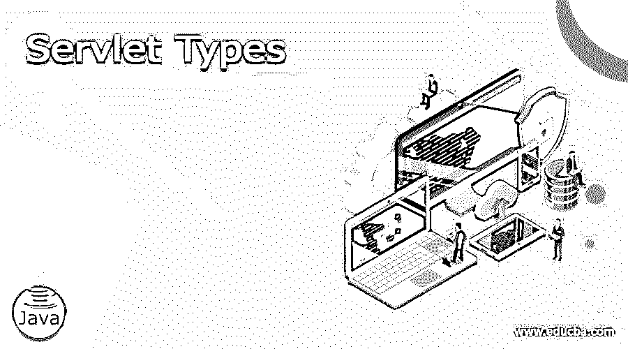

# Servlet 类型

> 原文：<https://www.educba.com/servlet-types/>

## Servlet 类型介绍

类似于运行在 web 服务器上的 applet 的 Java 程序被称为 Servlet，它根据用户的要求访问数据库并将信息发送回服务器。每个用户请求使用一个单独的进程作为一个线程，以便以更快的速度按顺序完成请求。为该请求创建的 URL 给出了 Java servlet 的结果，它具有在 Apache、Microsoft Internet Information 和 Netscape Enterprise 服务器上运行的附加模块。由于它通过 URL 中提到的端口号直接连接到 web 服务器，因此流量减少了。

### 类型

Servlet 有两种主要类型。它们是通用的 HTTP servlets。我们可以使用构造函数方法在 init()的帮助下初始化 servlet，使用析构函数方法使用 destroy()从资源中删除 servlet。有一个单独的方法叫做 service()来处理 servlet 请求，但是它们在两个 servlet 中以不同的方式处理。公共网关接口用于从网页连接到服务器，以便请求可以被理解，并且响应可以返回给用户。

<small>网页开发、编程语言、软件测试&其他</small>

#### 通用 Servlet:

通用 Servlet 是 Servlet 类型的直接分支。servlet 是以这种形式编写的

`javax.servlet.GenericServlet`

这个 servlet 不遵循任何协议，或者不受任何形式的关于如何编写 Servlet 和以什么顺序编写的协议规则的约束。这导致系统不支持任何 HTTP 协议。我们可以很容易地在通用 Servlet 中编写 Servlet，使得它对于系统中使用的任何方法都是通用的。日志方法也用于在 servletContext 接口中定义的通用 Servlet，以便可以很容易地监控 Servlet 中所做的所有更改。

由于没有特定的协议支持，我们可以将通用 Servlet 用于任何协议，并且在将它用于协议时没有任何限制。具体来说，当开发人员开发 web 页面并且还没有决定使用哪种协议时，可以使用通用 Servlet 来连接服务器并获取所需的信息。

当我们必须处理运行 servlet 请求的多个请求时，我们应该覆盖 service()方法来处理请求，因为它不特定于任何协议。此外，当在例程中运行时，service()方法不能以其通常的计时运行，它需要覆盖相同的计时。这使得服务方法以抽象的形式使用，不能直接帮助任何协议。ServletConfig 接口中只使用了 init 和 destroy 方法，这使得初学者很容易学会编写通用 Servlet。

*   通用 servlet 有助于任何 servlet 应用程序的配置和任何接口的实现，有助于使用 Servlet 中的任何方法，因为它是独立于协议的。任何类型的请求都可以在通用 Servlet 中处理，同时扩展服务器中应用程序的用途。
*   使用 Javax Servlet 包并帮助扩展 java.lang.object 来实现通用 Servlet 和 Servlet Config，Servlet Config 使初始化参数在 Servlet 中通过 XML 语言传递。
*   这不是开发人员的首选，因为在大多数情况下，HTTP 协议可以很好地与 HTTP Servlet 配合使用。
*   数据直接从浏览器中读取。如果它不属于 HTTP 协议，则在通用 Servlet 的帮助下进行管理，但是如果它是 HTTP 网页，则请求被发送到 HTTP servlet。这些数据在任何软件的帮助下或与数据库连接或直接获取信息进行处理。根据接收请求的方式，结果以 txt 或 HTML 格式发送回浏览器。此外，还会向浏览器发送一个响应，说明作为数据发送到浏览器的文档类型。

#### HTTP Servlet:

HTTP Servlet 是通用 Servlet 的一个子类。servlet 被称为 javax.servlet.HttpServlet。

*   顾名思义，它们有 HTTP 支持，在服务器的帮助下可以在任何 HTTP 环境下工作。当有特定于 HTTP 的方法要使用时，我们可以继续使用 HTTP servlet。
*   HTTP Servlet 只能用于 HTTP 协议，对于其他协议，我们应该使用通用的 Servlet。服务方法应该在所处理的服务中指定 HTTP 协议，使其只针对 HTTP 方法。
*   服务方法是在其他几个命令的帮助下一起处理的。为了发送请求，使用 doPost()，为了获取请求，使用 doGet()。HTTP servlet 中使用的其他方法有 doTrace()、doDelete()和 getServiceInfo()。使用这些命令，可以替换和使用通用 Servlet 的服务方法。根据传输方法，它重定向到相应的方法，并为服务器获取信息。服务方法不是抽象的，对于用户来说，在每个阶段使用哪个命令是很明显的。
*   Javax servlet Http package 用于扩展通用 servlet 以实现 java.io.serializable 以及 HTTP servlet 类的公共类。HTTP servlet 同时具有通用和 HTTP servlet 的属性，因此开发人员可以利用 servlet 中的所有功能。
*   提供了 Void 服务，该服务是公共的和私有的，使得协议理解服务器方法并基于该方法工作。不需要使用覆盖服务方法，因为大多数服务方法要么用在泛型 servlets 中，要么用在 HTTP servlets 中。
*   任何 Java 库都可以在 Servlet 中使用，因为基础语言是 Java，它有助于与 applets 和数据库或任何其他软件进行通信，这取决于开发人员的要求。
*   任何类型的应用程序都可以在 Servlet 的帮助下开发，Servlet 有助于保持应用程序的速度。因为它是独立于平台的，所以我们应该只关注服务器端并与应用程序连接。我们可以使用通用或 HTTP servlet 来编写应用程序，也可以借助 servlet 接口来编写。

### 推荐文章

这是 Servlet 类型的指南。这里我们分别讨论介绍两种主要类型的 Servlet。您也可以看看以下文章，了解更多信息–

1.  [Java 中的 Servlet](https://www.educba.com/servlet-in-java/)
2.  Servlet 中的[会话](https://www.educba.com/session-in-servlet/)
3.  [Servlet 过滤器](https://www.educba.com/servlet-filter/)
4.  [Servlet 架构](https://www.educba.com/servlet-architecture/)

