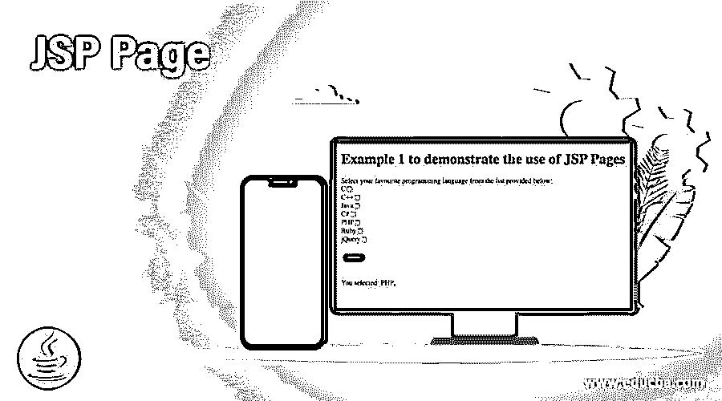
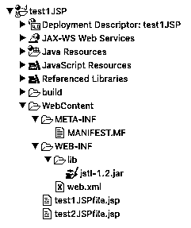
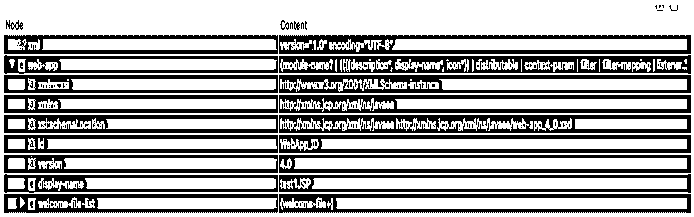
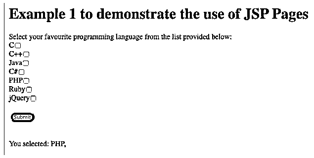

# JSP 页面

> 原文：<https://www.educba.com/jsp-page/>

## JSP 页面介绍

JSP 是 JAVA 服务器页面的缩写，是 JAVA servlet 技术的扩展。JSP 页面提供动态 web 内容，这有助于以交互方式更快地加载内容。与 JAVA servlets 相比，JSP 页面技术增加了一些功能，如 JSTL、更快的部署、更少的代码和高级定制标记。JSP 页面有一个额外的优势，它将 web 设计与开发分开，以实现代码清晰和更容易的长期维护。

### 句法

JSP 页面使用的语法是

<small>网页开发、编程语言、软件测试&其他</small>

应该创建该页面，并将其放在项目目录中的特定文件夹“WEB-INF”中，这样它才能正常工作。web.xml 文件将由您使用的 IDE(集成开发环境)自动创建，以便 IDE 本身可以正确地完成文件映射。页面的目录结构显示在本文所用示例的屏幕截图中。

JSP 页面应该以 ta9*gs 开始，这将有助于 HTML 标签包含 JSP 和 JAVA 相关的库。JSP 代码写在单独的标记下，以确定 JSP 代码，但这些都应包含在 HTML 标记下，如下所示:

`<%@ page language="java" contentType="text/html; charset=ISO-8859-1"
pageEncoding="ISO-8859-1"%>
<%@ taglib uri="http://java.sun.com/jsp/jstl/core" prefix="c" %>
<!DOCTYPE html PUBLIC "-//W3C//DTD HTML 4.01 Transitional//EN" "http://www.w3.org/TR/html4/loose.dtd">
<html>
<head> All header related things to be included here. The title is also attached to the web page in this section itself. </head>
<body> This section contains web static content or form along with links to other JSP pages or JAVA Servlets.  </body>
</html>`

### JSP 页面在 JSP 中是如何工作的？

JSP 页面主要使用三个函数来初始化、处理并最终销毁已部署的页面，以便在与服务器交互后打印动态内容。这三个函数分别是 jspInit()、_jspService()和 jspDestroy()。只有当 JSP 文件在内部被转换成 JAVA servlet 时，才会执行这个操作。然后启动这个 JAVA 文件来创建一个类文件。类文件通过 JRE 运行，最终得到处理。创建了依赖于本地系统设置的文件后，它将被加载到服务器上。

通过页面创建动态 web 内容的流程如下所示:

JSP 页面是通过 JSP 页面、HTML 页面或 JAVA servlet 调用的。一旦它被调用，下面提到的循环就会被触发以生成动态内容。这种动态内容然后被馈送到网页上。任何服务器都可以用在后端，比如 wildfly、tomcat 或其他支持这项技术的服务器。

网页→被调用的 JSP 页面→ JSP 页面(。jsp 文件)→ JSP 翻译器→ JAVA Servlet(。java 文件)->编译器→类文件→传递给 JRE ( JAVA 运行时环境)→ Servlet 对象→动态内容→网页。

借助示例，可以很好地理解控制和数据流。页面的使用将在下一节通过示例进行解释。

### 例子

在本节中，通过输出屏幕截图解释了页面示例。

#### 示例 1–test1 JSP 项目

**代码:JSP 页面:test1JSPfile.jsp**

`<%@ page language="java" contentType="text/html; charset=ISO-8859-1"
pageEncoding="ISO-8859-1"%>
<%@ taglib uri="http://java.sun.com/jsp/jstl/core" prefix="c" %>
<!DOCTYPE html PUBLIC "-//W3C//DTD HTML 4.01 Transitional//EN" "http://www.w3.org/TR/html4/loose.dtd">
<html>
<head>
<meta http-equiv="Content-Type" content="text/html; charset=ISO-8859-1">
<title>Example 1 of JSP Pages</title>
</head>
<body>
<h1>Example 1 to demonstrate the use of JSP Pages</h1>
<form name="forEachForm"
action="test1JSPfile.jsp"
method="POST">
Select your favourite programming language from the list provided below:  
C<input type="checkbox" name="option" value="C"/> 
C++<input type="checkbox" name="option" value="C++"/> 
Java<input type="checkbox" name="option" value="Java"/> 
C#<input type="checkbox" name="option" value="C#"/> 
PHP<input type="checkbox" name="option" value="PHP"/> 
Ruby<input type="checkbox" name="option" value="Ruby"/> 
jQuery<input type="checkbox" name="option" value="jQuery"/>  
<input type="submit"  style='background-color: green; border-radius: 15px;' value="Submit"/>
</form>
 
 
You selected:
<c:forEach var="lang" items="${paramValues.option}">
<c:out value="${lang}"/>,
</c:forEach>
</body>
</html>`

**Web.xml:**

**输出:**

说明:该项目包含两个主要文件，分别是“web.xml”和“test1JSPfile.jsp”。“web.xml”文件是参照项目创建的，用于映射目的。这个页面包含了一些重要的标签，这些标签将 JSP 和其他库链接起来，比如 JSTL 链接到 JSP 页面。语法部分提到了这些标记，它们对于 JSP 页面生成动态 web 内容非常重要。

“”标签包含页面的元数据。它在网页的输出屏幕上不可见，但它受浏览器支持，用于配置与内容显示、内容加载和所用字符集相关的设置。此标签始终显示在标题部分下。<title>标签用来设置网页的标题。这也应该只在 head 部分声明。</title>

在正文部分，设计表单。该表单包含“复选框”,并在页面中定义。checkbox 输入类型有一些属性，如 name 和 value，供内部使用，以从选中的复选框中获取值。“

<form>”标签包含一些重要的属性，比如动作和方法。action 属性决定了最终单击 submit 按钮后控件应该流向的下一个位置。</form>

因为复选框用于捕获用户的输入，所以可以选择多个值。选中复选框的值被取出并存储在 JSTL 的一个名为“paramValues”的关键字中。然后将“参数值”赋给一个名为“$lang”的变量。然后打印变量“$lang”(在 JSP 中，变量前面总是有美元符号，以便识别)。”4lang
使用 foreach 循环进行迭代，在 JSP 代码的帮助下，在同一个屏幕上动态打印所有选择的值。

### 结论

JSP 页面是 JAVA servlet 的简化版本，因为与 JAVA servlet 相比，JSP 页面简单且更易于维护。它带来了自定义标签和多个有用的库(如 JSTL)的额外优势，增加了 JSP 技术的用户数量。这被广泛使用，无疑是在 web 上开发交互式网页的最快方法之一。

### 推荐文章

这是一个 JSP 页面的指南。为了更好地理解，我们在这里讨论 JSP 页面如何在 JSP 中工作，并给出了相应的例子。您也可以看看以下文章，了解更多信息–

1.  [JSP 登录页面](https://www.educba.com/jsp-login-page/)
2.  [JSP 复选框](https://www.educba.com/jsp-checkbox/)
3.  [JSP 重定向](https://www.educba.com/jsp-redirect/)
4.  [Java 中的 JSP](https://www.educba.com/jsp-in-java/)

