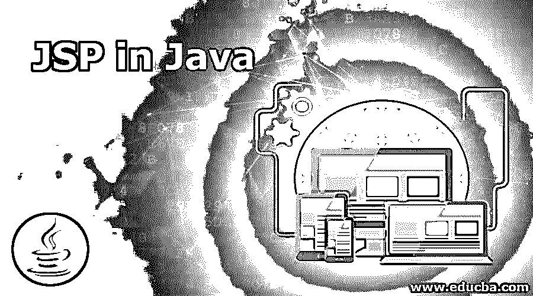
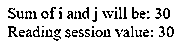

# Java 中的 JSP

> 原文：<https://www.educba.com/jsp-in-java/>

## Java 中的 JSP 介绍

JSP 是 Java 服务器页面的简称。JSP 在服务器端处理所有的东西。这是核心 Java 语言的扩展。在 Java 中，我们可以编写一个程序，但是让事情动态化 JSP 是可以帮助我们做到这一点的。这基本上是 HTML 和 Java 的结合。如果我们有一个 HTML 文件，这个过程可以用 JavaScript 来完成。JavaScript 在客户机上工作，但是 JSP 在服务器端工作。JSP 最适合服务器端动态网页。JSP 页面可以是 HTML 或 JSP 或者两者的组合。当我们将 HTML 页面保存为 JSP 时，它将使我们能够在该页面上使用 Java 代码。

### JSP 在 Java 中是如何工作的？

为了运行 JSP 页面，我们需要一个环境。因为它运行在服务器端，所以除了 JDK 之外，我们还需要一台服务器。JDK 只会运行 Java 程序。我们知道，JSP 代码只在服务器上运行。我们可以使用 Tomcat 服务器来运行我们的 JSP 文件。

<small>网页开发、编程语言、软件测试&其他</small>

为了编写 JSP 代码，我们需要在中编写代码。

`<%
// JSP code goes here…
%>`

假设我们想打印 Hello Word，我们可以编写如下代码:

`<html>
<head>
<title>JSP Test Page</title>
</head>
<body>
<%
out.println("<h1>Hello World!</h1>");
%>
</body>
</html>`

在上面的代码中，我们可以看到，它结合了 HTML 和 Java 两者。

jsp 的文件扩展名会是. JSP，如果我们想把上面的代码保存为 hello，那么我们需要用“hello.jsp”来保存这个。

这个程序可以在任何网络浏览器上运行。函数 out.print()可以用来打印输出窗口中的任何内容。我们无法在 JSP 中实现所有的功能，但是我们可以将一个全功能的 Java 类扩展到 JSP 文件类中。在 JSP 中，我们可以获取和设置会话变量，这在普通 Java 中是做不到的。

**语法:**

由于这是 Java 的扩展，所以代码将由 Java 本身编写。除了代码 Java 特性之外，还会有更多的特性可供使用。将会有一个块，Java 的每个代码都将在其中编写。在这个块之外，可以编写 HTML 和 CSS、JavaScript、JQuery。现在，是时候看看脚本元素了。这些元素帮助我们将 java 代码写入 JSP 页面。

**Scriptlet 标签:**

`<%  Our java source code goes here %>`

**表情标签:**

`<%=  our expression goes here %>`

**声明标签:**

`<%!  Our field or the method declaration goes here %>`

### Java 中 JSP 的隐式对象

JSP 中有 9 个隐式对象来满足不同的需求。

*   **out:** 可用于在屏幕上显示输出。

`PrintWriter out=response.getWriter();`

*   **request:** 通过使用这个，我们可以得到表单元素提交的请求。

`String name=request.getParameter("user_name");`

*   **回应:**我们可以用这个物体做各种事情。比如，向页面发送请求()
*   **config:** 可用于初始化一个页面或整个应用程序的参数。
*   应用
*   会议
*   页面上下文
*   页
*   例外

这是一些有用的物品。JSP 比 PHP、ASP 等其他动态支持语言更安全。由于 Java 的流行，这个 JSP 仍然有需求。

### 用 Java 实现 JSP 的例子

以下是 Java 中 JSP 的示例:

#### 示例#1

**代号:hello.jsp**

`<html>
<head>
<title>JSP Test Page</title>
</head>
<body>
<%
out.println("<h1>Hello World.</h1>");
out.println("<h1>This is my first JSP Program.</h1>");
%>
</body>
</html>`

**输出:**

#### 实施例 2

**代号:comment.jsp**

`<html>
<head>
<title>JSP Test Page</title>
</head>
<body>
<%
// This is single line comment
/*
This is multi-line comment line -1
This is multi-line comment line -2
*/
out.println("<h1>This is my first JSP Program.</h1>");
%>
</body>
</html>`

**输出:**

#### 实施例 3

**代码:**

`<html>
<head>
<title>JSP Test Page</title>
</head>
<body>
<%@ page session = "true" %>
<%
int i = 10;
int j = 20;
int sum  = i + j;
out.println("Sum of i and j will be: "+sum);
%>
</body>
</html>`

**输出:**

#### 实施例 4

**代码:**

`<html>
<head>
<title>JSP Test Page</title>
</head>
<body>
<%@ page session = "true" %>
<%
int i = 10;
int j = 20;
int sum  = i + j;
out.println("Sum of i and j will be: "+sum);
session.setAttribute("SUMSESSION",sum);  // setting the sum output to a session, SUM is the name of the session variable
session.getAttribute("SUM");  // getting the session value
out.println(" Reading session value: "+ session.getAttribute("SUMSESSION"));
%>
</body>
</html>`

**输出:**

#### 实施例 5

**代码:**

在这个例子中，我们将看到，如何在不使用 out 对象的情况下在浏览器屏幕上打印消息。

`<html>
<head>
<title>JSP Test Expression Page</title>
</head>
<body>
<%= "welcome to this jsp " %>
</body>expression tag
</html>`

**输出:**

#### 实施例 6

**代码:**

`<html>
<head>
<title>JSP Test Initialization Page</title>
</head>
<body>
<%! int i=50; int j=50; int sum=0; %>
<%= "Sum of  i and j variables will be:"+(sum = i+j) %>
</body>
</html>`

**输出:**

### 结论

最好使用任何 IDE，因为它为我们提供了运行 JSP 程序的完整环境。Eclipse 是我们可以继续前进的工具。我们可以从各种可用版本中选择任何一种 Eclipse。还有另一个类似的术语 Servlet，它在本质和功能上也与 JSP 非常相似。对于初学者，如果我们不能在您的机器上设置运行 JSP 的环境，我们也可以找到一些在线编辑器。

### 推荐文章

这是 Java 中 JSP 的指南。在这里，我们讨论 Java 中的 JSP 和顶级隐式对象的介绍，以及代码实现的例子。您也可以浏览我们推荐的其他文章，了解更多信息——

1.  [JSP 标记库](https://www.educba.com/jsp-taglib/)
2.  [JSP 格式化程序](https://www.educba.com/jsp-formatter/)
3.  [JSP 过滤器](https://www.educba.com/jsp-filters/)
4.  [JSP 表达式](https://www.educba.com/jsp-expression/)

