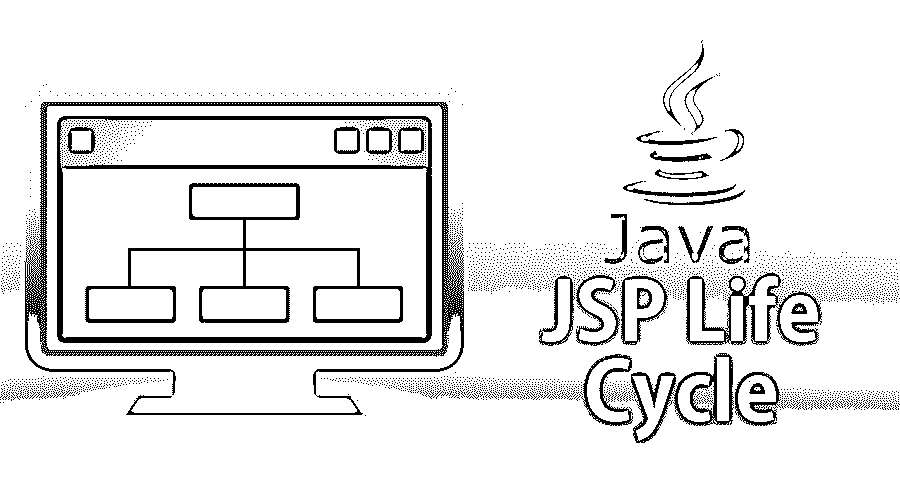

# JSP 生命周期

> 原文：<https://www.educba.com/jsp-life-cycle/>




## JSP 生命周期介绍

在本文中，我们将讨论 JSP 生命周期。Java 服务器页面，一种服务器端技术，负责服务器端的处理。

### 我们哪里需要 JSP？

*   嗯，如果你对基于网络的开发感兴趣，而我们看到的是构建动态网站，那么 JSP 扮演着重要的角色，因为渲染是动态完成的。
*   JSP 只在底层 HTML 上工作；页面的主体仅由基本的 HTML 标记组成，但是某些占位符、参数、列表值、[迭代器仅适用于 JSP，HTML 仅提供静态显示，而运行时要完成的任何解析都需要动态处理，因此 JSP 是一种解决方案。](https://www.educba.com/iterator-in-java/)
*   JSP 支持内容生成和内容呈现的分离

让我们举一个基本的例子，让你了解这种动态渲染。

<small>网页开发、编程语言、软件测试&其他</small>

**语法:**

```
<html>
<body>
<% out.print(“This is my first JSP page”); %>
</body>
</html>
```

内的内容或逻辑是动态呈现的，只由后端传递。

现在，让我们继续前进，理解 JSP 的生命周期，以及它们实际上是如何在前端呈现的，以便为客户提供易读或现成的体验。

### JSP 的生命周期

这个循环分为几个阶段，定义如下:

1.  **翻译阶段:**JSP 文件被转换成 servlet 文件。
2.  **编译阶段:**servlet 文件被转换成 servlet 类。
3.  类别加载
4.  servlet 对象的实例化
5.  Servlet 容器调用 jspInit()方法进行初始化
6.  Servlet 容器调用 _jspService()来处理请求
7.  JSP 的清理，这里 servlet 容器将调用 jspDestroy()方法。

现在让我们详细说明上述步骤，以便有一个更清楚的了解:

#### 第一步

在翻译阶段，servlet 容器将 JSP 翻译成 servlet，以便基于标记的编码在 java 中获得等效的形式，这样 Java 虚拟机(JVM)就可以理解这一点(因为它不理解标记的语言)。这种转换是由服务器在部署 web 应用程序的时候或者 JSP 获得第一个执行请求的时候完成的。

#### 第二步

现在是编译源代码的时候了，即将 servlet 代码转换成 java 字节码(java 字节码是 java 虚拟机的指令集)。

#### 第三步

从 JSP 源代码加载的 servlet 类现在将被加载到容器中。

#### 第四步

通过 web 容器加载类文件后，JSP 容器现在使用无参数构造函数来创建 servlet 类的实例；一旦容器通过调用 jsplnit()方法初始化了对象。

**语法:**

```
Public void jsplnit()
{
// servlet initialization related snipped to be placed here
}
```

#### 第五步

现在是请求处理的时候了；这里，初始化的 JSP 等价 servlet 对象用于处理客户机请求。_jspService()方法由 web 容器调用。这个调用是在 servlet 对象上完成的，为相应的请求和响应传递 HTTPServletRequest 对象和 HTTPServletResponse 对象。请注意，没有覆盖 _jspService()方法的规定。

**语法:**

```
Public void _jspService( HttpServletRequest request, HttpServletResponse response)
{
//snipped is placed here
}
```

#### 第六步

最后一步叫做 JSP 清理；JSP 必须从容器的使用中移除，jspDestroy()方法用于相同的目的；此方法只能调用一次。有一个覆盖这个方法的规定，在我们想要执行自定义操作的情况下可以这样做，比如数据库的连接释放等。

**语法:**

```
public void jspDestory()
{
// snippet is placed here
}
```

**举例:**

让我们为示例应用程序创建一个登录表单，我们将在这里使用 JSP 来呈现某些内容。

```
<%@ page language="java" contentType="text/html; charset=ISO-8859-1"
pageEncoding="ISO-8859-1"%>
<!DOCTYPE html PUBLIC "-//W3C//DTD HTML 4.01 Transitional//EN" "http://www.w3.org/TR/html4/loose.dtd">
<html>
<head>
<meta http-equiv="Content-Type" content="text/html; charset=ISO-8859-1">
<title>My Login Form</title>
</head>
<body>
<%
Date d = new Date();
System.out.println("Current Date= "+d);
%>
<form action="actionName" method="post">
<table style="with: 50%">
<tr>
<td> UserName</td>
<td><input type="text" name="userName" /></td>
</tr>
<td> Password </td>
<td><input type="password" name="password" /></td>
</tr>
</table>
</form>
</body>
</html>
```

在上面的例子中，放置在中的代码是动态呈现的，正如我们之前提到的。现在，一旦这个请求被提交，它将被动作控制器接收，动作控制器基本上是一个 Java 类，包含与 JSP 文件中提到的名称相对应的参数。

servlet 容器创建一个模态对象，通过引用这个特定的控制器，可以在其他 JSP 中引用内容。

如今，这种基于 MVC 的方法在如下技术中找到了一席之地

*   Spring MVC
*   支柱 2
*   小型应用程序

Spring MVC 和 Struts 2 已经引入了它们特定的 URI 来以定制的方式使用 JSP，它们还引入了不同种类的标签，比如自动完成、迭代器、列表等等。

因此，由于 JSP 的灵活性，它在许多框架中找到了理想的位置。

### 结论

*   因此，我们了解到动态网站的前端是通过 JSP 呈现的，而静态页面可以直接放入 HTML，因为它们不需要任何数据/内容操作。
*   现代技术与 JSP 兼容，并被类似于 struts 和 spring 的框架所使用，这些框架在与银行、SCM、零售商店等相关的大型应用程序中占有一席之地。
*   兼容 AJAX 调用动态渲染。
*   应用程序不能是单页类型，因为每次都需要从后端加载页面。
*   Tiles 可以用于 struts 和 spring 中的基本布局格式，我们需要反复渲染的只是 body。
*   最终代码在前端被转换成 HTML 的等价物。
*   JSP 区分了内容表示和内容生成的概念。
*   拦截器是由各种框架提供的，这使得开发人员的生活变得容易，像 [struts](https://www.educba.com/what-is-struts/) 中的实用程序是为文件上传过程等提供的。

### 推荐文章

这是 JSP 生命周期的指南。在这里，我们分别讨论了 JSP 生命周期的基本概念、步骤和示例。您也可以浏览我们推荐的其他文章，了解更多信息——

1.  [JSP vs ASP](https://www.educba.com/jsp-vs-asp/)
2.  [JSP vs Servlet](https://www.educba.com/jsp-vs-servlet/)
3.  [Java 中的 JSP](https://www.educba.com/jsp-in-java/)
4.  [JSP 重定向](https://www.educba.com/jsp-redirect/)


