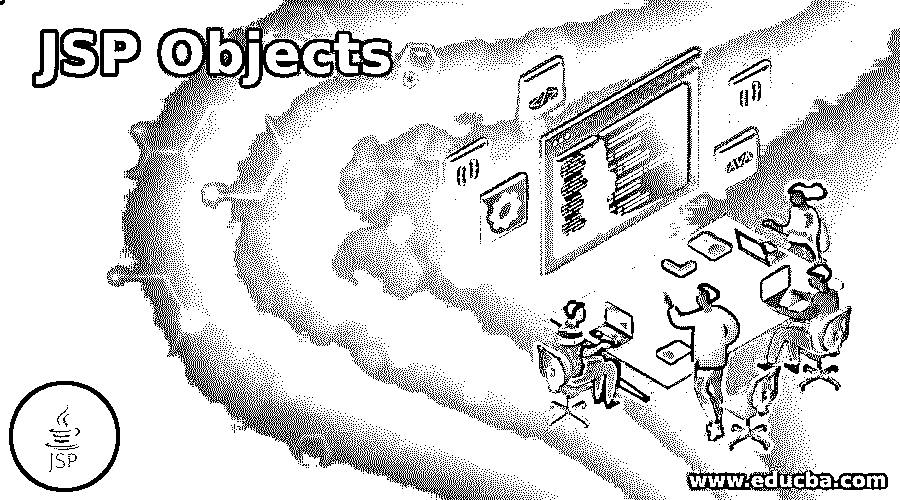
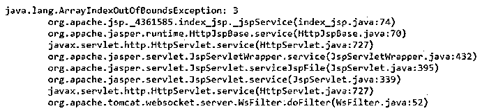
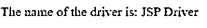
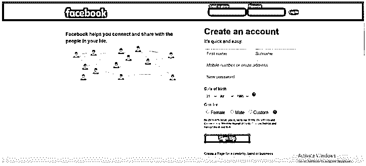
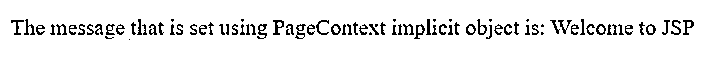
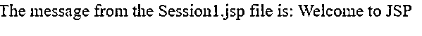
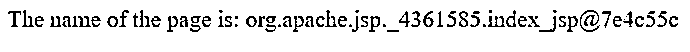

# JSP 对象

> 原文：<https://www.educba.com/jsp-objects/>

## JSP 对象简介

JSP 容器在每个页面中提供给开发人员的对象称为 JSP 隐式对象，开发人员可以直接调用这些对象而不必显式声明它们，这些对象也称为预定义变量，JSP 支持九个隐式对象，即 Throwable 类型的异常、ServletConfig 类型的配置、out 类型的 JspWriter、HttpServletRequest 类型的请求、object 类型的页面、ServletContext 类型的应用程序、HttpServletResponse 类型的响应、pageContext 类型的 pageContext 以及 HttpSession 类型的会话

### 在 JSP 中创建和定义隐式对象

*   JSP 引擎在将 JSP 转换为 Servlet 的过程中创建 JSP 隐式对象，这只是转换的一个阶段。
*   没有必要初始化和声明 JSP 隐式对象，因为隐式对象的创建发生在服务方法内部，这使我们能够在脚本中直接使用这些 JSP 隐式对象，而不需要初始化和声明。

### JSP 支持的隐式对象

下面给出了 JSP 支持的隐式对象:

<small>网页开发、编程语言、软件测试&其他</small>

#### 1.JSP 异常隐式对象

用于打印异常的隐式对象称为异常隐式对象，该隐式对象仅用于包含错误的页面。

**举例:**

演示异常隐式对象的程序。

**代码:**

`<%@ page language="java" contentType="text/html; charset=ISO-8859-1"
pageEncoding="ISO-8859-1" isErrorPage="true"%>
<html>
<head>
<meta http-equiv="Content-Type" content="text/html; charset=ISO-8859-1">
<title>Exception implicit object</title>
</head>
<body>
<%String[] str={"welcome","to","JSP"};
out.println(str[3]);%>
<%= exception %>
</body>
</html>`

**输出:**

在上面的程序中，定义了一个字符串数组来存储三个字符串，我们试图访问索引 3 处的字符串，这是不可用的。因此引发了数组索引越界异常。

#### 2.JSP 输出隐式对象

用来将数据写入缓冲区的隐式对象称为 out 隐式对象。

**举例:**

演示隐式对象的程序。

**代码:**

`<%@ page language="java" contentType="text/html; charset=ISO-8859-1"
pageEncoding="ISO-8859-1"%>
<html>
<head>
<meta http-equiv="Content-Type" content="text/html; charset=ISO-8859-1">
<title>out Implicit object</title>
</head>
<body>
<% String str1="Welcome to";String str2="JSP";
out.println("The first and second string together is: " +str1);
out.println(str2);
%>
</body>
</html>`

**输出:**

在上面的程序中，两个字符串变量用于存储两个字符串。然后使用 out 隐式对象将字符串打印出来作为输出。

#### 3.JSP 配置隐式对象

通过使用 JSP 容器为每个页面创建的隐式对象配置，可以获得特定 JSP 页面的初始化参数。

**举例:**

演示配置隐式对象的程序。

**代码:**

`<%@ page language="java" contentType="text/html; charset=ISO-8859-1"
pageEncoding="ISO-8859-1"%>
<html>
<head>
<meta http-equiv="Content-Type" content="text/html; charset=ISO-8859-1">
<title>config implicit object</title>
</head>
<body>
<% String name = config.getServletName();
out.println("The name of the servlet is: " +name);%>
</body>
</html>`

**输出:**

在上面的程序中，我们使用 config.getServletName()来获取 servlet 的名称。

#### 4.JSP 请求隐式对象

请求信息，如报头、参数、远程地址、内容类型、服务器名称、服务器端口、字符编码等信息。可以通过使用请求隐式对象来获得和设置、获取或删除属性。

**举例:**

演示异常隐式对象的程序。

**代码:**

Firstpart.html 项目内容:

`<form action="Request.jsp">
<input type="text" name="String">
<input type="submit" value="Enter"> 
</form>`

Request.JSP 项目内容:

`<%
String str=request.getParameter("String");
out.print(str);
%>`

**输出:**

在上面的程序中，接受用户输入的 html 代码写在一个文件中。然后在程序中使用请求隐式对象来获取用户在第二个文件中输入的内容。

#### 5.JSP 应用程序隐式对象

可以从配置文件中获取初始化参数，并且可以通过使用隐式对象应用程序来设置、获取或移除应用程序范围中的属性。

**举例:**

演示应用程序隐式对象的程序。

**代码:**

Web.xml 程序中的内容:

`<application>
<servlet>
<servlet-name>Welcome to JSP</servlet-name>
<jsp-file>/application.jsp</jsp-file>
</servlet>
<context-param>
<param-name>nameofthedriver</param-name>
<param-value>JSP Driver</param-value>
</context-param>
</application>`

application.JSP 项目内容:

`<%
String name=application.getInitParameter("nameofthedriver");
out.print("The name of the driver is:"+name);
%>`

**输出:**

在上面的程序中，xml 代码写在一个文件中，该文件由驱动程序的名称组成。然后应用程序使用隐式对象从另一个文件的 xml 文件中获取驱动程序的名称。

#### 6.JSP 响应隐式对象

可以添加或操作响应，例如将一个响应定向到另一个资源或发送错误等。可以使用响应隐式对象来完成。

**举例:**

演示响应隐式对象的程序。

**代码:**

Firstpart.html 项目内容:

`<form action="Response.jsp">
<input type="text" name="String">
<input type="submit" value="Enter"> 
</form>`

Response.JSP 项目内容:

`<%
response.sendRedirect("http://www.facebook.com");
%>`

**输出:**

在上面的程序中，接受用户输入的 html 代码写在一个文件中。则在程序中使用响应隐式对象将用户输入的输入重定向到第二文件中的网站。

#### 7.JSP 页面上下文隐式对象

通过使用 PageContext 隐式对象，可以在页面或请求或会话或应用程序的范围内设置、获取或删除属性。

**举例:**

演示 PageContext 隐式对象的程序。

**代码:**

`<%@ page language="java" contentType="text/html; charset=ISO-8859-1"
pageEncoding="ISO-8859-1"%>
<html>
<head>
<meta http-equiv="Content-Type" content="text/html; charset=ISO-8859-1">
<title>PageContext implicit object</title>
</head>
<body>
<%pageContext.setAttribute("Message","Welcome to JSP",pageContext.PAGE_SCOPE);
String str = (String)pageContext.getAttribute("Message");
out.println("The message that is set using PageContext implicit object is: " +str);
%>
</body>
</html>`

**输出:**

在上面的程序中，PageContext 隐式对象用于设置三个参数，key、value 和 scope。这里的键是消息，值是 JSP 的欢迎值，范围是可以使用 PAGE_SCOPE 访问的页面。通过使用 PageContext 隐式方法的 get 属性作为输出来获得键的值。

#### 8.JSP 会话隐式对象

会话的信息或设置属性，获取或删除属性可以使用会话隐式对象获得。

**举例:**

演示会话隐式对象的程序。

**代码:**

Session1.JSP 项目内容:

`<%@ page language="java" contentType="text/html; charset=ISO-8859-1"
pageEncoding="ISO-8859-1"%>
<html>
<head>
<meta http-equiv="Content-Type" content="text/html; charset=ISO-8859-1">
<title>Session implicit object demo file 1</title>
</head>
<body>
<% session.setAttribute("Message","Welcome to JSP"); %>
<a href="Session2.jsp">Click the link to obtain the message</a>
</body>
</html>`

Session2.JSP 项目内容:

`<%@ page language="java" contentType="text/html; charset=ISO-8859-1"
pageEncoding="ISO-8859-1"%>
<html>
<head>
<meta http-equiv="Content-Type" content="text/html; charset=ISO-8859-1">
<title>Session implicit object demo file 2</title>
</head>
<body>
<% String msg = (String)session.getAttribute("Message");
out.println("The message from the Session1.jsp file is: " +msg);
%>
</body>
</html>`

**输出:**

在上面的程序中，编写了使用会话隐式对象在一个文件中存储消息的代码，该文件可以通过在另一个文件中使用会话隐式对象来获得。

#### 9.JSP 页面隐式对象

自动生成的 servlet 类的引用被分配给 JSP 中的页面隐式对象。

**举例:**

演示页面隐式对象的程序。

**代码:**

`<%@ page language="java" contentType="text/html; charset=ISO-8859-1"
pageEncoding="ISO-8859-1"%>
<html>
<head>
<meta http-equiv="Content-Type" content="text/html; charset=ISO-8859-1">
<title>Page implicit object</title>
</head>
<body>
<% String str = page.toString();
out.println("The name of the page is: " +str);%>
</body>
</html>`

**输出:**

在上面的程序中，page.toString()方法用于显示 JSP 页面的名称。

### 推荐文章

这是 JSP 对象的指南。这里我们讨论介绍，创建和定义 JSP 中的隐式对象和 JSP 支持的隐式对象。您也可以看看以下文章，了解更多信息–

1.  [JSP 错误页面](https://www.educba.com/jsp-error-page/)
2.  [JSP 格式化程序](https://www.educba.com/jsp-formatter/)
3.  [JSP 登录页面](https://www.educba.com/jsp-login-page/)
4.  [JSP 复选框](https://www.educba.com/jsp-checkbox/)

