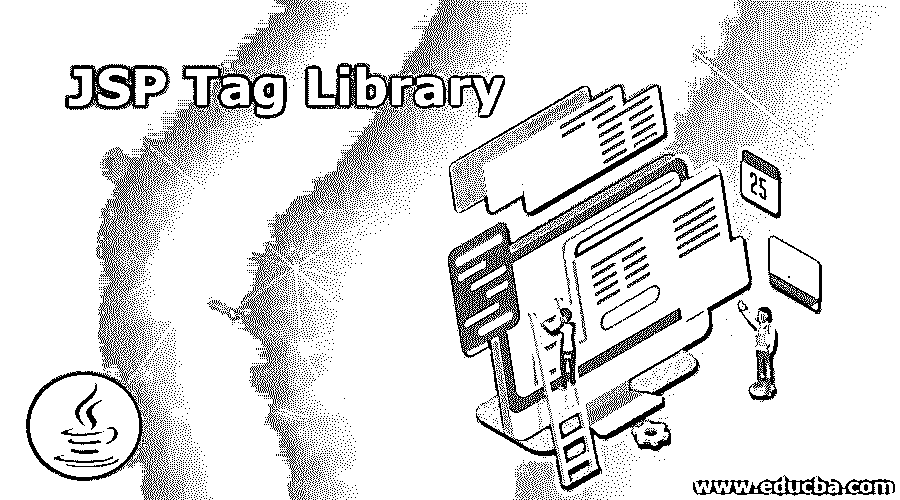
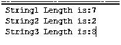

# JSP 标记库

> 原文：<https://www.educba.com/jsp-tag-library/>

## JSP 标记库简介

标记库定义为一组自定义动作和用户定义动作的集合。标记也可由开发人员直接使用。编码人员的代码可在 JSP 网页中手动编码，自动预定义标记显示在一些 Java 开发工具中。一个标签库应该必须与可移植库和它之间不同于 JSP 容器实现。自定义标记库或用户定义的标记库涵盖了与供应商相关的整个基本框架，也可用于提供他们自己的标记库，并以特定于供应商的编译时标记之间的标准运行时标记库差异的一些比较作为结论。

**语法:**

<small>网页开发、编程语言、软件测试&其他</small>

jsp 标签库分为不同的类别，如 JSTL(jsp 标准标签库)等。一般语法如下。

`<%@ taglib prefix = "" uri = "" %>
<html>
<body>
< ----core tags with their attributes values------/>
----some logic jsp codes----
</body>
</html>`

以上基本代码是 JSTL 标签库的语法之一，我们可以根据项目和用户要求使用定制的标签库和预定义的功能。

### JSP 标签库是如何工作的？

jsp 标记库，如 jstl，它代表了一组预定义的标记来简化 JSP 代码，特别是在开发过程中。jstl 主要提供了许多用于简化 JSP 代码的标记，这也是它的优点之一，类似于其他优点，如代码的可重用性。我们可以将 jstl 代码用于并行动态网页。我们在 jstl 中没有使用任何 scriptlet 标记。这是 jstl 的主要优点。

**JSP 标签库有两种不同的类型:**

1.  标准标签库框架
2.  编译时间标签。

标准 java 服务器页面中使用的标准标记库框架也允许供应商创建动态定制的 jsp 标记库。它定义为一组自定义或用户定义的操作集合。自定义标签也可以直接用于开发人员或编码人员。标签将被定义，标签库在标签库描述文件中被提及。[标签库指令中的 URI 指定了](https://www.educba.com/jsp-directives/)以及在哪里可以找到标签库描述文件。我们还在 jsp 项目的 web.xml 配置文件中使用了 URI 快捷方式。

#### JSP 标记库的使用

以下是 JSP 标记库的不同用途:

**1。**jsp 标记库的前缀:指令中的库总是在字符串中使用它总是在 JSP 网页中与库中任何预定义的标记一起使用标记库在 JSP 页面文档开始时被指定和初始化。

**2。**我们可以使用自定义标记，如“mytag”是自定义标记库中的一个标记。我们可以使用 jstl 标记指令和自定义标记库前缀。在 JSP 转换器中也可以使用标记库描述文件中的 mytag，该文件可以在 taglib 指令中指定的 URI 中找到。

**3。**标签库描述文件中指定标签的条目提供了关于标签用法的说明，包括标签是否使用 JSTL 标签中的属性以及这些属性的名称。

**4。**概述在标签处理程序类中定义了标签的语义以及使用指定标签的结果必须发生的动作。必须在标签处理程序中对其进行描述。每个指定标签都有其自己的标签处理程序类，并且在标签库描述符文件中定义了指定的类名。

**4。**该文件指示标记是否使用标记库描述符文件中的主体。自定义标记操作可以创建一个或多个服务器端实例，这些实例已被标记本身或其他 JSP 脚本元素(如 scriptlets)使用。

**6。**这些对象通常被定义为脚本变量，该变量信息存储在 tag-extra-info 类中。我们可以在标签之外使用嵌套标签处理程序类，这是需要的，如果它是关于访问外部标签处理程序实例的嵌套标签的目的的状态管理。

7 .**。**用于自定义标签和标签处理程序的动作的 JSTL 标签处理程序是 java 类的一个实例，必须用两个标准 java 接口中的一个来实现，它依赖于每个标签的主体。

### JSP 标签库的实现示例

以下是一些例子:

#### 示例#1

**代码:**

`<%@tagliburi="WEB-INF/sample.tld"prefix="t" %>
Today Date and Time       : <t:today/>
packagecom.first;
importjava.util.Calendar;
importjavax.servlet.jsp.JspException;
importjavax.servlet.jsp.JspWriter;
importjavax.servlet.jsp.tagext.TagSupport;
publicclasstagHandlerextendsTagSupport{
publicintStart() throwsJspException {
JspWriterj=pageContext.getOut();
try{
j.print(Calendar.getInstance().getTime());
}catch(Exception e){System.out.println(e);}
returnSKIP_BODY;
}
}`

**输出:**

#### 实施例 2

**代码:**

`<%@pagelanguage="java"contentType="text/html; charset=ISO-8859-1"
pageEncoding="ISO-8859-1"%>
<%@tagliburi="WEB-INF/sample.tld" prefix="c"%>
<!DOCTYPEhtmlPUBLIC"-//W3C//DTD HTML 4.01 Transitional//EN"
"http://www.w3.org/TR/html4/loose.dtd">
<html>
<head>
<metahttp-equiv="Content-Type"content="text/html; charset=ISO-8859-1">
<title>Welcome To My Domain</title>
</head>
<body>
<c:setvar="demo"value="Welcome To My Domain"></c:set>
<c:outvalue="${demo}"></c:out>
</body>
</html>`

**输出:**

#### 实施例 3

**代码:**

`<%@pagelanguage="java"contentType="text/html; charset=ISO-8859-1"
pageEncoding="ISO-8859-1"%>
<%@tagliburi="http://java.sun.com/jsp/jstl/core"prefix="c"%>
<%@tagliburi="http://java.sun.com/jsp/jstl/functions"prefix="fn" %>
<html>
<head>
<title>Sample</title>
</head>
<body>
<c:setvar="s"value="Welcome"/>
<c:setvar="s1"value="To"/>
<c:setvar="s2"value="MyDomain"/>
String1 Length is: ${fn:length(s)} 
String2 Length is: ${fn:length(s1)} 
String3 Length is: ${fn:length(s2)}
</body>
</html>`

**输出:**

上面的例子以三种不同的方式展示了 JSTL 标签库。在第一个示例中，我们已经使用标签库指令完成了基本的日期和时间操作，如我们自己的前缀和内置方法，它显示了当前的日期和时间。第二个示例仅显示了 JSTL 标签中的基本核心函数，它仅使用<out>标签在屏幕中打印字符串。最后一个示例中，我们使用了 JSTL 的核心和函数。必须使用名为 fn: length()方法的 jstl 函数计算三个字符串的长度。无论我们初始化了什么字符串，都必须计算长度。</out>

### 结论

它被称为 tld 文件，具有 JSP 代码中使用的一组内置功能。在 Jsp 2.0 版本中有一个叫做简单标签支持类的特性，它是用简单标签接口实现的，它们用于 getter 方法来检索属性。

### 推荐文章

这是一个 JSP 标签库的指南。这里我们讨论 JSP 标记库的介绍，以及它是如何工作的，还有它的例子和代码实现。您也可以浏览我们推荐的其他文章，了解更多信息——

1.  [JSP 在 Java 中是如何工作的？](https://www.educba.com/jsp-in-java/)
2.  [JSP 脚本元素(示例)](https://www.educba.com/jsp-scripting-elements/)
3.  [JSP 与 JavaScript 的主要区别](https://www.educba.com/jsp-vs-javascript/)
4.  [10 个最佳 JSP 面试问题](https://www.educba.com/jsp-interview-questions/)

