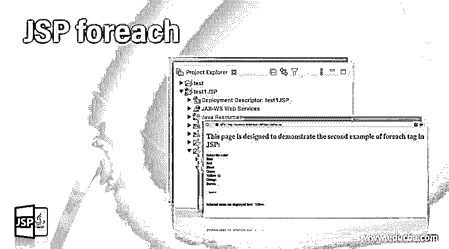
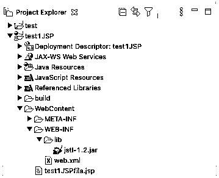
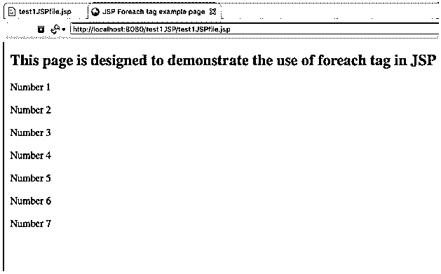
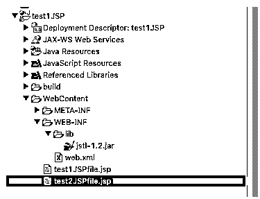
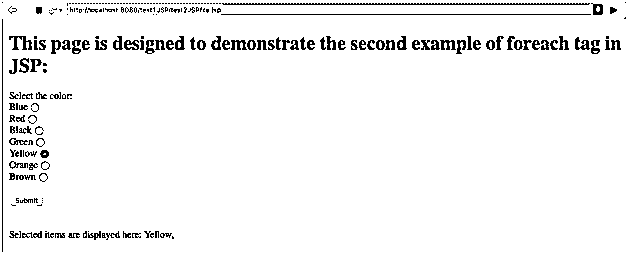

# JSP foreach

> 原文：<https://www.educba.com/jsp-foreach/>

## JSP foreach 简介

JSP Foreach 标记用于循环迭代，直到满足 false 条件。这在 JSP 中使用，以防我们需要显示包含多个值的数组中的一个值。为了让这个标签工作，我们应该有一个像 List /Sets 这样的集合数组应该声明为先决条件，因为 foreach 需要一个数组作为输入参数来迭代。它的工作方式类似于 JAVA 5 或 c 中的“for”循环，条件是“直到我们到达数组的末尾”。这是通过使用由关闭标签关闭的标签<foreach>来实现的。在 JSTL 库的帮助下，这个标签可以包含在 JSP 页面中。我们需要确保将 JSTL 的最新库包含在 web content 文件夹的“WEB-INF”文件夹中，这样标签才能起作用。让我们借助下面几节中给出的语法和示例来更好地理解这个标签。</foreach>

### 句法

JSP 中 Foreach 标记的语法如下:

<small>网页开发、编程语言、软件测试&其他</small>

包含应首先声明的值列表的数组/集合/列表。关键字“pageContext”和“pageScope”用于提取声明数组的属性和变量。带有属性“var”和“items”的 for 循环标记用于获取值，直到数组中达到 null。

`String[] var = new String[]{"1" , "2", "3", "4", "5", "6", "7"};
pageContext.setAttribute("variables", var);
<c:forEach var=*"var"* items="${pageScope.variables}" varStatus="status", begin=””, end=””, step=””>
<c:out value="${var}"/>
</c:forEach>`

在这里，只有“var”和“items”属性必须赋值，而其他属性“begin，end，step，varStatus”可以声明，也可以不声明，因为它们是默认的。

### Foreach 在 JSP 中是如何工作的？

Foreach 标记包含上一节“语法”中提到的两个属性。这两个属性用于获取项目，循环停止的条件(即 null)在 foreach 标记本身中定义，该标记存储在 JSTL 库中。变量应该存储在 JSTL 关键字“pagescope”和“pageContext”中，以便在 foreach 标记中使用。

下面列出了使用每个循环需要声明的一些先决条件:

1.  应该导入 JSTL 库并将其应用到项目中。
2.  在 jsp 页面中，应该使用 taglib 标记来继承依赖项，以便使用 JSTL 库。
3.  应该声明一个集合、列表或数组，并为其赋值，以使“foreach”循环发挥作用。

### 例子

下面举几个例子

#### 示例#1

**代码:**

`<%@page import="java.util.List"%>
<%@page import="java.util.Arrays"%>
<%@page contentType="text/html" pageEncoding="UTF-8"%>
<!DOCTYPE HTML PUBLIC "-//W3C//DTD HTML 4.01 Transitional//EN"
"http://www.w3.org/TR/html4/loose.dtd">
<%@ taglib prefix="c" uri="http://java.sun.com/jsp/jstl/core"%>
<html>
<head>
<meta http-equiv="Content-Type" content="text/html; charset=UTF-8">
<title>JSP Foreach tag example page</title>
</head>
<body>
<h2>This page is designed to demonstrate the use of foreach tag in JSP: </h2>
<jsp:scriptlet>
String[] var = new String[]{"Number 1" , "Number 2", "Number 3", "Number 4", "Number 5", "Number 6", "Number 7"};
pageContext.setAttribute("variables", var);
</jsp:scriptlet>
<%-- JSP foreach tag --%>
<c:forEach var="var" items="${pageScope.variables}">
<c:out value="${var}"/>    
</c:forEach>
</body>
</html>`

**输出:**

**说明:**

在本例中，用字符串中的值创建了一个名为“var”的数组。JSP 库中的 Pagecontext 关键字用于设置属性，其中数组“var”被分配给名为“variables”的变量。foreach 标记以标记“<foreach>开始，以结束标记“</foreach>结束。属性被添加到标签中。强制属性是“var”和“items ”,它们被赋值。“var”包含数组名“var ”,用于循环遍历这些值,“items”包含将用作 null 的比较因子的值。符号“$”表示该值不断变化。“items”中的值可以在“pageScope”关键字的帮助下从数组中提取。该关键字与“pageContext”关键字中声明的变量一起使用。最后，使用<out>标签打印这些值。</out>

#### 实施例 2

**代码:**

`<%@ page language="java" contentType="text/html; charset=ISO-8859-1"
pageEncoding="ISO-8859-1"%>
<%@ taglib uri="http://java.sun.com/jsp/jstl/core" prefix="c" %>
<!DOCTYPE html PUBLIC "-//W3C//DTD HTML 4.01 Transitional//EN" "http://www.w3.org/TR/html4/loose.dtd">
<html>
<head>
<meta http-equiv="Content-Type" content="text/html; charset=ISO-8859-1">
<title>JSP Foreach tag example-2 page</title>
</head>
<body>
<h1>This page is designed to demonstrate the second example of foreach tag in JSP: </h1>
<form name="forEachForm"
action="${pageContext.request.contextPath}/test2JSPfile.jsp"
method="POST">
Select the color:  
Blue     <input type="radio" name="langChoice" value="Blue"/> 
Red   <input type="radio" name="langChoice" value="Red"/> 
Black        <input type="radio" name="langChoice" value="Black"/> 
Green       <input type="radio" name="langChoice" value="Green"/> 
Yellow     <input type="radio" name="langChoice" value="Yellow"/> 
Orange     <input type="radio" name="langChoice" value="Orange"/> 
Brown   <input type="radio" name="langChoice" value="Brown"/>  
<input type="submit" value="Submit"/>
</form>
 
 `

此处显示选定的项目:

`<c:forEach var="lang" items="${paramValues.langChoice}">
<c:out value="${lang}"/>,
</c:forEach>
</body>
</html>`

**输出:**

**说明:**

这段代码还包含一个颜色名称字符串的数组。所有字符串都分配有一个单选按钮。选择单选按钮并单击提交按钮后，所选的颜色将显示在页面的末尾。使用 form 标记是为了记录单选按钮及其值，并在 submit 按钮中作为信息传递。然后，在 JSP 中 foreach 标记的帮助下，这些信息被传递到页面末尾的显示部分。这里，名为“pageContext”和 paramValues 的关键字用于记录值并显示在 foreach 部分中。

### 结论

JSP Foreach 标签被引入 JSTL 图书馆后，被用来制作页面动态。这在简单标签的帮助下提供了清晰的代码。这个功能消除了传统上在 JSP 下编写的 for 循环的使用，这增加了 JAVA 代码的混乱。对于编码人员来说，foreach 循环的使用在开始时看起来有点复杂，但是理解相关的属性和关键字(如“pageScope ”)的使用可以更容易地理解代码，并消除 JSP for 循环中不必要的 JAVA 混乱。

### 推荐文章

这是一个 JSP foreach 的指南。这里我们讨论 Foreach 在 JSP 中是如何工作的，并给出了相应的例子以便更好地理解。您也可以看看以下文章，了解更多信息–

1.  [JSP 表达式](https://www.educba.com/jsp-expression/)
2.  [JSP 声明](https://www.educba.com/jsp-declaration/)
3.  [JSP 标记库](https://www.educba.com/jsp-taglib/)
4.  [JSP 错误页面](https://www.educba.com/jsp-error-page/)

