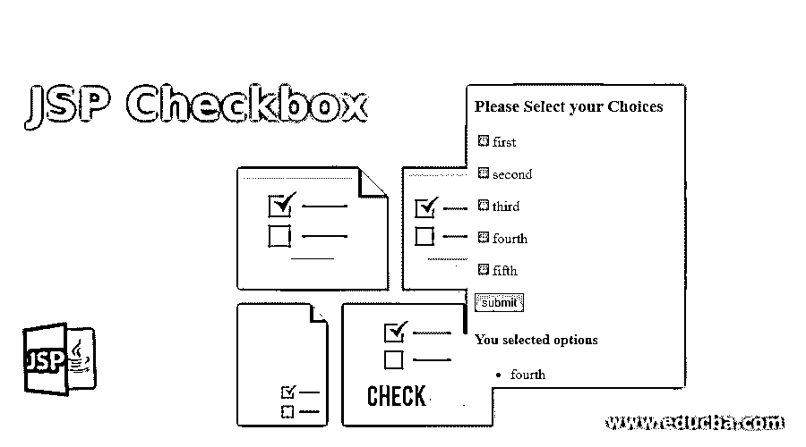
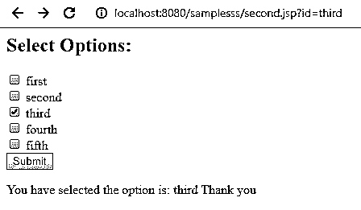
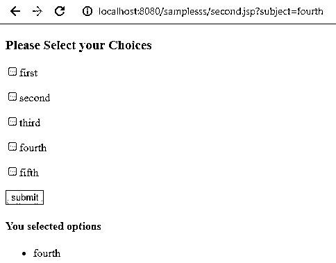
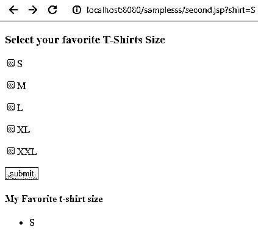

# JSP 复选框

> 原文：<https://www.educba.com/jsp-checkbox/>

## JSP 简介复选框

复选框是 UI 元素之一，也称为 tickbox、tick box 等，是 GUI 小部件之一，允许用户选择二进制格式，主要用作 true 或 false，也可以启用或禁用应用程序中的视图。复选框也像一个二元选择的选项，用户可能必须根据应用程序场景回答请求是或否，它将在此功能中启用。jsp 也是 UI 小部件，如复选框、文本框、滚动面板、滚动框等。jsp 元素的功能或动作与 jsp 复选框相同，与其他复选框 UI 元素相同。

**语法:**

<small>网页开发、编程语言、软件测试&其他</small>

使用复选框 UI 元素的 jsp 的一般语法 html 标记将用于 jsp 页面，如下所示。

`<html>
<body>
<form action=”.jsp” method=”get”>
<input type=’checkbox” name=”” vaue=””>
---some input type html UI elements—
</form>
---some jsp logic codes—
</body>
</html>`

在上面的代码中，我们将看到 html 标签的 UI 元素将被协调，并使用 html 表单在 jsp 中传递 id。JSP 代码将处理这些值，并用代码逻辑进行验证。

### JSP 复选框是如何工作的？

网页中使用的 jsp 复选框，它允许用户在选项列表中选择多个值，当我们使用多个复选框时，它可能会根据值而变化，同时它会将用户定义的值打印为消息，该消息将在提交 html 表单后由视图页面指定。在提交按钮值之后，执行操作按钮，它转到 jsp 页面，并且通过类似 request.getParameterValues(" ")的方法调用这些值，它用于返回所选复选框的值。使用一些 java 逻辑代码来实现应用程序需求。

通常，复选框有不同类型，如标准复选框、单选复选框、滑块、切换、只读、选中、不确定和禁用复选框。复选框总是像一个方盒子类型，它允许选择一个或多个项目。如果我们要将用户值设置为列表类型，则需要使用复选框选择多个选项。每当用户想获得更多的信息的时候，复选框需要。单击复选框时，复选标记也会启用。如果应用程序出于用户目的需要，则它具有肯定选择的含义。再次单击这些复选框时，复选标记被禁用，则它变成否定选择，如无选项。每当我们必须提交复选框值时，导航网页表单需要表单标签，然后提交请求的值表单，并将其发送到另一种导航脚本语言，如 php、jsp、python 等。然后，复选框总是设计成方形框，它允许选择一个或多个项目值。如果它使用单选按钮，则值为圆形格式，仅显示一个选项值。当我们将值创建为列表时，则需要将多个选项存储在单个复选框中。如果我们希望在复选框的多个选项中选择一个值，则它用作单选按钮功能。当我们使用单选按钮和复选框时，它通常是 jsp 网页中用户友好的 UI 选项。这取决于我们将在单个网页中使用两种 UI 功能的样式。对于所有的 UI 代码，如 html、jsp、angular 等，复选框属性值都有自己的样式。

### JSP 复选框的示例

以下是 jsp 复选框的示例:

#### 示例#1

`<html>
<h2>Select Options:</h2>
<form ACTION="second.jsp">
<input type="checkbox" name="id" value="first"> first 
<input type="checkbox" name="id" value="second"> second 
<input type="checkbox" name="id" value="third"> third 
<input type="checkbox" name="id" value="fourth"> fourth 
<input type="checkbox" name="id" value=*"five"*> fifth  
<input type=*"submit"* value=*"Submit"*>
</form>
<%
String s[] = request.getParameterValues("id");
if (s != null && s.length != 0) {
out.println("You have selected the option is: ");
for (int i = 0; i < s.length; i++) {
out.println(s[i] + "\n" + "Thank you");
}
}
%>
</html>`

**输出:**

#### 实施例 2

**代码:**

`<%@ page language=*"java"* contentType=*"text/html; charset=ISO-8859-1"* pageEncoding=*"ISO-8859-1"*%>
<!DOCTYPE html PUBLIC "-//W3C//DTD HTML 4.01 Transitional//EN" "http://www.w3.org/TR/html4/loose.dtd">
<html>
<head>
<meta http-eqUIv=*"Content-Type"* content=*"text/html; charset=ISO-8859-1"*>

<title>Sample</title>
</head>
<body>
<form name=*"f"* onsubmit="demo()">
<h3>Please Select your Choices</h3>

<input type=*"checkbox"* name=*"subject"* value=*"first"*/>first

<input type=*"checkbox"* name=*"subject"* value=*"second"*/>second

<input type=*"checkbox"* name=*"subject"* value=*"third"*/>third

<input type=*"checkbox"* name=*"subject"* value=*"fourth"*/>fourth

<input type=*"checkbox"* name=*"subject"* value=*"fifth"*/>fifth

<input type=*"submit"* value=*"submit"* />
</form>
<%
String subject[]= request.getParameterValues("subject");
if(subject != null)
{
%>
<h4>You selected options </h4>
<ul>
<%
for(int i=0; i<subject.length; i++)
{
%>
<li><%=subject[i]%></li>
<%
}
%>
</ul>
<%
}
%>
</body>
</html>`

**输出:**

#### 实施例 3

**代码:**

`<%@ page language="java" contentType="text/html; charset=ISO-8859-1"
pageEncoding="ISO-8859-1"%>
<!DOCTYPE html PUBLIC "-//W3C//DTD HTML 4.01 Transitional//EN" "http://www.w3.org/TR/html4/loose.dtd">
<html>
<head>
<meta http-eqUIv="Content-Type" content="text/html; charset=ISO-8859-1">

<title>Demo</title>
</head>
<body>
<form name="f" onsubmit="sample()">
<h3>Select your favorite T-Shirts Size</h3>

<input type="checkbox" name="shirt" value="S"/>S

<input type="checkbox" name="shirt" value="M"/>M

<input type="checkbox" name="shirt" value="L"/>L</p&gt

<input type="checkbox" name="shirt" value="XL"/>XL

<input type="checkbox" name="shirt" value="XXL"/>XXL

<input type="submit" value="submit"/>
</form>
<%
String s[]= request.getParameterValues("shirt");
if(s != null)
{
%>
<h4>My Favorite t-shirt size</h4>
<ul>
<%
for(int i=0; i<s.length; i++)
{
%>
<li><%=s[i]%></li>
<%
}
%>
</ul>
<%
}
%>
</body>
</html>`

**输出:**

### 结论

与单选按钮功能相比，复选框选项有助于选择用户选择值作为选项选择。复选框将在单个复选框选项中选择多个值，因此用户要求会更高。复选框在 html 标记中具有输入类型。

### 推荐文章

这是一个 JSP 复选框指南。在这里，我们还讨论了介绍和 jsp checkbox 如何工作，以及不同的例子和它的代码实现。您也可以看看以下文章，了解更多信息–

1.  [Java 中的 JSP](https://www.educba.com/jsp-in-java/)
2.  [JSP 脚本元素](https://www.educba.com/jsp-scripting-elements/)
3.  [旋转器](https://www.educba.com/jspinner/)
4.  [JSP 指令](https://www.educba.com/jsp-directives/)

