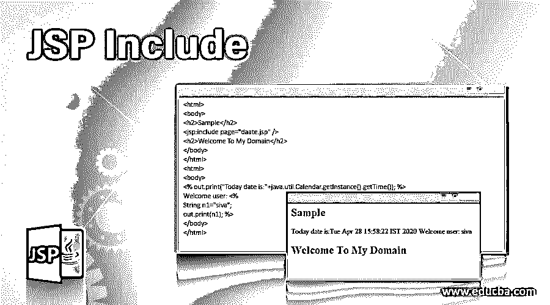
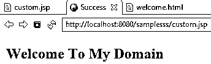
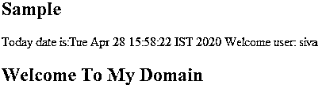
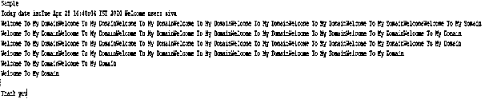

# JSP 包括

> 原文：<https://www.educba.com/jsp-include/>

## JSP 介绍包括

JSP 有一组不同的指令，用于向 JSP 容器发送客户端或用户消息，它通过单个或特定的 JSP 页面提供全局级别的信息。JSP 指令也是 JSP 容器的特殊指令，用于将 JSP 代码转换成 java servlet 代码。在 JSP 生命周期中，翻译是基于用户或项目需求的代码转换过程的一个阶段。include 是 JSP 指令之一，用于包含与具有不同扩展名的任何类型的资源相关的数据内容，如 JSP、HTML 或任何文本文件。include 标记在需要的时候将页面资源包含到翻译阶段。

**语法:**

<small>网页开发、编程语言、软件测试&其他</small>

JSP 网页文件中标记的基本语法如下。

`<html>
<body>
<%@include file=”file name”%>
<%
---some logic codes-- %>
</body>
</html>`

上述代码是 html 页面中 include 指令的基本语法，该页面还添加了 JSP 标记，这有助于包含用于在项目中导航 web 应用程序流的其他文件。

### JSP 如何包含？

*   JSP 包括对 JSP 容器的一组消息或数据的指令，它提供了全局访问，因此我们可以在浏览器中查看整个世界的页面，特别是在特定的 web 应用程序中。在页面中输入 include 指令后，它进入翻译阶段，将代码从 JSP 转换成 servlet。我们可以包括 HTML、PHP、XML、JSP 等。它包括任何具有不同扩展名的文件，这些文件已经在 web 项目中创建或者还没有创建。
*   它们还包括一个 action 标签，比如将不同的扩展文件集添加到当前的 JSP 文件或页面中。包含的文件资源也可以是 JSP、HTML 或 java servlet 的任何静态页面。我们还可以在特定资源文件的特定值中包含参数，它也可以包含在 include 标记中。使用<param>标签我们可以在文件中添加参数或自变量。如果我们在标题页中使用 include，无论我们对包含在文件中的内容做了什么更改，它都不会反映在应用程序中，但是如果我们在页面<jsp: include="" page="””/">中使用 include，那就是动作时间，它会反映包含在文件中的更改。</jsp:>
*   访问 JSP 指令的次数越多，某个地方就越不更新时间当我们使用 tomcat 应用服务器时，它反映了更改，但容器不会检查包含的文件时间戳也不更新，但包含指令只能包含静态页面内容，值在属性文件中分配它必须是路径和文件名文件存在，否则文件找不到运行时会出现异常文件扩展名可以是任何类型，如。html，。jsp，。js 等。我假设我们的应用程序中有一个 servlet 后端代码，它可能没有包含在 include header 标记中，当我们在标记中包含相同的 servlet 时，我们会在运行时得到类似 file not found 错误的异常。但是当我们在动作标签格式<include>中包含 servlet 时，包含动作标签不仅接受静态页面内容，还支持动态网页内容。这种不作为标记格式支持所请求的时间间隔，如果它超过了服务器超时错误将被显示，并且 JSP 页面内容也不会影响它所包括的 web 应用程序的主页，并显示所包括的 JSP 页面的输出。</include>
*   与 include 标记相比，指令文件中的指令和操作场景仅包含静态格式，并且如果我们在代码片段中使用公共代码，文件也会随机更改，这样我们就可以重复使用多个页面。include 指令代码是可重用性 JSP 页面也只翻译一次源代码，所以最好将文件资源包含为静态的。

### 实现 JSP 的例子包括

下面是提到的例子:

#### 示例#1

**代码:**

`<%@ page language=*"java"* contentType=*"text/html; charset=ISO-8859-1"*
pageEncoding=*"ISO-8859-1"*%>
<!DOCTYPE html PUBLIC "-//W3C//DTD HTML 4.01 Transitional//EN" "http://www.w3.org/TR/html4/loose.dtd">
<html>
<body>
<%@include file=*"welcome.html"*%>
</body>
</html>
<html>
<head>
<meta http-equiv=*"Content-Type"* content=*"text/html; charset=UTF-8"*>
<title>Success</title>
</head>
<body>
<h2>Welcome To My Domain</h2>
</body>
</html>`

**输出:**

#### 实施例 2

**代码:**

`<html>
<body>
<h2>Sample</h2>
<jsp:include page=*"daate.jsp"* />
<h2>Welcome To My Domain</h2>
</body>
</html>
<html>
<body>
<% out.print("Today date is:"+java.util.Calendar.getInstance().getTime()); %>
Welcome user: <%
String n1="siva";
out.print(n1); %>
</body>
</html>`

**输出:**

#### 实施例 3

**代码:**

`<%@page contentType=*"text/html"* pageEncoding=*"UTF-8"*%>
<!DOCTYPE html>
<html>
<head>
<meta http-equiv=*"Content-Type"* content=*"text/html; charset=UTF-8"*>
<title>Example</title>
</head>
<body style="max-width:*660px*; text-align: *center*; ">
<%@ include file=*"daate.jsp"* %>
<h2>Demo</h2>

<marquee>
Welcome To My DomainWelcome To My DomainWelcome To My DomainWelcome To My DomainWelcome To My DomainWelcome To My Domain
Welcome To My DomainWelcome To My DomainWelcome To My DomainWelcome To My DomainWelcome To My DomainWelcome To My Domain
Welcome To My DomainWelcome To My DomainWelcome To My DomainWelcome To My DomainWelcome To My DomainWelcome To My Domain
Welcome To My DomainWelcome To My DomainWelcome To My DomainWelcome To My DomainWelcome To My Domain
Welcome To My DomainWelcome To My DomainWelcome To My Domain
Welcome To My DomainWelcome To My Domain
Welcome To My Domain</marquee>

<jsp:directive.include file=*"//WEB-INF//footer.jsp"* />
</body>
</html>
<%@ page language=*"java"* contentType=*"text/html; charset=ISO-8859-1"*
pageEncoding=*"ISO-8859-1"*%>
<!DOCTYPE html PUBLIC "-//W3C//DTD HTML 4.01 Transitional//EN" "http://www.w3.org/TR/html4/loose.dtd">
<html>
<head>
<meta http-equiv=*"Content-Type"* content=*"text/html; charset=ISO-8859-1"*>
<title>Thank you</title>
</head>
<body>
<marquee>Thank you</marquee>
</body>
</html>
<html>
<body>
<% out.print("Today date is:"+java.util.Calendar.getInstance().getTime()); %>
Welcome user: <%
String n1="siva";
out.print(n1); %>
</body>
</html>`

**输出:**

上面的例子我们将在 JSP 中的 actions 和 directive 方法中使用 include 标签，我们可以添加 calendar 函数以供更多的使用。

### 结论

JSP include 指令和 action 标签是两种不同的类型，用于将 JSP 代码转换为 JSP 容器，我们可以在单个网页中添加所有其他扩展文件，以便在 web 应用程序的导航中工作。

### 推荐文章

这是一个 JSP 包含指南。在这里，我们讨论了 JSP 的介绍，包括适当的语法，工作和实施的例子。您也可以浏览我们的其他相关文章，了解更多信息——

1.  [Java 中的 JSP](https://www.educba.com/jsp-in-java/)
2.  [JSP 生命周期](https://www.educba.com/jsp-life-cycle/)
3.  [JSP 架构](https://www.educba.com/jsp-architecture/)
4.  [JSP 指令](https://www.educba.com/jsp-directives/)

