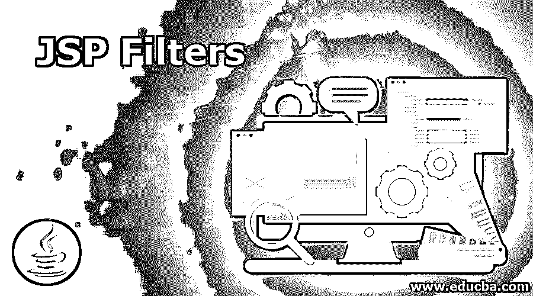
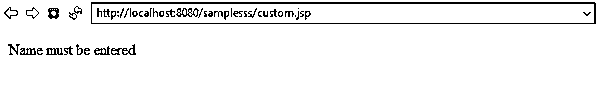
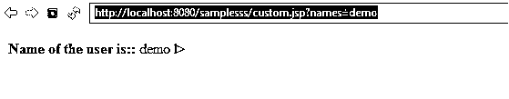
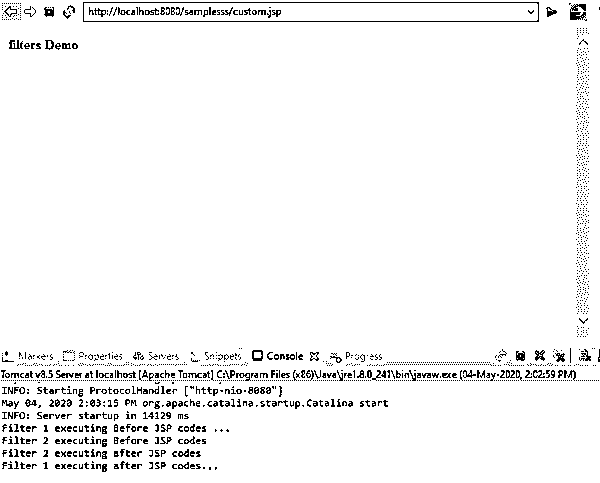
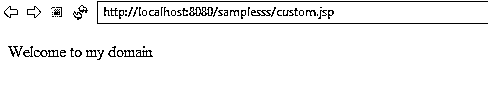

# JSP 过滤器

> 原文：<https://www.educba.com/jsp-filters/>

## JSP 过滤器介绍

在 jsp 中有很多特性可以使用 jstl 标签、定制标签和元素来定制网页。在正常的过滤器是一个特点，为迭代的数据或排序数据的基础上，用户的需求，主要是它降低了时间复杂度的程序，也后台任务采取较少的时间复杂度的过程。基于这一点，在 java 类中使用的具有自己的过滤器的 jsp 可以用于拦截客户端请求，并且它同时操纵服务器响应，它将验证用户凭证安全目的，如加密数据、记录和审计数据。

**语法**

<small>网页开发、编程语言、软件测试&其他</small>

我们可以将 jsp 中的过滤器作为 web.xml 来使用。

`<filter>
<filter-name></filter-name>
<filter-class></filter-class>
</filter>
<filter-mapping>
<filter-name></filter-name>
<url-pattern></url-pattern>
</filter-mapping>`

以上代码是 web.xml 配置文件中过滤器的基本语法，我们也可以在 jsp 页面过滤器中使用该配置。

### JSP 过滤器是如何工作的？

jsp 过滤器只不过是 java 类，它可以用来拦截客户机请求，或者操纵来自服务器的每个客户机请求的响应。然后，jsp 过滤器还用于对每个请求的用户进行身份验证，并对数据进行身份验证，以达到更安全的目的，如加密数据，并用于借助日志概念存储用户详细信息以及审计数据。使用 javax.servlet 类，我们可以用来创建过滤器，我们也可以实现过滤器接口。

过滤器不仅存在于 jsp 中，还用于 java servlets 等资源和其他静态页面，如 HTML 或一些表示技术，如图像、视频等。在某些情况下，通过使用过滤器，我们可以增加不必要的复杂性和性能方面的下降，因为它非常快，对用户环境友好。借助于用于通过使用过滤功能来过滤 java 应用的过滤器。

我们还可以使用不同类型的过滤器，如:

1.  身份验证过滤器，
2.  数据压缩过滤器，
3.  加密过滤器，
4.  MIME 链过滤器，
5.  日志过滤器和
6.  标记过滤器。

我们都知道过滤器是在 web.xml 文件中定义的，它将映射到 servlet 或 jsp 中。每当我们运行 jsp 代码时，它就会启动，jsp 容器也会自动创建每个过滤器的实例，它将被部署到部署描述符文件中。

我们可以在 jsp 中使用多个过滤器，使用身份验证过滤器，我们可以在数据压缩过滤器的帮助下验证用户详细信息，我们可以压缩用户数据，它将显示在网页中。用于加密用户数据的加密过滤器。在每个 jsp 或一些其他资源中，文件将被执行动作事件，它也通过使用过滤技术触发用户动作，它被称为触发资源访问事件的过滤器。

在网页中，我们可以使用图像来突出显示网页，使其更加用户友好和吸引人。它还适用于过滤器，它将用户数据存储在日志和审计过滤器中，并将 MIME 类型链过滤器用于 web.xml 中 jsp 过滤器中使用的类型中。每个用户数据使用标记化过滤器格式存储和检索。XSL/T 过滤器用于转换 xl 内容中的数据。

我们可以避免业务逻辑中的敏感代码，如 servlet，我们可以将它写在过滤器中，然后用户将只调用 servlet 而不是与 jsp 过滤器相同的过滤器，我们可以将它写在 web.xml 中，jsp 页面与过滤器相关联。我们可以在字符串替换中使用过滤器，过滤存储每个用户登录的 IP 地址。我们可以使用过滤器连接数据和字符串，还可以验证注册表单数据、图像登录身份验证我们可以在 servlet 代码中编写逻辑，它是不安全的，因此黑客将攻击代码，如果数据库可用，还可能进行 sql 注入攻击。

### JSP 过滤器的示例

下面举几个例子

#### 示例#1

**代码:**

`<body>
<%
String n = request.getParameter("n1");
%>
<strong> Name of the user is: </strong> <%= n %>
</body>
public class tagHandler implements Filter {
@Override
public void init(FilterConfig filterConfig) throws ServletException {
System.out.println("Filter  started...");
}
@Override
public void doFilter(ServletRequest request, ServletResponse response,
FilterChain filters) throws IOException, ServletException {
String n1 = request.getParameter("n");
if(n1==null || n1.equals(""))
{
PrintWriter writer = response.getWriter();
String s="Name must be entered";
writer.println(s);
return;
}
filters.doFilter(request, response);
}
@Override
public void destroy() {
System.out.println("Filters  deleted..");
}
}
<filter>
<filter-name>tagHandler</filter-name>
<filter-class>com.first.tagHandler</filter-class>
</filter>
<filter-mapping>
<filter-name>tagHandler</filter-name>
<url-pattern>/custom.jsp</url-pattern>
</filter-mapping>`

**样本输出:**

#### 实施例 2

**代码:**

`public class tagHandler implements Filter {
@Override
public void init(FilterConfig filters) throws ServletException
{
System.out.println("Filter 2 started...");
}
@Override
public void doFilter(ServletRequest request, ServletResponse response,
FilterChain f) throws IOException, ServletException
{
System.out.println("Filter 2 executing Before JSP codes");
f.doFilter(request, response);
System.out.println("Filter 2 executing after JSP codes");
}
@Override
public void destroy()
{
System.out.println("Filter 2 deleted..");
}
}
<body>
<strong>
filters Demo
</strong>
public class filterss implements Filter
{
@Override
public void init(FilterConfig filters) throws ServletException
{
System.out.println("Filter 1 started...");
}
@Override
public void doFilter(ServletRequest request, ServletResponse response,
FilterChain f) throws IOException, ServletException
{
System.out.println("Filter 1 executing Before JSP codes ...");
f.doFilter(request, response);
System.out.println("Filter 1 executing after JSP codes...");
}
@Override
public void destroy() {
System.out.println("Filter 1 deleted..");
}
}`

**样本输出:**

#### 实施例 3

**代码:**

`public class tagHandler implements Filter {
@Override
public void init(FilterConfig filters) throws ServletException {
System.out.println("Filter  started...");
}
@Override
public void doFilter(ServletRequest request, ServletResponse response,
FilterChain f) throws IOException, ServletException {
String user = request.getParameter("user");
if(user==null || user.equals(""))
{
PrintWriter writer = response.getWriter();
String m="Welcome to my domain";
writer.println(m);
return;
}
f.doFilter(request, response);
}
@Override
public void destroy() {
System.out.println("Filter  deleted..");
}
}
<body>
<%
String user = request.getParameter("user");
%>
<%out.print(user); %>
</body>`

**样本输出:**

### 结论

过滤器是 jsp 和 servlet 的重要概念之一，因为它根据客户端请求的需求来调节与客户端请求相关的数据流。它适用于 servlet。过滤器主要用于 web 应用程序。在 web 应用程序中实现过滤器非常容易

### 推荐文章

这是 JSP 过滤器的指南。在这里，我们讨论 JSP 过滤器的介绍以及工作和例子，以便更好地理解。您也可以阅读以下文章，了解更多信息——

1.  [JSP 生命周期](https://www.educba.com/jsp-life-cycle/)
2.  [JSP 错误页面](https://www.educba.com/jsp-error-page/)
3.  [什么是 JSP？](https://www.educba.com/what-is-jsp/)
4.  [JSP 指令](https://www.educba.com/jsp-directives/)

