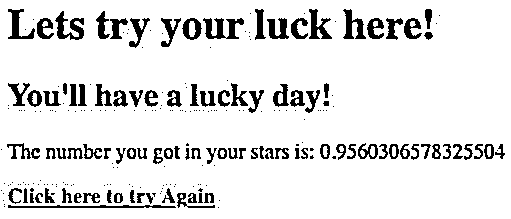

# JSP 文件

> 原文：<https://www.educba.com/jsp-file/>

## JSP 文件简介

JSP 文件用于在网络上创建动态和快速加载的网页。JSP 文件使用的文件扩展名是“”。jsp”。例如 test.jsp。JSP 文件包含一个全局标签“HTML ”,在该标签下，JAVA 编码被完成以将响应特性添加到 web 平台。如果没有添加 JAVA 代码，那么网页将是静态的。如果我们考虑使用，JSP 文件通常被认为类似于 JAVA servlets，但是 JSP 文件的额外优势是页面设计和业务逻辑的分离。

### 如何用 JSP 创建文件？

你可以像创建 HTML 文件一样创建一个 JSP 文件，但是不同的是 JSP 文件应该用扩展名“.jsp”。它还应该在文件的开头或结尾有“”标记。一旦这些标签被声明，那么在 html 标签内 JAVA 代码可以被内联。此外，JSP 文件可以作为独立文件单独创建，然后 JSP 文件可以包含在另一个文件中，如 JAVA servlets。像 Eclipse 或 netbeans 这样的任何 IDE(集成开发环境)都可以用来创建新的“动态 web 项目”。提供相关信息，如主类名、xml 描述符要求和其他细节，就可以创建一个 web 项目。创建项目后，可以在项目下的“WEB-INF”文件夹中创建一个新的 JSP 页面。

<small>网页开发、编程语言、软件测试&其他</small>

JSP 中的文件操作，JSP 页面编译一次，按照项目要求与 servlets 或 JSP 很好的连接。

JSP 中有三个标记用于执行文件操作，它们是:

*   **Scriptlet 标签:**该标签用于在 JSP 页面中编写 JAVA 代码脚本。这个标签看起来像 **<** % out.print("你在 JSP 页面中使用 scriptlet 标签内联 JAVA 代码")；% **>** 。这里，AVA 代码中的“out.print()”函数用于在输出屏幕上打印所需的语句。变量声明或控制语句也可以包含在这个标签下。
*   **表达式标签:**这个标签用于在网页上流式输出。它是为了取代名为“print()”的函数。标签看起来像: **<** %=“你在 JSP 中使用了表达式标签..”% **>** 。这个标签也用在下面提供的例子中。
*   **声明标签:**该标签用于声明 JSP 页面中的字段和方法。这个标记不使用内存分配，因为它不属于自动生成的 servlet 的 service()方法。JSP 声明标签看起来像: **<** %!..这是 JSP 中声明方法或字段的声明标记..% **>**

### JSP 文件的示例

下面是提到的例子:

#### 示例#1

test1JSP 项目

**代码:**

`JSP File: test1JSPfile.jsp ( This should be placed in webContent folder-> web-inf )
<%@ page language="java" contentType="text/html; charset=UTF-8"
pageEncoding="UTF-8"%>
<!DOCTYPE html>
<html>
<head>
<meta charset="UTF-8">
<title>Example of JSP file</title>
</head>
<body>
<%= "Hello All, This output screen is designed using JSP page..." %>
</body>
</html>`

**输出:**

**说明:**

*   在这个例子中，HTML 标签被声明。在 HTML 标签中，可以通过创建单独的全局 CSS 表来应用 CSS，并将其包含在 JSP 文件中。
*   如果 CSS 的使用受到限制，也可以在本地内联包含 CSS。在本例中，创建了一个名为“JSP 文件示例”的网页。
*   字符集是通过“meta”标签的一个名为“charset”的属性来使用的，并为它分配了 UTF-8 作为值。输出屏幕包含一个从 JSP 代码中显示的语句。
*   内联 JSP 代码应该写在 tage“”下。

#### 实施例 2

test1JSP 项目

**代码:**

`<html>
<head><title>Example 2 in JSP</title></head>
<body>
<h1> Lets try your luck here!  </h1>
<%
double num = Math.random();
if (num > 0.95) {
%>
<h2>You'll have a lucky day!</h2>
The number you got in your stars is: <%= num %> 

<%
} else {
%>
<h2>Well, life goes on ... </h2>
The number you got in your stars is: <%= num %> 

<%
}
%>
<a href=*"*<%= request.getRequestURI() %>*"*><b>Click here to try Again</b></a>
</body>
</html>`

**输出:**

**说明:**

*   在本例中，JSP 文件带有扩展名“.jsp”是在“WEB-INF”文件夹下创建的。就像前面的例子中解释的那样，应该使用 html 标签，并在该标签下内嵌 JSP 代码。该页面的标题为“JSP 中的示例 2”。在数据类型 double 的 JSP 标记下声明了一个名为“num”的变量。
*   “Num”被赋予值“Math.random()”。这个函数存储在 JAVA 库中，用来生成并返回一个随机数。然后，该示例有一个“if-else”控制语句来检查随机值是否大于“0.95”。如果条件满足，则从 If 部分加载数据。
*   如果条件不满足，那么来自 else 部分的数据被打印在输出屏幕上。最后，在“  ”标签下提供了一个自引用链接。用于自引用的函数是“request.getRequestURI()”。如果再次单击此链接，内容将再次加载。加载的新内容生成新的随机数，并使用“if/else”逻辑打印输出屏幕。

### 结论

JSP 页面是一种创建动态 web 内容的轻量级快速方法。当数据交换时，内容可以在网络上动态加载，而没有太多的开销。JSP 页面提供的最佳优势是“设计”和“业务逻辑”的划分。业务逻辑显示在 JAVA 代码下，而设计来自 HTML(超文本标记语言)和 CSS(层叠样式表)。这种划分简化了开发人员的工作，并促进了更容易的项目维护。JSP 是在 web 动态开发中生成项目的最优雅的方式之一。

### 推荐文章

这是一个 JSP 文件指南。这里我们分别讨论如何用 JSP 创建文件以及编程示例。您也可以看看以下文章，了解更多信息–

1.  [JSP 错误页面](https://www.educba.com/jsp-error-page/)
2.  [JSP 警报](https://www.educba.com/jsp-alert/)
3.  [JSP 登录页面](https://www.educba.com/jsp-login-page/)
4.  [JSP 格式化程序](https://www.educba.com/jsp-formatter/)

