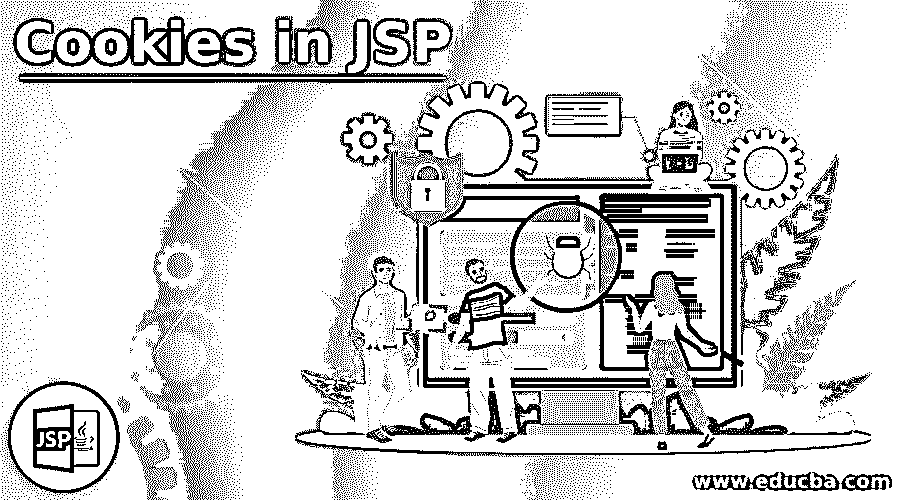
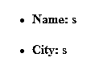
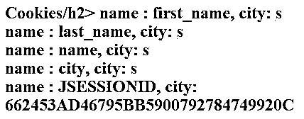
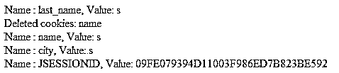

# JSP 中的 Cookies

> 原文：<https://www.educba.com/cookies-in-jsp/>

## JSP 中的 Cookies 介绍

一般来说，Cookies 被定义为文本文件，它将被存储在计算机中，主要是在客户端机器中，用于跟踪登录细节、文件传输等。我们还可以在 web 浏览器中看到 cookies，在 web 应用程序中使用调试模式选择“应用程序->存储-”。Cookies“我们可以在 cookies 栏中看到我们看到的任何网络应用程序或网站。在 JSP 中，我们处理 cookies 的概念，像 cookies 处理 JSP 透明地支持使用 HTTP cookies 的 cookies，JSP 有一些预定义的方法来处理 cookies。客户端-服务器交互类似请求，响应方法使用类似请求。get cookies()用于返回 cookie 实例的数组。

**语法:**

<small>网页开发、编程语言、软件测试&其他</small>

使用 JSP 方法的 cookies 的语法如下。

`<html>
<body>
<%
--create cookie instance using cookie class—
---write the JSP logic codes using user sessions----
%>
</body>
</html>`

### JSP 中如何处理 Cookie？

在 JSP 中，我们可以将用户的详细信息存储在 cookie 文件中，并在客户机和服务器之间来回传递的 session-id 的帮助下被引用。它还被存储在服务器端应用程序中，以便在 cookies 的帮助下在客户端浏览器中存储信息。它可以为每个客户端浏览器创建特定的变量。它可以存储上次访问日期的用户详细信息。Cookies 提供了一种持久性技术，可以使用无状态与 HTTP 协议组合。

只需使用获取 cookie()等方法发送请求，并使用一组 cookie 实例获取服务器的响应数据。它将在网络浏览器的帮助下存储一些与用户相关的小数据。cookie 以单个值命名，但它可能具有可选属性，包括通用路径、域限定符以及存储在 cookie 中的主机名。它指定最大时间计数、年龄计数和版本。

在 web 应用程序中，在客户端和服务器的第一次事务之后，下一次同一个客户端浏览器将向 web 服务器发送任何类型的请求，同一个 web 服务器将使用用户的数据，它可以用于其他一些目的。大多数网络浏览器接受 cookies，但是一些通过浏览器会话相关的信息会抵触或接受 cookies 的特性。

每个 cookie 都有自己的生命周期，并在生命周期结束时被用户浏览器清空。cookie 的用途是识别服务器上的用户。我们可以使用 servlet API 中的 cookie 类创建 cookie，还可以使用 add cookie()方法将 cookie 添加到响应实例中。使用 Http Cookies 来执行用户会话管理，使用 web 容器来存储单个用户机器上的会话 id，使用 getSession()方法，我们可以计算 web 容器上的用户会话。

有些用户浏览器不支持 cookie 技术，有些用户浏览器禁用 cookie，因为 cookie 是基于服务器上的会话管理失败。我们可以借助 HttpSession 策略管理“isRequestSessionIdFromCookie”方法来识别请求会话的 HTTP servlet 接口中的 Cookie。如果已经在 web 浏览器中使用了 cookie，则它总是返回 true。与“isRequestSessionIdFromURL”方法相同，如果 URL 重写技术用于会话管理，它也返回 true。

每当用户第一次打开网页时，服务器都不会从浏览器的 web 请求中接收到 cookies。但是 JSP 代码总是将名为“cookie_0”的 cookie 的默认值添加到响应中，JSP 服务器将名为“JSessionID”的 Cookie 的默认会话 id 添加到响应中。如果我单击浏览器刷新按钮，它还会在每个请求中将两个 Cookie 发送回服务器。在服务器发送响应后，Cookies 会自动在客户机 1 上分配内存。在内存 cookie 中，/每会话 cookie 和 2。持久性 cookie 是 JSP 中的两种 cookie。没有过期时间的 cookie 称为内存 cookie，有过期时间的称为持久 cookie。

### 用 JSP 实现 Cookies 的例子

下面是提到的一些例子:

#### 示例#1

**代码:**

`<html>
<body>
<form action = "custom.jsp" method = "post">
Name: <input type = "text" name = "name">
 
city: <input type = "text" name = "city" />
<input type = "submit" value = "Submit" />
</form>
</body>
</html>
<%
Cookie Name = new Cookie("name", request.getParameter("name"));
Cookie city = new Cookie("city", request.getParameter("city"));
Name.setMaxAge(54*61*12);
city.setMaxAge(54*61*12);
response.addCookie( Name );
response.addCookie( city );
%>
<html>
<body>
<ul>
<li>
<b>Name:</b>
<%= request.getParameter("name")%>

</li>
<li>
<b>City:</b>
<%= request.getParameter("city")%>

</li>
</ul>
</body>
</html>`

**输出:**

#### 实施例 2

**代码:**

`<html>
<body>
<form action = "custom.jsp" method = "post">
Name: <input type = "text" name = "name">
 
city: <input type = "text" name = "city" />
<input type = "submit" value = "Submit" />
</form>
</body>
</html>
<html>
<body>
<%
Cookie c = null;
Cookie[] c1 = null;
c1 = request.getCookies();
if( c1 != null ) {
out.println("<h2> Cookies/h2>");
for (int i = 0; i < c1.length; i++) {
c = c1[i];
out.print("name : " + c.getName( ) + ",  ");
out.print("city: " + c.getValue( )+"  ");
}
} else {
out.println("<h2>No cookies</h2>");
}
%>
</body>
</html>`

**输出:**

#### 实施例 3

**代码:**

`<html>
<body>
<%
Cookie c = null;
Cookie[] c1 = null;
c1 = request.getCookies();
if( c1 != null ) {
out.println("<h2>Cookies</h2>");
for (int i = 0; i < c1.length; i++) {
c = c1[i];
if((c.getName( )).compareTo("name") == 0 ) {
c.setMaxAge(0);
response.addCookie(c);
out.print("Deleted cookies: " +
c.getName( ) + " ");
}
out.print("Name : " + c.getName( ) + ",  ");
out.print("Value: " + c.getValue( )+"  ");
}
} else {
out.println(
"<h2>No cookies</h2>");
}
%>
</body>
</html>`

**输出:**

### 结论

cookie 主要是由大量高质量的 web 应用程序引领的，不仅仅是在 JSP 中。cookie 被接受，然后是 servlet 和 JSF(Java server faces)。它在 Java 社区流程中，因为它与标准质量应用程序框架的集成与 Apache 服务器集成在一起

### 推荐文章

这是 JSP 中的 Cookies 指南。在这里，我们讨论 JSP 中 Cookies 的介绍，语法，如何处理它，代码和输出的例子。您也可以浏览我们的其他相关文章，了解更多信息——

1.  [JavaScript 中的 Cookies】](https://www.educba.com/cookies-in-javascript/)
2.  [姜戈饼干](https://www.educba.com/django-cookies/)
3.  [JSP 脚本元素](https://www.educba.com/jsp-scripting-elements/)
4.  [JSP 生命周期](https://www.educba.com/jsp-life-cycle/)

