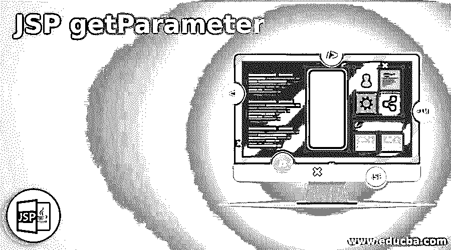
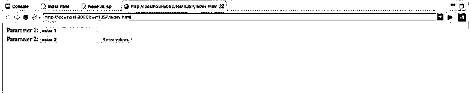
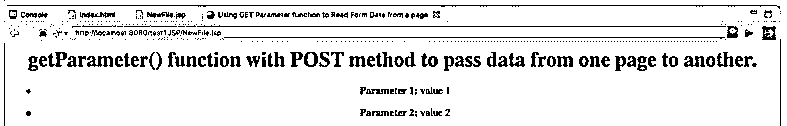
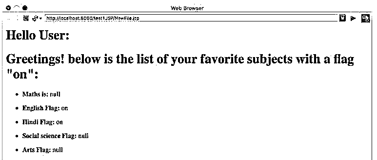

# jsp 参数

> 原文：<https://www.educba.com/jsp-getparameter/>

## JSP getParameter 简介

下面的文章提供了 JSP getParameter 的概要。getParameter 是 JSP 中的一个函数名，用于从 HTML/JSP 页面中检索数据并传递给 JSP 页面。该函数被指定为 getParameter()函数。这是一个客户端数据检索过程。完整的函数可以写成 request.getParameter()。这个函数可以有一个字符串作为参数来提取对应于所提供的字符串的值。它调用一个名为 javax . servlet . http . http servlet request 的 API(Application programming interface)方法，这个 API 方法将获取对应于输入字符串的值，然后将该值作为“字符串”再次传递给 JSP 页面。

**语法:**

<small>网页开发、编程语言、软件测试&其他</small>

getParameter 函数的语法是:

`Parameter paramValue1: <%= request.getParameter("paramValue") %>`

这里，paramValue1 是用于记录值的变量，paramValue 是在源页面上定义的变量的名称。

因此，在这种情况下，源页面应该具有:

`<form>
Input Text: <input type = "text" name = "paramValue" />
</form>`

**Note:** The value in the name property should match with the string passed in the getParameter function to pick the value of that parameter from the source page.

### JSP 中 getParameter 是如何工作的？

这是 JSP 的一个内置函数，它根据 HTML 页面中赋予值的“名称”提取数据。然后通过“GET”或“POST”方法将该值传递给另一个页面。有两种方法提取数据。它可以是“GET”方法或“POST”方法。这是在 HTML 页面的

<form>标签中选择的。“GET”使用一个 url，用户可以在 URL 中看到参数值。有人可以操纵 URL 中的值，因此这不是一种将数据从一个页面发送到另一个页面的非常安全的方法。而“POST”方法不显示 URL 中的数据。“Post”在将数据从一个页面传递到另一个页面时更安全。</form>

JSP 中还有两个函数链接到 get parameter 函数，它们是:

*   **getParameterValues():** 如果多个值作为参数从页面返回到 JSP 页面，则使用该函数。例如，如果使用复选框而不是单选按钮，或者启用了多选项选择。
*   **getParameterNames():** 这个函数用来从当前请求的页面中取出所有的值。所有的参数都将通过这个函数获取。

### JSP getParameter 的示例

下面给出的例子演示了 JSP getParameters 的使用。这些示例将帮助您了解如何使用 JSP getParameter 来实现整个流程中的数据流。

#### 示例#1

**代码:**

**Index.html:**

`<html>
<body>
<form action = "NewFile.jsp" method = "POST">
Parameter 1: <input type = "text" name = "p1">
 
Parameter 2: <input type = "text" name = "p2" />
<input type = "submit" value = "Enter values" />
</form>
</body>
</html>`

**NewFile.jsp:**

`<html>
<head>
<title>Using GET Parameter function to Read Form Data from a page</title>
</head>
<body>

<h1>getParameter() function with POST method to pass data from one page to another.</h1>
<ul>
<li>
<b>Parameter 1:</b>
<%= request.getParameter("p1")%>

</li>
<li>
<b>Parameter 2:</b>
<%= request.getParameter("p2")%>

</li>
</ul>
</body>
</html>`

**输出:**

**说明:**

*   在这个例子中，用 POST 方法从 HTML 页面传递了两个值，所以您不会在 URL 中找到值。参数名称为“p1”和“p2”。HTML 表单中的 action 标签调用 NewFile.jsp。NewFile.jsp 正在从 API 中读取数据，并把它们输出到屏幕上。request.getParameter()函数正在从 jsp 页面调用此 API。
*   名称“p1”和“p2”作为输入参数被发送给 getParameter()函数，以检查 Index.html 页面中该名称的值。如果找到，则打印这些值。

#### 实施例 2

**代码:**

**Index.html:**

`<html>
<body>
Select your favorite subjects from the options given below:
<form action = "NewFile.jsp" method = "POST" target = "_blank">
<input type = "checkbox" name = "Hindi" checked = "checked" /> <u>Hindi</u>
<input type = "checkbox" name = "English"  /> English
<input type = "checkbox" name = "Maths"/> <u>Maths</u>
<input type = "checkbox" name = "Social science"  /> Social science
<input type = "checkbox" name = "Arts"/> Arts
<input type = "submit" value = "Select Subject" />
</form>
</body>
</html>`

**NewFile.jsp:**

`<html>
<head>
<title>Reading Check-box Data</title>
</head>
<body>
<h1>Hello User: </h1>
<h1>Greetings! below is the list of your favorite subjects with a flag "on":</h1>
<ul>
<li>
<b>Maths is:</b>
<%= request.getParameter("Maths")%>

</li>
<li>
<b>English Flag:</b>
<%= request.getParameter("English")%>

</li>
<li>
<b>Hindi Flag:</b>
<%= request.getParameter("Hindi")%>

</li>
<li>
<b>Social science Flag:</b>
<%= request.getParameter("Social science")%>

</li>
<li>
<b>Arts Flag:</b>
<%= request.getParameter("Arts")%>

</li>
</ul>
</body>
</html>`

**输出:**

**说明:**

*   这个例子使用复选框而不是简单的输入。所以在这里，我们可以传递多个参数，而不是一个。每个复选框的名称应该是不同的，所以无论选择哪个都可以被拉出。动作标签再次调用 NewFile.jsp，它有 getParameter 函数。该函数根据输入参数名称进行搜索。
*   如果选中，则该函数返回“开”，否则返回“空”。此示例输出标志状态。如果主题标志切换为“开”或“空”，则分别为“开”或“空”。

### 结论

getParameter()函数是在变化之间传递数据的非常重要的函数之一。要在多页分布式环境中成功传递数据，建立公共链接非常重要。该链接是参数的“名称”。在这些参数名的帮助下，使用 API(javax . servlet . http . http servlet request)将参数值从一个页面传递到另一个页面。这是设计动态页面时非常常用的功能。

### 推荐文章

这是一个 JSP getParameter 的指南。这里我们讨论一下入门，JSP 中 getParameter 是如何工作的？和示例。您也可以看看以下文章，了解更多信息–

1.  [JSP 警报](https://www.educba.com/jsp-alert/)
2.  [JSP 格式化程序](https://www.educba.com/jsp-formatter/)
3.  [JSP 转发](https://www.educba.com/jsp-forward/)
4.  [JSP 中的 Cookies】](https://www.educba.com/cookies-in-jsp/)

