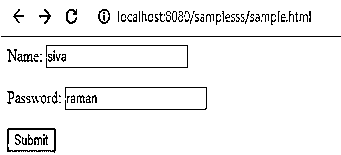
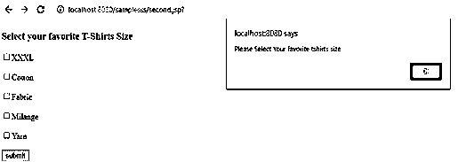
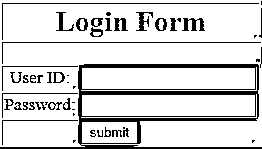
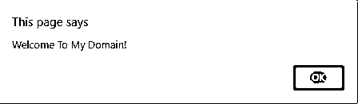

# JSP 预警

> 原文：<https://www.educba.com/jsp-alert/>

## JSP 预警简介

每当用户验证过程中，警告框主要是在那个时候使用，因为用户将很容易了解凭证或注册数据是否有效。同样的过程也在 jsp 警告框中完成，只要我们需要警告或触发器，我们将使用 javascript 中的警告函数，我们也使用了 windows.alert()方法。同样的场景也在我们有警告消息的地方执行，我们可以在该页面中使用默认方法，基本上我们使用表单来创建 html ui 标签并导航到 JSP 网页，然后使用 submit 或任何其他用户定制的标签直接调用 javascript 函数。

**语法:**

<small>网页开发、编程语言、软件测试&其他</small>

每个 jsp 标签都有自己的特性和每个标签元素的语法。JSP 警报功能具有使用网页的语法。

`<html>
<head>

</head>
<body>`

以上代码是 jsp 警告框的基本语法，它将被 javascript 函数调用，因此它将在同一网页上显示浏览器本身。

### JSP Alert 是如何工作的？

jsp 警告框将更频繁地被使用，以确保用户数据在验证后到达浏览器，并显示在用户屏幕上。警告框将焦点从当前窗口移开，并迫使浏览器阅读消息。我认为用户不会输入任何值到像文本框等 ui 元素中，它会显示弹出消息，如“输入值或值是必需的”，它会突出显示 ui 元素中的值。alert()方法在单击“确定”按钮或任何其他 ui 标签后，将始终显示具有一些指定消息的警告框，它将显示在用户浏览器屏幕中，每当警告框最常用于确保信息数据到达特定用户时，以及警告框时，它将焦点从当前用户窗口移开，并强制用户浏览器读取消息。当我们打开任何类型的网站时，我们可能会看到警告弹出框会出现很多次，这些框会显示用户在当前网页过程中做某事的警告，当脚本警告框被触发时，屏幕会显示小对话框，并显示一些已经插入代码中的文本值。基于上述场景，javascript 有三种不同的弹出框或警告框 1。报警框，2。确认框，3。提示框。每种类型的框将与用户浏览器一起显示，但在某些功能方面可能会有所不同。警告框主要用于用户身份验证的警告目的，确认框用于检查用户是否接受网页屏幕更改的特定功能更改。在用户确认之后，所反映的改变将被反映在特定的网页中。

浏览器中的用户使用提示框来获取用户输入值，同时在浏览器屏幕中输入网页。与确认框相同，用户也根据用户输入检查提示框文本是否被接受，它可以反映用户浏览器网页中的变化。每当弹出框(如警告框)使用 jsp 代码时，用户活动和会话都会被跟踪并存储在日志文件和 cookies 中。因此用户在点击警告或 web 浏览器中的其他弹出框时会更加小心和警觉。在 jsp 代码中使用 window.alert(")或简单的 alert(") window 关键字不是强制性的，不仅在警告类型的框中是如此，它还适用于确认框和提示框，因此 window 前缀对于这种弹出框不是强制性的。

### 实施 JSP 预警的示例

下面是提到的例子:

#### 示例#1

**代码:**

`<html>
<body>
<form action = *"second.jsp"* method = *"POST"*>
Name: <input type = *"text"* name = *"n"*>
  
Password: <input type = *"text"* name = *"pass"* />  
<input type = *"submit"* value = *"Submit"* />
</form>
</body>
</html>
<%@ page language=*"java"* contentType=*"text/html; charset=ISO-8859-1"*
pageEncoding=*"ISO-8859-1"*%>
<!DOCTYPE html PUBLIC "-//W3C//DTD HTML 4.01 Transitional//EN" "http://www.w3.org/TR/html4/loose.dtd">
<html>
<head>
<meta http-equiv=*"Content-Type"* content=*"text/html; charset=ISO-8859-1"*>

<title>Demo</title>
</head>
<body>
<form name=*"f"* onsubmit="sample()">
<h3>Select your favorite T-Shirts Size</h3>

<input type=*"checkbox"* name=*"shirt"* value=*"XXXL"*/>XXXL

<input type=*"checkbox"* name=*"shirt"* value=*"Cotton"*/>Cotton

<input type=*"checkbox"* name=*"shirt"* value=*"Fabric"*/>Fabric

<input type=*"checkbox"* name=*"shirt"* value=*"Milange"*/><u>Milange</u>

<input type=*"checkbox"* name=*"shirt"* value=*"Yarn"*/>Yarn

<input type=*"submit"* value=*"submit"*/>
</form>
<%
String s[]= request.getParameterValues("shirt");
if(s != null)
{
%>
<h4>My Favorite t-shirt size</h4>
<ul>
<%
for(int i=0; i<s.length; i++)
{
%>
<li><%=s[i]%></li>
<%
}
%>
</ul>
<%
}
%>
</body>
</html>`

**输出:**

#### 示例#2

**代码:**

`<html>
<head>

</head>
<body>
<form name=*"f"* method=*"post"* onsubmit="return demo();">
<table <u>width</u>=*"253px"* border=*<u>2</u>* style="background-color:*green*;">
<tr><td colspan=*3* align=*"center"* style="font-weight:*bold*;font-size:*22pt*;" align=*"center"*>Login Form</td>
</tr>
<tr><td colspan=*4*>&nbsp;</td>
</tr>
<tr><td style="font-size:*13pt*;" align=*"center"*>User ID:</td>
<td><input type=*"text"* name=*"userID"* value=*""*></td>
</tr>
<tr><td style="font-size:*13pt*;" align=*"center"*>Password:</td>
<td><input type=*"password"* name=*"password"* value=*""*></td>
</tr>
<tr>
<td></td>
<td><input type=*"submit"* name=*"Submit"* value=*"submit"*></td>
</tr>
</table>
</form>
</body>
</html>`

**输出:**

#### 实施例 3

**代码:**

`<!DOCTYPE html>
<html>
<body>

Welcome To My Domain.

<button onclick="demo()">Click it</button>

</body>
</html>`

**输出:**

### 结论

jsp 警告框具有网页上 ui 功能的特性之一。它主要用于 web 安全级别的程序，安全代码的编写类似于与 jsp 兼容的 javascript 模型。

### 推荐文章

这是一个 JSP 警报指南。在这里，我们用适当的语法来讨论 JSP Alert 的介绍，它是如何工作的，并用相应的例子来理解。您也可以浏览我们的其他相关文章，了解更多信息——

1.  [JSP 脚本元素](https://www.educba.com/jsp-scripting-elements/)
2.  [JSP 生命周期](https://www.educba.com/jsp-life-cycle/)
3.  [JPA 注释](https://www.educba.com/jpa-annotations/)
4.  [JSP 面试问题](https://www.educba.com/jsp-interview-questions/)

