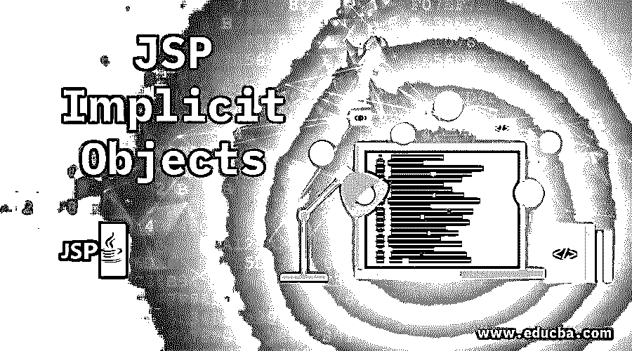
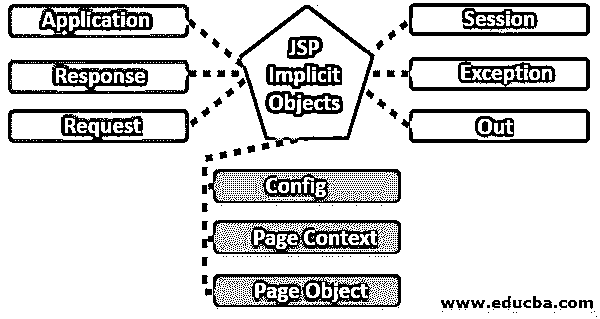
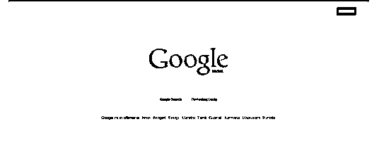
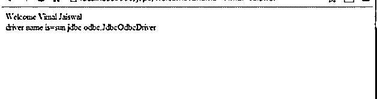
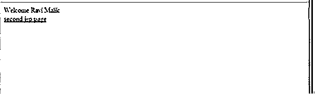
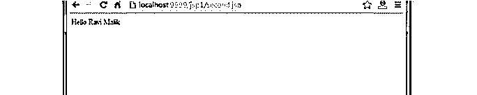

# JSP 隐式对象

> 原文：<https://www.educba.com/jsp-implicit-objects/>




## JSP 隐式对象介绍

JSP 为我们提供了各种隐式对象。所有这些由 web 容器创建的隐式对象。默认情况下，所有 JSP 页面都可以使用这些对象。众所周知，Java 服务器页面也就是我们的 JSP，它基本上是一种服务器端语言。JSP 的主要优点是，我们可以通过使用 JSP 标签将 java 代码放在 HTML 页面中。JSP 页面用于创建动态页面和 web 应用程序。

### 解释所有 JSP 隐式对象

JSP 为我们提供了 9 个隐式对象，如下让我们看看:

<small>网页开发、编程语言、软件测试&其他</small>




*   应用
*   反应
*   请求
*   会议
*   例外
*   在外
*   配置
*   页面对象
*   页面上下文

#### 1.应用

这个隐式对象是 ServletContext 的类型。这意味着它提供了对 ServletContext 接口的引用。我们有各种与 ServletContext 接口交互的 action 元素。

#### 2.反应

这个隐式对象是 HttpServletResponse 的类型。它与对客户端的响应直接相关。我们可以用这个响应对象添加很多东西，比如状态代码、cookies 和日期戳等等。

所以基本上它是 HttpServletResponse 接口的实例。一个优点是我们不需要在 JSP 上创建响应对象，因为它是隐式可用的。所以它是由 web 容器创建的，因为所有隐式对象都是由 web 容器为它们从客户端接收的每个请求创建的。响应对象主要用于导航到其他资源。因此，它用于操作响应对象，我们将它重定向到我们提到的其他资源。我们还可以指定错误、http 状态代码等。

下面的示例显示了如何使用响应对象:

```
<!DOCTYPE html>
<html>
<head>
<meta charset="UTF-8">
<title>Demo for response object</title>
</head>
<body>
<%
//below line will navigate us to other resource let’s say google for now
response.sendRedirect("google.com");
%>
</body>
</html>
```

在上面的例子中，它会将链接重定向到 google 页面或我们提到的任何 URL 作为输入。




#### 3.请求

这个对象也是由 web 容器创建的，这个隐式对象是 HttpServletRequest 的类型，它是由每个 JSP 请求创建的。它基本上为我们提供了可以进一步使用的用户信息，如用户名、密码、远程地址、标题信息、服务器名称、字符编码、服务器端口、内容类型等。基本上，它为我们提供了关于请求的信息，或者我们可以说是输入参数。请求对象也是由 JSP 页面上的 web 容器创建的，因此我们不需要创建任何隐式的请求对象。

**例子**

以下是下面提到的例子

**demo.Html**

```
<form action="demo.jsp">
<input type="text" name="username">
<input type="submit" value="click"><br/>
</form>
```

**demo.jsp**

```
<%
String username=request.getParameter("username");
out.print("welcome "+username);
%>
```

在上面的例子中，我们通过使用 getParameter()方法来检索用户输入，因此无论用户在输入字段中写了什么，我们都可以通过使用 getParameter()方法来检索输入。


#### 4.会议

这个隐式对象也是由 web 容器创建的，可以用来获取会话信息。我们也可以使用这个对象来删除、设置和获取属性。该对象属于 HttpSession 类型。

下面是如何使用它的一个简单例子。

**例子**

以下是下面提到的例子

**demo.html**

```
<html>
<body>
<form action="demo.jsp">
<input type="text" name="username">
<input type="submit" value="click"><br/>
</form>
</body>
</html>
```

**demo.jsp**

```
<html>
<body>
<%
String username=request.getParameter("username");
out.print("displaying the username here : "+username);
session.setAttribute("username",username);
<a href="demo2.jsp">another JSP page to get value</a>
%>
</body>
</html>
demo2.jsp
<html>
<body>
<%
String name=(String)session.getAttribute("username");
out.print("getting username here  "+name);
%>
</body>
</html>
```

在上面的例子中，我们需要在获取和设置参数时使用相同的名称，否则值将为 null。


#### 5.例外

这个隐式对象也是由 web 容器创建的，这是 Throwable 类的类型。但是我们只能在错误页面中使用这个隐式对象，它用于打印异常。

**例子**

以下是下面提到的例子

```
<%@ page isErrorPage="true" %>
<html>
<body>
This will print out the exception that has been occurred:<%= exception %>
</body>
</html>
```

此示例将只打印将发生的异常，并且只能在错误页面上使用。

#### 6.在外

这个隐式对象也是由 web 容器创建的。如果我们想写任何数据到缓冲区，那么我们有这个隐式对象。该对象是一种 JspWriter。

**语法:**

```
PrintWriter out=response.getWriter();
```

**例子**

```
<html>
<body>
<% out.print("Just print today's date :"+java.util.Calendar.getInstance().getTime()); %>
</body>
</html>
```

在上面的例子中，这将只打印这个对象用来打印数据的当前日期。


#### 7.配置

该对象属于 ServletConfig 类型。这个对象也是由 web 容器创建的。它主要用于初始化目的，从 web.xml 获取参数。

**例子**

以下是下面提到的例子

**demo.html**

```
<form action="demo">
<input type="text" name="username">
<input type="submit" value="Click"><br/>
</form>
```

**web.xml**

```
<web-app>
<servlet>
<servlet-name>demoservlet</servlet-name>
<jsp-file>/demo.jsp</jsp-file>
<init-param>
<param-name>drivername</param-name>
<param-value>sun.jdbc.odbc.JdbcOdbcDriver</param-value>
</init-param>
</servlet>
<servlet-mapping>
<servlet-name>sonoojaiswal</servlet-name>
<url-pattern>/welcome</url-pattern>
</servlet-mapping>
</web-app>
```

**demo.jsp**

```
<%
out.print("user name is"+request.getParameter("username"));
String driverName=config.getInitParameter("drivername");
out.print("driverName name is="+driverName);
%>
```




#### 8.页面上下文

该对象属于 PageContext 类型。它从下面提到的范围中删除、获取和设置属性:

*   应用
*   请求
*   会议
*   页

**例子**

以下是下面提到的例子

**demo.html**

```
<html>
<body>
<form action="demo.jsp">
<input type="text" name="username">
<input type="submit" value="click"><br/>
</form>
</body>
</html>
```

**demo.jsp**

```
<html>
<body>
<%
String username=request.getParameter("username");
out.print("display user name "+username);
pageContext.setAttribute("username",username,PageContext.SESSION_SCOPE);
<a href="demo2.jsp">This is second jsp page.</a>
%>
</body>
</html>
```

**demo2.jsp**

```
<html>
<body>
<%
String username=(String)pageContext.getAttribute("username",PageContext.SESSION_SCOPE);
out.print("Getting value from the previous page  "+username);
%>
</body>
</html>
```

在上面的例子中，我们将值设置到一个 JSP 中，并在另一个 JSP 中检索它。通过使用相应的方法。







#### 9.页面对象

此页面是对象类的类型。也由 web 容器创建。

### 结论

JSP 给了我们隐式对象，这意味着我们不需要显式地创建它们的对象。这个对象创建任务是由 web 容器完成的，JSP 页面上提供了这些对象。因此，我们可以根据需要简单地设置、获取和删除属性值，还可以使用提到的所有必需参数将它们导航到目的地。

### 推荐文章

这是 JSP 隐式对象的指南。这里我们讨论 JSP 为我们提供了 9 个隐式对象以及它们的例子。您也可以看看以下文章，了解更多信息–

1.  [JSP 指令](https://www.educba.com/jsp-directives/)
2.  [JSP 架构](https://www.educba.com/jsp-architecture/)
3.  [什么是 JSP？](https://www.educba.com/what-is-jsp/)
4.  [JSP 面试问题](https://www.educba.com/jsp-interview-questions/)


