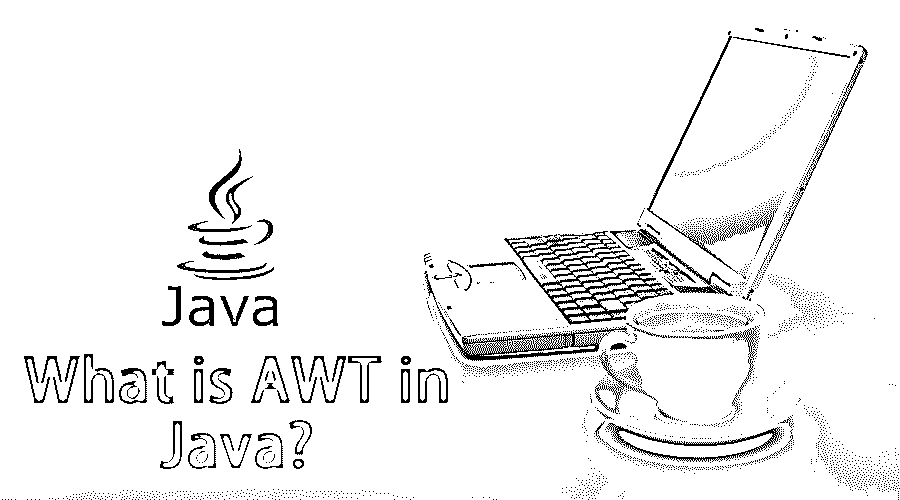
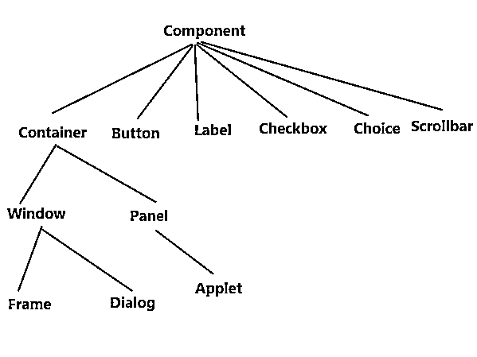

# Java 中的 AWT 是什么？

> 原文：<https://www.educba.com/what-is-awt-in-java/>




## Java 中的 AWT 简介

Java AWT 也称为抽象窗口工具包，它是一个 API，用于用 Java 开发 GUI 或基于窗口的应用程序。Java AWT 组件是平台相关的，这意味着它们是根据操作系统的视图显示的。它也是重量级的，意味着它的组件正在使用操作系统的资源。java。awt 包为 AWT api 提供了类。例如，文本字段、复选框、选项、标签、文本区、单选按钮、列表等。

### AWT 层次结构

以下是 AWT 层次结构:

<small>网页开发、编程语言、软件测试&其他</small>




#### 容器

容器是 AWT 中的一个组件，它包含按钮、文本字段、标签等其他组件。扩展容器类的类称为容器，如层次结构中所示的框架、对话框和面板。

### 容器的类型

如上所述，容器指的是可以添加组件的位置，如文本字段、按钮、复选框等。AW 中总共有四种类型的容器，即窗口、框架、对话框和面板。如上图所示，框架和对话框是窗口类的子类。

**1。窗口:**窗口是一个没有边框和菜单栏的容器。为了创建一个窗口，你可以使用框架，对话框或者[另一个窗口](https://www.educba.com/introduction-to-windows/)。

**2。Panel:**Panel 是不包含标题栏和菜单栏的容器/类。它还有其他组件，如按钮、文本字段等。

**3。对话框:**对话框是有边框和标题的容器或类。没有相应框架类的关联实例，我们无法创建对话框类的实例。

**4。框架是包含标题栏的容器或类，也可能有菜单栏。它还可以有其他组件，如文本字段、按钮等。**

### 为什么 AWT 是平台相关的？

Java 抽象窗口工具包调用本地平台，即操作系统的子例程，以创建文本框、复选框、按钮等组件。例如，包含按钮的 AWT GUI 在各种平台上具有不同的外观和感觉，如 Windows、Mac OS 和 Unix 等。由于这些平台对于它们各自的本机按钮有不同的外观和感觉，因此 AWT 将直接调用它们的本机子例程来创建按钮。简而言之，在 AWT 上构建的应用程序在 windows 上运行时看起来更像 Windows 应用程序，然而，在 Mac 操作系统上运行时，同样的应用程序看起来更像 Mac 应用程序。

### 组件类的基本方法

*   **public void add(Component c):**这个方法将在这个组件上插入一个组件。
*   **public void setSize(int width，int height):** 这个方法将设置特定组件的大小(宽度和高度)。
*   **public void set visible(boolean status):**这个方法会改变组件的可见性，默认情况下是 false。
*   **public void set layout(layout manager m):**该方法将为特定组件定义布局管理器。

### Java AWT 示例

我们可以通过两种方式使用 Frame 创建 GUI:

通过扩展框架类或通过创建框架类的实例

让我们通过两个例子来说明这一点，首先是扩展 Frame 类:

```
import java.awt.*;/* Extend the Frame class here,
*thus our class "Example" would behave
*like a Frame
*/public class Example extends Frame
{Example()
{Button b=new Button("Button!!");
//setting button position on screen
b.setBounds(50,50,50,50);
//adding button into frame
add(b);
//Setting  width and height
setSize(500,300);
//Setting title of Frame
setTitle("This is First AWT example");
//Setting the layout for the Frame
setLayout(new FlowLayout());
/*By default frame is not visible so
*we are setting the visibility to true
*to make it visible.
*/
setVisible(true);
}
public static void main(String args[]){
//Creating the instance of Frame
Example fr=new Example();
}
}
```

**举例:**

```
import java.awt.*;
public class Example {
Example()
{
//Creating Frame
Frame f=new Frame();
//Creating a label
Label l = new Label("User: ");
//adding label to the frame
f.add(l);
//Creating Text Field
TextField t = new TextField();
//adding text field to the frame
f.add(t);
//setting frame size
f.setSize(500, 300);
//Setting the layout for the Frame
f.setLayout(new FlowLayout());
f.setVisible(true);
}
public static void main(String args[])
{Example ex = new Example();
}
}
```

### AWT 中的布局

AWT 中有两种布局，如下所示:

流布局是默认布局，这意味着当您没有在代码中设置任何布局时，默认情况下特定布局将设置为流。流布局会将文本字段、按钮、标签等组件放在一行中，如果水平空间不足以容纳所有组件，它会将它们添加到下一行，循环继续。关于流程布局的几点思考

*   默认情况下，流程布局中的所有行都居中对齐。但是，如果需要，我们可以设置从左或右对齐。
*   默认情况下，所有组件之间的水平和垂直间距为 5 个像素。
*   默认情况下，组件的方向是从左到右，这意味着组件将根据需要从左到右添加，但我们可以在需要时将其从右到左更改。

边框布局，其中我们可以添加组件，如文本字段，按钮，标签等，以特定的五个这些地区被称为页面开始，行开始，中心，行结束，页面结束。

**边框布局的方法是:**

```
public BorderLayout(int hgap,int vgap)
```

它将使用组件之间指定的间隙来构造边框布局。水平间隙由 hgap 指定，垂直间隙由 vgap 指定。
参数有:

*   **hgap:** 水平缺口。
*   **vgap:** 垂直间隙。

我们也可以通过对组件之间的水平间隙使用 setHgap(int hgap)方法和对垂直间隙使用 setVgap(int vgap)方法来实现相同的效果。

### 结论

因此，我们可以得出结论，AWT 的设计是为了提供一套通用的 GUI 设计工具，可以在各种平台上工作。这些工具保留了每个平台的外观和感觉。

### 推荐文章

这是 Java 中 AWT 的指南。这里我们讨论了 Java 中 AWT 的层次结构、基本方法、例子和布局。您也可以阅读以下文章，了解更多信息——

1.  [Java 中的设计模式是什么？](https://www.educba.com/what-is-design-pattern-in-java/)
2.  [JavaScript 是什么？](https://www.educba.com/what-is-javascript/)
3.  [什么是软件开发？](https://www.educba.com/what-is-software-development/)
4.  [Java 中的 BorderLayout](https://www.educba.com/borderlayout-in-java/)


