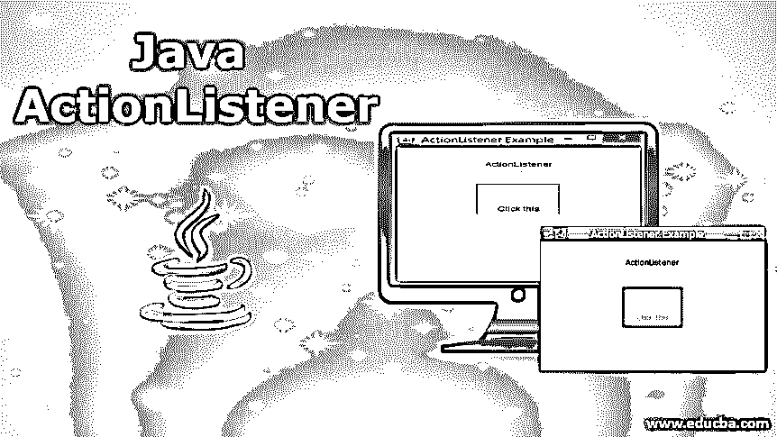
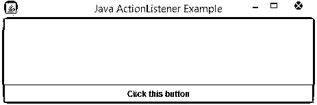
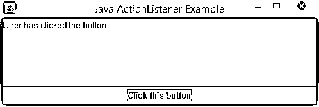
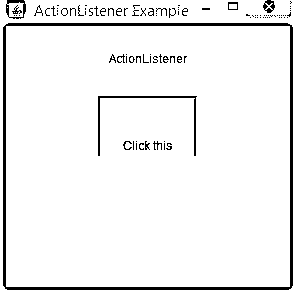
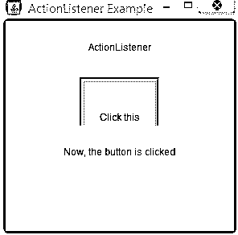
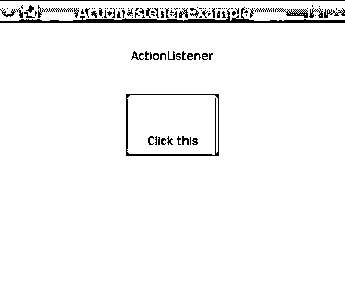
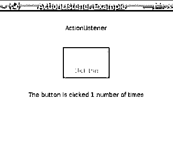

# Java 操作监听器

> 原文：<https://www.educba.com/java-actionlistener/>




## Java ActionListener 简介

顾名思义，Java ActionListener 是 Java 编程语言中的一种类，每当应用程序上有操作执行时，它就接收一条记录。它与 java.awt.event 包一起提供，并在 JButtons 的帮助下实现，其语法是“公共接口 action listener extends event listener”。当在给定的空间上执行任何类型的动作时，比如点击按钮、点击菜单项、点击应用程序中的任何随机空间等，这个类都会参与进来。

**声明:**

<small>网页开发、编程语言、软件测试&其他</small>

可以使用以下语法声明该接口。

```
Public interface ActionListener extends EventListener
```

**方法:**

ActionListener 只有一个方法。

*   actionPerformed(ActionEventev)

当一个动作发生时，这个方法将被调用。

### 创建 Java 操作监听器的步骤

通常，ActionListener 通过实现它来工作。为此，可以执行以下步骤。

第一步:必须声明一个事件处理类。

**第二步:**在创建类的时候，提到这个类是实现还是扩展 ActionListener 接口。

```
public class ActionExample Implements ActionListener
```

**步骤 3:** 组件或事件处理程序实例必须注册为监听器。

```
cmp.addActionListener(instanceOfActionListenerclass);
```

**步骤 4:** 在 ActionListener 的接口中添加覆盖方法 actionPerformed()的代码。

```
actionPerformed(ActionEvent evnt){  //specify the code that has to be implemented  }
```

### Java ActionListener 如何工作？

*   当用户或个人单击按钮时，程序中应该有一个实现该接口的对象。
*   因为对象将注册到 ActionListener，所以单击按钮将触发操作。
*   这将调用 actionPerformed 方法并执行其中提到的操作。

### 实现 Java ActionListener 的示例

以下是实现 java ActionListener 的示例:

#### 示例#1

**代码:**

```
import java.awt.BorderLayout;
import java.awt.event.ActionEvent;
import java.awt.event.ActionListener;
import javax.swing.JButton;
import javax.swing.JFrame;
import javax.swing.JTextArea;
//new class that implements the ActionListener interface
public class JActionListenerExample implements ActionListener {
//create a button
JButton btn;
//create a frame
JFrame frm;
//create a text area
JTextArea txt;
public JActionListenerExample() {
btn = new JButton("Click this button");
frm = new JFrame("Java ActionListener Example");
txt = new JTextArea(6, 41);
btn.addActionListener(this);
// line wrapping of text area
txt.setLineWrap(true);
//sets layout
frm.setLayout(new BorderLayout());
//add textarea to the container
frm.add(txt, BorderLayout.NORTH);
//add the button to the container
frm.add(btn, BorderLayout.SOUTH);
//Resize the window based on container size
frm.pack();
frm.setDefaultCloseOperation(JFrame.EXIT_ON_CLOSE);
//set visibility
frm.setVisible(true);
}
//action to be performed on clicking the button
@Override
public void actionPerformed(ActionEvent ev) {
//set text
txt.setText(txt.getText().concat("User has clicked the button \n"));
}
public static void main(String args[]) {
//create object
JActionListenerExample jl = new JActionListenerExample();
} }
```

**输出:**

执行代码时将显示如下所示的输出。




此外，点击按钮时，屏幕上会显示一段文字，如下图所示。




#### 实施例 2

**代码:**

```
import java.awt.*;
import java.awt.event.ActionEvent;
import java.awt.event.ActionListener;
import java.awt.event.WindowAdapter;
import java.awt.event.WindowEvent;
public class JActionListenerExample {
//create a frame
private Frame fr;
//create a label 1
private Label lbl1;
//create a label 2
private Label lbl2;
//create a panel
private Panel pnl;
public JActionListenerExample(){
//call the method userint()
userint();
}
public static void main(String[] args){
//create the object of class
JActionListenerExample  jl = new JActionListenerExample();
jl.ActnListener();
}
//definition of method userint
private void userint(){
//frame
fr = new Frame(" ActionListener Example");
//set the size of frame
fr.setSize(300,300);
//set the layout of frame
fr.setLayout(new GridLayout(4, 2));
//add the window listener
fr.addWindowListener(new WindowAdapter() {
//call when window is closing
public void windowClosing(WindowEvent wev){
System.*exit*(0);
}
});
//create label 1
lbl1 = new Label();
//set the alignment
lbl1.setAlignment(Label.*CENTER*);
//create label 2
lbl2 = new Label();
//set the alignment
lbl2.setAlignment(Label.*CENTER*);
//set the size
lbl2.setSize(450,200);
//create panel
pnl = new Panel();
//set the layout of panel
pnl.setLayout(new FlowLayout());
//add the label 1 to frame
fr.add(lbl1);
//add the panel to frame
fr.add(pnl);
//add the label 2 to frame
fr.add(lbl2);
//se the visibility as true
fr.setVisible(true);
}
//define the method
private void ActnListener(){
//set the text for label 1
lbl1.setText("ActionListener");
//create a scrollpane
ScrollPane pane = new ScrollPane();
//create a button
Button btnn = new Button("Click this");
//add actionlistener
btnn.addActionListener(new CustomActionListener());
//add button to the pane
pane.add(btnn);
//add pane to the panel
pnl.add(pane);
//set visibility as true
fr.setVisible(true);
}
class CustomActionListener implements ActionListener{
//declare the actionperformed method
public void actionPerformed(ActionEvent e) {
//set the text as lbl2
lbl2.setText("Now, the button is clicked");
}}}
```

**输出:**

在这个节目中，将展示一个带有标签的按钮，与上面的节目不同。




单击此按钮时，会遇到一个操作，因此会显示一个文本，显示该按钮已被单击。




#### 实施例 3

**代码:**

```
import java.awt.*;
import java.awt.event.ActionEvent;
import java.awt.event.ActionListener;
import java.awt.event.WindowAdapter;
import java.awt.event.WindowEvent;
public class JActionListenerExample {
//create a frame
private Frame fr;
//create a label1
private Label lbl1;
//create a label2
private Label lbl2;
//create a panel
private Panel pnl;
//variable to count the number of clicks
private int noClick = 0;
public JActionListenerExample(){
//call the method userint()
userint();
}
public static void main(String[] args){
//create the object of class
JActionListenerExample  jl = new JActionListenerExample();
jl.ActnListener();
}
//definition of method userint
private void userint(){
//frame
fr = new Frame(" ActionListener Example");
//set the size of frame
fr.setSize(300,300);
//set the layout of frame
fr.setLayout(new GridLayout(4, 2));
//add the window listener
fr.addWindowListener(new WindowAdapter() {
//call when window is closing
public void windowClosing(WindowEvent wev){
System.exit(0);
}
});
//create label1
lbl1 = new Label();
//set the alignment
lbl1.setAlignment(Label.*CENTER*);
//create label2
lbl2 = new Label();
//set the alignment
lbl2.setAlignment(Label.*CENTER*);
//set the size
lbl2.setSize(450,200);
//create panel
pnl = new Panel();
//set the layout of panel
pnl.setLayout(new FlowLayout());
//add the label1 to frame
fr.add(lbl1);
//add the panel to frame
fr.add(pnl);
//add the label2 to frame
fr.add(lbl2);
//visibility as true
fr.setVisible(true);
}
//method definition
private void ActnListener(){
//set the text for label 1
lbl1.setText("ActionListener");
//create a scrollpane
ScrollPane pane = new ScrollPane();
//set the background for pane
pane.setBackground(Color.*green*);
//create a button
Button btnn = new Button("Click this");
//add actionlistener
btnn.addActionListener(new CustomActionListener());
//add button to the pane
pane.add(btnn);
//add pane to the panel
pnl.add(pane);
//set visibility as true
fr.setVisible(true);
}
class CustomActionListener implements ActionListener{
//declare the actionperformed method
public void actionPerformed(ActionEvent e) {
//increment the count if button is clicked
noClick++;
//set the text as lbl2
lbl2.setText("The button is clicked "+ noClick + " number of times");
}}}
```

**输出:**

在这个节目中，还将展示一个带有标签的按钮。




但是与上面的程序不同的是，一个包含点击次数的文本也会显示出来，如下所示。




### 结论

Java ActionListener 是一个当用户单击菜单项或按钮时得到通知的类。关于这个接口的更多细节将在本文档中详细讨论。

### 推荐文章

这是 Java ActionListener 的指南。这里我们讨论基本概念，java ActionListener 如何与创建 ActionListener 的步骤一起工作及其示例。您也可以阅读以下文章，了解更多信息——

1.  [Java 中的 JButton](https://www.educba.com/jbutton-in-java/)
2.  [Java 集合面试问题](https://www.educba.com/java-collection-interview-questions/)
3.  [Java 私有](https://www.educba.com/private-in-java/)
4.  [Java WindowListener](https://www.educba.com/java-windowlistener/)


