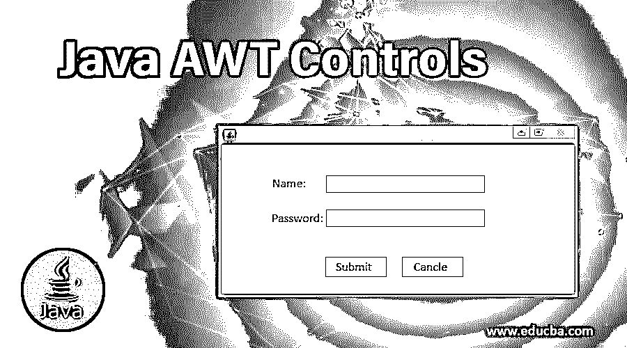

# Java AWT 控件

> 原文：<https://www.educba.com/java-awt-controls/>




## Java AWT 控件简介

Java AWT 控件是用于设计图形用户界面或 web 应用程序的控件。为了制作有效的 GUI，Java 提供了 java.awt 包，它支持各种 awt 控件，如标签、按钮、复选框、复选框组、列表、文本字段、文本区域、选项、画布、图像、滚动条、对话框、文件对话框等，这些控件可以在 web 上创建或绘制各种组件，并管理基于 GUI 的应用程序。

### Java AWT 控件的结构

AWT 的结构非常简单，在程序中广泛使用。每个 AWT 都从容器类继承控件。

<small>网页开发、编程语言、软件测试&其他</small>

#### 集装箱等级

它用图形表示法表示对象，是 GUI 界面中的一个抽象类。

以下是 GUI 中常用 UI 元素的列表，通常称为图形用户界面。

##### 1.标签

标签是用于在容器中放置文本的用户。标签仅用于输入文本。这个标签并不意味着文本可以被修改，也不意味着它可以被用作一个可以进一步操作的按钮。

**语法:**

```
Label n=new Label("Name:",Label.CENTER);
```

##### 2.纽扣

该命令在用户界面中生成一个按钮。单击该按钮会将命令移动到另一个页面或另一个 web 服务器，该页面或服务器用于在用户界面页面中显示几个其他输出。

**语法:**

```
a1=new Button("submit");
a2=new Button("cancel");
```

##### 3.检验盒

可以有某个问题，复选框用于确定所提问题的真或假性质。如果勾选了复选框，则表示该问题为真，如果未勾选，则表示该问题为假。基本上就是 Java 编程语言中的真或假[状态。](https://www.educba.com/java-programming-language-features/)

**语法:**

```
Checkbox checkbox1 = new Checkbox("Hello World");
```

##### 4.复选框组

顾名思义，复选框组是编程语言中使用的一组复选框。有许多复选框被使用，因此复选框组被称为复选框组。

**语法:**

```
CheckboxGroup cb = new CheckboxGroup();
Checkbox checkBox1 = new Checkbox("Hello", cb, true);
checkBox1.setBounds (100,100, 50,50);
```

##### 5.目录

该列表为用户提供了项目的滚动列表。项目的滚动列表也由用户设置。用户设置项目的滚动列表，例如水果、蔬菜、一些问卷或其他事实。

**语法:**

```
List l1=new List(4);
l1.setBounds(100,100, 75,75);
```

##### 6.文本字段

文本字段用于编辑可在编程概念中使用的特定文本行。

**语法:**

```
na=new TextField(20);
```

##### 7.文本区域

文本区域用于编辑多行文本。文本字段和文本区域之间的唯一区别在于，文本字段用于编辑用户界面中的单行文本，而文本区域用于编辑多行文本。

**语法:**

```
TextArea area=new TextArea("Welcome to the universe");
area.setBounds(10,30, 300,300);
```

##### 8.选择

顾名思义，选项显示各种选项，所选的选项显示在屏幕顶部的菜单栏中。

**语法:**

```
Choice c=new Choice();
c.setBounds(100,100, 75,75);
c.add("Subject 1");
c.add("Subject 2");
c.add("Subject 3");
c.add("Subject 4");
c.add("Subject 5");
```

##### 9.帆布

在画布空间中，可以有用户给出的输入，或者用户可以在给出的画布空间上画些东西。

**语法:**

```
f.add(new MyCanvas());
f.setLayout(null);
f.setSize(400, 400);
f.setVisible(true);
```

##### 10.图像

在一个 UI 中可以有一个或多个图像。可以有一个与图像相关联的按钮，当点击它时，它可以产生一些功能。

**语法:**

```
Image i=t.getImage("pic2.gif");
```

##### 11.滚动条

滚动条和普通滚动条一样，用于在不同的值范围内滚动或移动。用户从这些值的范围中选择一个值。

**语法:**

```
Scrollbar s=new Scrollbar();
s.setBounds(100,100, 50,100);
```

##### 12.对话

对话框用于从用户处获取某种形式的输入，并以连续的方式产生它。

**语法:**

```
d = new Dialog(f , "Hello World", true);
```

##### 13.文件对话框

从文件对话框中，用户可以选择他/她希望使用的文件。

**语法:**

```
FileDialog(Dialog parent)
```

### AWT 理论及解释

可以使用所有 Java AWT 控件在用户界面中创建登录页面，在该界面中，要求用户以连续的方式输入名称和密码。这个代码可以插入到一个 SQL 表中，各个人的名字和密码可以以一种非常健康的方式存储。

Java 代码的整个输出是一个使用 Java AWT 控件创建的登录页面。用户可以通过点击用户界面中的取消按钮来取消特定名称和密码的输入。此外，姓名和密码可以连接到一个 SQL 表，其中存储了各个人的所有姓名及其密码。“提交”按钮用于确保用户名和密码已提交，并且成功存储在 excel 表中。此外，可以调用 Excel 表，并且可以使用 SQL 查询从 Excel 表中获取数据。

### 结论

在所示的程序中使用了许多 AWT 控件。在本文中，还按顺序列出了 Java 编程语言中通常使用的所有 Java AWT 控件。程序中还使用了提交和取消等按钮，每个按钮都有独立的功能。屏幕的大小也是共享的，这给了我们一个关于屏幕看起来有多大或多小的想法。在本文中，我们看到了 Java AWT 控件的各种功能以及它们在特定领域的用法。

### 推荐文章

这是一个 Java AWT 控件的指南。这里我们讨论 java AWT 控件的结构以及从 GUI 中的容器类继承的 UI 元素列表。您也可以阅读以下文章，了解更多信息——

1.  [Java 中的 JTree](https://www.educba.com/jtree-in-java/)
2.  [JavaFX 文本字段](https://www.educba.com/javafx-textfield/)
3.  [JavaFX StackPane](https://www.educba.com/javafx-stackpane/)
4.  [Java 中的矩阵乘法](https://www.educba.com/matrix-multiplication-in-java/)


