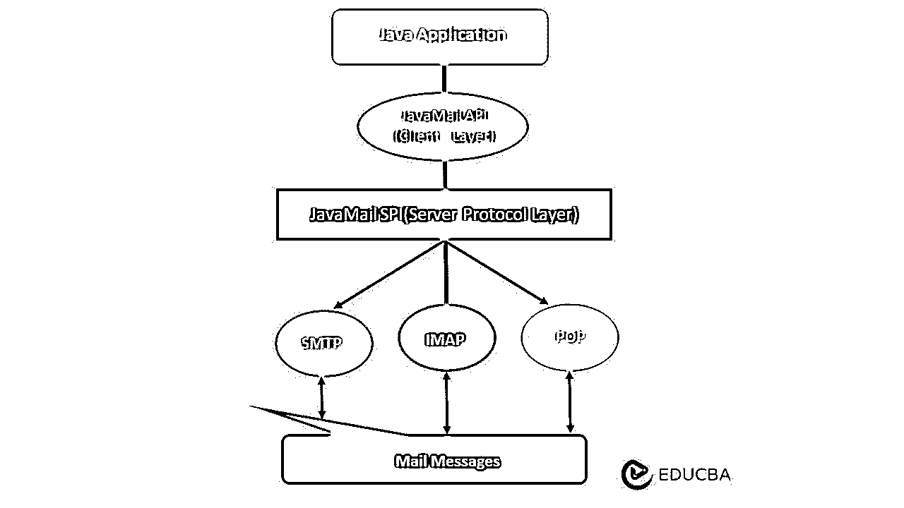

# JavaMail Api

> 原文：<https://www.educba.com/javamail-api/>

## JavaMail Api 简介

JavaMail API 用于读、写和撰写电子邮件(电子消息)。JavaMail API 提供了一个框架，通过独立于平台和独立于协议的方式使用 Java 创建邮件和消息客户端应用程序。JavaMail API 提供了包含邮件系统中定义的对象的抽象类，并且还提供了一个到电子邮件应用程序的接口。JavaMail API 通常用于阅读和发送电子邮件，需要服务提供商与执行传输协议的邮件服务器进行交互。

### JavaMail API 概述

JavaMail API 提供了一个框架，可以独立于平台和协议创建邮件和消息客户端应用程序。JavaMail API 提供了一组抽象类，这些抽象类包含了邮件系统的对象，还提供了电子邮件应用程序的接口。它通常用于撰写、阅读和发送电子邮件(电子消息)。JavaMail API 是一组用于邮件系统的 API，它提供发送和阅读电子邮件的服务。JavaMail 提供了一个元素，用于为带有接口和系统组件的消息传递系统构建接口。JavaMail 包括各种实现 MIME 互联网消息标准和 RFC822 的类；这些类在 JavaMail 类包中。

<small>网页开发、编程语言、软件测试&其他</small>

### JavaMail API 中使用的协议

JavaMail API 中使用了几个协议，它们如下:

#### 1.SMPT(简单邮件传输协议)

它提供了传送电子邮件的机制，并且它是用于通过 IP 网络接收和发送电子邮件的互联网标准，IP 网络使用具有最可接受的端口 25 的 TCP 来发送和接收电子邮件。它有安全的 SSL 连接。JavaMail API 具有 com.sun.mail.smtp 中的核心类和包，它将执行 smtp 协议提供程序，以便与任何 SMTP 服务器建立连接。我们可以像在 SMTP 服务器上一样使用 Postcast 服务器、电子邮件服务器、Apache James 服务器。一旦购买了主机空间，默认情况下，SMTP 服务器为我们提供主机提供商。

#### 2.邮局协议

它也被称为 POP3，主要提供接收电子邮件的机制。它为每个用户定义和维护特定的/单个邮箱。RFC 1939 中定义了 POP3 协议。POP3 是本地电子邮件客户端使用的标准互联网协议，用于通过 TCP/IP 协议使用来自远程服务器的电子邮件，它侦听端口 110。JavaMail API 中 POP3 协议的提供者是 com.sun.mail.pop3。

#### 3.互联网信息访问协议

它是接收消息的最高级协议。IMAP 为每个用户提供对大量邮箱的支持；此外，邮箱可以提供给几个不同的用户。这个 IMAP 在 RFC 2060 中定义，它监听端口 143。JavaMail API 中 IMAP 协议的提供者是 **com.sun.mail.imap** 。SSL 上的 IMAP 使用分配的端口 993。

#### 4.多用途互联网邮件扩展

它定义并告诉浏览器正在传输的内容。它没有邮件传输协议，它只告诉实际发送的内容，例如任何附件、发送的消息格式等等。对于不同的文档，它们有不同的效果，它们是 RFC 2047、RFC 2046、RFC 2045 和 RFC 822，这些格式在邮件程序本身中存在和使用。

#### 5.NNTP(新闻传输协议)和其他

有几个协议是由第三方组织者提供的，有些是 NNTP，S/MIME(安全多用途互联网邮件扩展)等。

### 体系结构

如前所述，Java 应用程序使用 JavaMail API 来读、写和编写电子邮件(电子消息)。JavaMail API 提供了一个框架，通过独立于平台和独立于协议的方式使用 Java 创建邮件和消息客户端应用程序。JavaMail API 使用 SPI(服务提供者接口), SPI 是处理各种协议的 Java 应用程序的中间服务。让我们看看下面的架构，它描述了 JavaMail 的流程，

JavaMail API 的概念机制与其他 J2EE API 相关，如 JNDI、JDBC 和 JMS，通过查看上面的架构图，JavaMail API 分为两个基本部分，

*   **应用无关:**这部分是应用编程接口(API)，应用组件使用它来发送和接收邮件消息。它是所使用的独立提供者或协议的基础。
*   **服务相关:**这部分是一个服务提供者接口(SPI ),讲述特定于协议的语言，如 POP、IMAP、SMTP 和 NNTP。它是基于电子邮件服务的插件提供者的 J2EE 平台。

### 性能

在 JavaMail API 属性中，javax 中只引用了几个可识别的属性。邮件执行提出了 J2EE 参考实现，这些属性被设置为字符串，因为类型列定义了如何解释字符串。让我们看看下面几个属性:

**1。IMAP 配置属性**

| **名称** | **类型** | **描述** |
| 邮件。imap .主机 | 线 | IMAP 服务器到连接–连接到 |
| Mail. imap.user | 线 | IMAP 的默认用户——用户名 |

**2。SMTP 配置属性**

| **名称** | **类型** | **描述** |
| 邮件。smtp.port | （同 Internationalorganizations）国际组织 | 它象征着与港口的联系。它将默认值设置为 25。 |
| 邮件。smtp .超时 | （同 Internationalorganizations）国际组织 | 默认超时是无限的。I/O 超时值以毫秒为单位定义。 |

**3。POP3 配置属性**

| **名称** | **类型** | **描述** |
| 邮件. pop3 .主机 | 线 | POP3 服务器到连接–连接到 |
| Mail.pop3.user | 线 | POP3 的默认用户–用户名 |

### API 提供了对邮件系统建模的类

在 JavaMail API 中，有各种接口和类用于阅读、发送和删除电子邮件。JavaMail API 中使用了两个主要的包，它们是 javax。邮件和 javax。mail.internet 包。这些包包含的核心类如下:

| **类** | **描述** |
| **Javax.mail.Message** | 这是一封模拟抽象类的电子邮件。子类提供了实现 |
| **Javax.mail.Session** | 这是 API 的主要关键类。它代表连接工厂，并且是一个多线程对象。 |
| **Javax.mail.Address** | 它们的子类提供了实现。抽象类描述了消息中端到端的地址。 |
| **Javax.mail.Transport** | 它是一种用于发送/传输电子邮件的消息传输机制。 |
| **Javax。邮件。认证器** | 这用于保护邮件服务器上的邮件资源。 |
| **javax . mail . internet . mimom message** | 这是一个电子邮件消息服务，它理解 MIME 类型(如格式等)。)和标题。它作用于子类。消息是抽象类。 |
| **Javax。邮件。商店** | 此目的是为检索和存储消息建立消息存储和访问协议模型。商店被分成文件夹。 |
| **Javax。邮件。文件夹** | 它包含子文件夹，该类表示邮件消息的文件夹结构。 |
| **Javax.mail.internet.InternetAddress** | The InternetAddress class represents an internal address of e-mail that uses the syntax of RFC822\. The address format will be user@host.domain or the Personal Name user@host.domain |

**结论**

在本文中，我解释了 JavaMail API。希望文章能帮助你理解。

### 推荐文章

这是一个 JavaMail Api 的指南。这里我们讨论 JavaMail 包含了各种实现 MIME 互联网消息标准的类。您也可以看看以下文章，了解更多信息–

1.  [Java XML 解析器](https://www.educba.com/java-xml-parser/)
2.  [JavaFX 可观察列表](https://www.educba.com/javafx-observablelist/)
3.  [JavaFX 组](https://www.educba.com/javafx-group/)
4.  [JavaScript 图像滑块](https://www.educba.com/javascript-image-slider/)

