# Java 机器人框架

> 原文：<https://www.educba.com/robot-framework-with-java/>

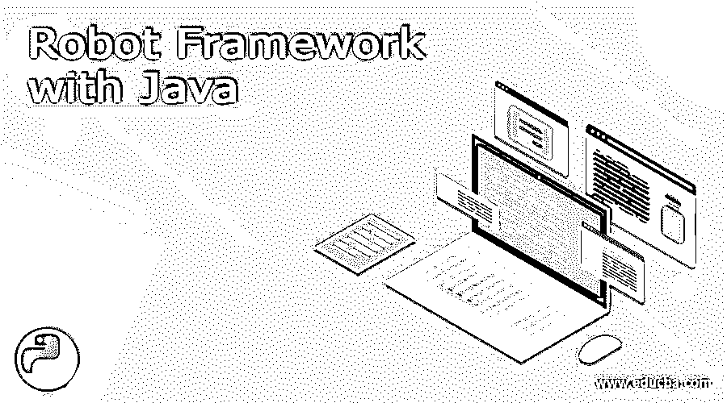


## 用 Java 介绍机器人框架

Robot framework 是一个基于 Python 的开源测试自动化框架，可用于采用关键字驱动的方法进行自动化测试，Jython (Java)和 IronPython 也受 Robot framework 支持，它是自动化测试过程的验收测试框架。它使用关键字驱动的测试策略，具有易于使用的表格测试数据语法，测试库用 Python 或 Java 编写，可以扩展其测试功能，实时用户可以从现有的关键字生成新的更高级别的关键字，以创建相同的测试用例语法。

### 用 Java 使用机器人框架

Robot Framework 是一种通用的关键字驱动的框架，可以使用包含使用和识别术语的文本文件来运行测试。到目前为止，我们在 Java 中所做的只是用 Selenium2 关键字创建了一个文本文件。Robotframework 包括 selenium 的所有几个预构建的关键字，它是一种直接的方法，无需任何可写代码就可以开始使用示例和简单的测试用例。并且它被广泛用作执行测试驱动开发(ATDD)验收的测试工具，并且它是广泛的应用，包括机器人过程自动化。因为它为编写、执行和其他编排由机器人框架支持的软件机器人提供了一些默认工具，以便使用 RPA 和其他机器人软件开发人员所必需的基本知识。Robot 框架及其在 RPA 中的应用它是最受推荐的，并从测试用例的初始级别开始使用。

<small>网页开发、编程语言、软件测试&其他</small>

### 如何用 java 安装机器人框架？

Java 也支持 Robot 框架，它与 selenium 驱动程序一起更广泛地用于独立和 web 应用程序测试。Robot framework 刚刚开始使用一些清单和指南，使用 Robotframework java 的设置指令，可以找到测试用例输入和执行。但是这是测试人员在必需的和入门的指令上做的一些基本测试和无数的 StackOverflow 讨论。有些步骤可能是也可能不是绝对必要的，但它们有助于应用程序验收测试更有效地运行。当我们想要创建一个新的机器人框架项目时，我们需要遵循以下步骤。

1.首先，我们必须安装 java 并使用下面的命令来测试 java 版本。

```
Java –version
```

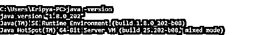


2.然后，我们应该按照 python 安装步骤在机器上安装 python，即下载 python 网页。

https://www.python.org/downloads/

3.这里我已经安装了以下 python 版本，


4.然后我们使用下面的命令安装 Robotframework，

```
pip install --upgrade Robotframework
```


5.它将在机器上安装机器人框架。然后我们安装像 eclipse，STS 等 ide。这里我已经在机器上安装了 STS(Spring Tool Suite)。

6.在此之前，我们应该安装 RED Editor，它支持 IDE 中的 Robotframework 代码，并且很容易与 python 和 Robotframework 集成。

7.我们将看到使用窗口->透视图->打开透视图->其他


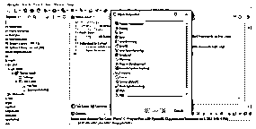


以上步骤用于设置机器人框架以及 java 及其 ide 插件。这些步骤和构建工具更具前瞻性，并且通过了广泛的用户验收测试。

### 用 java 创建机器人框架

我们可以用 java 技术创建机器人框架。上面的小标题我们已经讨论了 ide、java、python 和 robot 框架以及所需安装的必要步骤。完成上述安装步骤后，我们在 ST 的 ide 的 New 选项卡上有了 Robot 项目，

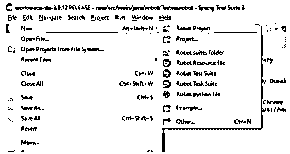


在这里，我已经创建了一个包含机器人测试用例的项目，并添加了所需的依赖项。我们还可以用 Robot framework 项目配置 maven，但在此之前，我们必须向 maven pom.xml 添加依赖项。

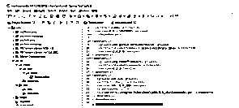


我为此创建了以下示例来测试基于 Web 的应用程序。

**例子**

```
*** Settings ***
Library SeleniumLibrary
*** Test Cases ***
Fist Test
Log Welcome To My Domain its the first test case regarding Robotframework using Java
SeleniumFirtsTest
Create Webdriver Chrome executable_path=F:/chromedriver_win32/chromedriver.exe
Open Browser https://www.facebook.com/ chrome
```

在上面的例子中，我需要在 SeleniumLibrary 及其 Web 驱动程序的帮助下测试脸书应用程序。我们还可以在必需的项目文件夹中看到测试用例，

在测试用例执行之后，我们得到下面的输出。

**样本输出:**

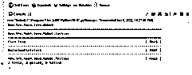


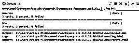


上面的示例输出有三个链接，一个用于输出、日志和报告。如果我在同一个 chrome 浏览器中粘贴链接，我们会得到我执行了相同测试案例的报告结果。

**样本报告:**

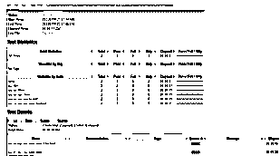


#### 运行命令

每当我们想要执行测试用例时，它应该是执行任务的运行环境所需要的。在这种情况下，我们应该在可运行的环境中正确配置机器人框架。Run 是用于执行测试用例的关键字和命令。在这方面，我还使用了 RIDE editor，它适用于 Robotframework 环境和 web 应用程序测试套件。

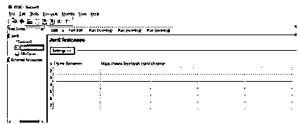


上面的截图是乘坐编辑器，我创建了一个新的机器人项目新的套件，新的测试用例。此外，我们可以使用新的用户关键字创建新的关键字。

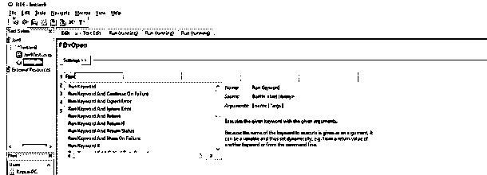


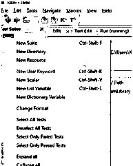


在表格单元格中，我们可以检查每个内置测试用例及套件的运行关键字用法和默认关键字。

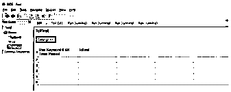


或许我们可以使用 Run 命令来检查和验证条件、测试用例以及套件是通过还是失败。我们也可以在宏中配置运行。

### 结论

在自动化技术中，许多新的趋势和特征日益增强。最有可能的是，javascript 和其他基于脚本的语言被支持来在具有支持的驱动程序的 web 浏览器中执行用户测试用例，例如，机器人框架是通过使用所需的编程语言来执行自动化测试用例的技术和特征。

### 推荐文章

这是一个用 Java 编写的机器人框架指南。这里我们讨论一下入门，用 java 使用机器人框架，如何用 Java 安装机器人框架？.您也可以看看以下文章，了解更多信息–

1.  [Java 异步](https://www.educba.com/java-async/)
2.  [Java 电子邮件](https://www.educba.com/java-email/)
3.  [Java 列表迭代器](https://www.educba.com/java-listiterator/)
4.  [Java 线程转储](https://www.educba.com/java-thread-dump/)


