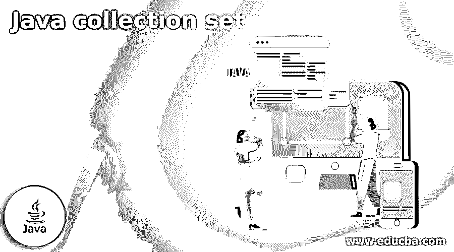
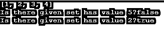
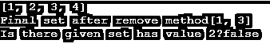

# Java 收集组

> 原文：<https://www.educba.com/java-collection-set/>




## Java 收集组简介

集合只不过是 java 中的一个框架，它使用户能够存储和操作一组对象。Java 集合框架支持许多接口，set 是其中一个集合接口。它收集无序元素，其中不存储重复值。Java 收集组接口消除了重复值。它由 TreeSet、HashSet 或 LinkedHashSet 实现。在对集合进行迭代时，这些实现中的每一个在元素排序方面都可以有不同的表现。

**语法:**

<small>网页开发、编程语言、软件测试&其他</small>

下面是用于在 java 中创建收集组的语法。set num = new HashSet()；

这里，set 是用于创建 Set 接口的关键字。整数是一种数据类型。根据需求，我们可以使用合适的数据类型。num 是存储值的变量。new 是关键字。HashSet 是一个接口，我们也可以根据需要使用另一个接口，如 LinkedHashSet 或 TreeSet。

### Java 集合的工作

嵌入集合，我们可以执行各种操作，如

1.  **add():** 用于在集合中插入一个新值。
2.  **addAll():** 用于将指定集合的所有元素追加到一个集合中。
3.  **clear():** 用于清除集合中的所有元素。
4.  **remove():** 用于从集合中删除指定的值。
5.  **contains():** 用于确定集合中元素的存在。
6.  **hashCode():** 用于计算集合的哈希码值。
7.  **isEmpty():** 用来判定集合的空性。如果集合为空，则返回 true，否则返回 false。
8.  **大小:**用于计算集合的大小。

### Java 收集组的示例

这里我们将讨论一些例子来理解收集组在 Java 中的实现

#### 示例#1

用 add 方法在 java 中实现 Set 接口。

**代码:**

```
import java.util.*;
public class Main{
public static void main(String[] args)
{
// create LinkedHashSet using the Set
Set example = new LinkedHashSet();
example.add("Welcome");
example.add("to");
example.add("eduCBA");
example.add("Java Collection Set Example");
System.out.println(example);
}
}
```

**输出:**


**解释**

这里，我们写了一个程序来添加集合中的值。首先，我们使用 LinkedHashSet 创建了一个集合。然后在 add 方法的帮助下，我们在一个集合中添加了多个字符串，并使用 System.out.println 打印该集合。

#### 实施例 2

用 clear 方法在 java 中实现 set 接口。

**代码:**

```
import java.util.*;
public class Main{
public static void main(String[] args)
{
// creating LinkedHashSet using the Set
Set example = new LinkedHashSet();
example.add("Welcome");
example.add("to");
example.add("eduCBA");
example.add("Java Collection Set Example");
System.out.println(example);
example.clear();
System.out.println("Result after clear method" +example);
}
}
```

**输出:**


**解释**

这里我们写了一个程序来清除集合中的值。正如在第一个例子中所讨论的，我们已经创建了一组值，然后应用 clear 方法。您可以看到，第一条语句打印了包含值的集合，而 clear 方法之后的语句不打印任何内容，因为它清除了所有的值。

#### 实施例 3

用 clear 方法在 java 中实现 set 接口

**代码:**

```
import java.util.*;
public class Main{
public static void main(String[] args)
{
// creating LinkedHashSet using the Set
Set example = new LinkedHashSet();
example.add(1);
example.add(2);
example.add(3);
example.add(4);
System.out.println(example);
example.clear();
System.out.println("Result after clear method" +example);
}
}
```

**输出:**


**解释**

这个例子与第二个例子相同。唯一的区别是，这里我们创建了一个带有数值的集合。

#### 实施例 4

用 contains 方法在 java 中实现 set 接口

**代码:**

```
import java.util.*;
public class Main{
public static void main(String[] args)
{
// creating LinkedHashSet using the Set
Set example = new LinkedHashSet();
example.add(1);
example.add(2);
example.add(3);
example.add(4);
System.out.println(example);
System.out.println("Is there given set has value 5?" + example.contains(5));
System.out.println("Is there given set has value 2?" + example.contains(2));
}
}
```

**输出:**




**解释**

contains 方法用于检查集合中是否存在提到的值。它以布尔格式返回结果，如 true 或 false。在本例中，第一条语句返回 false 值，因为集合中没有 5，第二条语句返回 true 值，因为集合中有 2。

#### 实施例 5

用 remove 方法在 java 中实现 set 接口。

**代码:**

```
import java.util.*;
public class Main{
public static void main(String[] args)
{
// creating LinkedHashSet using the Set
Set example = new LinkedHashSet();
example.add(1);
example.add(2);
example.add(3);
example.add(4);
System.out.println(example);
example.remove(2);
example.remove(4);
System.out.println("Final set after remove method" +example);
System.out.println("Is there given set has value 2?" + example.contains(2));
}
}
```

**输出:**




**解释**

在这里，我们用 java 编写了一个程序来实现 set collection 的 remove 方法。它从集合中删除提到的值。

### 结论

在本文中，我们已经讨论了 java 中集合的基本概念。我们还讨论了一些在实践中实现它们的例子。希望你喜欢这篇文章。

### 推荐文章

这是一个 Java 收集集指南。这里我们讨论 java 中 kf 集合的基本概念和一些实现的例子。您也可以看看以下文章，了解更多信息–

1.  [Java XML 解析器](https://www.educba.com/java-xml-parser/)
2.  [settimeout Java](https://www.educba.com/settimeout-java/)
3.  [Java 中的 Struts](https://www.educba.com/struts-in-java/)
4.  [Java 中的 AWT 组件](https://www.educba.com/awt-components-in-java/)


