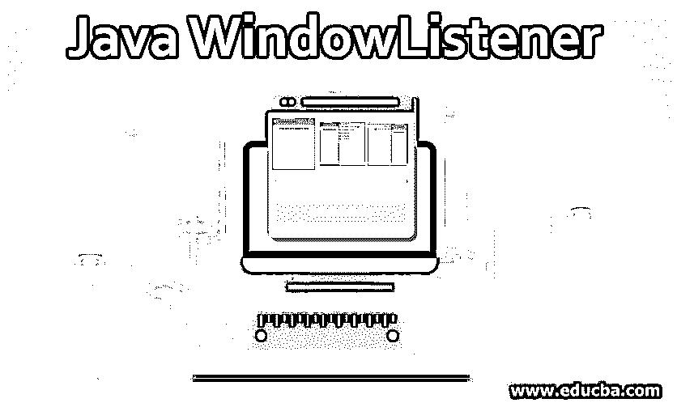
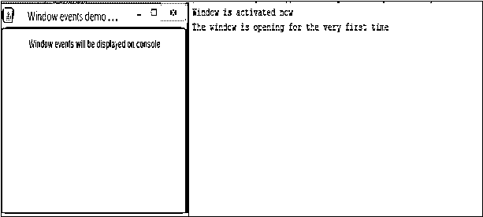
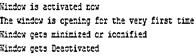
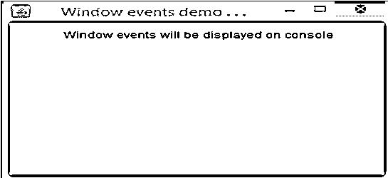

# Java 窗口监听器

> 原文：<https://www.educba.com/java-windowlistener/>




## Java 窗口监听器简介

在 Java 中，当窗口状态发生变化时，WindowListener 类会得到通知。窗口状态可以是关闭、激活或停用窗口。WindowListener 在 implements 关键字的帮助下工作，这个接口可以从 java.awt.event 包中获得

可以使用以下语法声明 Java WindowListener 接口:

<small>网页开发、编程语言、软件测试&其他</small>

```
Public interface WindowListener extends EventListener
```

### Java WindowListener 方法

以下是 Java WindowListener 中常用的方法。

*   **window activated****(window event ev):**当窗口设置为活动时，将调用该方法。
*   **window dei confined****(window event ev):**当窗口大小从最小到正常状态发生变化时，将调用该方法。
*   **window closing(window event ev):**当用户试图使用窗口中的系统菜单关闭窗口时，将调用该方法。
*   **window closed****(window event ev):**当窗口因调用窗口中的 disposing 而关闭时，将调用该方法。
*   **window deactivated****(window event ev):**当窗口不再活动时，将调用该方法。
*   **window opened****(window event e):**当一个窗口第一次可见时，这个方法会被调用。
*   **window icon ified****(window event e):**当窗口大小从正常变为小状态时，将调用该方法。

### Java WindowListener 是如何工作的？

以下是 java 窗口监听器的一些工作方式，解释如下:

*   当有一个类必须处理某些窗口事件时，该类中应该有一个对象来帮助实现接口。
*   因为对象已经注册到侦听器中，所以在窗口的关闭、激活、图标化、取消激活、取消确认状态时将会生成一个事件。
*   这将有助于调用监听器对象中的相关方法。
*   调用后，WindowEvent 被传递给它。

### 实现 Java WindowListener 的示例

以下是一些例子:

#### 示例#1

这个 Java 程序演示了 WindowListener，在某些窗口事件中文本显示在控制台上。

**代码:**

```
//Java program to demonstrate the WindowListener with texts displaying on console on certain window events
import java.awt.FlowLayout;
import java.awt.Frame;
import java.awt.Label;
import java.awt.event.WindowEvent;
import java.awt.event.WindowListener;
//class that implements the WindowListener interface
public class JWindowListenerExample implements WindowListener
{
//create a label
Label lbl1;
//create frame
Frame fr;
JWindowListenerExample()
{
fr = new Frame("Window events demo . . .");
lbl1= new Label(" Window events will be displayed on console", Label.CENTER);
//set the layout
fr.setLayout(new FlowLayout());
//add the label to the frame
fr.add(lbl1);
//In order to catch as well as respond to the mouse events, register the created class JWindowListenerExample
fr.addWindowListener(this);
//set the size of frame where width is 350 and height as 250
fr.setSize(350,250);
//set the visibility as true
fr.setVisible(true);
}
//implementation of windowActivated method
public void windowActivated(WindowEvent ev)
{
System.out.println("Window is activated now");
}
//implementation of windowClosed method
public void windowClosed(WindowEvent ev)
{
System.out.println("Now, the window is closed");
}
//implementation of windowClosing method
public void windowClosing(WindowEvent ev)
{
//release all the resources
fr.dispose();
System.out.println("Window is closing now");
}
//implementation of windowDeactivated method
public void windowDeactivated(WindowEvent ev)
{
System.out.println("Window gets Deactivated");
}
//implementation of windowDeiconified method
public void windowDeiconified(WindowEvent ev)
{
System.out.println("Window gets Deiconified");
}
//implementation of windowIconified method
public void windowIconified(WindowEvent ev)
{
System.out.println("Window gets minimized or iconified");
}
//implementation of windowOpened method
public void windowOpened(WindowEvent e)
{
System.out.println("The window is opening for the very first time");
}
//main method
public static void main(String... ar)
{
new JWindowListenerExample();
}
}
```

**输出:**

执行代码时，会出现一个带有标签的窗口。根据窗口中发生的事件，某些文本也会显示在控制台中。首先，让我们看看执行代码后立即出现的窗口。




可以看到，窗口是第一次被激活和打开的。如果窗口被最小化，控制台将显示一个文本，提示窗口被最小化并被禁用。




同时，如果窗口被取消确认，文本将显示窗口被取消确认并被激活。


此外，如果窗口是关闭的，文本将显示窗口正在关闭和停用。


#### 实施例 2

这个 Java 程序演示了 WindowListener，在窗口事件的控制台上没有任何文本。

**代码:**

```
//Java program to demonstrate the WindowListener without any texts on console on window events
import java.awt.FlowLayout;
import java.awt.Frame;
import java.awt.Label;
import java.awt.event.WindowEvent;
import java.awt.event.WindowListener;
//class that implements the WindowListener interface
public class JWindowListenerExample implements WindowListener
{
//create a label
Label lbl1;
//create frame
Frame fr;
JWindowListenerExample()
{
fr = new Frame("Window events demo . . .");
lbl1= new Label(" Window events will be displayed on console", Label.CENTER);
//set the layout
fr.setLayout(new FlowLayout());
//add the label to the frame
fr.add(lbl1);
//In order to catch as well as respond to the mouse events, register the created class JWindowListenerExample
fr.addWindowListener(this);
//set the size of frame where width is 350 and height as 250
fr.setSize(350,250);
//set the visibility as true
fr.setVisible(true);
}
//implementation of windowActivated method
public void windowActivated(WindowEvent ev)
{
}
//implementation of windowClosed method
public void windowClosed(WindowEvent ev)
{
}
//implementation of windowClosing method
public void windowClosing(WindowEvent ev)
{
fr.dispose();
}
//implementation of windowDeactivated method
public void windowDeactivated(WindowEvent ev)
{
}
//implementation of windowDeiconified method
public void windowDeiconified(WindowEvent ev)
{
}
//implementation of windowIconified method
public void windowIconified(WindowEvent ev)
{
}
//implementation of windowOpened method
public void windowOpened(WindowEvent e)
{
}
//main method
public static void main(String... ar)
{
new JWindowListenerExample();
}
}
```

**输出:**




可以看到，在执行代码时会出现一个窗口。然而，与程序 1 不同，在窗口事件期间，文本不会显示在控制台上。

### 结论

当窗口状态发生变化时，如关闭、激活或停用窗口，这个类会得到通知。更多细节，如声明、方法、工作和该接口的实现将在本文档中详细讨论。

### 推荐文章

这是一个 Java WindowListener 的指南。在这里，我们讨论 Java WindowListener 的语法、方法和工作方式，以及示例和代码实现。您也可以阅读以下文章，了解更多信息——

1.  [Java 中的静态构造函数](https://www.educba.com/static-constructor-in-java/)
2.  [Java 流过滤器](https://www.educba.com/java-stream-filter/)
3.  [Java BufferedInputStream](https://www.educba.com/java-bufferedinputstream/)
4.  [Java 瞬态](https://www.educba.com/java-transient/)


