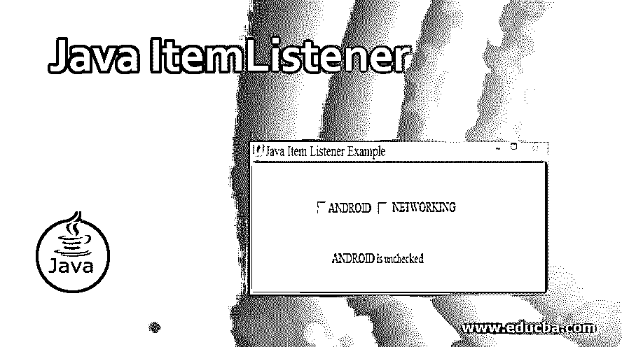
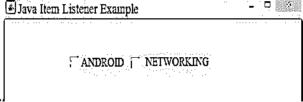
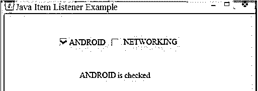
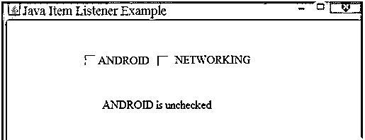
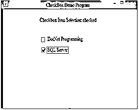
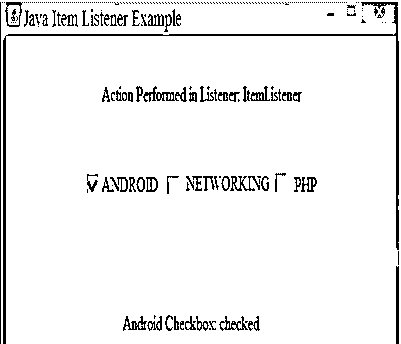

# Java ItemListener

> 原文：<https://www.educba.com/java-itemlistener/>




## Java 项目监听器简介

ItemListener 主要用于项目选择，是一个监听项目事件的接口。接口 ItemListener 主要管理一个或几个项目的开或关状态。Java ItemListener 通知对复选框的每一次点击，并让您了解 ItemEvent。在 java.awt.event 中找到了用于 ItemListener 的包。ItemListener 使用的方法是 ItemStateChanged()和 getState()。

### ItemListener 接口中使用的方法

下面给出了 itemlistener 接口中使用的方法:

<small>网页开发、编程语言、软件测试&其他</small>

*   **itemStateChanged(item event e):**itemStateChanged(item event e)方法仅在用户注册的 checkbox 组件上的项目被选中或未选中时调用。
*   **getState():**getState()方法是 checkbox 类的预定义方法，通过使用这个 getState()方法我们可以检查 checkbox 是否被选中。当复选框被选中时，它返回结果为 true，返回 false。
*   Java ItemListener 将使用 itemStateChanged()方法；该方法将在每次选中/取消选中时调用注册的复选框组件，语法如下:
*   **void****itemStateChanged(item event e):**只有当一个项目被用户点击或取消点击时才触发的方法。

### Java ItemListener 是如何工作的？

它通过如下设置其方法的实现来实现一个名为 ItemListener 的接口，

**ItemStateChanged(item event e)**:只有当用户选择或取消选择某个项目时，才会调用该方法。ItemEvent 甚至可以是一个复选框，也可以是一个列表，事件源将通过 addItemListener(ItemListener e)调用它的方法，其中由它的接口实现的类的对象称为 ItemListener，每当在特定源上单击它注册的类对应于 ItemEvent。AWT 包被导入来为程序提供 GUI(图形用户界面)。ItemEvent 类有几个方法:public **Object getItem()** :当它被触发或点击 ItemEvent 时返回项目。

*   **public items selectable getItemSelectable()**:点击某项时返回。
*   **public int getStateChange():**返回被点击项目的当前/最新状态。

让我们看看使用接口 ItemListener 处理 ItemEvent 的示例；在下面的代码中，我们通过实现接口 ItemListener 来创建监听 ItemEvent 的类。当点击“选中/取消选中”时，将生成 ItemEvent。

**代码:**

```
import java.awt.*;
import java.awt.event.*;
public class ItemListenerDemo implements ItemListener
{
Frame jFrame;
Checkbox chkBox1, chkBox2;
Label label_11;
ItemListenerDemo()
{
jFrame= new Frame("Java Item Listener Example");
chkBox1 = new Checkbox("ANDROID");
chkBox2 = new Checkbox("NETWORKING");
label_11 = new Label();
jFrame.add(chkBox1);
jFrame.add(chkBox2);
chkBox1.addItemListener(this);
chkBox2.addItemListener(this);
jFrame.setLayout(new FlowLayout());
jFrame.setSize(220,150);
jFrame.setVisible(true);
}
public void itemStateChanged(ItemEvent ie)
{
Checkbox ch =(Checkbox)ie.getItemSelectable();
if(ch.getState()==true)
{
label_11.setText(ch.getLabel ()+ " is checked");
jFrame.add(label_11);
jFrame.setVisible(true);
}
else
{
label_11.setText(ch.getLabel ()+ " is unchecked");
jFrame.add(label_11);
jFrame.setVisible(true);
}
}
public static void main(String... ar)
{
new ItemListenerDemo();
}
}
```

**输出:**




当您选择一个事件复选框时，将调用 ItemEvent，并且您会得到一条显示消息，其中显示该复选框被选中或取消选中。例如，当您选择标签为“ANDROID”的复选框时，您将收到“ANDROID 已检查”的消息。




当您取消选择该复选框时，ItemEvent 将被调用，您将收到通知消息，其名称为“ANDROID is unchecked”。




### 实现 Java ItemListener 的示例

ItemListener 接口具有在 ItemEvent 实现下处理的类。当事件发生时，将调用名为 itemStateChanged()的方法。类对象将由 addItemListener()方法注册，该方法使用组件注册。ItemListener 主要用于项目选择，它是一个监听项目事件的接口。总的来说，接口 ItemListener 管理一个或几个项目的开或关状态。Java ItemListener 让您知道对复选框的每一次点击，并让您知道 ItemEvent。在 java.awt.event 中找到了用于 ItemListener 的包。ItemListener 使用的方法是 ItemStateChanged()，只有当用户在已注册的 checkbox 组件上选中或取消选中该项时，才会调用该方法。

#### 示例#1

**代码:**

```
import java.awt.*;
import java.awt.event.*;
public class ItemListener_Example implements ItemListener{
Checkbox checkbox_1,checkbox_2;
Label  label_1;
ItemListenerExample(){
Frame f= new Frame("CheckBox Demo Program");
label_1 = new Label ();
label_1.setAlignment(label_1.CENTER);
label_1.setSize(400,100);
checkbox_1 = new Checkbox("DotNet Programming");
checkbox_1.setBounds(100,100, 50,50);
checkbox_2= new Checkbox("SQL Server");
checkbox_2.setBounds(100,150, 50,50);
f.add(checkbox_1);
f.add(checkbox_2);
f.add(label_1);
checkbox_1.addItemListener(this);
checkbox_2.addItemListener(this);
f.setSize(400,400);
f.setLayout(null);
f.setVisible(true);
}        public void itemStateChanged(ItemEvent e) {
if(e.getSource()==checkbox_1)
label_1.setText("Checkbox: "
+ (e.getStateChange()==1?"checked":"unchecked"));
if(e.getSource()==checkbox_2)
label_1.setText("Checkbox Item Selection: "            + (e.getStateChange()==1?"checked":"unchecked"));
}
public static void main(String args[])
{
new ItemListener_Example();
}
}
```

当执行代码时，您将获得如下所示的输出，调用 checkbox ItemEvent，并且您将获得一条显示消息，其中 checkbox 被选中或取消选中。例如，当您选中复选框时，您将获得“已选中”的消息。

**输出:**




#### 实施例 2

**代码:**

```
import java.awt.*;
import java.awt.event.*;
public class JavaItemListenerDemo {
private Frame mainFrame_1;
private Label headerLabel_1;
private Label statusLabel_1;
private Panel controlPanel_1;
public JavaItemListenerDemo()
{
organizeGUI();
}
public static void main(String[] args){
JavaItemListenerDemo itemListenerDemo  = new JavaItemListenerDemo();
itemListenerDemo .showItemListener();
}
private void organizeGUI(){
mainFrame_1 = new Frame("Java Item Listener Example");
mainFrame_1.setSize(400,400);
mainFrame_1.setLayout(new GridLayout(3, 1));
mainFrame_1.addWindowListener(new WindowAdapter() {
public void windowClosing(WindowEvent windowEvent){
System.exit(0);
}
});
headerLabel_1 = new Label();
headerLabel_1.setAlignment(Label.CENTER);
statusLabel_1 = new Label();
statusLabel_1.setAlignment(Label.CENTER);
statusLabel_1.setSize(350,100);
controlPanel_1 = new Panel();
controlPanel_1.setLayout(new FlowLayout());
mainFrame_1.add(headerLabel_1);
mainFrame_1.add(controlPanel_1);
mainFrame_1.add(statusLabel_1);
mainFrame_1.setVisible(true);    }
private void showItemListener(){
headerLabel_1.setText("Action Performed in Listener: ItemListener");
Checkbox chkAndroid = new Checkbox("ANDROID");
Checkbox chkNet = new Checkbox("NETWORKING");
Checkbox chkPhp = new Checkbox("PHP");
chkAndroid.addItemListener(new CustomItemListener());
chkNet.addItemListener(new CustomItemListener());
chkPhp.addItemListener(new CustomItemListener());
controlPanel_1.add(chkAndroid);
controlPanel_1.add(chkNet);
controlPanel_1.add(chkPhp);
mainFrame_1.setVisible(true);
}
class CustomItemListener implements ItemListener {
public void itemStateChanged(ItemEvent e) {
statusLabel_1.setText(e.getItem()
+" Checkbox: "          + (e.getStateChange()==1?"checked":"unchecked"));
}
}
}
```

**输出:**




### 推荐文章

这是 Java ItemListener 的指南。这里我们也讨论一下 java 项目监听器的简介和工作原理？以及不同的示例及其代码实现。您也可以看看以下文章，了解更多信息–

1.  [Java 中的 JComboBox](https://www.educba.com/jcombobox-in-java/)
2.  [Java 中的线程组](https://www.educba.com/threadgroup-in-java/)
3.  [Java BufferedWriter](https://www.educba.com/java-bufferedwriter/)
4.  [Java OutputStreamWriter](https://www.educba.com/java-outputstreamwriter/)


