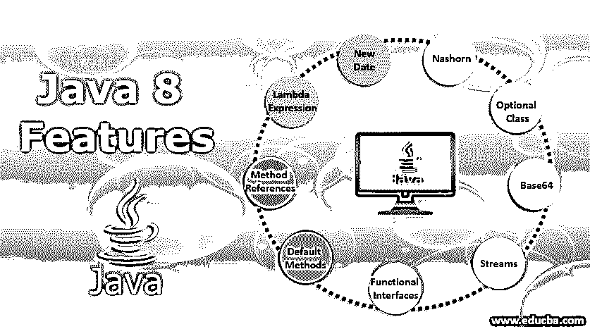

# Java 8 特性

> 原文：<https://www.educba.com/java-8-features/>

## Java 8 简介

甲骨文于 2014 年 3 月 18 日发布了 Java 的新版本。这被称为 Java 8，被吹捧为具有许多新的和有用的特性的里程碑式的发布。继续阅读，了解 Java 8 的特性。它包括新的功能、升级和错误修复，以提高设计和操作 Java 程序的效率。

### Java 8 的主要特性

以下是 Java 8 的主要特性，这些特性使 Java 8 更容易理解，也更有用:

<small>网页开发、编程语言、软件测试&其他</small>

#### 1.新日期/时间 API

旧的 Java 日期时间 API 有很大的缺点。取而代之的是 Java 8 中新的日期时间 API。我们来看看下面的缺点:

*   难以处理时区问题:程序员需要许多行代码来处理时区问题。
*   **低质量 De **sign** :** 早期的 API 对日期操作的直接函数相对较少。Java 8 API 为日期操作提供了许多函数。
*   **缺少线程安全属性** : java.util.date 缺少线程安全属性。因此程序员在使用数据时不得不面对并发问题。Java 8 日期时间 API 是不可变的，没有 setter 方法。

在 Java 8 中，java.time 包中包含了一个新的日期时间 API。时间包。

*   **Zoned:** 处理不同时区的专用 API。
*   **Local** :简化的 API，没有处理时区的复杂性。

#### 2.Nashorn JavaScript

Java 的早期版本包含 Rhino JavaScript 引擎。在 Java 8 中，Rhino 被一个更高级的 JavaScript 引擎 Nashorn 所取代。当与它的前身进行基准测试时，后者提供了 2 到 10 倍的优越性能。这是可能的，因为它直接编译内存中的代码行，然后将字节码传递给 Java 虚拟机。为了提高性能，Nashorn 采用了 Java 7 的 invoke dynamics [特性。](https://www.educba.com/java-7-features/)

#### 3.选修课

简单地说，可选的是用来存储非空对象的容器对象。可选对象的一个主要用途是表示没有值的 null。这个重要的类有不同的实用方法来帮助代码处理“不可用”或“可用”的值，而不是检查空值。这个类是在 Java 8 中添加的，类似于 Guava 中的可选类。

#### 4.Base64

新版本的 Java 包含一个内置的编码器和一个用于 Base64 编码的解码器。程序员可以使用 3 种 Base64 编码。

*   **MIME** :完成输出到 MIME 格式的映射。输出以每行不超过 76 个字符的形式表示。行分隔符是一个回车符，后跟一个换行符。编码输出的结尾没有行分隔符。
*   **URL** :输出映射到 A-Za-z0-9+_ 中的一组字符。输出是文件名和 URL 安全。
*   **简单的**:输出映射到 A-Za-z0-9+_ 中的一组字符。编码器不会在输出中添加任何换行。解码器接受任何不同于 A-Za-z0-9+_ 的字符。

#### 5.流

流是 Java 新版本中出现的一个新的抽象层。通过使用 stream，可以以类似于 SQL 语句的声明性方式处理数据。

理解流

简单地说，流是从支持聚合操作的源发出的一系列对象的表示。以下是流的某些属性。

*   **迭代是自动的:**显式迭代在集合中是强制的。而在流中，迭代是在内部对提供的源元素进行的。
*   **流水线:**流操作的大部分输出是流类型的。因此，输出可以是流水线的。特定的操作被称为中间操作。它们接受输入，进行必要的处理，然后将输出提供给目标。

**流支持的一些聚合操作:**

*   比赛
*   发现
*   减少
*   限制
*   地图
*   过滤器

#### 6.功能界面

它们显示各自的功能。新版本的 Java 有许多[函数接口](https://www.educba.com/functional-interface-in-java/)，它们可以在 lambda 表达式中大量使用。

#### 7.默认方法

在 Java 8 中，有一个新的具有默认方法实现的接口范例。包含该功能是为了向后兼容。现在可以使用旧的接口来利用新版本 Java 的 lambda 表达式功能。

*   **例如:**“集合”和“列表”接口缺少“forEach”方法声明。如果添加这样的方法，集合框架的实现将会被破坏。现在，引入了默认方法，使得 List/Collection 包含 forEach 方法的默认实现。现在，各个方法不必由实现这些特定接口的类来实现。

#### 8.方法引用

Java 8 使用的这个主要特点就是用各自的名字指向相关的方法。“::”符号描述方法引用。后者可以用来指下面提到的方法

*   使用新运算符的构造函数
*   实例方法
*   静态方法

#### 9.λ表达式

这些被认为是新版 Java 最重要也是最有意义的特性。前者让[函数编程](https://www.educba.com/functional-programming-in-java/)变得简单方便。此外，Lambda 表达式在很大程度上简化了编程。

下面是一个典型的 lambda 表达式。

**参数- >表达式体**

我们来看看 lambda 表达式的主要部分。

*   **Return 关键字:**如果主体包含单个表达式，则由编译器返回该值。花括号表示表达式返回某个值。
*   **参数周围的括号:**如果只有一个参数，括号可以省略。
*   **类型声明:**不需要参数类型声明。从参数的值，编译器确定必要的行动。

**Java 8 的其他特性:** JDBC-ODBC 桥已经关闭。所以。一直是 PermGen 内存空间。“jjs”命令调用 Nashorn 引擎，而“jdeps”命令分析类文件。

### 结论

现在，您已经对 Java 8 的新特性有了理论上的了解，有必要将它们付诸实践。换句话说，您必须编写代码，利用新版本 Java 的许多有用和有价值的特性。只有这样，你才会真正精通 Java 8。

### 推荐文章

这是 Java 8 特性的指南。这里我们讨论基本概念，Java 8 中的 9 大特性，为了更好的理解，我们还做了简单的解释。您也可以浏览我们的其他相关文章，了解更多信息——

1.  Java 8 有什么新特性？
2.  [如何安装 Java 8](https://www.educba.com/install-java-8/)
3.  [Java 中的数字模式](https://www.educba.com/number-patterns-in-java/)
4.  [Java 8 中的可选类](https://www.educba.com/optional-class-in-java-8/)

