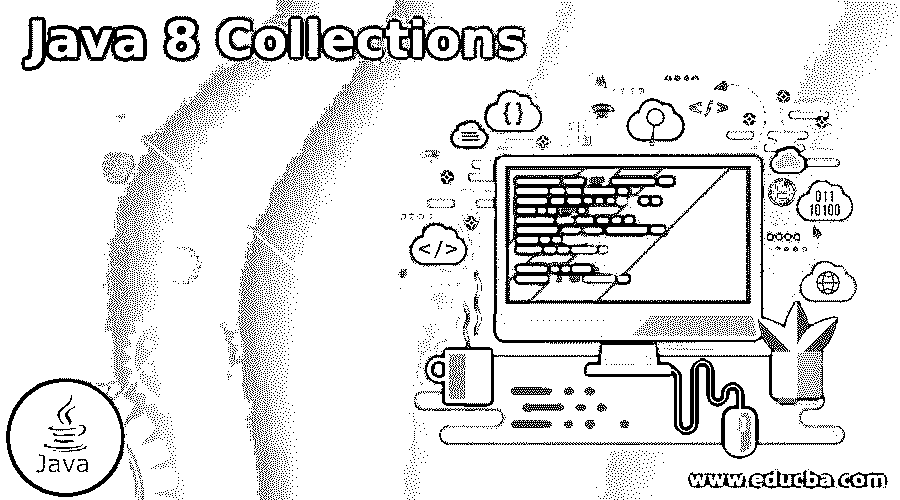

# Java 8 集合

> 原文：<https://www.educba.com/java-8-collections/>




## Java 8 集合简介

基本上，Java 8 向用户提供了框架的不同种类的接口，其中该集合是 Java 提供的接口之一。通常一个集合是一个框架的根接口，它提供了不同类型的类，通过使用这个集合，我们可以将一组对象表示为一个单独的单元。基本上，java 8 向用户发布了几种不同的特性。它用于根据用户需求进行函数式编程、JavaScript 和 API 操作。与其他框架相比，集合是一种易于编程的框架。

### 什么是 Java 8 集合？

Java 8 中的集合给出了存储和控制项目、接口和类的集合的设计。这个 java 分类是一个结构。这种结构有一些有用的能力，这些能力具有大量有价值的能力，使得软件工程师的任务非常简单。

<small>网页开发、编程语言、软件测试&其他</small>

这个系统提供了许多接口(Queue、Set、List、Deque)和类(PriorityQueue、HashSet、ArrayList、Vector、LinkedList、LinkedHashSet)。

1.  集合结构是一种集合设计，用于存放和控制项目集合。
2.  产品组合结构旨在满足几个目标，例如
3.  结构必须是精英，并调整简单的战略分类。
4.  关键品种的执行是非常有效的。
5.  这种结构需要允许不同种类的产品同样工作。
6.  毫无疑问，需要扩展和调整产品组合的结构。

### Java 8 集合框架有什么用？

现在让我们看看为什么我们需要使用 Java 8 集合框架，如下所示。

假设，一个变量用来存储信息，一个值为 15 的变量被降级(例如，int X =15)。目前，开发人员需要再存储一条等效数据类型的信息。因此，开发人员需要创建另一个变量并分配另一个值(例如，int Y= 25)。

假设开发人员需要存储 150 个质量，那么这样做的缺点是软件工程师需要用一个特殊的名称来制作各种因素，这也是非常繁琐的。

针对这种情况，提出了一个展览的想法。开发人员声明一个具有明确大小和存储组件的集群。

所有预定义的执行都可以在 Collectors 类中找到。通常的做法是利用附带的静态导入来使用扩展的一致性:

`import static java.util.stream.Collectors.*;`

根据我们的要求，我们可以如下导入单个收集器。

将静态 Java . util . stream . collectors . to list 导入；
导入静态 Java . util . stream . collectors . tomap；
导入静态 Java . util . stream . collectors . toset；

现在让我们来看看不同的收集方法，如下所示。

**Collectors.toList()**

toList 权限可用于将所有流组件收集到一个列表事件中。要记住的重要一点是，我们不能接受使用这种策略的特定列表执行。假设我们需要更多的力量来控制它，我们可以利用它来收集所有考虑过的东西。

我们制作一个针对一组组件的流事件，然后将它们收集到一个事件列表中，如何？

```
List<String> specified name = provided_list_name.stream() .collect(toList());
```

**Collectors.toSet()**

Collectors toSet()返回一个收集器，它将信息组件聚合到另一个集合中。没有关于返回集的种类、可更改性、可序列化性或字符串安全性的认证。这是一个无序的收集器，即分类活动不关注保存信息组件的体验请求。

**例子**

```
import java.util.Set;
import java.util.stream.Collectors;
import java.util.stream.Stream;
class sample {
public static void main(String[] args)
{
Stream<String> s_obj = Stream.of("Welcome",
"In",
"Java 8",
"Collection");
Set<String> Set_obj = s_obj.collect(Collectors.toSet());
System.out.println(Set_obj);
}
}
```

**解释**

在上面的例子中，我们尝试实现 Collectors.toSet()。上面代码的最终输出用下面的截图来说明。


**collectors . to collection()**

利用 Java 中的 collectors to Collection(Supplier<c>Collection factory)技术来制作利用 Collector 的集合。它返回一个收集器，该收集器将信息组件聚合到另一个集合中，在请求中传递这些组件。</c>

**例子**

现在让我们看看 Collectors.toCollection()方法的例子，以便更好地理解。

```
import java.util.*;
import java.util.stream.Collectors;
import java.util.stream.Stream;
class Main{
public static void main(String[] args)
{
Stream<String> s_obj = Stream.of("Welcome", "In", "Java 8", "Collection");
Collection<String> c_obj= s_obj.collect(Collectors.toCollection(TreeSet::new));
System.out.println(c_obj);
}
}
```

**解释**

在上面的代码中，我们尝试实现 Collectors.toCollection()。上面代码的最终输出用下面的截图来说明。


**Collectors.toMap()**

toMap 收集器可用于将流组件收集到一个地图事件中。为此，我们需要提供两种能力:

按键映射器

值映射器

我们将利用 keyMapper 从流组件中移除一个映射键，并利用 valueMapper 释放一个与给定键相关的值。

我们应该将这些组件收集到一个映射中，将字符串存储为键，将它们的长度存储为质量。toMap()技术是 Collectors 类的静态策略，它返回一个收集器，该收集器将组件聚集到一个映射中，映射的键和值是将给定的规划容量应用到信息组件的结果。请注意，密钥非常重要，假设无论密钥是否被复制，在执行分类活动时都会抛出 IllegalStateException。

```
import java.util.stream.Collectors;
import java.util.stream.Stream;
import java.util.*;
public class Main {
public static void main(String[] args)
{
Stream<String[]>
S_obj = Stream.of(new String[][] { { "Hi", "Welcome" },
{"C", "collection" },
{ "J", "Java" } });
Map<String, String>
map_obj = S_obj.collect(
Collectors.toMap(a -> a[0], a -> a[1]));
System.out.println("Map:" + map_obj);
}
}
```

**解释**

在上面的代码中，我们尝试实现 Collectors.toMap()。上面代码的最终输出用下面的截图来说明。


**collectors . collecting andthen()**

Java 中类权限的 collecting andthen(Collector downstream，Function finisher)技术，它包含了 Collector，因此我们可以完成额外的修改。

```
import java.util.Collections;
import java.util.List;
import java.util.stream.Collectors;
import java.util.stream.Stream;
public class sample {
public static void main(String[] args)
{
List<String> l_obj
= Stream
.of("Hi", "Welcome", "Collection")
.collect(Collectors
.collectingAndThen(
Collectors.toList(),
Collections::<String> unmodifiableList));
System.out.println(l_obj);
}
}
```

**解释**

在上面的代码中，我们尝试实现 Collectors.collectingAndThen()。上面代码的最终输出用下面的截图来说明。


### 结论

我们希望通过这篇文章，您能够了解更多关于 java 8 集合的知识。从上面的文章中，我们已经理解了 java 8 集合的基本思想，我们还看到了 java 8 集合的表示和例子。从本文中，我们了解了如何以及何时使用 java 8 集合。

### 推荐文章

这是一个 Java 8 集合的指南。这里我们讨论了 java 8 集合的基本思想，我们也看到了它的表示。您也可以看看以下文章，了解更多信息–

1.  [settimeout Java](https://www.educba.com/settimeout-java/)
2.  [Java 中的数据结构](https://www.educba.com/data-structures-in-java/)
3.  [Java 中的国际化](https://www.educba.com/internationalization-in-java/)
4.  [Java 中的 Volatile 关键字](https://www.educba.com/volatile-keyword-in-java/)


