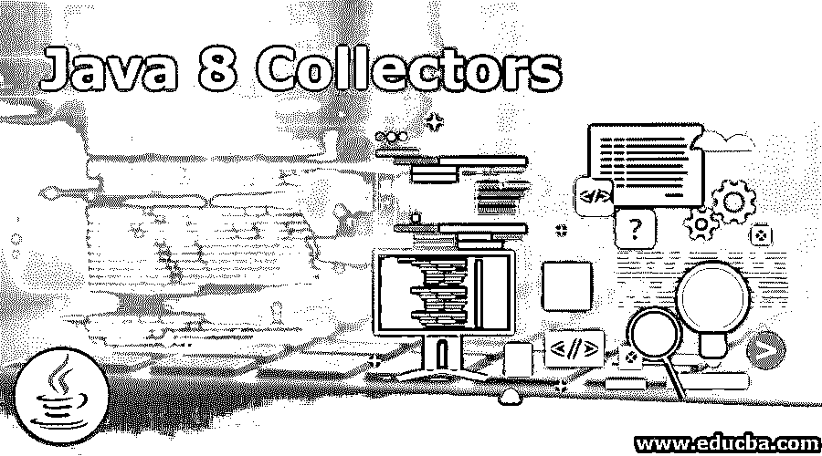

# Java 8 收集器

> 原文：<https://www.educba.com/java-8-collectors/>

## Java 8 收集器简介

由 object 类扩展的最后一个类是 collectors，它提供了关于归约的操作，比如将元素累积到集合中，基于不同的标准对元素进行汇总，等等。通过使用 Java collectors 类中可用的方法来处理元素，该类是由许多静态方法组成的实用程序类 java.util.stream 包的成员。

**声明 Java 收集器的语法如下:**

<small>网页开发、编程语言、软件测试&其他</small>

`Interface collector <T,A,R>`

在哪里，

*   t 表示要对其执行归约操作的输入元素类型。
*   指示归约操作的累加类型，它是可变的。
*   r 表示归约类型的结果。

**导入 java 收集器的语法如下:**

导入静态 Java . util . stream . collectors . *；

**有不同类型的收集器，导入不同类型收集器的语法如下:**

*   将静态 Java . util . stream . collectors . to list 导入。
*   导入静态 Java . util . stream . collectors . tomap。
*   导入静态 Java . util . stream . collectors . toset。

### 在 Java 8 中使用收集器

java.util.stream.collectors 类提供了 37 个不同的收集器，这些收集器进一步分为三组，即:

*   减少或汇总了单个值或集合类型。
*   Joining()方法可用于连接字符串，使用 toset()可创建新集合，使用 summary gint()可利用数字流汇总等新功能。
*   分组:GroupingBy()方法可以以三种不同的方式使用，并行或并发处理使用另外三种。
*   分区。

像 partitionBy()这样的方法有两种。如果我们需要独特的处理，我们可以创建自己的收集器。对所提供的收集器没有任何限制。

接口收集器<t a="" r="">由每个收集器实现，</t>

*   t 表示要对其执行归约操作的输入元素类型。
*   指示归约操作的累加类型，它是可变的。
*   r 表示归约类型的结果。

### Java 8 收集器的方法

收集器支持的方法有:

*   **Supplier():** 使用 Supplier()方法提供的 supplier < A >创建累加器对象的新实例。
*   **Combiner():** 当并行处理流时，收集器会创建累加器的多个对象，可以使用 Combiner()方法提供的功能合并这些对象。
*   **Finisher():** 在结束收集过程时，accumulator 对象到返回类型 R 的转换由这个 Finisher()方法完成。
*   **特性():**采集器的特性用这个特性()方法描述。

### 收集器的特征

可以通过使用收集器的特性来优化归约操作的实现。这三个特征的组合可能如下:

**1。collector . characters . concurrent**

这用于指示累加器对象支持的并行或并发处理。

**2。collector . characters . identity _ FINISH**

finisher 函数被表示为 identity 函数，以便累加器直接转换为结果类型。

**3。collector . characters . unordered**

这用于指示流中不需要保留的元素的顺序。

**Java 8 收集器支持几种方法，它们是:**

*   公共静态<t>收集器<t double="">平均双精度(到双功能 Super T>映射器)</t></t>

收集器使用此方法生成一个双值函数，其算术平均值应用于输入元素。如果没有元素，结果为零。

*   公共静态<t>收集器<t t="">还原(T 标识，二元运算器 <t>op)</t></t></t>

输入元素的减少是通过使用此方法返回的收集器来执行的，它位于使用给定标识的指定二元运算符下。

*   公共静态<t>收集器<t optional="">还原(二元运算器< T> op)</t></t>

输入元素的减少是由使用此方法返回的收集器在某个二元运算符下执行的。可选的<t>描述结果。</t>

*   公共静态<t>收集器<t>归约(U 标识，函数 Super T,? extends U>映射器，二元运算符 <u>op)</u></t></t>

输入元素的归约是使用收集器执行的，该收集器由该方法在某个二元运算符和映射函数下返回，该映射函数只是归约(Object，binary operator)的一般化，允许在归约之前转换元素。

*   公共静态<t>收集器<t map="" list="">> >分组方式(函数 Super T,? extends K>分类器)</t></t>

返回一个收集器，该收集器对类型为 t 的输入元素执行 group by 操作，根据分类函数对元素进行分组，并在映射中返回结果。

*   公共静态<t d="">收集器< T,?,Map< K,D>>分组 By(功能 Super T,? extends K>分类器，下游收集器 Super T,A, D></t>

对类型 T 的输入元素执行级联分组操作，并且基于由使用该方法返回的收集器实现的分类函数对元素进行分组，并且使用下游收集器对具有与给定值相关联的特定关键字的值执行归约操作。

*   公共静态<t a="" mextendsmap="" k="">>采集器< T,?,M>分组 by(功能 Super T,? extends K>分类器，供应商< M>地图工厂，采集器 Super T,A,D>下游)</t>

对类型 T 的输入元素执行级联分组操作，并且基于由使用该方法返回的收集器实现的分类函数对元素进行分组，并且使用下游收集器对具有与给定值相关联的特定关键字的值执行归约操作。提供的工厂函数用于创建收集器生成的地图。

*   公共静态< T,K>收集器< T,?,ConcurrentMap< K,List< T>> >分组并发(函数 Super T,? extends K>分类器)

返回一个收集器，它对类型为 t 的输入元素执行 group by 操作，这些元素基于分类函数进行分组。

*   公共静态< T,K,A,D>收集器<t concurrentmap="" k="">>分组并行(功能 Super T,? extends K>分类器，收集器 Super T,A,D>下游)</t>

对类型 T 的输入元素执行级联分组操作，并且基于由使用该方法返回的收集器实现的分类函数对元素进行分组，并且使用下游收集器对具有与给定值相关联的特定关键字的值执行归约操作。

*   公共静态< T,K, A,D,M extends ConcurrentMap< K,D>>收集器<t>分组并发(功能 Super T,? extends K>分类器，供应商< M>映射工厂，收集器下游)</t>

返回并行收集器，其在输入元素上实现级联分组操作，根据分类函数对元素进行分组，并且使用与给定关键字相关联的下游收集器对值执行归约操作。提供的工厂函数创建由收集器生成的并发映射。

*   公共静态< T>收集器< T,?,Map<boolean t="">> >分区依据(谓词 Super T>谓词)</boolean>

返回一个收集器，使用它按照谓词对输入元素进行划分，然后组织成 Map < Boolean, List< T>>不能保证映射的类型、可变性、可串行化、线程安全性。

*   公共静态<t>收集器<t boolean="">>分区依据(谓词 Super T>谓词，收集器 Super T,A,D>下游)</t></t>

返回一个收集器，使用该收集器按照谓词对输入元素进行分区，每个分区的值根据另一个收集器进行缩减，然后组织成一个映射<boolean d="">，它是下游缩减的结果。</boolean>

*   公共静态<t>收集器 <t>> toMap(函数 Super T,? extends K>键映射器，函数 Super T,? extends U>值映射器)</t></t>

返回一个收集器，将元素累积到一个映射中，并将映射函数应用于输入元素会产生键和值。

*   公共静态<t>收集器 <t>> toMap(函数 Super T,? extends K>键映射器，函数 Super T,? extends U>值映射器，二元运算符< U>合并函数)</t></t>

返回一个收集器，将元素累积到一个映射中，并将映射函数应用于输入元素会产生键和值。

*   公共静态< T,K, U,MextendsMap< K,U>收集器< T,?, M> toMap(函数 super T,? extends K>键映射器，函数 super T,? extends U>值映射器，二元运算符< U>合并函数，供应商<m>映射供应商)</m>

返回一个收集器，将元素累积到一个映射中，并将映射函数应用于输入元素会产生键和值。

*   公共静态< T,K,U>收集器<t concurrentmap="" k="">>到当前映射(函数 super T,? extends K>键映射器，函数 super T,? extends U>值映射器)</t>

返回一个并发收集器，将元素累积到一个 ConcurrentMap 中，并将映射函数应用于输入元素会产生键和值。

*   public static< T,K,U>Collector< T,?,ConcurrentMap<k>> to concurrent map(函数 super T,? extends K> keyMapper，函数 super T,? extends U> valueMapper，二进制运算符< U> mergeFunction)</k>

返回一个并发收集器，将元素累积到一个 ConcurrentMap 中，并将映射函数应用于输入元素会产生键和值。

*   public static<t extends="" concurrentmap="" k="">> Collector<t>to concurrent map(函数 super T,? extends K> keyMapper，函数 super T,? extends U> valueMapper，二元运算符 <u>mergeFunction，供应商< M> mapSupplier)</u></t></t>

返回一个并发收集器，将元素累积到一个 ConcurrentMap 中，并将映射函数应用于输入元素会产生键和值。

*   公共静态< T>收集器<t intsummarystatistics="">summaring int(函数 super T>映射器)</t>

由返回的收集器将 int 生成映射函数应用于每个输入元素，并返回结果值的汇总统计信息。

*   公共静态< T>收集器<t longsummarystatistics="">汇总 Long( ToLongFunction super T>映射器)</t>

一个长生成映射函数由一个返回的收集器应用于每个输入元素，并返回结果值的汇总统计信息。

*   public static< T>Collector<t doublesummarystatistics="">summaring double(to double function super T>mapper)</t>

由返回的收集器将双生产映射函数应用于每个输入元素，并返回结果值的汇总统计信息。

### 结论

在本教程中，我们通过定义来理解 Java 版本 8 中收集器的概念。然后理解声明收集器的语法和导入收集器的语法。此外，我们了解了 Java 8 中收集器的工作方式以及使用收集器实现的几种方法。

### 推荐文章

这是 Java 8 收集器指南。这里我们讨论 Java 8 收集器的介绍及其不同的方法和特征。您也可以浏览我们推荐的其他文章，了解更多信息——

1.  [Java 中的布局](https://www.educba.com/layout-in-java/)
2.  [Java 编译器](https://www.educba.com/java-compilers/)
3.  [Java 中的合并排序](https://www.educba.com/merge-sort-in-java/)
4.  [Java 运行时类](https://www.educba.com/java-runtime-class/)

