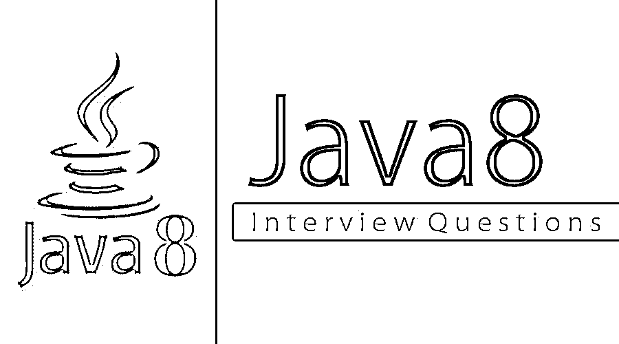

# Java 8 面试问题

> 原文：<https://www.educba.com/java-8-interview-questions/>

## Java 8 面试问答介绍

Java 8 是一个新的平台，最近发布了新的库和类。这些特性主要集中在拥有一个更简洁紧凑的代码上。这个版本中添加的新特性可以列为 Lambda 表达式、方法引用、可选、函数接口和默认方法、Nashorn、Stream 和 Date API。Java 的变化需要有效地利用当前的多核 CPU 并利用 FP 特性。

以下是面试中最重要的问题:

<small>网页开发、编程语言、软件测试&其他</small>

现在，如果你正在寻找一份与 Java 8 相关的工作，那么你需要准备 2022 年的 Java 8 面试问题。的确，每个面试都因不同的职位而不同。在这里，我们准备了重要的 Java 8 面试问题和答案，将帮助你在面试中取得成功。这些面试问题分为以下两部分:

### 第 1 部分–Java 8 面试问题(基础)

第一部分涵盖了基本的 Java 8 面试问题和答案

#### Q1。Java 8 和以前的 Java 版本有什么不同？

**答案:**
不同 Java 版本如下:

*   **Date API:** 它是一个改进的 API，是一个不可变的 JodaTime 启发的 Date API。
*   Stream API: 这是一个特殊的迭代器类，有助于以函数方式处理对象集合。
*   **Lambda 表达式:**这是一个新的语言特性，允许将不同的动作作为对象来处理。
*   **方法引用:**这有助于通过直接使用不同方法的名称来引用不同的方法来定义 Lambda 表达式。
*   **可选:**这是一个[特殊包装类](https://www.educba.com/wrapper-class-in-java/)，它帮助指定可选特性。
*   **函数接口:**这是一个最多有一个抽象方法的接口，它的实现由 Lambda 表达式提供
*   **Nashorn Javascript 引擎:**它是一个基于 Java 的引擎，用于执行和评估 Javascript 代码。

#### Q2。有可能实现两个具有相同名称和签名的默认方法的接口吗？举例说明。

**答案:**
这是 Java 8 面试中问的基本问题。考虑下面的代码，它实现了两个接口
`public interface DefaultMethodInterface {
default public void defaultMethod(){
System.out.println("I am in Default method Interface I");
}
}
public interface DefaultMethodInterface2 {
default public void defaultMethod(){
System.out.println("I am in Default method Interface II");
}
}
public class HelloJava8 implements DefaultMethodInterface,DefaultMethodInterface2 {
public static void main(String[] args){
DefaultMethodInterface defMethIn = new HelloJava();
defMethIn.defaultMethod();
}
}`
，这里编译器给出一个错误，说“重复默认方法”。因此，不可能用相同的名称和签名实现两个接口。

#### Q3。有可能定义我们自己的功能接口吗？解释定义功能接口的规则。

**答案:**
定义我们自己的功能接口是可能的。用户可以使用 Java SE 8 的@FunctionalInterface 注释将接口标记为功能接口。创建功能接口时，需要记住以下规则。

1.  只有一个接口必须定义为只有一个抽象方法
2.  无法定义超过个抽象方法
3.  用户应该在接口定义中使用@FunctionalInterface 注释。
4.  任意数量的不同方法，如默认方法、静态方法等。可以定义。
5.  我们可以覆盖 java.lang.Object 类的方法作为一个抽象方法，这不会被算作一个抽象方法。

让我们转到下一个 Java 8 面试问题。

#### Q4。Java 8 中什么是可选的？说明它的优点。

**答:**
Optional 是作为 Java SE 8 的一部分引入的 final 类。它是 java.util.package 的一部分，可用于表示存在或不存在的可选值。这可以有一个值或零值。如果这个类包含一个值，那么我们得到这个值，否则我们什么也得不到。
该类的主要优点是可用于避免空检查，并可用于避免“NullPointerException”。

#### Q5。下面的代码能正确编译吗？

**答:**
`@FunctionalInterface
public interface Function2<T, U, V> {
public V apply(T t, U u);
default void count() {
// increment counter
}
}`
是的，这段代码会编译无误，因为它遵循了函数接口规范中只定义一个抽象方法的规则。使用的第二种方法是默认方法，不会增加抽象方法的数量。

### 第 2 部分–Java 8 服务器面试问题(高级)

现在让我们来看看高级 Java 8 面试问题和答案

#### Q6。Java 里的 Nashorn 是什么？

**回答:**
这是 Java 8 中搭载的新的 Java 平台的 Java 处理引擎。直到 JDK 7 Java 平台使用 Rhino 作为处理引擎。这是一个 Javascript 处理引擎。Nashorn 提供了对 ECMA 标准化 JavaScript 规范的更好的遵从。它还提供了比以前版本更好的运行时性能。

#### Q7。谓词和函数的区别是什么？

**回答:**
这两个都是功能接口。谓词是返回 true 或 false 的单参数函数。该表达式可用作 lambda 表达式或任何方法引用的赋值目标。
函数< T，R >也是一个单参数函数，但不同之处在于它返回一个对象。这里 T 代表函数的输入，R 代表结果的类型。这两者都可以用作 lambda 表达式或方法引用的赋值目标。

让我们转到下一个 Java 8 面试问题。

#### Q8。解释中间操作和终端操作的区别。

**答案:**
流操作是用来处理流并将其组合起来的。所有这些操作要么是中间的，要么是终端的。中间操作返回流本身，并允许执行进一步的操作。这些操作不是同时执行的。当存在终端操作时，这些操作只能被执行以处理数据。举几个操作的例子，它们是过滤、映射和平面图。
终端操作终止流水线并启动流处理。在终端操作期间，该流通过所有中间操作。这些操作包括 for each、reduce、collect、sum 等。

#### Q9。Java 8 中的流流水线是什么？

**答案:**
这是高级 Java 8 面试中问的面试问题。这是将操作链接在一起的概念。这个过程是通过拆分操作来完成的，这些操作可以用两类中间和终端操作来处理流。每个中间操作在运行时都返回一个流实例。还必须有一个终端操作，它将返回一个最终值并终止管道。

#### Q10。什么是 StringJoiner？

**答案:**
StringJoiner 是一个 util 方法，用来构造不同的字符串，带有想要的分隔符。它还可以帮助创建由分隔符分隔的不同字符的序列。这是在 Java 8 中引入的。不同的构造函数是 Public string joiner(CharSequence 分隔符)和 Public string joiner(CharSequence 分隔符、char sequence 前缀、char sequence 后缀)。下面是 StringJoiner 的一个例子:
`StringJoiner strJoiner = new StringJoiner(".");
strJoiner.add("Buggy").add("Bread");
System.out.println(strJoiner); // prints Buggy.Bread`

### 推荐文章

这是 Java 8 面试问题和答案的列表指南。在这里，我们涵盖了最常见的面试问题及其详细的答案，以帮助候选人轻松应对面试。您也可以阅读以下文章，了解更多信息——

1.  [Java 多线程面试问题](https://www.educba.com/java-multi-threading-interview-questions/)
2.  [哎呀 Java 面试问题](https://www.educba.com/oops-java-interview-questions/)
3.  [Java 春季面试试题](https://www.educba.com/java-spring-interview-questions/)
4.  Java 8 有什么新特性？

