# JUnit Maven 依赖性

> 原文：<https://www.educba.com/junit-maven-dependency/>

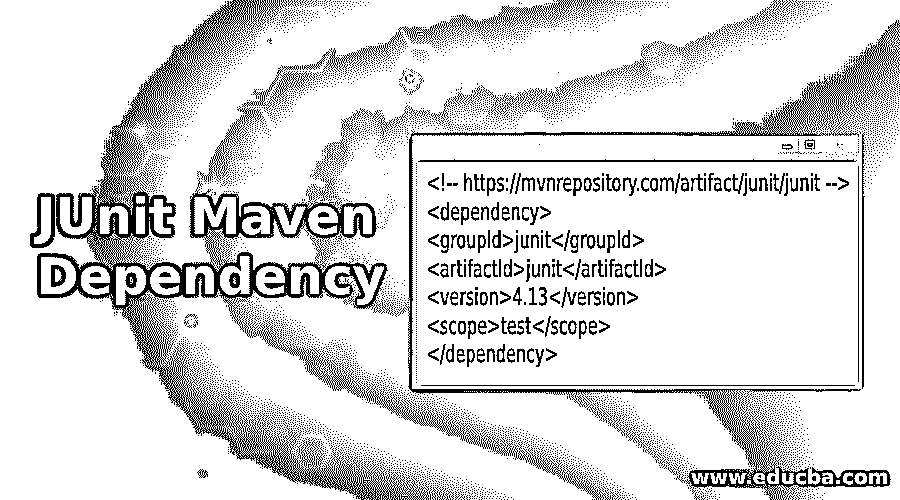

## JUnit Maven 依赖性介绍

JUnit 是一个测试框架，广泛用于以 maven 项目格式构建的 java 项目，以进行单元测试。在这里，我们将看到如何在 maven 项目的 pom.xml 文件中提到 JUnit 依赖项，并看到可以在 java 项目中使用的各种注释和断言方法。两种类型的 JUnit 版本都是从头开始编写的，在用法上有很大的不同。我们将了解这两者，以及我们如何在 eclipse IDE for java 项目中执行单元测试。

在使用 JUnit 4 进行单元测试时，我们需要 org.junit 包；在使用 JUnit 5 进行测试时，我们需要 org.junit.jupiter.api 包。

<small>网页开发、编程语言、软件测试&其他</small>

### JUnit Maven 依赖项的标签

JUnit4 和 JUnit5 的最新版本依赖标签如下:

#### JUnit4 的标签

下面是 JUnit 4 的最新版本依赖标签。

**代码:**

`<!-- https://mvnrepository.com/artifact/junit/junit -->
<dependency>
<groupId>junit</groupId>
<artifactId>junit</artifactId>
<version>4.13</version>
<scope>test</scope>
</dependency>`

#### 六月五日的标签

JUnit 5 在 maven 的 pom.xml 文件中添加了以下依赖标签，用于使用 maven 在 java 项目中执行单元测试。

**代码:**

`<!-- https://mvnrepository.com/artifact/org.junit/junit5-engine -->
<dependency>
<groupId>org.junit</groupId>
<artifactId>junit5-engine</artifactId>
<version>5.0.0-ALPHA</version>
</dependency>`

### JUnit Maven 依赖性的示例

下面是提到的例子:

#### 示例#1: **JUnit 4**

首先创建一个新的 maven 项目。

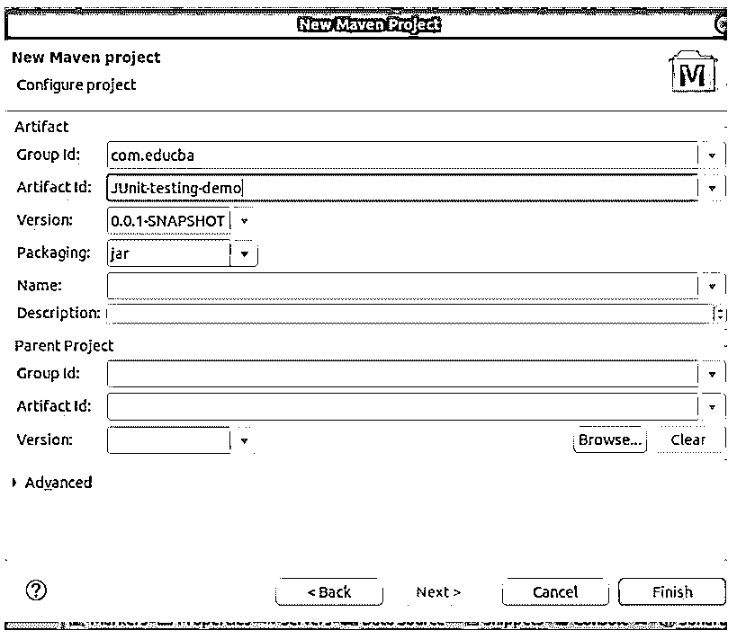

考虑下面的例子，我们有两个方法，一个用于计算乘积，另一个用于名为算术的类中的除法。创建一个名为算术的新 java 类文件。

**代码:**

`public class Arithmetic {
public int product(int number1, int number2) {
return number1 * number2;
}
public int division(int number1, int number2) {
return number1 / number2;
}
}`

该类文件的结构和位置应该如下所示:

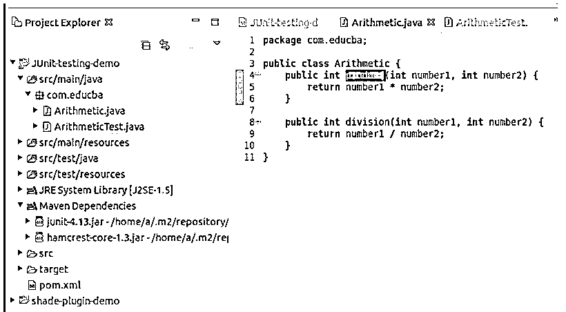

现在，我们将根据编码惯例创建一个名为 Arithmetictest 的测试类。测试类的名称应该是被测试的类的名称，后跟 Test 关键字。这将包含测试方法，这些方法的命名约定是被测试方法的名称，前面加上测试字。因此，这里有两个名为 testProduct 和 testDivision 的测试方法。

可以通过单击 new -> other，然后单击 JUnit 中的 test case 选项来创建测试类，如下所示:

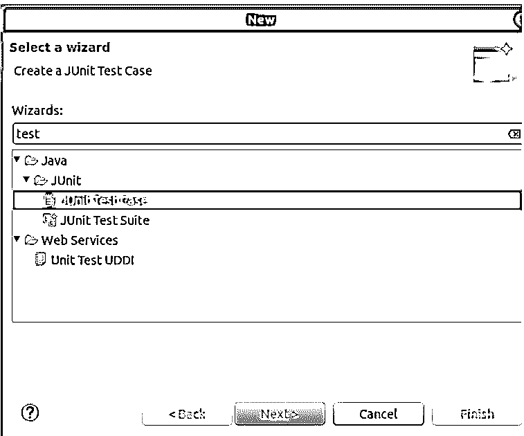

然后选择您想要添加到测试类文件中的方法，并在下面的窗口中提到测试类文件和被测试文件的名称，以创建一个测试类文件。

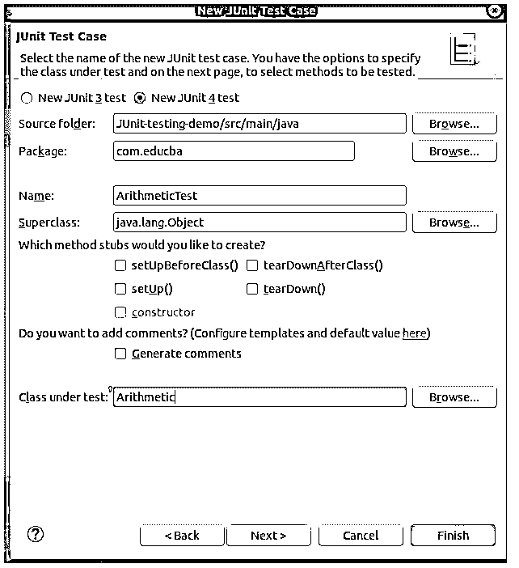

**代码:**

`import org.junit.*;
public class ArithmeticTest {
@BeforeClass
public static void setUpClass() {
// This block is executed before all the methods of test
}
@Before
public void setUp() {
// This block is executed before each method of test
}
@Test
public void testProduct() {
// This block is executed for testing product method of Arithmetic class
Arithmetic arithmetic = new Arithmetic();
int number1 = 100;
int number2 = 5;
int actualvalue = arithmetic.product(number1, number2);
int expectedvalue = 500;
assertEquals(expectedvalue, actualvalue);
}
@Test
public void testDivision() {
// This block is executed for testing division method of Arithmetic class
}
@After
public void tearDown() {
// This block is executed after each method of test
}
@AfterClass
public static void tearDownClass() {
// This block is executed after all the methods of test
}
}`

***Note:** All the methods above that are annotated with BeforeClass, Before, After and AfterClass are optional. Only test methods are required in test classes. Each method has its specific purpose and the time when it is executed. Mentioned in the comment section of each method.*

*   **BeforeClass:** 您希望在执行任何其他方法(如设置测试环境、打开数据库连接等)之前只执行一次的代码可以包含在这里。
*   **Before:** 这是在执行每个测试方法之前将要执行的方法。
*   **Test:** 您想要检查方法的执行和性能的代码可以包含在测试方法中。有许多断言方法可以用来判断工作的正确性。如果条件失败，它们将导致 java.lang.AssertionError。
*   **After:** 这是在执行每个测试方法后将要执行的方法。
*   **AfterClass:** 在执行完所有其他测试方法(如清理测试环境、关闭数据库连接等)后，您只想执行一次的代码可以放在这里。

这个算术测试类文件的结构和位置应该如下所示:

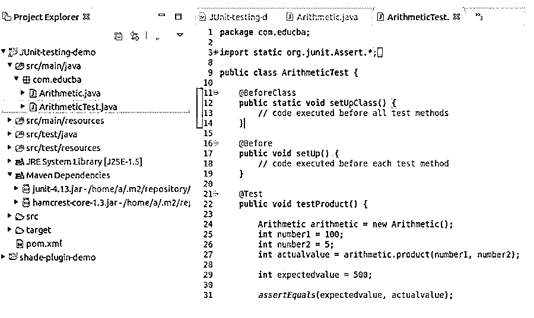

Maven 的 pom.xml 将包含:

**代码:**

`<project xmlns:xsi="http://www.w3.org/2001/XMLSchema-instance"xsi:schemaLocation="http://maven.apache.org/POM/4.0.0 http://maven.apache.org/xsd/maven-4.0.0.xsd">
<modelVersion>4.0.0</modelVersion>
<groupId>com.educba</groupId>
<artifactId>JUnit-testing-demo</artifactId>
<version>0.0.1-SNAPSHOT</version>
<properties>
<java.version>1.8</java.version>
</properties>
<dependencies>
<!-- https://mvnrepository.com/artifact/junit/junit -->
<dependency>
<groupId><u>junit</u></groupId>
<artifactId><u>junit</u></artifactId>
<version>4.13</version>
<scope>test</scope>
</dependency>
</dependencies>
</project>`

该文件的结构和显示方式如下:

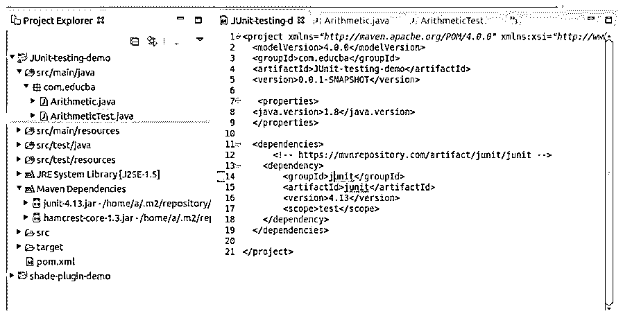

要检查测试用例并执行测试，从 window -> preferences -> outline 打开 outline 窗口，然后右键单击要执行的测试类文件的任何方法，并作为 JUnit 测试选项运行。在运行上述 ArithmeticTest 类的 testProduct 方法后，您将在 Junit 控制台上获得以下输出。

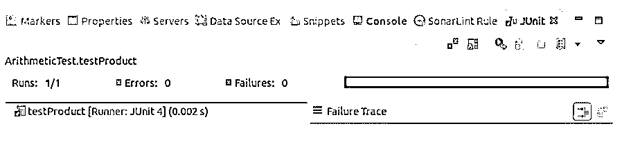

绿色条显示测试用例被成功执行，并且没有错误。要运行测试用例的整个类文件，您可以右键单击 ArithmeticClass 文件，并运行一个 Junit 测试，给出以下输出。

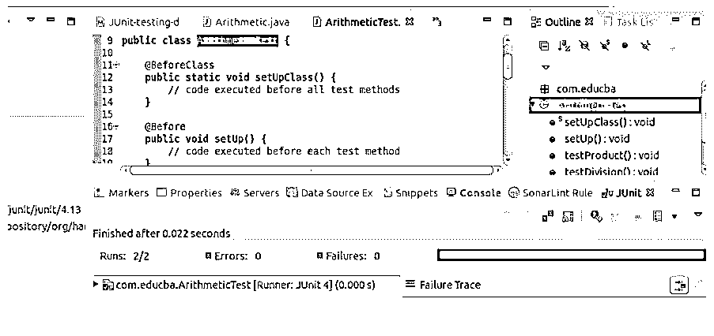

#### 示例 2: JUnit 5

考虑到上面 Junit 5 依赖关系的例子，我们的算术类文件将保持不变。我们的 pom.xml 有点像下面这样。

**代码:**

`<project xmlns:xsi="http://www.w3.org/2001/XMLSchema-instance"xsi:schemaLocation="http://maven.apache.org/POM/4.0.0 http://maven.apache.org/xsd/maven-4.0.0.xsd">
<modelVersion>4.0.0</modelVersion>
<groupId>com.educba</groupId>
<artifactId>JUnit-testing-demo</artifactId>
<version>0.0.1-SNAPSHOT</version>
<properties>
<java.version>1.8</java.version>
</properties>
<dependencies>
<!-- https://mvnrepository.com/artifact/org.junit/junit5-engine -->
<dependency>
<groupId>org.junit</groupId>
<artifactId>junit5-engine</artifactId>
<version>5.0.0-ALPHA</version>
</dependency>
</dependencies>
</project>`

算术测试将如下:

**代码:**

`package com.educba;
import org.junit.gen5.api.AfterAll;
import org.junit.gen5.api.AfterEach;
import org.junit.gen5.api.BeforeAll;
import org.junit.gen5.api.BeforeEach;
import org.junit.gen5.api.Test;
import staticorg.junit.gen5.api.Assertions.assertEquals;
public class ArithmeticTest {
@BeforeAll
public static void setUpClass() {
// code executed before all test methods
}
@BeforeEach
public void setUp() {
// code executed before each test method
}
@Test
public void testProduct() {
Arithmetic arithmetic = new Arithmetic();
int number1 = 100;
int number2 = 5;
int actualvalue = arithmetic.product(number1, number2);
int expectedvalue = 400;
assertEquals(expectedvalue, actualvalue);
}
@Test
public void test Division() {
// test method
}
@AfterEach
public void tearDown() {
// code executed after each test method
}
@AfterAll
public static void tearDownClass() {
// code executed after all test methods
}
}`

在上面的 Junit 5 测试文件中，我将预期值更改为 400，这不等于 100 * 5，即 500，因此抛出了一个红色的错误条。请注意，在 Junit 5 测试中，注释的名称发生了变化，但是它们的功能保持不变，不受影响。

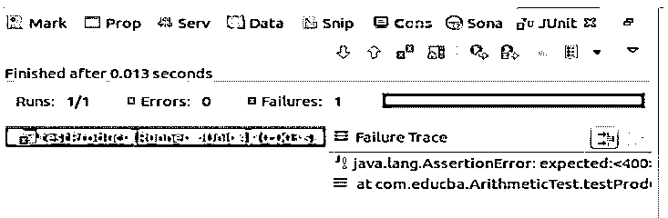

如果我们将 testProduct 方法的预期值改回 500，它将给出绿色条，并成功执行测试用例。

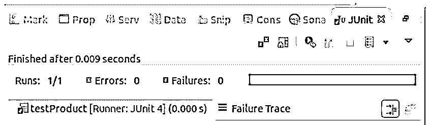

只需确保在为 JUnit 5 创建测试文件时，在创建文件时会询问名称和其他细节的窗口中正确选择了选项。

### 推荐文章

这是一个关于 JUnit Maven 依赖性的指南。在这里，我们讨论 JUnit Maven 依赖关系的介绍以及一些例子。我们可以在 pom.xml 中添加 JUnit 4 或 JUnit 5 maven 依赖项，以便在结构化的 java 项目中执行单元测试，并在其中使用 maven。您也可以看看以下文章，了解更多信息–

1.  [JUnit 注释](https://www.educba.com/junit-annotations/)
2.  [胃插件](https://www.educba.com/maven-plugins/)
3.  [Maven Shade 插件](https://www.educba.com/maven-shade-plugin/)
4.  [Jetty Maven 插件](https://www.educba.com/jetty-maven-plugin/)

