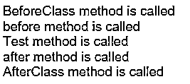

# JUnit 注释

> 原文：<https://www.educba.com/junit-annotations/>


## JUnit 注释简介

JUnit 是市场上最强大的、基于 Java 的开源测试框架之一，可以免费获得。它有助于在注释的帮助下，根据需求轻松快速地创建和执行测试用例。注释基本上提供了关于 Java 代码中使用的类和方法的额外信息。它有助于测试每个单元组件，无论是方法、类、包还是变量。它通常用于应用程序的[单元测试。JUnit 的最新升级是 JUnit5。它支持 Selenium web 驱动程序，用于 web 和移动应用程序的自动化测试。org。Junit 是包含通过 JUnit 进行测试的所有接口和类的包。](https://www.educba.com/unit-testing/)

### 带有示例的 JUnit 注释

 **下面给出了一些 JUnit 注释:

<small>网页开发、编程语言、软件测试&其他</small>

#### 1.@以前

有些情况下，在执行实际的测试用例之前，需要创建一些测试用例或测试数据。在这种情况下，@在注释出现之前。用这个注释注释任何公共方法允许代码/方法在每个实际的@test 方法之前运行。在继承的情况下，首先调用超类的@before 方法，然后调用当前类的@before 方法。

#### 2.@之后

和注释前的@正好相反。它用于需要执行一些操作的情况，比如在执行@test 方法之后(在执行每个测试用例之后)释放资源、清理内存、在控制台上打印任何东西。对于@After 注释，需要注意的重要一点是，即使@test 或@before 方法抛出异常，它也会执行。例如，在子类和超类关系的情况下，子类/当前类的@after 方法在超类的@after 方法之前执行。

#### 3.@BeforeClass

该注释用于在执行特定类的任何测试用例之前需要执行某些操作的场景，如创建与数据库的连接、在数据库中创建条目、在日志中创建条目等。当@BeforeClass 注释在任何方法之前使用时，该方法在类中的任何测试方法之前执行。它的工作方式类似于@Before 注释，唯一的区别是@Before 在执行每个@test 方法之前执行该方法，而@BeforeClass 只执行一次，即在执行类中的任何@test 方法之前。

#### 4.@课后

在执行完当前类的所有@test 方法后，需要释放@BeforeClass 方法中分配的所有资源。在整个类执行完毕后，资源的释放或任何重要任务都是由@AfterClass 方法完成的。@AfterClass 方法在当前类的所有@test 方法以简单的方式执行后运行。它只执行一次。即使@BeforeClass 方法抛出异常，也必须运行@AfterClass 方法。

像@After 方法一样，@AfterClass 方法的工作方式也是类似的，只是@After 方法是在一个类的每个@test 方法之后执行，而@AfterClass 方法是在一个类的所有@test 方法执行之后执行一次。

#### 5.@测试

该注释指定该注释下的公共方法是需要执行的主测试用例的一部分。@test 下的方法将测试用例定义为通过或失败，这取决于在执行它时是否出现任何异常/错误。

它也可以有两种用途:

*   **@Test(timeout= 500):** 将参数作为超时，接受毫秒值。当测试用例的执行时间超过预期时间时，它认为测试用例失败，当它在指定的时间限制内成功执行时，它认为测试用例通过。
*   **@ Test(expected = exception . class):**有些情况下，我们希望某些方法抛出一个特定的异常。如果方法没有抛出任何异常或上述异常，测试用例失败。

#### 6.@忽略

有些情况下，我们想要忽略一些测试用例，并且不想运行它们。@Ignore 同样有帮助。@Ignore 批注下的方法不会被执行，在代码执行期间会被忽略。即使在 TestNG 报告中，测试用例也会被忽略，通过的测试用例数量。

**举例:**

让我们以 JUnit 注释为例。

```
package demo;
import org.junit.*;
public class JUnitAnnotationTest {
// Run once, before any @test method in the class are executed
@BeforeClass
public static void bClass() {
System.out.println("BeforeClass method is called”);
}
// Run once after all the @test methods of the class are executed
@AfterClass
public static void aClass() {
System.out.println("AfterClass method is called");
}
// Run before every @test method of a class is executed
@Before
public void bMethod() {
System.out.println("before method is called");
}
// Run after every @test method of class is executed
@After
public void aMethod() {
System.out.println("after method is called");
}
// Test method which has actual test case
@Test
public void testMethod() {
System.out.println("Test method is called");
}
}
```

**输出:**




### JUnit 注释的优势

下面给出了 JUnit 注释的一些优点:

1.  JUnit 提供了一种简单的方法来根据用户的需求以特定的方式执行测试用例。
2.  通过将多个测试用例组合在一个测试套件中，使用 JUnit 可以很容易地并行执行多个测试用例。
3.  在 [Selenium](https://www.educba.com/what-is-selenium/) 中用于自动化测试用例的 JUnit 注释为用户提供了一个非常详细的、交互式的、图形化的报告，这是非常用户友好的。
4.  JUnit 允许以非常简单的方式传递方法中的参数。
5.  JUnit 注释有助于执行干净的编码，这对测试人员和程序员来说都非常容易理解。

### 结论

上面的解释清楚地描述了 JUnit 框架的重要性以及 JUnit 的各种注释被调用的顺序。在程序中使用各种注释之前，理解它们是非常重要的，这样就不会在控制执行流程时产生任何问题。

### 推荐文章

这是 JUnit 注释指南。这里我们用例子来讨论 JUnit 的介绍和注释，包括@Before、@After、@Test 和@Ignore 等。您也可以浏览我们推荐的其他文章，了解更多信息——

1.  [单元测试](https://www.educba.com/unit-testing/)
2.  [白盒测试](https://www.educba.com/white-box-testing/)
3.  [硒架构](https://www.educba.com/selenium-architecture/)
4.  [测试线束](https://www.educba.com/test-harness/)


**