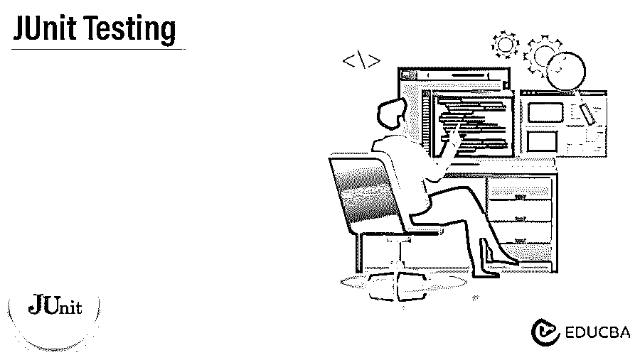
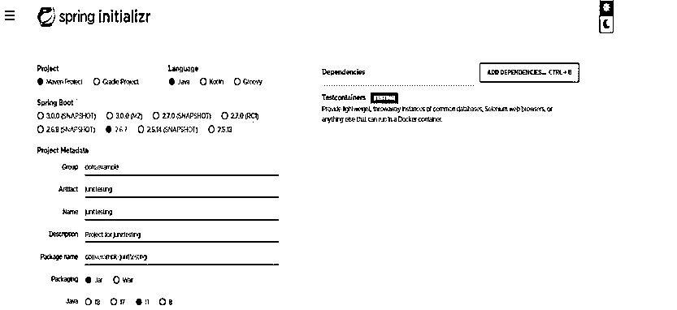
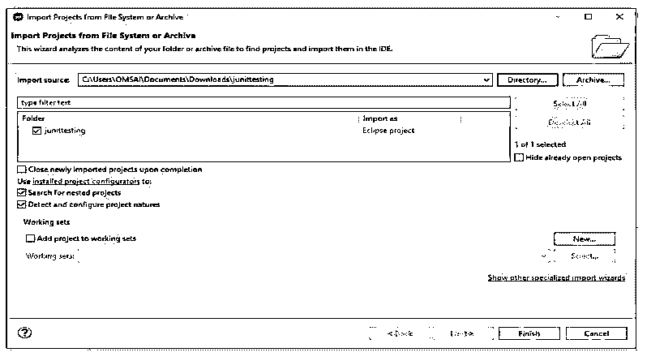
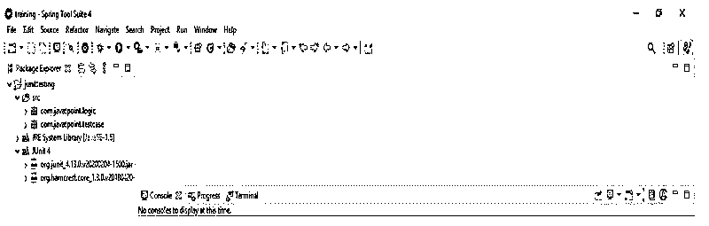
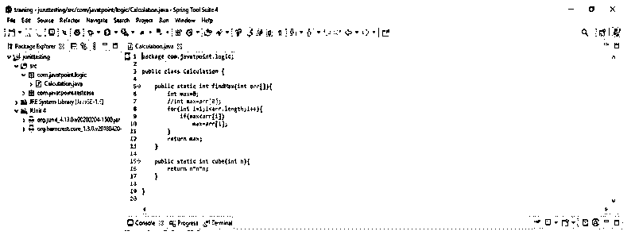
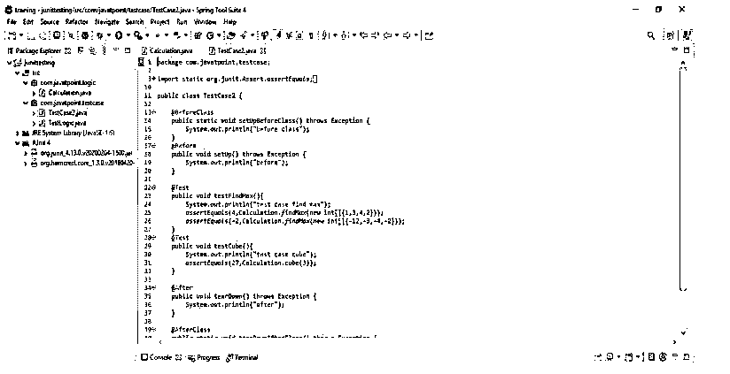
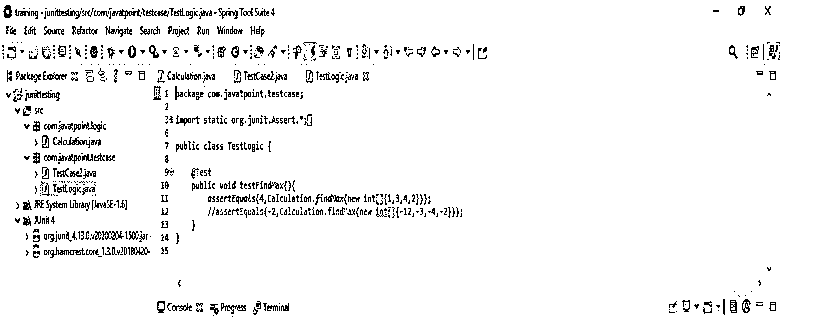
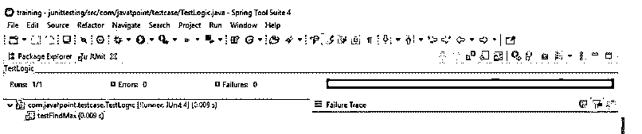
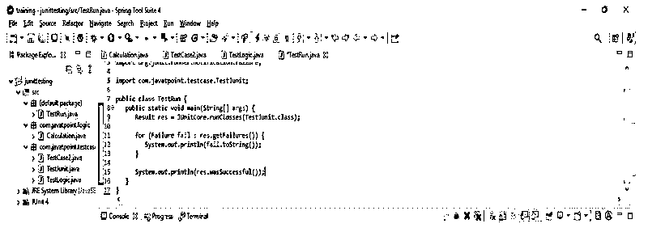
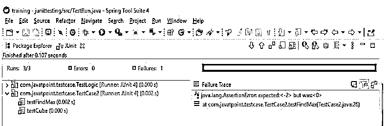

# JUnit 测试

> 原文：<https://www.educba.com/junit-testing/>




## JUnit 测试简介

JUnit 测试运行在 java 版本 8 及以上；它不能在低于版本 8 的 java 版本上运行。JUnit 是用于 java 的单元测试框架；我们可以使用 JUnit 测试应用程序。java 开发人员运行和编写测试用例是有益的。它只不过是架构，是 xUnit 的一个实例。

### 什么是 JUnit 测试？

*   JUnit 是一个 java 测试框架，用于在 Java 应用程序上运行回归和单元测试。此外，它是 java 应用程序中用于运行可重复测试用例的开源框架。
*   有多个 JUnit 测试版本可用，但是 JUnit 5 将添加多个新特性，这有利于测试 java 应用程序。
*   它是一个包含在类中的方法，仅用于测试目的；这就是所谓的测试类。因此，要将 JUnit 测试标记为测试方法，我们需要用@test 注释对其进行注释。

### JUnit 测试的类型

以下是以下类型:

<small>网页开发、编程语言、软件测试&其他</small>

1.  人工测试
2.  自动化测试

如果我们不使用任何工具手动执行测试用例，这就是所谓的手动测试。这种测试不可靠，而且会很费时间。因此，手动测试并不是在所有的应用中都可行，因为它很耗时。手工测试是一个手工执行测试用例的软件测试过程。应用程序的测试用例将由测试人员从用户的角度手动执行。正如文档中所提到的，该测试将确保应用程序正常工作。

如果我们使用任何工具支持来执行测试用例，那么自动化测试就被称为自动化测试。与手动测试相比，自动化测试速度更快，也更可靠。自动化测试是包含测试软件的过程，以确保它将满足用户的确切要求。

还有，分为以下几种。它将包括单元、系统、集成和验收测试。单元测试用于修复开发周期中的 bug，以节省应用程序开发成本。集成测试将帮助开发人员理解代码库，并快速实现更改。单元测试对于服务于项目文档非常有用。此外，它在应用程序代码重用期间也是有益的。我们可以很容易地将我们的代码和测试从一个项目迁移到一个新项目。

单元测试是自动化的，但是我们需要手动测试一些代码。在进行自动化测试时，开发人员将为测试目的编写一段代码。应用程序代码将自动使用 JUnit 测试框架来开发测试用例。

### JUnit 测试框架

JUnit 是一个回归测试框架，开发人员使用它在 java 中实现单元测试，以提高编程速度和代码质量。

我们可以通过使用以下工具轻松集成 JUnit 框架:

*   蚂蚁
*   黯然失色
*   专家

下面是在 JUnit 测试框架中使用的注释，如下所示:

*   **@Test:** 这个注释将指定它将是一个测试方法。此注释用于测试目的。
*   **@Test (timeout=1000):** 这个注释将确定测试方法如果花费的时间超过 1000 毫秒就会失败。
*   **@BeforeClass:** 这个注释将决定在开始所有测试之前只调用一次流程。
*   **@After:** 该注释将选择在每次测试后调用该方法。
*   **@AfterClass:** 该注释将指定在完成所有测试用例后，一次性调用该方法。

下面是 JUnit 测试框架的如下特性:

夹具是 JUnit 测试框架的一个基本特性:

*   测试套件
*   固定装置
*   JUnit 类
*   测试跑步者

下面是用于编写 JUnit 测试用例的 JUnit 框架的类。

*   维护
*   判例案件
*   测试结果

以下是 JUnit 测试框架的示例:

1.第一步，我们创建 JUnit 测试框架示例的项目模板。

我们以 com 的形式提供项目组名称。例如，工件名称如 JUnit testing，项目名称如 JUnit testing，以及选定的 java 版本为 8。此外，我们将 spring boot 的版本定义为 2.6.7。

group–com . example 工件名称–JUnittesting
名称–JUnit testing Spring boot–2 . 6 . 7
项目–Maven Java–11
包名称–com . example . JUnit testing
项目描述–用于 JUnit testing 的项目




2.在这一步中，我们提取下载的项目，并使用 spring 工具套件打开它。

在下面的例子中，我们可以看到我们已经提取了项目。然后我们使用 spring 工具套件打开它。




3.在这一步，我们检查所有的项目结构和文件。

在下面的例子中，我们可以看到框架例子的结构。




4.在这一步，我们编写程序代码，程序的逻辑如下。










5.在这一步编写了测试用例之后，我们使用 JUnit 测试运行我们的应用程序。




### JUnit 测试跑步者

JUnit test runner 类扩展了 JUnit 抽象类及其相关的 JUnit 测试用例。因此，我们正在使用 JUnit test runner 方法开发抽象方法。

JUnit 测试运行器用于执行测试用例。

下面的示例显示了 JUnit 测试运行程序，如下所示:

**代码:**

```
public class TestRun {
public static void main(String[] args) {
Result res = JUnitCore.runClasses (TestJUnit.class);
{
System.out.println (fail.toString ());
}
System.out.println (res.wasSuccessful ());
}
}
```

**输出:**







### 结论

JUnit 测试是一个包含在类中的方法，只用于测试目的；这就是所谓的测试类。运行在 java 版本 8 及以上；它不能在低于版本 8 的 java 版本上运行。

### 推荐文章

这是 JUnit 测试指南。这里我们讨论 JUnit 测试的介绍、类型、框架和运行者。您也可以看看以下文章，了解更多信息–

1.  [JUnit 代码覆盖率](https://www.educba.com/junit-code-coverage/)
2.  [JUnit assertEquals](https://www.educba.com/junit-assertequals/)
3.  朱尼特木星
4.  [JUnit 5 Maven 依赖](https://www.educba.com/junit-5-maven-dependency/)


