# JUnit 测试订单

> 原文：<https://www.educba.com/junit-test-order/>


## JUnit 测试订单介绍

JUnit test order 方法被调用来返回反射 API。使用 [JVM](https://www.educba.com/what-is-jvm/) 时，顺序不是特定的，因为 java 没有指定任何特定的顺序，所以我们可以说 JDK 7 返回任何顺序。然而，在测试测试用例时，这是有益且必要的。此外，字母数字排序用于通过名称对测试方法进行字母数字排序。

### 概观

*   从版本 4.11 开始，默认情况下 JUnit 被用作确定性顺序，但是我们可以说它是不可预测的。因此，在创建测试用例代码时，我们需要使用不同的注释来改变顺序执行。
*   JUnit 5 允许用户覆盖顺序并以确定的顺序运行测试。我们可以指定数字和字母顺序。
*   我们可以通过在类级别上指定@ TestMethodOrder 注释来使用数字顺序运行 JUnit 测试，并且需要使用@Order 注释来选择每个方法编号。

### JUnit 测试订单类别

下面是按顺序测试测试用例时使用的类，如下所示:

<small>网页开发、编程语言、软件测试&其他</small>

#### 1.方法名.类

这个类用于根据测试名称对测试进行字母数字排序。下面的例子显示了根据方法名对测试进行排序。在下面的例子中，我们已经使用测试方法顺序定义了 MethodName.class。我们已经创建了 MethodOrderedTest 类来使用 JUnit 测试订单类。

**代码:**

```
@TestMethodOrder (MethodOrderer.MethodName.class)
public class MethodOrderedTest
{
@Test
void ordE () {
assertTrue (true);
}
@Test
Void ordA () {
assertTrue (true);
}
@Test
void OrdD () {
assertTrue (true);
}
@Test
void OrdC () {
assertTrue (true);
}
@Test
void ordB () {
assertTrue (true);
}
}
```

**输出:**

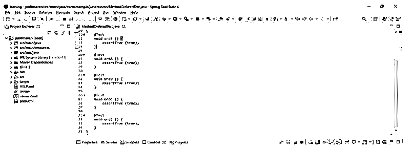


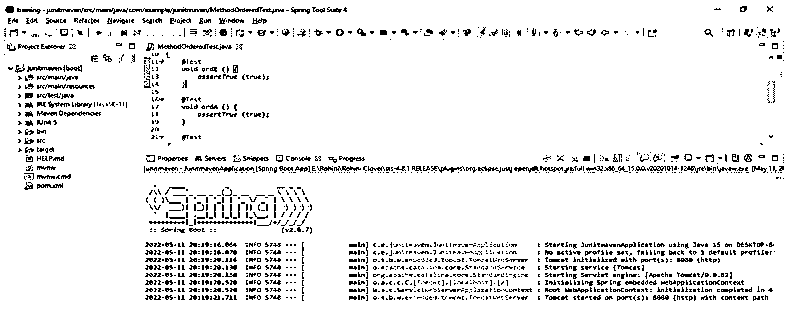


#### 2.DisplayName.class

这个类用于根据显示名称对测试进行排序。以下示例显示了根据显示名称对测试进行排序，如下所示。在下面的示例中，我们通过使用测试方法顺序定义了 DisplayName.class。此外，我们还创建了 MethodDisplayTest 类来使用类。

**代码:**

```
@TestMethodOrder (MethodOrderer.DisplayName.class)
public class MethodDisplayTest
{
@DisplayName ("2")
@Test
void ordE ()
{
assertTrue (true);
}
@DisplayName ("4")
@Test
void ordA () {
assertTrue (true);
}
@DisplayName ("3")
@Test
void OrdD ()
{
assertTrue (true);
}
@DisplayName ("5")
@Test
void OrdC ()
{
assertTrue (true);
}
@DisplayName ("1")
@Test
void ordB ()
{
assertTrue (true);
}
}
```

**输出:**

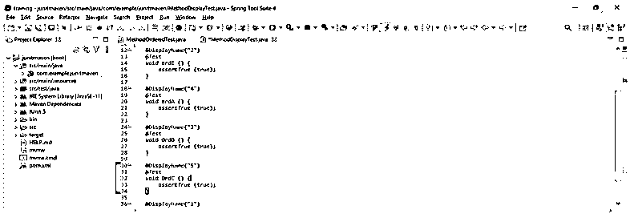


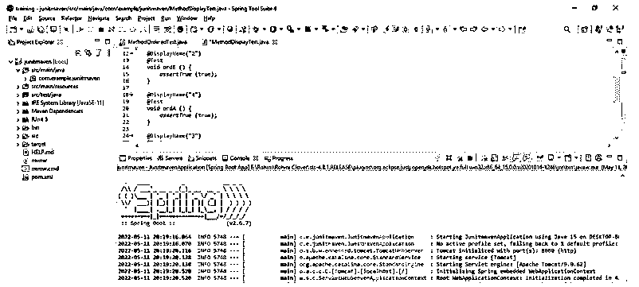


#### 3.OrderAnnotation.class

该类用于根据订单注释对测试进行排序。以下示例显示了根据订单的注释对测试进行分类。在下面的例子中，我们使用测试方法 order 定义了 OrderAnnotation.class。我们已经创建了 OrderAnnotationTest 类来使用 JUnit 订单注释类。

**代码:**

```
@TestMethodOrder (MethodOrderer.OrderAnnotation.class)
public class OrderAnnotationTest
{
@Order (2)
@Test
void ordE () {
assertTrue (true);
}
@Order (4)
@Test
void ordA () {
assertTrue (true);
}
@Order (3)
@Test
void OrdD ()
{
assertTrue (true);
}
@Order (5)
@Test
void OrdC ()
{
assertTrue (true);
}
@Order (1)
@Test
void ordB ()
{
assertTrue (true);
}
}
```

**输出:**

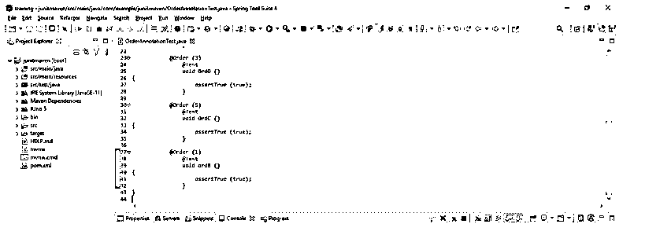


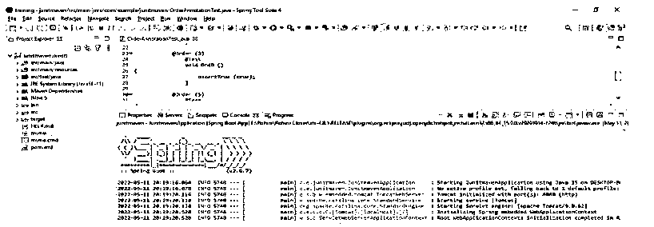


#### 4.随机类

这个类用于根据随机序列对测试进行排序。下面的例子显示了按照随机顺序对测试进行排序，如下所示。在下面的例子中，我们已经使用测试方法顺序定义了 Random.class。此外，我们还创建了 RandomTest 类来使用类。

**代码:**

```
@TestMethodOrder (MethodOrderer.Random.class)
public class RandomTest
{
@Test
void ordE () {
assertTrue (true);
}
@Test
void ordA () {
assertTrue (true);
}
@Test
void OrdD () {
assertTrue (true);
}
@Test
void OrdC () {
assertTrue (true);
}
@Test
void ordB () {
assertTrue (true);
}
}
```

**输出:**

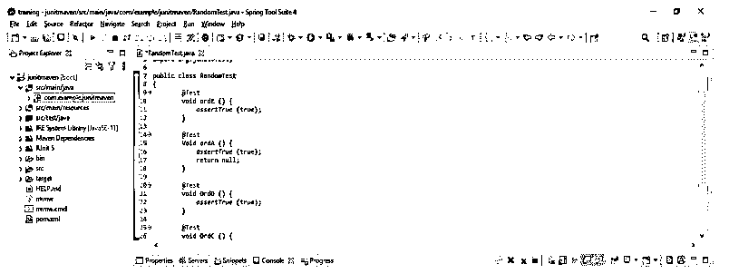


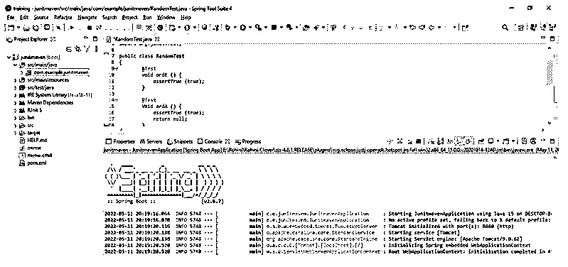


### JUnit 测试顺序示例

下面提到了不同的例子:

#### 示例#1

以下示例显示了 MethodSorters.DEFAULT 的 JUnit 测试方法。该枚举值用于按照特定顺序对执行进行排序。测试用例运行的顺序是不可预测的。在使用 MethodSorters 默认值执行订单时，订单不会更改其订单；它保持不变。

**代码:**

```
@FixMethodOrder (MethodSorters.DEFAULT)
public class JUnitTest1 {
@Test
public void case3 () {
System.out.println ("Third test case");
}
@Test
public void case1 () {
System.out.println ("First test case");
}
@Test
public void case2() {
System.out.println ("Second test case");
}
@Test
public void case4 () {
System.out.println ("Fourth test case");
}
@Test
public void case5 () {
System.out.println ("Fifth test case");
}
}
```

**输出:**

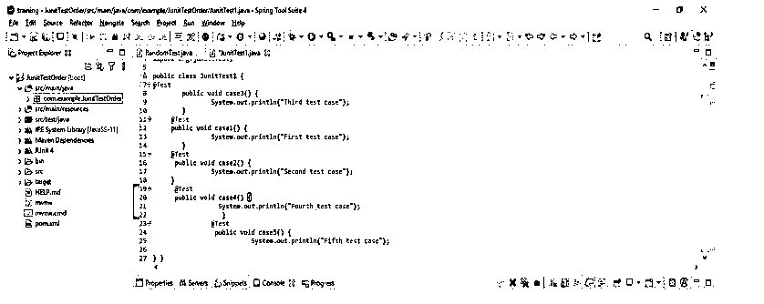


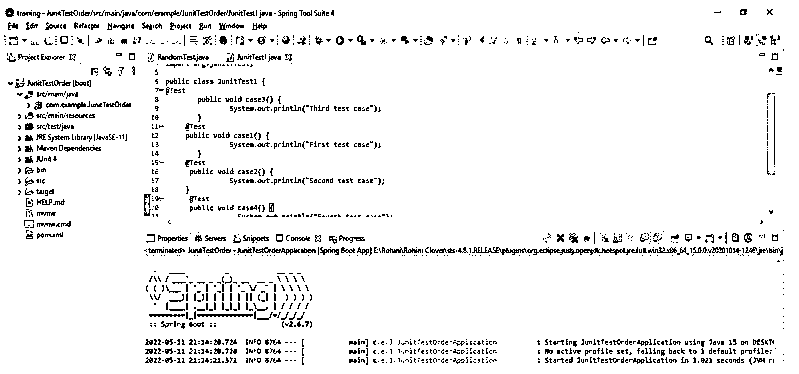


#### 实施例 2

以下示例显示了 JUnit 方法将使用字母数字进行排序。

我们使用下面的注释对字母数字排序值进行排序，如下所示。

*   @TestMethodOrder
*   @订单

我们正在使用的类属于方法排序器的接口。字母数字排序用于通过名称对测试方法进行字母数字排序。

**代码:**

```
@FixMethodOrder (Alphanumeric.class)
public class Alphanumeric {
@Test
public void case3 () {
System.out.println ("Third test case");
}
@Test
public void case1 () {
System.out.println ("First test case");
}
@Test
public void case2() {
System.out.println ("Second test case");
}
@Test
public void case4 () {
System.out.println ("Fourth test case");
}
@Test
public void case5 () {
System.out.println ("Fifth test case");
}
}
```

**输出:**


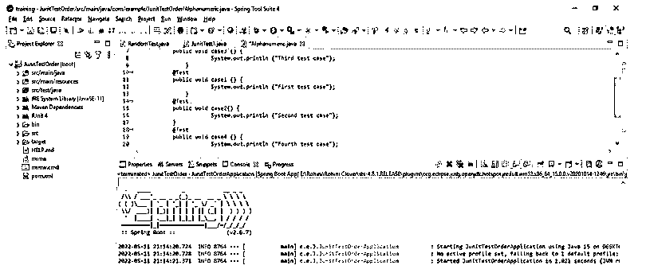


#### 实施例 3

以下示例显示了如何创建订单注释，如下所示。JUnit 版本 5 支持订单注释类。这种方法在按照指定的顺序显示记录时也起着重要的作用。

**代码:**

```
@FixMethodOrder (OrderAnnotation.class)
public class Annotation {
@Test
@Order (3)
public void case3 () {
System.out.println ("Third test case");
}
@Test
@Order (4)
public void case1 () {
System.out.println ("First test case");
}
@Test
@Order (1)
public void case2() {
System.out.println ("Second test case");
}
@Test
@Order (5)
public void case4 () {
System.out.println ("Fourth test case");
}
@Test
@Order (2)
public void case5 () {
System.out.println ("Fifth test case");
}
}
```

**输出:**

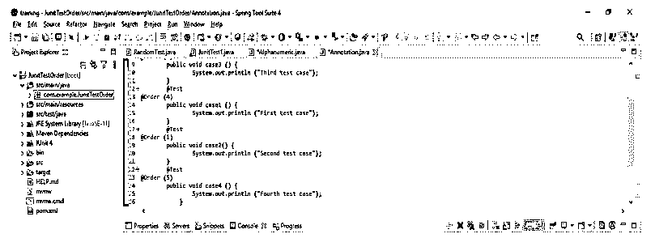


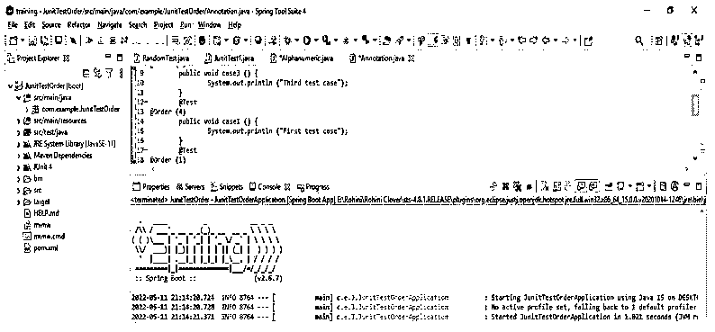


### 结论

我们可以通过在类级别上指定@TestMethodOrder 注释，使用数字顺序运行 JUnit 测试。然而，JUnit 5 允许用户覆盖顺序，并按照确定的顺序运行测试。因此，我们可以指定数字以及字母数字顺序。

### 推荐文章

这是 JUnit 测试顺序指南。为了更好地理解，我们在这里讨论简介、JUnit 测试订单类和示例。您也可以看看以下文章，了解更多信息–

1.  [JUnit 代码覆盖率](https://www.educba.com/junit-code-coverage/)
2.  [JUnit assertEquals](https://www.educba.com/junit-assertequals/)
3.  朱尼特木星
4.  [JUnit 5 Maven 依赖](https://www.educba.com/junit-5-maven-dependency/)


