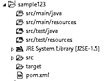
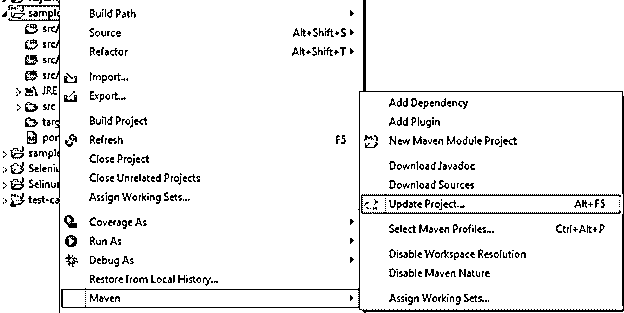
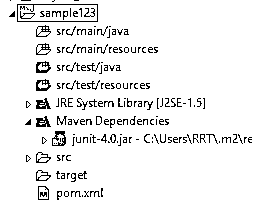
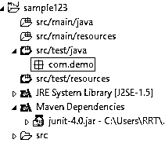

# 六月四号胃

> 原文：<https://www.educba.com/junit-4-maven/>


## JUnit 4 Maven 简介

JUnit 是一个开源测试框架，用于测试 maven 项目中构建的 java 项目。通常，JUnit 4 用于对应用程序执行回归测试。换句话说，我们可以说在这里我们可以根据我们的需求编写测试脚本并在可重复测试中运行它。单元测试是白盒测试，其中实验依赖于内部结构。分析器选择贡献来调查特定的方式并决定相关的结果。单元测试的原因是查看技术/类的不同部分来确认有用性，保证行为符合形式。

### 什么是 JUnit 4 maven？

JUnit 是一种 Java 单元测试结构，是复发测试的独特测试技术之一。利用开源结构来编写和运行可重复的机械化测试。

<small>网页开发、编程语言、软件测试&其他</small>

类似地，和其他任何东西一样，JUnit 4 测试系统也经历了长期的发展。值得注意的重要变化是随着 JUnit 4 的到来而出现的解释，它增加了 JUnit 的关联性和清晰度。因此，这篇博客的剩余部分将由 Junit 4 和 5 的应用组成。

Junit 4 的指定内容独立于 Junit 5，是一个独立的赋值(例如，一个单独的策略或类)。有一个有效的理由证明我们在单元测试时限制了范围——假设我们开发了一个包括一个项目的各个部分的测试，我们已经将注意力从一个单独技术的有用性转移到代码的各个部分之间的合作。假设测试失败了，我们对失败的原因一无所知，我们只能思考弱点是在我们热衷的策略中还是在与该技术相关的条件中。

补充单元测试重复测试通过测试您对代码所做的进展来验证最近的修复、改进或修正没有破坏现有的有用性。代码变更是不可避免的，不管它们是对现有代码的调整还是添加新的有用的包…你的代码肯定会变更。在这种变化中，这是最大的风险，因此，鉴于此，复发测试是一个毫无疑问的要求。

### 如何安装 JUnit 4 maven？

现在让我们看看如何安装 JUnit 4，如下所示。

首先，我们需要在 eclipse 中创建 maven 项目，因此在文件中，菜单选择 new，然后选择 other project，并根据我们的要求提供组 id 和工件 id。创建项目后，它看起来像下面的截图所示。




现在我们需要在 pom.xml 文件中做一些更改，这意味着我们需要添加 JUnit 的依赖项，如下所示。

```
<!-- https://mvnrepository.com/artifact/junit/junit -->
<dependency>
<groupId>junit</groupId>
<artifactId>junit</artifactId>
<version>4.0</version>
<scope>test</scope>
</dependency>
```

现在保存 pom.xml 文件，右键单击项目名称，单击 maven，在 maven 内部，选择 Update Project 选项，如下图所示。




更新项目后，我们可以看到如下截图所示的文件结构。




### 创建 JUnit 4 maven

现在让我们看看如何用例子创建 JUnit 4 maven。

我们已经创建了 maven 项目；让我们在 main 内部添加一个包，如下图所示。




现在创建类并编写代码；这里，我们看到一个简单程序的简单例子。

只需创建一个类似示例演示的类文件，然后粘贴以下代码。

```
package com.demo;
import static org.junit.Assert.assertTrue;
import org.junit.After;
import org.junit.AfterClass;
import org.junit.Before;
import org.junit.BeforeClass;
import org.junit.Test;
public class sampledemo  {
@BeforeClass
public static void beforeClassmethod() {
System.out.println("Hi welcome in Before Class Method");
}
@Before
public void beforemethod() {
System.out.println("Hello there welcome in Before Test Case strategy ");
}
@Test
public void Test() {
System.out.println("Welcome in First Test");
}
@After
public void aftermethod() {
System.out.println("Hi welcome in After Test Case");
}
@AfterClass
public static void afterClassmethod() {
System.out.println("Hi welcome in After Class");
}
}
```

**解释**

在上面的例子中，我们试图涵盖 JUnit 注释，如上面的代码所示。我们使用下面的屏幕截图展示了上述实现的最终输出。


### JUnit 4 maven 方法

现在让我们看看不同类型的方法，如下所示。

**@Test:** 用于确定这是一个测试方法。

**@Before:** 根据我们的要求，这个方法在每个测试用例之前执行。

**@After:** 该方法用于根据我们的要求执行每个测试用例后的测试。换句话说，我们可以说它是在每次测试后执行的。它清理了测试环境(例如，删除非永久性信息，重新建立默认值)。它同样可以通过整理昂贵的内存结构来节省内存。

**@BeforeClass:** 执行一次，在开始之前，一切都相等。它用于执行时间逐步升级的练习，例如，与数据集交互。与此注释分开的技术应该被描述为静态的，以便与 JUnit 4 一起工作。

**@AfterClass:** 在所有测试完成后执行一次。它被用来执行整理练习，例如，从信息库中分离出来。用这个解释阐明的策略应该是静态的，以便与 JUnit 4 一起工作。

**@Ignore** :标记测试应该失效。当实际代码已经被改变并且实验还没有被调整时，这是很有帮助的。或者另一方面，万一这个测试的执行季节太长而不能以任何方式包括在内。最佳实践是给出测试失效原因的任意描述。

### 结论

我们希望通过这篇文章，您能够了解更多关于 JUnit 4 maven 的知识。从上面的文章中，我们已经理解了 JUnit 4 maven 的基本思想，我们还看到了 JUnit 4 maven 的表示和示例。此外，本文还告诉我们如何以及何时使用 JUnit 4 maven。

### 推荐文章

这是一个关于 JUnit 4 Maven 的指南。这里我们讨论了 JUnit 4 maven 的基本思想，我们还看到了表示和示例。您也可以阅读以下文章，了解更多信息——

1.  [JUnit 测试套件](https://www.educba.com/junit-test-suite/)
2.  [JUnit 月食](https://www.educba.com/junit-eclipse/)
3.  [JUnit 版本](https://www.educba.com/junit-version/)
4.  [JUnit 规则](https://www.educba.com/junit-rule/)


