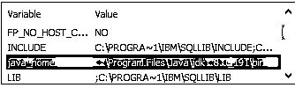

# 朱尼特罐

> 原文：<https://www.educba.com/junit-jar/>


## JUnit Jar 简介

JUnit 是一个开源框架，用于测试基于 java 的应用程序。JUnit 是一个根据需求执行可重复测试用例的简单框架。换句话说，我们可以说它是 xUnit 的一个实例，用于对应用程序执行单元测试。市场上有不同的版本，我们称之为新版本和更新版本。我们需要在项目中导入 JUnit jar。我们可以使用 JUnit，也可以访问 JUnit 的特性。

### 什么是 JUnit jar？

通常 JUnit 用于 java 应用程序。JUnit 在测试驱动的事件转变的发展中起着重要的作用，它是一组单元测试结构中的一个，从各方面考虑，被称为 xUnit，它始于 JUnit。JUnit 用于任务单元测试，同时使用 java。

<small>网页开发、编程语言、软件测试&其他</small>

测试是查看应用程序的有用性以保证它根据先决条件运行的最常见方式。单元测试在设计者的层次上出现，尝试单一的物质(类或策略)。单元测试承担了一个基本的部分，帮助产品公司向客户传达高质量的项目。它承担了测试驱动事件转变的关键部分，是一组被称为 xUnit 的单元测试结构。JUnit 提出了“先测试，然后在那时编码”的可能性，强调为一段代码建立测试信息，这段代码可以先测试，然后再执行。这种方法就像“测试一点，编码一点，测试一点，编码一点。”它扩展了开发者的有用性和程序代码的坚固性，减轻了软件工程师的负担和花费在故障诊断上的时间。

现在让我们来看看 JUnit 的一些特性，如下所示。

*   解释区分测试技术。
*   给测试冲刺者运行测试。
*   JUnit 测试允许您更快地编写代码，这是可扩展的
*   使用 JUnit 可以在更短的时间内执行测试用例，这意味着我们可以获得最低限度的准确性。
*   JUnit 测试可以自然运行；他们审视自己的成果，并立即给予批评。但是，另一方面，没有令人信服的理由来筛选实验结果的报告。
*   JUnit 以绿色条显示测试进度，假设测试按预期进行，当测试失败时，它变成红色。

现在让我们看看为什么需要使用 JUnit，如下所示。

我们知道 JUnit 不过是代码，用指定的格式来达到快速的效果，所以那个时候，我们就可以用 JUnit 了。然而，JUnit 提供了一种不同的功能来确保测试用例的结果、验证、测试用例的确认等。

### JUnit jar 设置

现在让我们看看如何设置 JUnit jar。

在设置 JUnit jar 之前，我们需要在本地机器上做一些验证，如下所示。

1.  首先，我们需要使用下面的命令来验证本地机器上的 Java 安装。

java 版本

**解释**

我们在执行上面的命令后得到版本 java，如下面的截图所示。


上述命令的执行和语法取决于操作系统。

*   第二步，我们需要设置 JAVA 环境变量 path 该路径取决于用户的本地环境。出于示例目的，如下图所示。




*   我们需要从官网下载 JUnit Jar 文件来写测试用例；在这里，我们可以根据需要下载任何版本的 Jar 文件。
*   完成下载后，我们需要根据例如的位置设置 JUnit 环境变量 path，如下面的屏幕截图所示。


*   现在，出于示例目的，在 JUnit jar 所在的位置设置 classpath 变量，如下面的屏幕截图所示。


现在让我们来看一个简单的例子，以便更好地理解。

首先，我们必须创建一个简单的 java 类，并编写以下代码。

```
package com.datap;
import static org.junit.Assert.assertEquals;
import org.testng.annotations.Test;
public class sample {
@Test
public void stringcomparison() {
String  x = "ASasasasss12323SASJASAS ";
assertEquals("ASasasasss12323SASJASAS ",x);
}
}
```

**解释**

我们编写一个简单的测试用例来使用 assertEquals 匹配字符串，如上面的代码所示。

我们需要编写 TestRunner 类来执行测试用例，如下所示。

```
import org.junit.runner.JUnitCore;
import org.junit.runner.Result;
import org.junit.runner.notification.Failure;
public class TRunner {
public static void main(String[] args) {
Output output= JUnitCore.runClasses(TestJunit.class);
for (Failure failure : output.getFailures()) {
System.out.println(failure.toString());
}
System.out.println(output.wasSuccessful());
}
}
```

**解释**

我们编写 test runner 类来验证上面代码中的结果。我们用下面的屏幕截图展示了上述类的最终输出。


### 如何使用 JUnit jar？

现在让我们看看如何使用 JUnit jar，如下所示。

我们已经讨论了使用 JUnit Jar 需要遵循的步骤。

首先，我们需要验证 java 的所有先决条件，然后设置上面提到的不同路径并创建一个单独的类，或者我们可以像上面的例子一样添加 test runner 类来验证 JUnit 结果。

使用以下步骤执行 JUnit 测试，如下所示。

1.  右键单击 java 类。
2.  选择 run as 选项，并单击 JUnit Test 选项。

### 结论

我们希望通过这篇文章，您能够了解更多关于 JUnit Jar 的知识。从上面的文章中，我们已经理解了 JUnit Jar 的基本思想，我们还看到了 JUnit Jar 的表示和示例。此外，本文还告诉我们如何以及何时使用 JUnit Jar。

### 推荐文章

这是一个 JUnit Jar 的指南。这里我们讨论了 JUnit Jar 的基本思想，我们还看到了表示和示例。您也可以阅读以下文章，了解更多信息——

1.  朱尼特木星
2.  [JUnit 版本](https://www.educba.com/junit-version/)
3.  [JUnit 注释](https://www.educba.com/junit-annotations/)
4.  [JUnit 规则](https://www.educba.com/junit-rule/)


