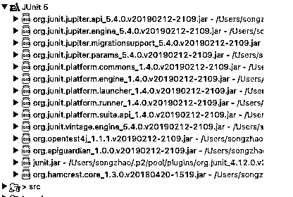
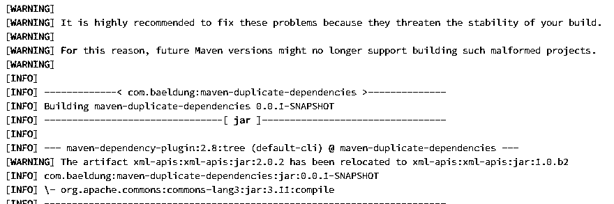
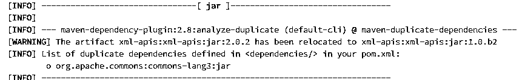

# JUnit 依赖性

> 原文：<https://www.educba.com/junit-dependency/>


## JUnit 依赖关系介绍

JUnit 是一个 API 依赖，用于提供公共 API；在这个 API 的帮助下，我们可以用 JUnit 5 的扩展来编写测试。换句话说，我们可以说 JUnit 依赖提供了执行使用 JUnit 5 的测试用例的正确路径。JUnit 是一个开源框架，用于测试基于 java 的应用程序。JUnit 是一个根据需求执行可重复测试用例的简单框架。换句话说，我们可以说它是 xUnit 的一个实例，用于对应用程序执行单元测试。

### 什么是 JUnit 依赖？

stage 负责发送 JVM 上的测试系统。它体现了 JUnit 与其客户(例如制造设备)之间稳定而强大的互动点。stage 有效地协调客户机和 JUnit 来查找和执行测试。

<small>网页开发、编程语言、软件测试&其他</small>

它同样描述了 TestEngine API 的特性，用于培养一个突然增加 JUnit 阶段需求的测试系统。通过执行定制的 TestEngine，我们可以将外部测试库插入 JUnit。

通过将 JUnit-Jupiter reliance 添加到测试范围中，我们可以根据先决条件获得所需的条件。这是一个集合器古董，它改进了对电路板的依赖，因为它具有附带的传递条件:

JUnit-Jupiter 编程接口 reliance(汇编范围)提供了公共 API 来编写测试和扩充。

JUnit-Jupiter-params reliance(聚合度)为编写定义的测试提供了帮助。

JUnit-Jupiter-motor reliance(运行时范围)包含运行我们的单元测试的 JUnit Jupiter 测试马达的执行。假设我们将这种依赖性添加到我们的类路径中，Maven Surefire 和 Failsafe 模块(2.22.0 或更高版本)可以运行使用 JUnit 5 的测试。

### 如何添加 JUnit 依赖？

现在让我们看看如何添加 JUnit 依赖，如下所示。

有两种方法可以将依赖项添加到项目中，如下所示。

首先，我们可以通过以下步骤在 java 项目中添加 jar 文件。

1.  首先，我们需要在 eclipse 中创建一个 maven 项目。
2.  点击项目的属性。
3.  之后，我们需要点击 Java 构建路径。
4.  在弹出窗口中单击“库”选项卡。
5.  单击添加库按钮。
6.  从本地机器中选择 JUnit 库。
7.  单击下一步并应用按钮。
8.  最后，单击保存按钮。

第二种方法，我们需要创建 maven 项目，在这里，我们可以在 pom.xml 文件中添加 JUnit 依赖项，如下所示。

```
<dependency>
<groupId>org.JUnit.jupiter</groupId>
<artifactId>JUnit-jupiter-engine</artifactId>
<version>5.4.0</version>
</dependency>
<dependency>
<groupId>org.JUnit.platform</groupId>
<artifactId>JUnit-platform-runner</artifactId>
<version>${JUnit.platform.version}</version>
<scope>test</scope>
</dependency>
<dependency>
<groupId>org.JUnit.platform</groupId>
<artifactId>JUnit-platform-launcher</artifactId>
<version>${JUnit.platform.version}</version>
<scope>test</scope>
</dependency>
```

但是上面的专家条件设计可能会抛出一个错误，比如遗漏了古代稀有组织。JUnit . platform:JUnit-stage runner:jar:5 . 4 . 0。您可以在< dependency> XML 组件的开头看到这个错误，当您将鼠标放在这个错误上时，它会显示这个错误消息。

这个错误意味着没有古董组织。JUnit . platform:JUnit-stage runner:jar:5 . 4 . 0 在焦点专家金库。因此，您应该为 reliance 添加当前的 JUnit reliance 容器记录再现。

现在，您可以按照 2.1 节将 JUnit 独立库容器记录添加到您的模糊任务中，然后，在这一点上，在 venture name/JUnit 5 子文件夹下找到连接的容器变体。




### JUnit 依赖项删除

首先，我们必须在命令行上运行依赖树命令。

```
mvn dependency:tree
```

我们将获得 pom.xml 文件中存在的所有重复的依赖项。这里，我们得到一个关于 pom.xml 中复制条件的警告。我们还注意到，尽管有更高的版本 3.12.0 可用，但 center lang3.jar 的 rendition 3.11 还是被添加到了任务中。这是因为 Maven 选择了后来出现在 pom.xml 中的 reliance，如下图所示。




现在我们需要分析终端上重复的命令

```
mvn dependency:analyze – duplicate
```

以上命令的最终结果如下面的截图所示。




### 示例项目

现在让我们看一个 JUnit 依赖的例子，以便更好地理解。

这里我们创建了 maven 项目，在 pom.xml 文件中，我们添加了所有必需的 JUnit 依赖项。

只需创建一个类似示例演示的类文件，然后粘贴以下代码。

```
package com.demo;
import static org.JUnit.Assert.assertTrue;
import org.JUnit.After;
import org.JUnit.AfterClass;
import org.JUnit.Before;
import org.JUnit.BeforeClass;
import org.JUnit.Test;
public class sampledemo  {
@BeforeClass
public static void beforeClassmethod() {
System.out.println("Hi welcome in Before Class Method");
}
@Before
public void beforemethod() {
System.out.println("Before Test Case strategy ");
}
@Test
public void Test() {
System.out.println("Welcome in First Test");
}
@After
public void aftermethod() {
System.out.println("Hi welcome in After Test Case");
}
@AfterClass
public static void afterClassmethod() {
System.out.println("Hi welcome in After Class");
}
}
```

**解释**

在上面的例子中，我们试图涵盖 JUnit 注释，如上面的代码所示。我们使用下面的屏幕截图展示了上述实现的最终输出。


在另一个例子中，我们可以创建一个简单的 java 项目，并添加我们需要的整个外部 jar。现在让我们来看看如下的实现。

首先，我们必须创建一个简单的 java 类，并编写以下代码。

```
package com.datap;
import static org.JUnit.Assert.assertEquals;
import org.testng.annotations.Test;
public class sample {
@Test
public void stringcomparison() {
String  x = "ASasasasss12323SASJASAS ";
assertEquals("ASasasasss12323SASJASAS ",x);
}
}
```

**解释**

我们编写一个简单的测试用例来使用 assertEquals 匹配字符串，如上面的代码所示。

我们需要编写 TestRunner 类来执行测试用例，如下所示。

```
import org.JUnit.runner.JUnitCore;
import org.JUnit.runner.Result;
import org.JUnit.runner.notification.Failure;
public class TRunner {
public static void main(String[] args) {
Output output= JUnitCore.runClasses(TestJUnit.class);
for (Failure failure : output.getFailures()) {
System.out.println(failure.toString());
}
System.out.println(output.wasSuccessful());
}
}
```

**解释**

我们编写 test runner 类来验证上面代码中的结果。我们用下面的屏幕截图展示了上述类的最终输出。


### 结论

我们希望从这篇文章中，您能学到更多关于 JUnit 依赖的知识。从上面的文章中，我们已经理解了 JUnit 依赖的基本思想，并且看到了 JUnit 依赖的表示和例子。此外，本文还告诉我们如何以及何时使用 JUnit 依赖项。

### 推荐文章

这是一个关于 JUnit 依赖的指南。在这里，我们将讨论定义以及如何添加 JUnit 依赖项以及一个示例项目。您也可以看看以下文章，了解更多信息–

1.  [JUnit Maven 依赖关系](https://www.educba.com/junit-maven-dependency/)
2.  [JUnit 5 Maven 依赖](https://www.educba.com/junit-5-maven-dependency/)
3.  [JUnit 参数化测试](https://www.educba.com/junit-parameterized-test/)
4.  [JUnit 测试套件](https://www.educba.com/junit-test-suite/)


