# JUnit 失败

> 原文：<https://www.educba.com/junit-fail/>

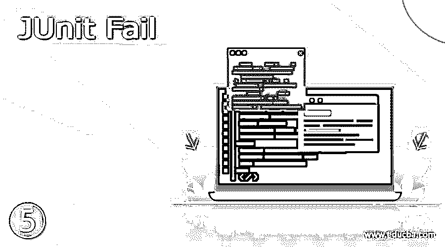


## JUnit 失败的定义

Junit 失败断言方法通过抛出断言错误使测试失败，失败方法在 junit 版本 4 中使用，它将使用 org.junit.Assert 类。junit fail 方法用于在开发时验证实际的异常是否会抛出错误或者测试是否会失败。junit 失败断言将失败，同时抛出无条件的断言错误。

### JUnit 失败概述

*   在编写单元测试用例时，我们使用 junit fail 方法在测试条件下创建失败。fail 方法对于标记一个不完整的测试很有用，或者我们确保我们预期的异常将抛出一个错误。
*   当 junit 断言错误发生时，我们的测试将停止执行，并且不会执行任何断言。如果假设测试包含单个断言，那么这就不是问题。但是如果假设测试包含多个断言，我们的测试就会受到限制，它会在断言失败后运行这些断言。

### 使用 JUnit 失败

*   假设我们想抛出一个错误，我们可以使用 fail 方法，这将导致一个判决失败。
*   我们还可以在 fail 方法中使用附加参数。我们可以使用带有字符串参数的断言方法，它是 junit 中使用 fail 方法的第一个参数。
*   如果假设断言失败，我们使用的字符串消息将被追加到失败消息中。我们可以通过使用下面的方法在断言中写一个失败消息如下。

*   我们可以通过两种方式使用 fail 方法，一种是提供消息，另一种是不在输出中提供消息。
*   失败方法将只包含一个参数，该参数是一条消息，除了用于标识断言错误的消息之外，它什么也不是。fail 方法对于测试应用程序的失败标准是非常有用和重要的。
*   下面的例子显示了如何使用 fail 如下。在下面的例子中，我们如下使用 JunitFail 类。在下面的例子中，我们使用了 junitfail 方法，也使用了 try 和 catch 块来捕捉程序执行时发生的任何异常。在 catch 块中，我们使用 fail 方法来定义 fail 方法的使用，

**代码:**

<small>网页开发、编程语言、软件测试&其他</small>

```
public class JunitFail {
   private void junitfail () {
         try {
            java.lang.reflect.Field fie = SpelExpression.class.getField ("Junit Fail");
         }
        catch (Exception ex) {
          fail (ex.toString ());
        }
     }
```


*   我们也可以将 fail 方法与 test 方法一起使用。以下示例显示了@Test 注释与 fail 的用法，如下所示。在下面的例子中，我们可以看到我们在 fail 方法中使用了@Test 和@DisplayName 注释。我们还定义了 junitfailtest 方法来定义 fail 方法。

**代码—**

```
public class JunitFail {
@Test
@DisplayName ("Junit Fail")
void junitfailtest () {
fail ("Junit fail with assertion");
}
}
```

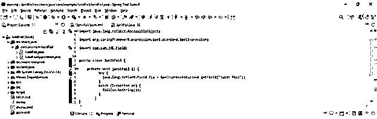


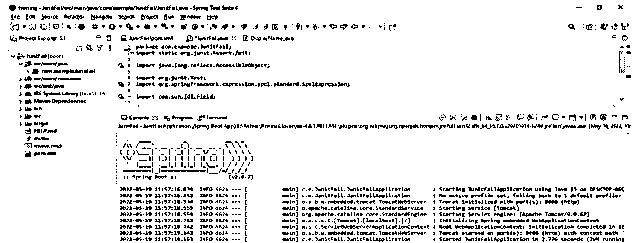


### JUnit 失败方法

*   我们可以在 junit 中演示 fail 方法。fail 方法抛出一个无条件的错误。当标记一个未完成的测试或者我们需要确保异常将抛出一个错误时，Fail 方法是有帮助的。
*   我们还可以在 fail 方法中使用@DisplayName 注释。为了使用 fail 方法创建测试用例，我们也可以使用@Test 注释。
*   在 junit 中，我们可以使用多种断言方法。fail 方法是 junit 中使用的断言方法之一。在使用 junit 编写测试用例时，我们需要使用最合适的断言方法。
*   下面的例子显示了失败的方法如下。在下面的例子中，我们使用两个代码来定义失败方法。首先，我们将类名实现为 Junit1。

**代码 1—**

```
public class Junit1 {
       if (a < 0) {
        throw new Exception();
       }
    }
}
```


**代码 2—**

```
public class Junit2 {
   Junit1 junit1;
@Before
public void setUp () {
junit1 = new Junit1 ();  }
@Test
public void failTest () throws Exception {
   if (junit1 == null){
     fail ("Junit1 is null"); }
   try {
        junit1.method(-1);
      fail("Junit fail");
   } catch (Exception e) {
} 
} 
}
```

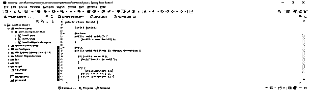


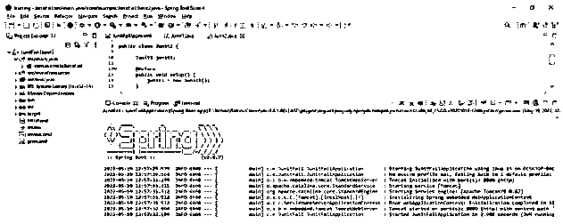


### 例子

*   下面的步骤显示了失败方法的例子如下。我们将项目命名为 JunitFail。
*   在这一步中，我们将创建 junit fail in spring boot 的项目模板。我们提供项目组名为 com.example，工件名为 JunitFail，项目名为 JunitFail，选择的 java 版本为 11。我们将 spring boot 的版本定义为 2.6.7。

group–com . example 工件名称–JUnit fail

名称–JUnit fail 弹簧靴–2 . 6 . 7

项目–Maven Java–11

包名–com . example . JUnit fail

项目描述 JunitFail 项目

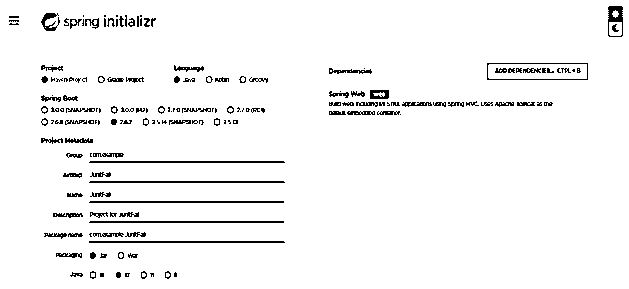


*   在这一步中，我们提取下载的项目，并使用 spring 工具套件打开它，如下所示。

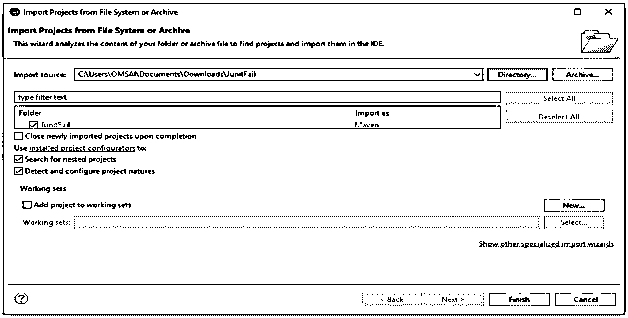


*   在这一步，我们检查所有的项目结构和它的文件如下。此外，我们正在检查 pom.xml 文件是否已创建。假设没有创建这个文件，那么我们需要手动创建相同的文件。在下面的例子中创建了这个文件，所以我们不需要手动创建它。

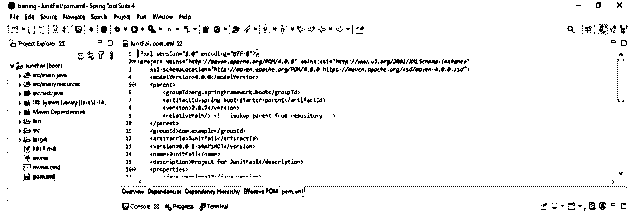


*   在这一步中，我们将在 junit 框架中添加 junit 依赖关系我们将添加 junit 依赖关系。

**代码—**

```
<dependencies>
<dependency>
     <groupId> org.junit.jupiter </groupId>
     <artifactId> junit-jupiter-engine </artifactId>
     <version> 5.3.1 </version>
     <scope> junit- fail </scope>
</dependency>
<dependency>
   <groupId> junit </groupId>
   <artifactId> junit </artifactId>
   <version> 4.12 </version>
</dependency>
</dependencies>
<reporting>
<plugins>
<plugin>
   <groupId> org.apache.maven.plugins </groupId>
   <artifactId> maven-surefire-report-plugin </artifactId>
   <version> 2.19.1 </version>
</plugin>
</plugins>
</reporting>
```

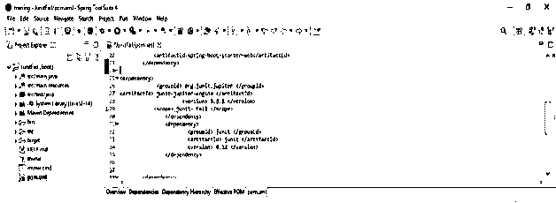


*   在下面的例子中添加了依赖关系后，我们将 fail 定义如下。

**代码—**

```
public class JunitFail_Example {
@Test
public void returnBefore () {
int val = junitexample ();
fail ("junit fail example");
}
private int junitexample() {
return 0;
}
}
```

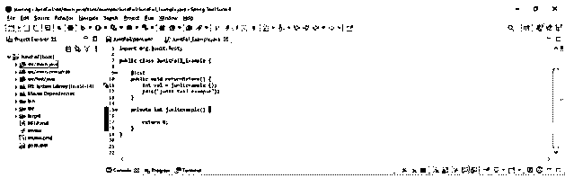


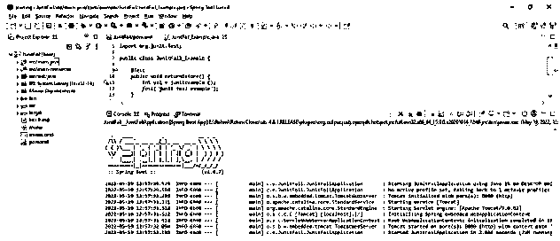


### 结论

当 junit 断言错误发生时，我们的测试将停止执行，并且不会执行任何断言。Junit 失败断言方法通过抛出断言错误使测试失败，失败方法在 junit 版本 4 中使用，它将使用 org.junit.Assert 类。

### 推荐文章

这是一个 JUnit 失败的指南。这里我们讨论定义、概述、如何使用、方法和代码实现示例。您也可以看看以下文章，了解更多信息–

1.  朱尼特木星
2.  [JUnit 注释](https://www.educba.com/junit-annotations/)
3.  [JUnit 规则](https://www.educba.com/junit-rule/)
4.  [JUnit assertEquals](https://www.educba.com/junit-assertequals/)


