# JUnit 断言

> 原文：<https://www.educba.com/junit-assert/>

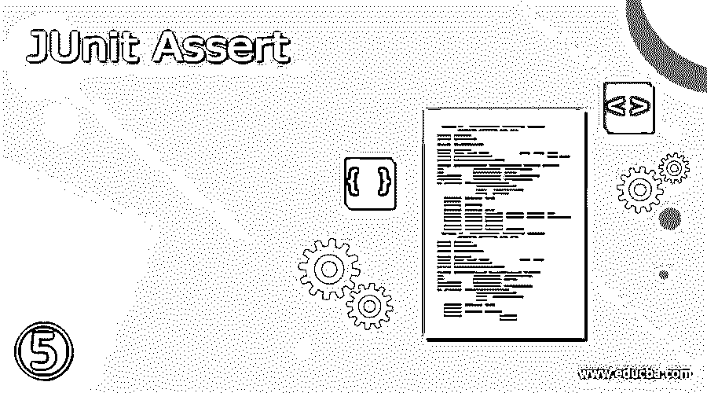


## JUnit 断言的定义

这是一种用于确定测试用例的通过和失败状态的方法。这个方法是由类名 org 提供的。用于扩展 java.lang.Object 类的 JUnit.Assert。JUnit 中有多种类型的断言可用，比如 null、identical 和 Boolean。基本上，JUnit 以 assert 的形式提供类名，assert 提供断言的方法。

### JUnit 断言概述

*   基本上，JUnit 以 assert 的形式提供了类方法名，这将提供一堆断言方法，这些方法在编写测试用例时很有用，并用于检测测试。
*   它是用于支持测试中断言条件的实用程序。所有的方法都可以通过 assert 类来访问。在 JUnit4 版本中可以访问 assert 类，在 JUnit5 中可以访问断言。
*   为了增加测试和断言的可读性，我们使用了 JUnit。我们需要统计地导入各自的类。

### 使用 JUnit 断言

*   在 JUnit4 版本中，断言库可用于所有原始数据类型。JUnit4 断言中提供了数组和对象。
*   断言中参数的顺序是期望值，后跟实际值。第一个参数可选消息是，它表示消息的输出。
*   我们可以说 assert 是 JUnit 的 API 或函数库的函数，通过它我们可以验证在执行测试时特定的条件或逻辑将返回 true 还是 false。如果假设值将返回 false，那么断言将抛出错误。
*   这是用来做好单元测试的一个重要特性。我们可以说，它帮助我们用我们在应用程序中定义的特定测试用例的预期输出来验证实际输出。
*   编写 JUnit 断言是修复和检测 bug 的一种非常有效和快速的方法。它会给我们信心，让我们相信我们在特定条件下的假设是正确的。
*   很多时候，断言会作为函数调用的前提条件，或者也可以在条件下工作。JUnit 4 和 JUnit 5 将包含不同的类，这些类包含不同的方法。
*   JUnit 4 将包含 assert 类中的所有 assert 方法，而 JUnit 5 包含 assert 类中的所有 assert 方法。
*   JUnit 5 的包是通过使用 org 导入的。JUnit.jupiter.api.assertions，JUnit 4 的包是通过使用 org.JUnit.assert 导入的。

在下面的例子中，我们使用的是 JUnit 4 assert 类。在下面的例子中，我们使用@Test 方法来测试类。在下面的例子中，我们使用 JUnit 4 assert，所以我们使用包名 org.JUnit.assert。

<small>网页开发、编程语言、软件测试&其他</small>

**代码—**

```
public class JUnit_assert {
@Test
public void test () {
fail ("Test case is failing");
}
}
```

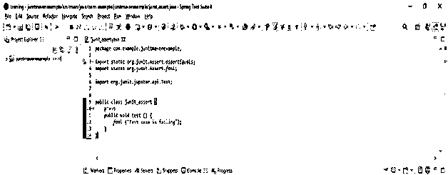


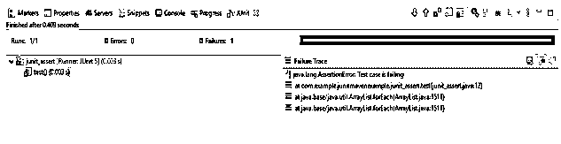


### JUnit 断言方法

*   这个类提供了许多断言方法，这些方法对于编写测试用例非常有用。通过使用这种方法，我们只记录失败的断言。在 JUnit 中，所有断言都包含 assert 类。
*   在使用 assert 方法测试应用程序时，我们使用 fail 方法来测试应用程序。

以下是可用的方法。

*   **Void assert equals**–该方法用于检查两个对象是否相等。此方法包含实际和预期的布尔对象。
*   **Void assert true**–该方法用于检查真实情况。此方法包含布尔条件对象。
*   **Void assert False**–该方法用于检查 false 条件。此方法包含布尔条件对象。
*   **Void assertNotNull**–该方法用于检查对象不为空。此方法包含对象条件。
*   **Void assert null**–该方法用于检查对象是否为空。此方法包含对象条件。
*   **Void assert same**–这个方法将测试指向同一个对象的两个对象引用。此方法包含两个对象。
*   **Void assertNotSame**–这个方法将测试两个没有指向同一个对象的对象引用。此方法包含两个对象。
*   **Void assertArrayEquals**–该方法用于检查我们的两个数组是否相等。此方法包含实际和预期的数组对象。

### JUnit 断言示例

*   下面的例子展示了 JUnit 的 assert 示例，如下所示。我们将项目名称创建为 JUnit_assert。
*   在这一步中，我们将在 spring boot 中创建项目模板。我们提供的项目组名称为 com。例如，工件名为 JUnitassert，项目名为 JUnitassert，选择的 java 版本为 11。我们将 spring boot 的版本定义为 2.6.7。

group–com . example 工件名称–JUnitassert

名称–JUnitassert 弹簧靴–2 . 6 . 7

项目–Maven Java–11

包名–com . example . JUnitassert

项目描述 JUnitassert 项目

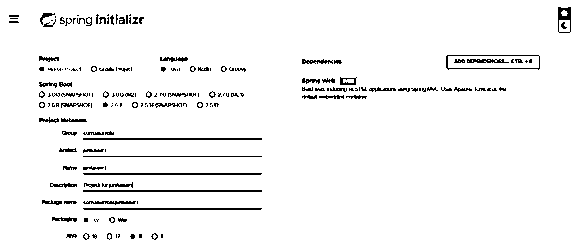


*   在这一步中，我们提取下载的项目，并使用 spring 工具套件打开它。

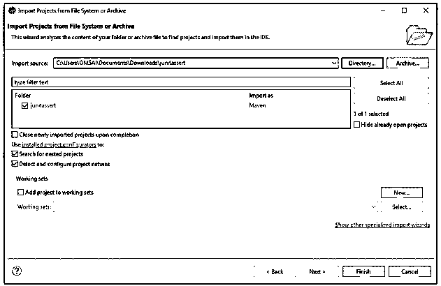


*   在这一步中，我们检查所有的项目结构，它们的文件如下。此外，我们正在检查 pom.xml 文件是否已创建。

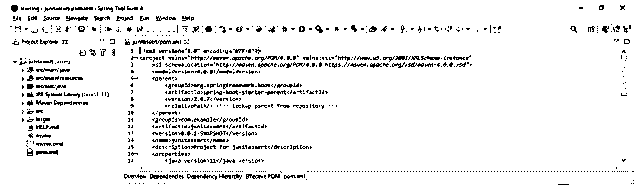


*   在 JUnit assert 项目中添加 JUnit 依赖项。我们正在添加 JUnit 依赖，如下所示。

**代码:**

```
<dependency>
<groupId> org.JUnit.jupiter </groupId>
<artifactId> JUnit-jupiter-engine </artifactId>
<version> 5.3.1 </version>
<scope> JUnit-assert </scope>
</dependency>
```

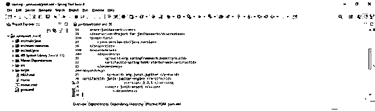


*   下面的示例显示了如下的 equal 方法。

**代码:**

```
public class JUnitassert1 {
@Test
public void test () {
int p=115;
int q=20;
int del=25;
assertEquals ("P value: "+p+ " Q value "+q+ " Difference:"+del, p, q, del);
}
}
```

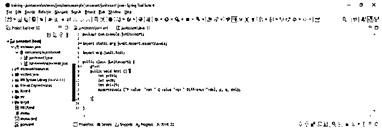


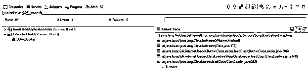


*   下面的示例显示了如下的 false 方法。

**代码:**

```
public class JUnitassert1 {
@Test
public void test() {
int p=10;
boolean val;
if(p<20) {
val=true;
}
else {
val=false;
}
assertFalse (val);
}
}
```

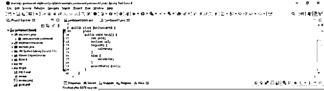


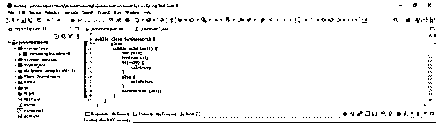


### 结论

它是用于支持测试中断言条件的实用程序。所有的方法都可以通过 assert 类来访问。这是一个由类名 org 提供的方法。用于扩展 java.lang.Object 类的 JUnit.Assert。

### 推荐文章

这是 JUnit Assert 的指南。这里我们讨论定义、概述、如何使用、方法和代码实现示例。您也可以看看以下文章，了解更多信息–

1.  [JUnit 代码覆盖率](https://www.educba.com/junit-code-coverage/)
2.  [JUnit 断言异常](https://www.educba.com/junit-assert-exception/)
3.  朱尼特木星
4.  [JUnit assertEquals](https://www.educba.com/junit-assertequals/)


