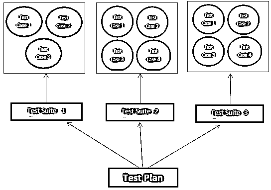
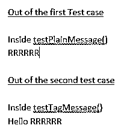

# JUnit 测试套件

> 原文：<https://www.educba.com/junit-test-suite/>

## JUnit 测试套件简介

在 JUnit 的应用程序测试场景中，可能有这样一种情况，即多个测试用例需要捆绑在一起，并一次性执行。JUnit 中的测试套件以简单无缝的方式促进了这种捆绑。

测试套件中的测试用例可以是同质的，也可以是异质的。例如，一个测试套件可以只包含冒烟测试用例/功能测试用例/性能测试用例，也可以包含所有测试用例的任意组合。通常情况下，测试用例按照应用程序生命周期的顺序进行分组，在某些场景中，操作范围相似的测试用例被分组在一起。一个测试用例可以在多个测试套件中找到位置。一个测试计划将有多个测试套件，每个套件将有多个测试用例。

<small>网页开发、编程语言、软件测试&其他</small>

### 如何创建测试套件？

如何创建测试套件和测试计划的图形表示。

各种测试用例根据开发人员决定的一些独特性分组在一起。它可以与应用程序模块的一个场景的多个功能相关，或者与应用程序中的一个功能相关的一系列测试用例。在一个应用程序中可以有不同的测试套件，它们可以成为一个由开发/测试团队管理的测试计划。如上所述，一个测试套件可以执行许多测试用例，任何新的用例都可以被动态地添加并执行

`TestSuite oursuite = new TestSuite();
oursuite.addtest(new xxxTest(“testMultiply”));
oursuite.addtest(new xxxTest(“testDivide”));`

或者它也可以自动提取测试用例并执行它们。testcase 类必须被传递给 TestSuite 的构造函数。

`Testsuite oursuite = new Testsuite(xxxTest.class);`

构造函数创建了我们的套件，其中包含了必要的方法。

作为测试套件的一部分，必须创建一个带有@SuiteClasses 和@RunWith 注释的 Java 类，这将在下面的示例中详细解释。

### 创建测试套件的步骤

在创建测试套件时，可以遵循以下步骤

首先，准备好需要 Testuite 测试的类。要测试的类可以是应用程序的一部分，也可以是跨多个应用程序使用的 ac 关键例程。

*   根据需要创建尽可能多的测试用例类
*   必须创建测试套件类。它是一个带有注释引用@RunWith 的 Java 类。
*   测试套件中调用的测试类必须使用注释@Suite 来引用。套装类
*   使用测试用例的多种组合创建尽可能多的测试套件。
*   要执行测试套件，请创建一个测试运行程序类并验证输出。

### 使用的方法及其细节

| **方法名** | **访问说明符，返回类型** | **详情** |
| --- | --- | --- |
| addTest(测试，测试) | 空的 | 此方法将测试添加到套件中 |
| addTestMethod | 私人空间 | 宣布细节 |
| addTestSuite | 空的 | 它将测试类添加到套件中 |
| countTestCases | 整数 | 返回将被执行的测试用例的数量 |
| 创建测试 | 静态试验 | 定义测试用例 |
| 异常字符串 | 私有静态 | 堆栈跟踪被转换为字符串 |
| getName | 线 | 该方法返回套件的名称 |
| GetTestConstructor | 静态 | 返回带单个参数或不带参数的构造函数 |
| 奔跑 | 空的 | 运行测试套件，并在 TestResult 中收集结果 |
| 集合名称 | 空的 | 套件的名称在这里设定 |
| 测试于 | 试验 | 测试在指定的索引处返回 |
| 测试计数 | 整数 | 返回套件中包含的测试数量 |
| 试验 |  | 将测试作为枚举返回 |
| 警告 | 私有静态 | 该方法返回测试用例，该测试用例可能会预先失败作为警告 |

### 例子

创建一个需要测试的 Java 类。这个类接受一个文本，并按原样打印它，还打印带有标签的文本。

`/*
* This class prints the given message on console.
*/
public class MessPrintx {
private String messagex;
//Constructor
//Test that is passed has to be printed
public MessPrintx(String messagex){
this.messagex = messagex;
}
// prints the message as it is
public String plainMessage(){
System.out.println(messagex);
return messagex;
}
// tag "Hello!" to the message and then prints it
public String tagMessage(){
messagex = "Hello!" + messagex;
System.out.println(messagex);
return messagex;
}
}
Creating first test case -1
import org.junit.Test;
import org.junit.Ignore;
import static org.junit.Assert.assertEquals;
// test case 1 – TestJunit11
public class TestJunit11 {
String messagex = "RRRRRR";
MessagePrintx messagePrintx = new MessagePrintx(messagex);
@Test // Annotation
public void testPlainMessage() {
System.out.println("Inside testPlainMessage()");
assertEquals(messagex, messagePrintx.plainMessage());
}
}
Creating second test case – 2
import org.junit.Test;
import org.junit.Ignore;
import static org.junit.Assert.assertEquals;
// Test case -2 TestJunit22
public class TestJunit22 {
String messagex = "RRRRRR";
MessagePrintx messagePrintx = new MessagePrintx(messagex);
@Test // annotation
public void testTagMessage() {
System.out.println("Inside testTagMessage()");
messagex = "Hello!" + "RRRRRR";
assertEquals(messagex,messagePrintx.tagMessage());
}
}
Creating Test Suite
import org.junit.runner.RunWith;
import org.junit.runners.Suite;
@RunWith(Suite.class) // Annotation is attached
@Suite.SuiteClasses({ // Another annotation is attached
TestJunit11.class,
TestJunit22.class
})
public class JunitTestSuitex {
}
Creating Runner Class to execute the test
import org.junit.runner.JUnitCore;
import org.junit.runner.Result;
import org.junit.runner.notification.Failure;
// Actual execution starts from this line using JunitTestSuitex class defined earlier
public class TestRunner {
public static void main(String[] args) {
Result result = JUnitCore.runClasses(JunitTestSuitex.class);
for (Failure failure : result.getFailures()) {
System.out.println(failure.toString());
}
System.out.println(result.wasSuccessful());
}
}`

**执行时的结果**

### 结论

JUnit Test Suite 减少了开发人员和测试人员一次性测试各种应用程序场景的工作量，从而提高了他们的工作效率。通过这种测试用例的组合，总的测试时间以及上市时间明显下降，产品的准确性在更大程度上得到了提高。

### 推荐文章

这是 JUnit 测试套件的指南。这里我们讨论定义，如何创建测试套件？代码实现示例。您也可以看看以下文章，了解更多信息–

1.  [JUnit 版本](https://www.educba.com/junit-version/)
2.  [JUnit Maven 依赖关系](https://www.educba.com/junit-maven-dependency/)
3.  [JUnit 注释](https://www.educba.com/junit-annotations/)
4.  [Java JUNIT](https://www.educba.com/course/java-junit-learn-junit-in-easy-steps/)

