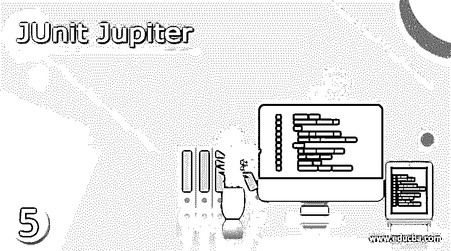

# 朱尼特木星

> 原文：<https://www.educba.com/junit-jupiter/>




## 朱尼特木星是什么？

JUnit Jupiter 为开发测试和扩展提供了新的编程和扩展模型。它是 JUnit 5 和 JUnit Platform 的关键组件，JUnit Platform 是一个基础测试框架，它和经典的 JUnit Vintage 组件一起为执行基于 JUnit 3 / JUnit 4 的测试提供了必要的测试引擎。

除了作为一个扩展模型，JUnit Jupiter 还提供了一个 TestEngine 来在这个平台上执行基于 Jupiter 的测试。这些测试引擎为各种编程模型识别正确的测试，并使用它们自己的 ID 执行它们，发现由引擎恢复请求提供的测试。

<small>网页开发、编程语言、软件测试&其他</small>

### 用 JUnit Jupiter 编写测试

测试是在 Jupiter 中作为一种方法开发的，包含在用于测试的专用类中。这个类被称为测试类。为了将一个方法标识为测试方法，必须有一个注释@Test。该方法下的代码在测试期间执行。

在代码中使用 Assert 方法来验证实际结果和预期结果，这样的 assert 语句还可以在测试失败时显示消息。开发人员可以在创建测试时编写有意义的消息，这样用户就可以很容易地理解错误消息并采取行动。

### JUnit Jupiter 框架

注释和断言方法是 JUnit Jupiter 框架最重要的组成部分。

| **标注** | **描述** |
| --- | --- |
| @测试 | 这个注释清楚地表明主题方法是一个测试方法。Jupiter 中的 Test Extension 有自己的注释，因此这个注释不像 JUnit 4 那样声明任何属性。除非被重写，否则这些方法通常会被继承。 |
| @TestFactory | 此方法用于动态测试，除非被重写，否则通常会被继承。 |
| @重复测试 | 这个方法充当了重复执行测试的模板。 |
| @ParameterizedTest | This indicates that this method enables executing the same test multiple times using different datasets. |
| @TestTemplate | 该方法是测试用例的模板，根据注册提供者返回的调用上下文被多次调用。 |
| @TestClassOrder | 该方法有助于在@Nested 测试类的情况下配置测试执行顺序。这些注释是继承的 |
| @DisplayName | 测试方法或类由自定义显示名称标识。这些注释不会被继承。 |
| @ beforeeach | 它表示这种带注释的方法应该在每个@Test、@ParameterizedTest、@TestFactory 或@RepatedTest 方法之前执行。这个方法在 JUnit 4 中的对等用法是@Before |
| @AfterEach | 它表示应该在每个@Test、@TestFactory、@ParameterizedTest 或@RepatedTest 方法之后执行这种带注释的方法。这个方法在 JUnit 4 中的对等用法是@After |
| @之前所有 | 它表示这种带注释的方法应该在所有@Test、@ParameterizedTest、@TestFactory 或@RepatedTest 方法之前执行。这个方法在 JUnit 4 中的对等用法是@BeforeClass |
| @毕竟 | 它指示这种带注释的方法应该在所有@Test、@ParameterizedTest、@TestFactory 或@RepatedTest 方法之后执行。这个方法在 JUnit 4 中的对等用法是@AfterClass |

### 断言和假设

JUnit 5 中有多个 assert 语句，这使我们能够验证测试结果，并确定代码是否正常工作。它们都是源自包 org . JUnit . Jupiter . API . assertions . *的静态方法。这些断言语句涵盖了相等、真或假、空或非空的测试条件。

| **断言变量** | **用途** |
| --- | --- |
| assertequals | It checks for equal condition of the result returned by the code with the intended value.assertEquals(36，Multiplier.product(6，6)，"失败的结果文本")； |
| assertTrue | It checks whether the given condition is true or not

assertTrue('x' < 'y '，()，"失败的结果文本))；

 |
| assertFalse | It checks whether the given condition is false or otherwiseassertFalse('x' > 'y '，()，"失败的结果文本")； |
| 断言 Null | It verifies whether a  data variable has a null value or notassertNull(Subject，“失败的结果文本”)； |
| assertNotNull | It verifies whether a  data variable has a value or notassertNotNull(Subject，“失败的结果文本”)； |

### 测试异常情况的发生

org。JUnit . Jupiter . API . assertions . expect throws()assert 语句测试在测试过程中会抛出一些异常。它跟踪任何预定义的异常，并在异常发生时提供代码来处理异常。

### JUnit Jupiter 扩展模型

与 JUnit 4 中的扩展点(如 Runner、MethodRule 和 TestRule)不同，Jupiter 扩展模型有一个全面的概念，称为扩展 API。必须注意，这个扩展只是一个标记接口。有各种带有扩展的注册过程，下面将对它们进行简要说明。

*   **声明式注册:**通过用@ExtendWith 标注一个测试方法/测试类/测试接口，开发者可以注册一个或多个扩展。还应该提供类引用来完成扩展注册。
*   **程序化注册:**通过在测试类中用@RegisterExtension 标注字段，开发者可以程序化注册扩展。与只能通过注释进行配置的声明式注册不同，这里可以通过编程方式进行配置。
*   **自动注册:** Java 的 ServiceLoader 机制支持自动检测第三方扩展及其注册。

### 类别和方法

*   **类**

类是顶级类、嵌套类还是静态成员类，它应该至少有一个测试方法，必须包含一个构造函数，并且不应该是抽象的。

*   **方法**

方法被直接注释或用@Test、@ParameterizedTest、@TestTemplate、@RepeatedTest 进行元注释。有些生命周期方法是用@BeforeEach、@BeforeAll、@AfterEach、@AfterALL 进行注释或元注释的

### 例子

```
import static org.junit.jupiter.api.Assertions.fail;
import org.junit.jupiter.api.AfterAll;
import static org.junit.jupiter.api.Assumptions.assumeTrue;
import org.junit.jupiter.api.BeforeEach;
import org.junit.jupiter.api.AfterEach;
import org.junit.jupiter.api.BeforeAll;
import org.junit.jupiter.api.Test;
import org.junit.jupiter.api.Disabled;
class StandardTests {
@BeforeAll
static void initAll() {
}
@BeforeEach
void init() {
}
@Test
void succeedingTest() {
}
@Test
void failingTest() {
fail("Test Fails");
}
@Test
@Disabled("Demo only")
void skippedTest() {
}
```

### 结论

JUnit Jupiter 是现成可用的，易于使用，并且实现简单。它拥有全新的特性，是 JUnit 4 测试用例的改进版本。它有助于开发人员实现更快的项目构建，并有助于有效地管理生命周期。

### 推荐文章

这是朱尼特木星的指南。这里我们讨论什么是 JUnit Jupiter，JUnit Jupiter 框架，方法和例子。您也可以看看以下文章，了解更多信息–

1.  [JUnit 版本](https://www.educba.com/junit-version/)
2.  [JUnit Maven 依赖关系](https://www.educba.com/junit-maven-dependency/)
3.  [JUnit 注释](https://www.educba.com/junit-annotations/)
4.  [TestNG vs JUnit](https://www.educba.com/testng-vs-junit/)


