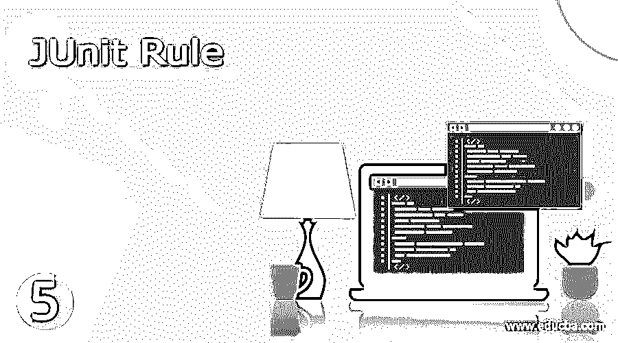

# 朱尼特规则

> 原文：<https://www.educba.com/junit-rule/>

## 什么是 JUnit 规则？

Junit 规则为用户提供了在测试运行前后执行特定功能的控制。该功能包括:在测试用例执行之前创建文件和子目录，并在测试用例完成之后删除它们；对测试用例执行运行时间检查，并在时间超时的情况下中止测试；在执行之前启用数据库连接，并在测试用例执行之后断开连接。

在测试用例开始之前和结束时，可能会有一些所有测试用例共有的例程要执行。这样的例程可以成为 Junit 规则的一部分，可以在所有测试用例中调用。这些 Junit 规则组件必须使用 org.junit.rules.TestRule 接口，这是强制性的。重要的是，Junit 规则字段应该是公共的，而不是静态的，并且应该是 Testrule 子类型之一。

<small>网页开发、编程语言、软件测试&其他</small>

### Junit 规则指南

下面列出了 Junit 中可用于管理测试用例的各种规则的简要说明。

| **Sl** | **规则** | **解释** |
| --- | --- | --- |
| One | 外部资源规则 | 外部资源可以在测试用例开始之前设置，稍后可以删除。通过这个抽象类可以连接到文件或数据库。 |
| Two | 错误收集器规则 | 该规则收集测试用例执行中出现的错误细节。执行不会因为错误而停止，但是测试最终会失败。收集的详细信息将为错误分析和采取纠正措施提供良好的数据 |
| Three | 测试名称规则 | 当测试被执行时，这个规则促进了当前测试用例名称的显示 |
| Four | 验证者规则 | 这条规则帮助开发人员验证测试用例中的一些行为。应该适当地添加额外的验证逻辑来验证预期的活动。 |
| Five | 超时规则 | Earlier developers used to set time-out values through an annotation @Test in each and every test case individually. But this rule helps to set this timeout at a global level which will become applicable for all the test cases uniformly.当测试用例的执行时间超过超时限制时，测试用例会自动失败。 |
| Six | 预期异常规则 | 在测试用例的执行过程中，可能会有许多已知或未知的错误。已知的预期错误可以被捕获在错误处理例程的测试用例模块中。当预期的错误发生时，异常处理例程获得控制，并且执行可以被带到逻辑停止。 |
| Seven | 测试看守规则 | 该规则监控测试用例的性能，并且为每个成功/失败的测试用例维护日志。 |
| Eight | 调试规则时禁用 | 开发人员在调试代码时希望关闭一些规则。当程序在调试模式下执行以完成调试时，应禁用超时规则。这条规则的独特优势在于，当测试用例在正常模式下运行时，它不会改变任何条件。 |
| Nine | 临时文件夹规则 | 它将作为一个单独的主题进行详细讨论 |
| Ten | 应用分类规则 | 所有上述规则将仅在测试用例级别应用，并且可能有一些规则必须应用于所有测试的需求。该规则将有助于应用这些条件，但是该规则中引用的字段应该是静态的。 |
| Eleven | 海关规则 | 到目前为止，我们已经看到内置于 JUnit 的标准规则作为现成的解决方案提供给用户。这些规则涵盖了整个用户群体及其需求。但是某些用户可能会有特定于应用程序的一次性特定需求，这些需求需要通过规则的定制开发来解决。开发人员可以编写自己的规则，并在他们的应用程序中实现它们。 |

### 临时文件夹规则

在上面解释的这么多规则中，让我们详细地研究一下这条规则。

**什么事？**

temporary folder 规则是 Extension Resource 规则的逻辑扩展，该规则使开发人员能够创建运行测试用例所需的文件、文件夹和子文件夹。在测试用例执行期间创建的工作数据可以存储在这些文件和文件夹中，并且一旦执行结束，这些过渡或临时文件/文件夹可以被删除。

通常，文件或文件夹将被删除，此规则不会检查删除是否成功，也不会引发任何异常。

**使用的方法**

方法名访问说明符，返回类型详细信息。

| **方法名** | **访问说明符，返回类型** | **详情** |
| --- | --- | --- |
| 在()之后 | 受保护的空隙 | 删除外部资源的覆盖功能 |
| 之前() | 受保护的空隙 | 设置外部资源的覆盖功能 |
| 创建() | 空的 | 这仅用于测试目的 |
| 删除() | 空的 | 这将删除临时文件夹中的所有文件/文件夹 |
| getroot() | 文件 | 返回根组件的路径对象，如果没有根，则返回 null |
| newfile() | 文件 | 在临时文件夹中返回一个具有随机名称的文件(新的和新鲜的) |
| newfile(字符串，文件名) | 文件 | 返回临时文件夹中具有给定文件名的新文件 |
| 新文件夹() | 文件 | 返回临时文件夹中具有随机名称的新的新鲜文件夹 |
| newfolder

(字符串…，文件夹名)

 | 文件 | 返回临时文件夹中具有给定文件夹名称的新文件夹 |
| newfolder(string, foldername) | 文件 | 返回临时文件夹中具有给定文件夹名称的新文件夹。 |
| 应用 |  | 从 org . JUnit . rules . external resources 类继承 |
| 克隆 |  | 从 java.lang.object 类继承 |
| 完成 |  | –做– |
| 等于 |  | –做– |
| 等待 |  | –做– |
| toString |  | –做– |
| notifyAll |  | –做– |
| 哈希码 |  | –做– |
| getClass |  | –做– |

### 结论–JUnit 规则

Junit 为开发人员提供了强大而灵活的工具，以最少的努力和成本有效地管理测试用例。该工具的另一个重要优势是，它允许开发人员以自己的方式创建任何规则(如果它是现成的解决方案)，以满足他们管理测试用例的一次性需求。

### 推荐文章

这是一个 Junit 规则指南。这里我们讨论什么是 Junit 规则，Junit 规则指南，临时文件夹规则，方法。您也可以看看以下文章，了解更多信息–

1.  [JUnit 版本](https://www.educba.com/junit-version/)
2.  [JUnit 注释](https://www.educba.com/junit-annotations/)
3.  [TestNG vs JUnit](https://www.educba.com/testng-vs-junit/)
4.  [JUnit Maven 依赖关系](https://www.educba.com/junit-maven-dependency/)

