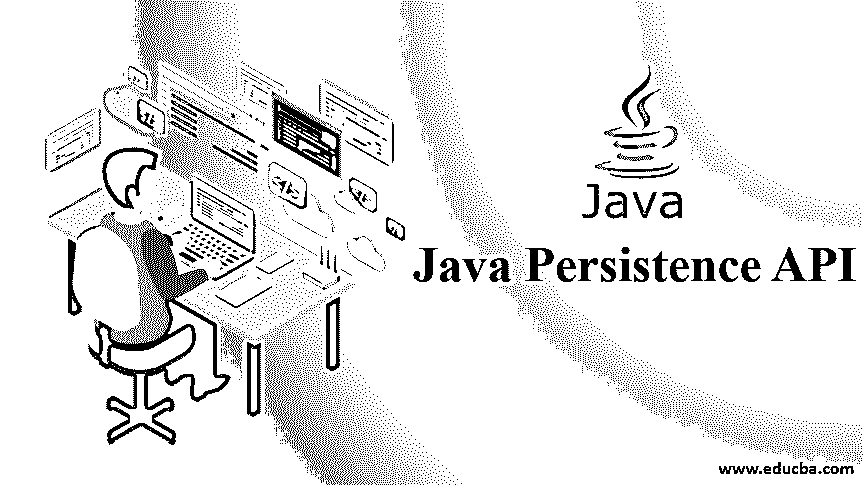

# Java 持久性 API

> 原文：<https://www.educba.com/java-persistence-api/>

## Java 持久性 API 简介

正如“持久性”这个词所暗示的，JAVA 持久性 API 必须完成 JAVA 对象的持久性，即使这些对象的词干应用程序不再存在。这些对象的实现主要存在于 ORM(对象关系映射)软件中，如 hibernate、EclipseLink 等等。ObjectDB 只是提供 JPA (JAVA 持久性 API)内置支持的 DBMS。

在 JPA 的帮助下，开发人员可以直接在 JAVA 数据对象中工作，而不是陷入错综复杂的 SQL 查询中。这使得将数据库链接到面向对象语言的整个过程独立于数据库的本地查询系统，并注入了一致性。

<small>网页开发、编程语言、软件测试&其他</small>

### 为什么我们需要 Java 持久性 API？

使用 JPA 的主要目的是以 [JAVA](https://www.educba.com/what-is-java/) 对象的形式拥有持久对象，这些对象可以在以后与数据库交互时使用。为了降低阻抗并使前端应用程序独立于后端，我们使用 ORMs 作为中间件。JPA 促进了 ORMSs 的使用，从而使整个过程灵活和模块化。

### 工作

正在 JAVA 持久对象和数据库表之间建立映射。在 JPA 提供者的帮助下，持久元数据将被用于我们的开发中。这种元数据也是在 JAVA 类或 XML 文件的注释下定义的。如果我们有一个 XML 文件，那么 [XML](https://www.educba.com/what-is-xml/) 文件将覆盖注释的实现。

JPA 的上述应用可以总结为以下几点:

*   JPA 帮助定义类似 SQL 的查询，从而减少对我们在后端使用的数据库管理系统的依赖。当我们进行大数据迁移时，这种灵活性的重要性显而易见。
*   JPA 有时通过提供在元数据的帮助下自动创建的数据库模式来促进 ORM 与 JAVA 对象的结合使用。
*   JPA 帮助运行查询，更新数据库，而不使用 SQL 查询。
*   取消了 [JDBC](https://www.educba.com/what-is-jdbc/) 和相关方法的使用，从而降低了复杂性。

### Java 持久性 API 的使用

因此，即使主应用程序不工作，持久对象的生命周期也应该在运行。这可以通过使 JPA 的数据对象保持活动状态，然后将它们传递给数据库来实现。一旦工作完成，这些物品就可以被销毁。JPA 可以使用[实例变量](https://www.educba.com/instance-variable-in-java/)(字段)或者 getters 和 setters 方法来访问这些字段。要使用 setters 和 getters 方法，应该使用一些 java beans 功能。类、实体、字段等被用作关键的东西，使活动的 JPA 对象活跃起来，并在前端和后端系统交互时使用。

任何应该保留在数据库中的类都应该用 javax.persistence.Entity 进行注释。该实体将存储在数据库表中。有一个条件，每个实体类应该有一个主键，一个非参数构造函数，而不是 final。根据业务需求，主键可以是单个字段，也可以是两个字段的组合。默认情况下，Primary 也可以通过@GeneratedValue 注释自动生成。然后，在我们定制的逻辑的帮助下，可以覆盖这个默认的主节点。

默认情况下，JPA 中的类对应于数据库的表名。名字是一样的。类似地，JPA 中的“字段”与数据库中的表的列相匹配。尽管这些可以在注释的帮助下进行更改，如下所示:

@Table (name="CHANGEDNAME_TABLE ")

@Column (name=”newColumnName”).

**NOTE:***“*@transient” annotation can be used if we want to deliberately declare that the particular field should not be retained.

在没有 SQL 查询的情况下，我们也可以借助 JPAs 来维护关系。注释“mappedBy”用于此目的。这些映射可以是“一对一”、“一对多”、“多对多”或“多对一”类型。

@ ManyToMany(mapped by = " attributes _ are _ defined _ here ")。

还有一个库“javax . persistence . entitymanager ”,用于管理数据库中持久性对象的生命周期。它有助于发现、保存和销毁对象。对于大多数 JAVA EE 应用程序，实体管理器是自动插入的。实体管理器是在“EntityManagerFactory”之上创建的，后者是在持久性单元的帮助下配置的。有一个名为“persistence.xml”的文件，用于存储映射数据库和 JPA 对象所需的所有映射。这个文件成为在 java 对象和数据库表之间实现许多功能的基本文件。

### 优势

JPA 相对于其他产品的一些重要优势是:

*   它消除了 SQL 查询和 JDBC 连接器的使用，从而降低了数据库编程的复杂性。
*   极大地减少了对后端数据库系统的依赖。这在 DBMS 迁移时非常有用，可以节省大量的精力和工作。
*   代码看起来很干净，开发人员只需要知道 JAVA，而不需要学习 SQL 或 PL/SQL。

### 所需技能

需要学习的技能有助于轻松掌握 JPA 功能:

*   对 JAVA 语言基本理解、库、方法、对象、类和函数的使用对于实现 JPAs 是有用的。
*   对 SQL 查询语言和 ORM 如何工作的基本理解将有助于理解 JPA 的使用。
*   人们可以理解 XML 映射来检查前端和后端系统之间的数据流是如何设计的。

### 结论

因此，JPA 是 JAVA 对象形式的 SQL 查询的非常有用的实现之一。ORM 是建立在 JPA 概念本身之上的。由于易于实施和优点，这种化妆品在市场上占有很好的份额。

### 推荐文章

这是一个 Java 持久性 API 的指南。在这里，我们讨论 Java 持久性 API 的介绍和在各个领域的使用，以及学习 Java 持久性 API 所需的优势和技能。您也可以阅读以下文章，了解更多信息——

1.  [什么是 Java Hibernate？](https://www.educba.com/what-is-java-hibernate/)
2.  [Java EE vs Spring](https://www.educba.com/java-ee-vs-spring/)
3.  [Java 中的字符串初始化](https://www.educba.com/string-initialization-in-java/)
4.  [Java AWT 控件](https://www.educba.com/java-awt-controls/)

