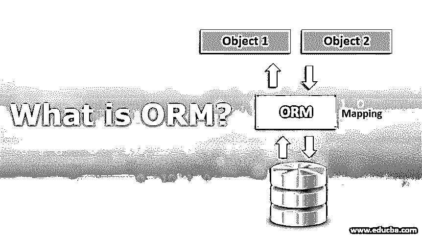
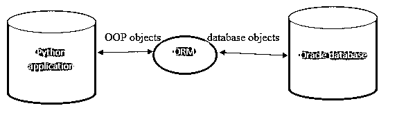

# ORM 是什么？

> 原文：<https://www.educba.com/what-is-orm/>




## ORM 入门？

ORM 代表对象关系映射，其中对象用于将编程语言连接到数据库系统，具有使用 SQL 和面向对象编程概念的功能。ORM 可以在任何类型的数据库管理系统上实现，其中对象到表的映射可以在虚拟系统中实现。ORM 语言有很多种，像 Django ORM，Dapper ORM，JOOQ ORM，SQL Alchemy 等等。

### ORM 是如何工作的？

它作用于物体。所以 ORMs 遵循的整个方法论依赖于面向对象的范例。ORM 生成虚拟映射到数据库中的表的对象。一旦这些对象建立起来，编码人员就可以轻松地从表中检索、操作或删除任何字段，而不需要特别注意语言。它支持以更简单的方式编写复杂的长 SQL 查询。它使用库来理解我们以对象形式编写的代码，然后将其映射到数据库中。

<small>网页开发、编程语言、软件测试&其他</small>

假设使用将 python 应用程序与 oracle 数据库连接起来。在这种情况下，开发人员必须根据业务需求选择最相关的 ORM。这可以通过下图很好地理解:




### ORM 和 OOPs 之间的共同语言

一些常见的 ORM 和相关的 OOPs 语言有:

1.  **休眠:** JAVA
2.  姜戈 ORM: 姜戈
3.  **SQL 炼金术:**烧瓶
4.  **微软实体框架:**。NET 框架
5.  **按形状分类:** C#
6.  **JAVA 持久性 API:** JAVA
7.  **NHibernate:** 。NET 框架
8.  JOOQ ORM: JAVA
9.  **教义:** PHP

随着应用程序编程语言的数量与日俱增，这个列表变得很大。

### 特征

一些关键特征如下:

*   它使应用程序独立于后端使用的数据库管理系统，因此您可以编写通用查询。在迁移到另一个数据库的情况下，在项目中实现 ORM 是一个很好的选择。
*   减少了编码人员为支持应用程序而分别学习 SQL 语法的麻烦。编码人员可以将注意力转移到优化代码和提高性能上，而不是处理连接性问题。
*   所有或大或小的改变都可以通过 ORM 进行，所以我们在处理数据的时候没有这样的限制。例如，**、**、[、](https://www.educba.com/what-is-jdbc/)JDBC 对提取结果集、处理结果集并将其提交回数据库有很多限制。ORM 不是这样的。甚至数据库中的单个单元格都可以被检索、更改和保存。
*   连接变得健壮、安全，因为对代码的干预减少了。它将处理将应用程序[编程语言](https://www.educba.com/what-is-a-programming-language/)与数据库的查询语言进行映射所需的所有必要配置，因为整体上促进安全应用程序的干预较少。
*   根据所使用的应用程序语言，市场上有相当多的 ORM。人们可以根据业务需求轻松选择。
*   使用 ORM 还有一个附带的缺点。这是当数据库在遗留文件系统中并且混乱的时候。整理一大堆数据，然后用 ORM 映射这些数据就成了一项任务。因此，当后端得到合理管理时，建议使用 ORM。

### 优势

ORM 的一些亮点列举如下:

1.  不需要学习数据库查询语言。
2.  它传播了数据抽象的思想，从而提高了数据安全性。
3.  不用把大的过程存储在后端的 [pl/SQL 中，这些可以保存在前端。它提高了进行更改的灵活性。](https://www.educba.com/what-is-pl-sql/)
4.  如果数据库结构中有很多类似 1: m，n: m 和较小的 1:1 的关系，那么 ORM 就很好用。
5.  它通过减少数据库查询部分的处理来减少编码人员的麻烦。
6.  不管后端使用什么数据库，都可以通过 ORM 编写查询。这为编码者提供了很大的灵活性。这是 ORM 提供的最大优势之一。
7.  这些对于任何面向对象的语言都是可用的，所以它不仅仅是特定于一种语言的。

### 实现 ORM 的示例

下面的代码片段解释了当我们实现 ORM 时，它是如何被用来映射 SQL 语句的。

**Note:** This is a non-functional code written to explain how ORM commands work.

#### 示例#1

通过印度时报查询打印所有报纸

**代码:**

```
Newspapers_by_TOI = Newspaper.objects.filter(publisher="TOI")
for Newspaper in Newspapers_by_TOI:
print(Newspapers)
```

**在这里当我们使用命令:** "anything.object.filter "这个命令将用于检索相应表的字段值。例如，在这里，publisher 值是“TOI”，那么查询应该能够从表“报纸”中检索所有细节。这个物体的名称是“TOI 的报纸”。

#### 实施例 2

在数据库中创建新报纸的查询

**代码:**

```
Newspapers.object.create(publisher="TOI",name="19<sup>th</sup> dec 2019 TOI Newspaper")
```

**这里当我们使用命令:**“any thing . object . create”这个命令将被用来对象化字段。例如，在这里，出版商和名称将存储在“报纸”表的“出版商”和“名称”字段中。

### 结论

建议在中小型项目中使用 ORM，以减少阻抗不匹配。根据业务要求，这可以包括在任何需要的地方。还有一些专门针对特定前端语言的，只像 hibernate 是与 JAVA 结合使用的。因此，它是基于需要与任何数据库进行映射的应用程序编程技术来选择的。这减少了工作量，提高了编码人员的效率，因为他们可以更多地关注核心逻辑，而不必太关注数据库查询语言。

### 推荐文章

这是一个什么是 ORM 的指南？这里我们讨论 ORM 的工作原理和优势，特点，以及实现 ORM 的例子。您也可以浏览我们的其他相关文章，了解更多信息——

1.  [SQL 键](https://www.educba.com/sql-keys/)
2.  [JavaScript 中的算术](https://www.educba.com/arithmetic-operators-in-javascript/)
3.  [如何用 Java 创建 Webservice？](https://www.educba.com/how-to-create-webservice-in-java/)
4.  [Java 持久性 API](https://www.educba.com/java-persistence-api/)


