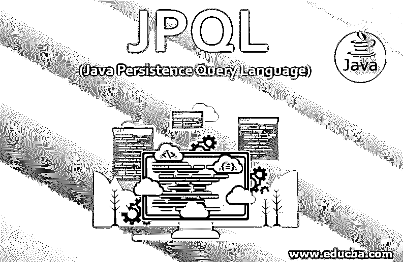

# JPQL

> 原文：<https://www.educba.com/jpql/>




## JPQL 简介

为了执行一些数据库操作，特别是在持久实体上，JPA 规范中使用了一种面向对象的查询语言，称为 JPQL (Java 持久查询语言)。作为数据库表的替代品，JPQL 通过使用实体对象模型来操作[结构化查询语言查询](https://www.educba.com/what-is-sql/)。JPA 的主要目标是将 Java 持久性查询语言转换成结构化查询语言。因此，它为开发人员提供了一个管理 SQL 任务的简单平台。尽管这是基于 SQL 语法建立的，但数据库不会受到直接影响。

### 我们为什么需要 JPQL？

JPQL 因其广泛的特性和优势而被开发人员所使用。它有助于针对存储在关系数据库中的[实体创建查询。此外，JPQL 查询可以从表中获取和返回比字段值更多的对象。这是 JPQL 被认为是面向对象友好且更易于使用的主要原因之一。](https://www.educba.com/relational-database/)

<small>网页开发、编程语言、软件测试&其他</small>

### JPQL 是如何工作的？

JPQL 和 SQL 的主要区别在于，前者处理 Java 的类和对象，而后者处理关系数据库的字段、记录和表。

JPQL 使用了几个类似于 SQL 的子句，它们是:

*   **选择:**检索数据或信息。
*   **更新:**进行数据的更新。
*   **删除:**删除数据。

#### 1.挑选

与 SQL 类似，JPQL 中的 SELECT 查询也采用以下格式:

```
SELECT…..
FROM……
```

这两个子句在用于检索信息的每个查询中都是必需的。在某些情况下，还包括某些可选条款。它将采用如下所示的格式。

**代码:**

```
SELECT…..
FROM……
[WHERE...]
[GROUP BY ... [HAVING ...]]
[ORDER BY...]
```

由于这些条款是可选的，因此在方括号中提及。

**举例:**

以下查询从数据库中检索所有雇员对象:

```
SELECT e FROM Employee AS e
```

因为 SELECT 和 FROM 是必需的，所以这显示了一个最小的查询。FROM 子句声明一个或多个标识变量或查询变量。它类似于编程语言中的循环变量。每个标识变量表示数据库对象的迭代。这里，e 是一个范围变量。也就是说，它描述了对数据库中每个雇员对象的迭代。

#### 2.更新

**语法:**

```
UPDATE. . .
SET. . .
[ WHERE. . .]
```

**代码:**

```
UPDATE employee SET salary=salary*12/10
UPDATE employee e SET e.salary=e.salary*12/10
UPDATE employee AS e SET e.salary=e.salary*12/10
```

在这里，3 个等价的查询将雇员的工资提高了 10%。此外，UPDATE 子句只描述了一个用于迭代的范围变量。但是，在这个中不支持多个变量和连接。SET 子句描述了一个或多个字段更新表达式。

#### 3.删除

**语法:**

```
DELETE
FROM . . .
[ WHERE. . . ]
```

**代码:**

```
DELETE From Employee
DELETE From Employee e
DELETE From Employee AS e
```

此外，JPQL 被认为是不区分大小写的。也就是选择、更新等关键词。可以用大写字母(选择，更新)或小写字母(选择，更新)书写。但是，在某些情况下，它区分大小写。它可以是实体类名和持久字段名等。除此之外，字符串也被认为是区分大小写的(“abc”和“ABC”是不同的值)。

### JPQL 查询示例

下面是提到的例子:

#### 示例#1

查询以检索按字母顺序排序的所有雇员

**代码:**

```
SELECT e
FROM employee e
ORDER BY e.firstName, e.lastName
```

#### 实施例 2

查询以检索 ABC 部门的雇员。

**代码:**

```
SELECT e
FROM employee e
WHERE department='ABC'
```

#### 实施例 3

查询以删除薪金低于 65000 的雇员。

**代码:**

```
DELETE FROM
Employee e
WHERE e.salary < 65000
```

#### 实施例 4

按姓名的首字母对雇员进行分组的查询。

**代码:**

```
SELECT SUBSTRING( e.name , 1 , 1 )
FROM employee e
GROUP BY
SUBSTRING( e.name , 1 , 1 )
```

#### 实施例 5

查询以查找 ABC 部门员工的工资总额和平均工资。

**代码:**

```
SELECT SUM(e.salary), AVG(e.salary)
FROM employee e
WHERE department='ABC'
```

#### 实施例 6

查询来计算雇员的所有主题，并且只返回具有多个主题的雇员。

**代码:**

```
SELECT e
FROM Employee e
WHERE (SELECT count(s) FROM Subject s WHERE e MEMBER OF s.subjects ) > 1
```

### JPQL 的方法

它提供了两种有助于访问数据库记录的方法，它们是:

*   **Query create Query(String n)**:该方法用于创建用于 JPQL 语句执行的查询接口实例。
*   **Query createnamed Query(String n)**:该方法用于查询接口实例的创建，该实例用于命名查询的执行。

除此之外，查询执行可以由下面的接口方法控制。

*   **int executeUpdate():** 更新和删除操作将使用该方法执行。
*   **int getFirstResult():** 调用此方法将返回查询检索的第一个结果。
*   **int getMaxResults():** 调用此方法将返回查询检索的最大结果数。
*   **Query set first result(int start position):**查询检索到的第一个结果的位置将被分配给调用该方法。
*   **Query setmax results(int max result):**查询检索的最大结果数将在调用此方法时分配。

### 优势

以下是 JPQL 的主要优势

*   简单的
*   粗野的
*   JPQL 能够[使用不同类型的数据库](https://www.educba.com/types-of-database/)，如 MySQL、Oracle 等。
*   在代码中，JPQL 查询可以动态构建。
*   JPQL 可以静态地声明到元数据中。

### JPQL 特性

JPQL 被认为是 EJB QL()的扩展，增加了以下主要功能，例如:-

*   它能够执行联合行动。
*   它可以更新和删除大量数据。
*   它可以通过排序和分组子句执行聚合功能。
*   它是面向对象的
*   单值和多值的结果类型。
*   JPQL 是一种独立于平台的查询语言。

### 结论

JPQL 用于执行多种数据库操作，尤其是在持久性实体上。这篇文档以有效的方式清楚地解释了 JPQL 的每个方面。

### 推荐文章

这是 JPQL 的指南。这里我们讨论实体 JavaBeans 查询语言是如何工作的，以及一些特性、方法和不同的例子。您也可以浏览我们的其他相关文章，了解更多信息——

1.  [Java 中的定时器](https://www.educba.com/timer-in-java/)
2.  [Java 中的 StringBuffer 类](https://www.educba.com/stringbuffer-class-in-java/)
3.  [Java 瞬态](https://www.educba.com/java-transient/)
4.  [Java 中的内部类](https://www.educba.com/inner-class-in-java/)


