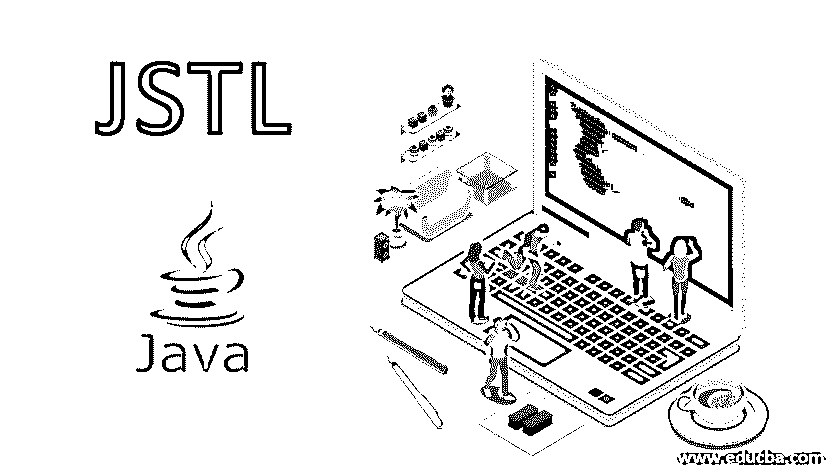

# JSTL

> 原文：<https://www.educba.com/jstl/>




## 什么是 JSTL？

JavaServer Pages 标准标记库(JSTL)是 JSP 标记的集合，它封装了 JSP 应用程序中的核心功能，并提供了一个框架来集成现有的定制标记和 JSTL 标记。它还支持迭代、用于操作 XML 文档的标签、SQL 标签、条件、国际化标签。

### JSTL 标签的类型

下表给出了 Java 服务器页面标准标记库的类型和描述。

<small>网页开发、编程语言、软件测试&其他</small>

| **标签库名称** | **前缀** | **描述** |
| **核心标签** | 英语字母表中第三个字母 | 核心标签库包含一组常用的 JSTL 标签，用于 URL 管理、流控制或迭代、变量支持…在 JSP 中使用核心标签。我们应该添加下面的代码。

```
<%@ taglib prefix = "c" uri = "http://java.sun.com/jsp/jstl/core" %>
```

 |
| **XML 标签** | 英语字母表的第 24 个字母 | JSTL XML 标签库包含一组用于 XML 文档的标签，如 XML 解析、XPath 表达式求值、XML 转换等。包含 XML 标签库的语法。

```
<%@ taglib prefix = "x"    uri = "http://java.sun.com/jsp/jstl/xml" %>
```

 |
| **SQL 标签** | 结构化查询语言 | JSTL SQL 标签库支持与任何关系数据库的交互，如 SQL，MySQL 等…包括数据操作标签，如查询，更新等。包含 SQL 标记库的语法-

```
<%@ taglib prefix = "fmt" uri = "http://java.sun.com/jsp/jstl/fmt" %>
```

 |
| **格式化标签** | fmt | 这些格式化标签由一组用于格式化文本、日期、时间和数字的标签组成。这些有助于通过地区和资源包开发国际化网站，即 i18n。

```
<%@ taglib prefix = "fmt" uri = "http://java.sun.com/jsp/jstl/fmt" %>
```

 |
| **JSTL 功能标签** | 【数学】函数 | JSTL 函数标签库由支持执行基本操作的标签组成。这个库包括大多数字符串操作标签，即连接、拆分、子串等。为了包括这个库，我们添加了下面一行。

```
<%@ taglib prefix="fn” uri="http://java.sun.com/jsp/jstl/functions" %>
```

 |

### 举例说明 JSTL 的工作

要使用这些标签，请遵循以下步骤在应用程序中设置 JSTL 标签。

*   从 jakarta.apache.org 下载 JSTL 罐子。两个。jar 文件下载为 jstl.jar 和 standard.jar。
*   将 jstl.jar 和 standard.jar 文件添加到应用程序内的 WEB-INF/lib 目录中。
*   将这些文件包含在项目类路径中。
*   要在 java 程序中包含特定的标签，你需要在 JSP 程序中引用 JSTL。

```
<%@ taglib prefix="c" uri="http://java.sun.com/jstl/core" %>
```

*   要在 JSTL 使用表达式语言，请使用下面的标记库。

```
<%@ taglib prefix="c" uri="http://java.sun.com/jsp/jstl/core" %>
```

**在 JSP 中使用标签的示例:**

```
<c:out value="Hello World" ></c:out>
<c:forEach var="i" begin="1" end="5">
Array: <c:out value="${i}"/><p>
</c:forEach>
<fmt:setTimeZone value="GMT-5" />
<c:set var="date" value="<%=new java.util.Date()%>" />
<x:parse xml="${studentInfo}" var="output"/>
<c:set var="string" value="Hello World"/>
${fn:substring(string, 7, 12)}
<sql:query dataSource="${dataBase}" var="res">
SELECT * from Employee;
</sql:query>
```

### JSTL 的特性(JSP 标准标记库)

这些标签简化了程序员创建网站的任务，因为这些 JSP 标准标签库标签提供了一种维护 JSP 页面的简单方法。

*   JSTL 的核心标签支持条件、迭代器和 URL 相关的操作，只需使用标签库的标签即可。
*   JSTLs XML 标记库帮助程序员操纵与 XML 相关的操作，比如迭代或对解析的 XML 文档进行条件操作。
*   它通过使用 JSTL SQL 标记库来支持与 JSP 页面内的关系数据库的交互，该标记库由各种处理数据库的标记组成。
*   JSP 标准标签库格式化标签库支持长度、连接、替换等各种字符串操作标签。使用格式化标签库，字符串操作过程变得更加容易。
*   它使程序员能够开发可通过任何语言环境访问的国际化网站。这个功能是通过格式化标签提供的，包括设置地区、日期格式、时间格式等。

### 优势

下面是解释的一些优点。

*   It 表达式语言支持 java bean 检查是自动完成的，与 JSP 页面中的 scriptlet 相比。
*   它支持标准化的国际化格式。通过使用支持的标签来格式化数字、时间、日期等，这在 scriptlet 编码中是不可能的。
*   程序员更容易理解。JSP 标准标记库不遵循 OOP 语言的复杂语法。这些标签基于类似于 [HTML](https://www.educba.com/what-is-html/) 的 [XML 标签](https://www.educba.com/what-is-xml/)。
*   它提供了方便的数据访问和操作。
*   降低代码复杂度单个标签可以代替冗长的 scriptlet 代码。
*   可重用性是通过使用 JSP 标准标记库实现的。

### 应用程序

*   JSP 标准标签库最重要的应用之一是开发运行在不同地区的网站。
*   使用 JSP 标准标记库开发动态 web 应用程序各种标记支持开发动态 web 应用程序。
*   Web 应用程序需要使用任何关系数据库进行实时数据操作。
*   导入表达式语言的 Java 应用程序。
*   最适合开发服务器端应用。

### 结论

众所周知，JSP 标准标签库提供了一组用于开发动态 web 应用程序的内置标签。在 JSP 中包含 JSTL 有利于程序员减少编写冗长代码的工作量。与任何其他 web 应用程序编程语言相比，由于引入了 JSP 标准标记库，JSP 成为了一种广泛使用的编程语言。在引入 JSTL 之前，甚至 JSP 页面也有一些限制，现在最大限制减少了。

### 推荐文章

这是 JSTL 旅游指南。这里我们讨论 JSP 标准标记库的介绍和类型，以及 JSP 标准标记库的优点和特性。您也可以看看以下文章，了解更多信息–

1.  [JSP vs ASP](https://www.educba.com/jsp-vs-asp/)
2.  [JSP 指令](https://www.educba.com/jsp-directives/)
3.  [Java EE vs Spring](https://www.educba.com/java-ee-vs-spring/)
4.  [静态与动态网页](https://www.educba.com/static-vs-dynamic-web-page/)


