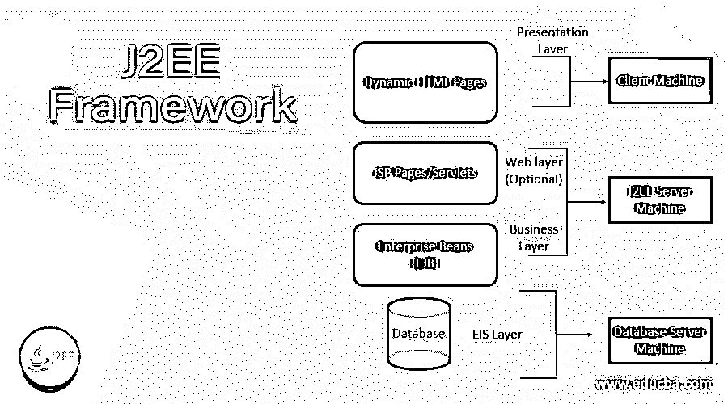

# J2EE 框架

> 原文：<https://www.educba.com/j2ee-framework/>

## J2EE 框架的定义

Java 2 Platform，Enterprise Edition 也称为 J2EE，是 Oracle 拥有的 Java API 集合。程序员使用它来创建服务器端应用程序。Java EE 的应用程序托管在几个应用服务器上，如 IBM 的 WebSphere、Oracle 的 GlassFish、Red Hat 的 WildFly server 等，所有这些服务器都运行在云中或企业数据中心内。尽管这些应用程序托管在服务器中，但一些客户端，如物联网设备、标准 web 应用程序、智能手机、web 套接字、RESTful web 服务或微服务，都运行在 Docker 容器中。

### 为什么我们需要 J2EE 框架？

现在，我们可能会想，虽然有这么多技术，但这个框架有什么必要。

<small>网页开发、编程语言、软件测试&其他</small>

使用 Java EE 框架的一个重要原因是因为它提供了服务，这使得开发人员面临的常见挑战变得容易。也就是说，在开发应用程序时，API 使得使用通用设计模式和行业接受的实践的过程更加简单。假设企业开发人员在处理来自基于 web 的客户端的请求时面临挑战。为了简化这一点，这个框架提供了服务器和 JSP APIs，它们提供了一些方法来找出用户在表单的文本字段中键入了什么，或者在浏览器中保存了一个 cookie。

与此类似，另一项任务是如何将信息存储在数据库中以及如何从数据库中检索信息。为了实现这一目标，Java EE 提供了 JPA，也称为 Java 持久性 API，它使得程序中的数据映射到数据库表和行中的信息变得容易。此外，使用 EJB(Enterprise JavaBean s)规范，创建 web 服务以及高可伸缩性的逻辑组件变得很容易。这些 API 的优点是它们经过了有效的测试，并且对开发人员来说很容易。

### J2EE 框架是如何工作的？

Java 应用程序的服务器端开发步骤包括:

1.  编写利用 Java EE 核心技术的代码
2.  将创建的代码编译成字节码
3.  将创建的字节码以及与之相关的资源打包到一个 EAR 企业归档文件中
4.  将企业存档文件部署到应用服务器

为了完成这个过程，我们所需要的是一个文本编辑器以及标准的 Java 编译器和 JDK 安装。但是，我们也应该知道，IDE(集成开发环境)工具的丰富生态系统有助于 Java EE 代码的快速应用程序开发。对于开源的 ide，Eclipse 和 NetBeans 被认为是 Java EE 开发中最常见的。除了丰富的插件社区之外，两者都提供了项目组织、语法检查和源代码格式化，这允许用户创建向集成开发环境添加附加功能的组件。插件通常用于构建、部署和执行与 Java EE 应用程序的持续集成。

### 优点和缺点

**Java EE 的优势包括:**

*   Java EE 可以在任何操作系统和应用服务器上运行。但是，在某些情况下需要做一些改变。
*   可以处理复杂、高交易量、高容量的应用程序。
*   由应用程序集成、会话管理、负载平衡和故障转移等众多企业功能组成。
*   由著名的企业供应商使用，如 BEA、IBM、Oracle 和 SAP
*   提供了广泛的工具和应用服务器。
*   有经过证明的有效记录。
*   支持由具有不同应用程序开发技能水平和经验的团队进行开发。
*   明确区分网页设计者和开发者的角色。
*   应用服务器提供的工具可以用于快速开发、原型制作和部署。
*   基于标准的应用服务器提供了互操作性和厂商中立性。
*   因为这是基于 java 的，所以 Java 的所有优点也可以在这里应用。

示例:跨平台开发

*   开源应用服务器，如 JBoss 和 MySql 这样的数据库服务器，都是可用的。与应用程序的其他专有开发平台相比，它允许开发和部署都非常经济高效。

**Java EE 的缺点包括:**

*   复杂的应用开发环境。
*   难以使用工具。
*   Java 的 Swing 环境在构建 GUI 的能力上有一定的局限性。
*   构建、部署和管理应用程序的成本高昂。
*   缺少对 web 服务标准的内置支持
*   对于低成本、快速周转和大众市场的项目来说很困难
*   与 J2EE 相关的大学习曲线。
*   一些开发者的限制就像，任何阻碍系统应用服务器控制的东西。

**示例:**不允许编写自己的控制线程以及调度任务。

### J2EE 框架的使用

如前所述，J2EE 是一个包含多种技术的规范，用于开发和运行企业 Java 应用程序。

现在，让我们来看看 J2EE 的一些主要特色和服务:

*   客户端层的 J2EE 支持纯 HTML、java 小程序和 java 应用程序。
*   依赖 JSP(Java 服务器页面)和 servlet 代码来创建 HTML 或其他一些用于客户端的格式化数据。
*   EJB(Enterprise JavaBean s)提供了另一个保存平台逻辑的层。
*   EJB 服务器提供了线程、安全、并发和内存管理等功能，这些功能对作者来说是透明的(可见的)。
*   通常，JVM 提供运行编译后的 Java 代码所需的运行时解释器。同时，对于使用一些 J2EE 企业特性的应用程序，如 EJB/Enterprise Java Beans，需要一个符合 J2EE 的应用服务器。
*   提供事务处理、负载平衡、会话管理以及消息传递等服务，帮助企业应用程序开发人员无需为他们编写的几乎所有应用程序重新编写组件。
*   支持高度异构的环境。
*   提供了广泛的工具和应用服务器。

### 结论

Java 2 Platform，Enterprise Edition 是程序员用来创建服务器端应用程序的。Java EE 应用程序托管在几个应用服务器上，如 WebSphere、GlassFish、WildFly server 等，它们都运行在云中或企业数据中心内。在本文中，将详细解释 Java EE 的不同方面。

### 推荐文章

这是一个 J2EE 框架指南。这里我们讨论定义，为什么我们需要 J2EE 框架？，J2EE 框架是如何工作的？您也可以看看以下文章，了解更多信息–

1.  [J2EE 建筑](https://www.educba.com/j2ee-architecture/)
2.  什么是 J2EE？
3.  [J2EE 面试问题](https://www.educba.com/j2ee-interview-questions/)
4.  [安全架构](https://www.educba.com/security-architecture/)

